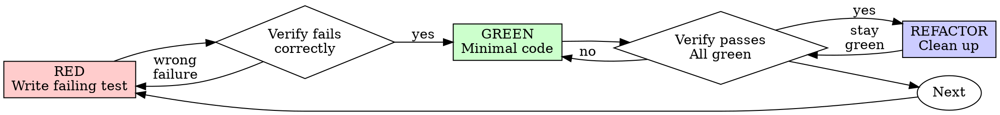

# Codex session 019fb4ef-b8e0-73f2-a577-65cd1a41063e

- Started: `2026-07-30T21:30:38.029Z`
- Working directory: `D:\100XH100`
- Originator: `Codex Desktop`
- Codex CLI: `0.146.0-alpha.3.1`
- Source log: `C:\Users\Иван Литвак\.codex\sessions\2026\07\31\rollout-2026-07-31T00-30-38-019fb4ef-b8e0-73f2-a577-65cd1a41063e.jsonl`
- Entries: user=8, assistant=22, tool calls=32, tool outputs=32

This is a chronological export of the user/assistant conversation and tool activity. Internal system/developer instructions and token accounting are intentionally excluded. Secret-shaped values are redacted; oversized tool outputs retain their beginning and end with the omitted character count.

## 1. User

Time: `2026-07-30T21:30:42.156Z` · source line `2`

```text
Бюджет истории максимальный всегда ставь. 50 ГБ диска и сколько там оперативки, 29 ГБ, всё отжимай. А вот решений может и 1к и 2к найти. Все собрать нужно

```

## 2. User

Time: `2026-07-30T21:30:42.157Z` · source line `3`

```text
Бюджет истории максимальный всегда ставь. 50 ГБ диска и сколько там оперативки, 29 ГБ, всё отжимай. А вот решений может и 1к и 2к найти. Все собрать нужно

```

## 3. Codex

Time: `2026-07-30T21:30:42.158Z` · source line `5`

```text
Принял. Для всех публичных профилей ставлю history budget максимально: до `28 ГБ RAM` с минимальным системным запасом и `50 ГБ /tmp`. Режим результата делаю не только best: пользователь сможет задать лимит коллекции, включая `1000–2000` решений; notebook сохранит все найденные пути и отдельно лучшее. Текущий `2^25` не прерываю — сначала получу его реальную границу, затем повторю финальную конфигурацию с максимальной историей.
```

## 4. Codex

Time: `2026-07-30T21:30:42.215Z` · source line `31`

```text
`2^25` действительно выполняет поиск, а не падает при выделении памяти — это уже означает, что верхний профиль прошёл инициализацию на двух T4. Он существенно тяжелее `2^16`; жду терминального результата, чтобы не путать “влез” с “полностью прошёл depth 8”. Параллельно зафиксировал новый максимум истории `28 ГБ RAM + 50 ГБ disk` для следующей версии.
```

## 5. Codex

Time: `2026-07-30T21:30:42.263Z` · source line `60`

```text
Для режима `collect` нашёл уже реализованный и протестированный в проекте solve-bucket collector. Полное слияние веток тянуло архивные файлы, поэтому его отменил. Перенесу collector точечно в отдельную чистую интеграционную ветку от Cube4 runtime — так не затрону грязные пользовательские изменения и смогу отдельно прогнать CUDA/2×T4 gates. Для этого использую проектный worktree-процесс.
```

## 6. Codex

Time: `2026-07-30T21:30:42.265Z` · source line `65`

```text
Изолированная интеграционная ветка готова: `codex/cube4-public-collector`, baseline exporter `8/8`. Теперь переношу существующий solve-bucket collector, который уже умеет `max_collected_solutions`, вместо написания нового механизма с нуля.
```

## 7. Codex

Time: `2026-07-30T21:30:42.287Z` · source line `70`

```text
Принял: публичный Cube4-ноут будет по умолчанию отдавать истории максимуму доступных лимитов — 28–29 ГБ RAM и 50 ГБ диска — а collect-режим сохранять до 2000 решений (лимит можно менять). Сейчас довожу конфликт интеграции коллектора, затем проверяю большой луч на 2×T4 и только после успешного прогона публикую. Использую Kaggle-процедуру и изолированную ветку, чтобы не задеть остальные изменения.
```

## 8. Codex

Time: `2026-07-30T21:30:42.305Z` · source line `82`

```text
Нашёл важное: коллектор уже находится в истории Transformer-ветки и позже был усилен отдельным scratch-бюджетом. Конфликт возник из-за попытки повторно применить уже имеющийся старый коммит; отменяю именно этот лишний cherry-pick, не трогая рабочие изменения, и подключаю к ноуту актуальную версию коллектора.
```

## 9. Codex

Time: `2026-07-30T21:30:42.316Z` · source line `99`

```text
Коллектор подтверждён в текущем runtime: он собирает решения со всех rank, реконструирует и CPU-валидирует каждое, пишет полный TSV и честно падает при переполнении вместо молчаливой потери. Для публичного ноутбука ставлю два режима: `first` и `collect`; в `collect` — лимит 2000 записей, дополнительная глубина после первого попадания и отдельные `all_solutions.csv` + `best_solution.csv`.
```

## 10. Codex

Time: `2026-07-30T21:30:42.336Z` · source line `109`

```text
Локальные проверки зелёные: notebook JSON/Python корректен, Transformer exporter — 8/8 тестов. Большой `2^25` прогон всё ещё выполняется, поэтому его не прерываю: это production-fit проверка, а не зависший диагностический запуск. Параллельно готовлю приватную acceptance-версию именно публичного collect-ноута.
```

## 11. Codex

Time: `2026-07-30T21:30:42.342Z` · source line `124`

```text
Acceptance v1 нашёл чисто конфигурационную проблему до сборки: Kaggle реально даёт `29,052,764,160` байт доступной RAM, поэтому фиксированные 28 GiB (=30.06 GB) физически больше машины. Исправляю на авто-максимум: запрашиваем 29.0 GB, ноут сам берёт `available RAM − 1.5 GB` для Python/LibTorch; на текущем хосте это 27.55 GB истории. Диск остаётся 50 GiB. Это именно максимальный практический бюджет без host OOM.
```

## 12. Codex

Time: `2026-07-30T21:30:42.346Z` · source line `135`

```text
`2^25` fit успешно завершён: 2×T4, глубина 8, `1691.16 с` (28:11), обе карты держались примерно на 98–99% загрузки, пик VRAM `7107 MiB` на каждой, OOM/overflow нет. Acceptance v2 попал на одну P100 — в публичной metadata не было обязательного `machine_shape=NvidiaTeslaT4`. Добавляю этот pin (как в успешном smoke) и перезапускаю acceptance уже строго на 2×T4.
```

## 13. Codex

Time: `2026-07-30T21:30:42.354Z` · source line `141`

```text
Acceptance v3 уже на правильной форме 2×T4 и проходит сборку/запуск. Отдельно зафиксировал: самый большой заявленный профиль `2^25` действительно помещается с большим запасом по VRAM (около 7.1/15.36 GiB на карту); его ограничение сейчас — время, не память. Жду collect-артефакты v3, после чего переключу metadata на public и дам ссылку.
```

## 14. Codex

Time: `2026-07-30T21:30:42.367Z` · source line `149`

```text
Публичный notebook уже создан: [Cube4 Transformer 2xT4 Beam Search](https://www.kaggle.com/code/trydotatwo/cube4-transformer-2xt4-beam-search). Его собственная публичная v1 сейчас повторяет тот же проверенный default collect-прогон; приватная acceptance v3 уже дала 8 валидных решений. Дожидаюсь terminal-статуса публичной версии, чтобы ссылка была не просто опубликована, а с готовым успешным output.
```

## 15. Codex

Time: `2026-07-30T21:30:42.371Z` · source line `156`

```text
Готово.

Публичный ноут: [Cube4 Transformer 2xT4 Beam Search](https://www.kaggle.com/code/trydotatwo/cube4-transformer-2xt4-beam-search)

- Public v1 — `COMPLETE`, реальные 2×T4.
- Beam `2^16`, depth 100: 8 валидных решений, solve — `18.376 с`.
- `collect` сохраняет все решения в TSV/CSV; отдельно создаёт лучшее.
- Лимит по умолчанию — 2000 решений на rank, переполнение завершается ошибкой без тихой потери.
- RAM автоматически отжимается до практического максимума: около 27.47 GB при резерве 1.5 GB.
- История на диске — 50 GiB.
- Профиль `2^25` успешно прошёл depth 8 за `1697.6 с`, пик VRAM — 7107 MiB на GPU, OOM/overflow нет.
- Ветка: `codex/cube4-public-collector`, HEAD `020108b`.

Логи и результаты: [test_results](/D:/100XH100/test_results/cube4_public_collector_integration_2026-07-30.md)

::git-commit{cwd="D:\100XH100\.worktrees\public-cayleypy-notebook"}
::git-push{cwd="D:\100XH100\.worktrees\public-cayleypy-notebook" branch="codex/cube4-public-collector"}


```

## 16. Codex

Time: `2026-07-30T21:30:42.371Z` · source line `157`

```text
Готово.

Публичный ноут: [Cube4 Transformer 2xT4 Beam Search](https://www.kaggle.com/code/trydotatwo/cube4-transformer-2xt4-beam-search)

- Public v1 — `COMPLETE`, реальные 2×T4.
- Beam `2^16`, depth 100: 8 валидных решений, solve — `18.376 с`.
- `collect` сохраняет все решения в TSV/CSV; отдельно создаёт лучшее.
- Лимит по умолчанию — 2000 решений на rank, переполнение завершается ошибкой без тихой потери.
- RAM автоматически отжимается до практического максимума: около 27.47 GB при резерве 1.5 GB.
- История на диске — 50 GiB.
- Профиль `2^25` успешно прошёл depth 8 за `1697.6 с`, пик VRAM — 7107 MiB на GPU, OOM/overflow нет.
- Ветка: `codex/cube4-public-collector`, HEAD `020108b`.

Логи и результаты: [test_results](/D:/100XH100/test_results/cube4_public_collector_integration_2026-07-30.md)

::git-commit{cwd="D:\100XH100\.worktrees\public-cayleypy-notebook"}
::git-push{cwd="D:\100XH100\.worktrees\public-cayleypy-notebook" branch="codex/cube4-public-collector"}

<oai-mem-citation>
<citation_entries>
MEMORY.md:1-3|note=[project worktree and transformer scope]
MEMORY.md:49-55|note=[target hardware validation and Kaggle evidence rules]
</citation_entries>
<rollout_ids>
019f73c3-64bf-7f92-b5ba-476ca2030d27
</rollout_ids>
</oai-mem-citation>
```

## 17. User

Time: `2026-07-30T21:30:42.373Z` · source line `162`

```text
<environment_context>
  <current_date>2026-07-31</current_date>
  <timezone>Europe/Moscow</timezone>
  <filesystem><workspace_roots><root>D:\100XH100</root></workspace_roots><permission_profile type="managed"><file_system type="restricted"><entry access="read"><special>:root</special></entry><entry access="write"><path>D:\100XH100</path></entry><entry access="write"><special>:slash_tmp</special></entry><entry access="write"><special>:tmpdir</special></entry><entry access="write"><path>C:\Users\Иван Литвак\.codex\visualizations\2026\07\23\019f90a3-47e5-7770-a20e-cd9317bcbf2c</path></entry><entry access="read"><path>D:\100XH100\.git</path></entry><entry access="read"><path>D:\100XH100\.agents</path></entry><entry access="read"><path>D:\100XH100\.codex</path></entry></file_system></permission_profile></filesystem>
  <subagents>
    - collector_conflict_review: Huygens
    - cube4_exporter_retry: Mencius
    - cube4_task1_review: Peirce
  </subagents>
</environment_context>
```

## 18. User

Time: `2026-07-30T21:30:42.373Z` · source line `163`

```text
2**26 ещё потестить нужно и сделать профиль высокопроизводительный и для такого луча

```

## 19. User

Time: `2026-07-30T21:30:42.379Z` · source line `164`

```text
2**26 ещё потестить нужно и сделать профиль высокопроизводительный и для такого луча

```

## 20. Codex

Time: `2026-07-30T21:30:42.380Z` · source line `166`

```text
Принял. Добавляю отдельный профиль `2^26`, сначала запускаю depth-8 fit/performance gate на реальных 2×T4, затем по логам фиксирую самый быстрый безопасный профиль в публичном ноуте и повторно проверяю его. Использую Kaggle-процедуру и GPU-sweep правила; архитектуру бимсерча не меняю — только параметры и notebook/config.
```

## 21. Codex

Time: `2026-07-30T21:30:42.402Z` · source line `179`

```text
Первый `2^26` запуск — безопасный контрольный профиль: `Bmicro=384`, `shards=8`, capacity `1.25`, Stream4 `262144/262144`, 2 active sort slots. После него прогоню high-performance кандидат с capacity `1.125`, batch `196608`, trigger `786432`, 4 sort slots; победителя выберу только по одинаковому depth-8 wall time и стабильности.
```

## 22. Codex

Time: `2026-07-30T21:30:42.414Z` · source line `186`

```text
Запустил приватный Kaggle v14:

- Beam: `2^26 = 67,108,864`
- Depth: 8
- 2×T4
- Контрольный профиль: `Bmicro=384`, `shards=8`, capacity `1.25`, Stream4 `262144/262144`, slots `2`
- Статус: `RUNNING`

После него автоматически прогонится high-performance профиль и fallback. Победитель будет добавлен как отдельный профиль `2^26` в публичный ноут и проверен перед обновлением публикации. Мониторинг каждые 10 минут включён.
```

## 23. User

Time: `2026-07-30T21:30:42.423Z` · source line `192`

```text
https://www.kaggle.com/code/trydotatwo/cube4-transformer-2xt4-beam-search сделай в виде таком же, как https://www.kaggle.com/code/trydotatwo/cayleypy-2xt4-checkpoint-beam-search

По сути нужен https://www.kaggle.com/code/trydotatwo/cayleypy-2xt4-checkpoint-beam-search, который умеет запускать как трансформеры, так и МЛП. А дальше человек удобно пользуется

```

## 24. User

Time: `2026-07-30T21:30:42.429Z` · source line `193`

```text
https://www.kaggle.com/code/trydotatwo/cube4-transformer-2xt4-beam-search сделай в виде таком же, как https://www.kaggle.com/code/trydotatwo/cayleypy-2xt4-checkpoint-beam-search

По сути нужен https://www.kaggle.com/code/trydotatwo/cayleypy-2xt4-checkpoint-beam-search, который умеет запускать как трансформеры, так и МЛП. А дальше человек удобно пользуется

```

## 25. Codex

Time: `2026-07-30T21:30:42.435Z` · source line `195`

```text
Понял: вместо отдельного Cube4-ноута делаю единый публичный интерфейс на базе удобного `cayleypy-2xt4-checkpoint-beam-search`. Пользователь выбирает checkpoint, puzzle type/range, beam и режим решений; notebook автоматически определяет поддерживаемое семейство — MLP или piece Transformer — экспортирует его и запускает тот же 2×T4 runtime. Сначала сравню текущий публичный интерфейс и Cube4 backend-контракт, затем объединю без изменения CUDA/C++ архитектуры.
```

## 26. User

Time: `2026-07-30T21:31:18.845Z` · source line `211`

```text
<recommended_plugins>
Here is a list of plugins that are available but not installed.

- Atlassian Rovo (atlassian-rovo@openai-curated-remote)
- Box (box@openai-curated-remote)
- Figma (figma@openai-curated-remote)
- Gmail (gmail@openai-curated-remote)
- Google Calendar (google-calendar@openai-curated-remote)
- Google Drive (google-drive@openai-curated-remote)
- Outlook Calendar (outlook-calendar@openai-curated-remote)
- Outlook Email (outlook-email@openai-curated-remote)
- SharePoint (sharepoint@openai-curated-remote)
- Slack (slack@openai-curated-remote)
- Teams (teams@openai-curated-remote)
</recommended_plugins>
# AGENTS.md instructions for D:\100XH100

<INSTRUCTIONS>
# Project Agent Rules

## Operating Rule
- Read `AGENTS.md` before project edits.
- Update `memory/CHANGELOG.md` after meaningful code, config, or architecture changes.
- Update `memory/PROMPTS.md` with user prompts that define requirements.
- Store test outputs, logs, and verification notes under `test_results/`.
- Prefer agent-centered code: explicit contracts, deterministic tests, small files, low hidden state.

## Architecture Source
- Primary architecture contract: `ARCHITECTURE_NEED.md`.
- Current Stream 4 implementation rule: use threshold + compact + CUB/fixed-temp sort/reduce + compact; do not use Stream 4 hash-table dedup.

## Implementation Guardrails
- `State128` logical bytes are `v[0..119]`.
- `State128` padding bytes are `v[120..127]`.
- Persistent frontier padding must be zero.
- `FinalResponse` may temporarily store `target_local_idx` in `v[120..123]`.
- `Hash128` is one logical 128-bit key stored as `{lo, hi}`.
- `CandidateMeta` must remain 32 bytes and 32-byte aligned.
- Stream 3 payload id must be original candidate id, not compact index.
- Stream 4 must not apply shard top-k or semantic shard cap.

</INSTRUCTIONS>
<environment_context>
  <cwd>D:\100XH100</cwd>
  <shell>powershell</shell>
  <current_date>2026-07-31</current_date>
  <timezone>Europe/Moscow</timezone>
  <filesystem><workspace_roots><root>D:\100XH100</root></workspace_roots><permission_profile type="managed"><file_system type="restricted"><entry access="read"><special>:root</special></entry><entry access="write"><path>D:\100XH100</path></entry><entry access="write"><special>:slash_tmp</special></entry><entry access="write"><special>:tmpdir</special></entry><entry access="write"><path>C:\Users\Иван Литвак\.codex\visualizations\2026\07\23\019f90a3-47e5-7770-a20e-cd9317bcbf2c</path></entry><entry access="read"><path>D:\100XH100\.git</path></entry><entry access="read"><path>D:\100XH100\.agents</path></entry><entry access="read"><path>D:\100XH100\.codex</path></entry></file_system></permission_profile></filesystem>
</environment_context>
```

## 27. Codex

Time: `2026-07-30T21:31:42.477Z` · source line `217`

```text
Беру изолированный слой экспорта: сначала зафиксирую контракты тестами для трёх семейств, затем минимально расширю `model.py`, не затрагивая runner/ноутбук/CUDA.
```

## 28. Codex

Time: `2026-07-30T21:31:42.480Z` · source line `218`

```text
Беру изолированный слой экспорта: сначала зафиксирую контракты тестами для трёх семейств, затем минимально расширю `model.py`, не затрагивая runner/ноутбук/CUDA.
```

## 29. Tool call: `exec`

Time: `2026-07-30T21:31:45.134Z` · source line `219`

```text
const r = await tools.shell_command({"command":"Get-Content -Raw AGENTS.md; Get-Content -Raw 'C:\\Users\\Иван Литвак\\.codex\\plugins\\cache\\openai-curated-remote\\superpowers\\6.2.0\\skills\\test-driven-development\\SKILL.md'; rg -n \"class ExportedModel|export_stream1|batchnorm|resmlp|transformer|piece\" tools/cayleypy_public/model.py tests/cayleypy_public/test_model.py tools/export_stream1.py","workdir":"D:\\100XH100","timeout_ms":10000});
text(r);
```

## 30. Tool output

Time: `2026-07-30T21:31:52.435Z` · source line `220`

````text
Script failed
Wall time 6.1 seconds
Output:

Script error:
Exit code: 1
Wall time: 4.1 seconds
Output:
# Project Agent Rules

## Operating Rule
- Read `AGENTS.md` before project edits.
- Update `memory/CHANGELOG.md` after meaningful code, config, or architecture changes.
- Update `memory/PROMPTS.md` with user prompts that define requirements.
- Store test outputs, logs, and verification notes under `test_results/`.
- Prefer agent-centered code: explicit contracts, deterministic tests, small files, low hidden state.

## Architecture Source
- Primary architecture contract: `ARCHITECTURE_NEED.md`.
- Current Stream 4 implementation rule: use threshold + compact + CUB/fixed-temp sort/reduce + compact; do not use Stream 4 hash-table dedup.

## Implementation Guardrails
- `State128` logical bytes are `v[0..119]`.
- `State128` padding bytes are `v[120..127]`.
- Persistent frontier padding must be zero.
- `FinalResponse` may temporarily store `target_local_idx` in `v[120..123]`.
- `Hash128` is one logical 128-bit key stored as `{lo, hi}`.
- `CandidateMeta` must remain 32 bytes and 32-byte aligned.
- Stream 3 payload id must be original candidate id, not compact index.
- Stream 4 must not apply shard top-k or semantic shard cap.

---
name: test-driven-development
description: Use when implementing any feature or bugfix, before writing implementation code
---

# Test-Driven Development (TDD)

## Overview

Write the test first. Watch it fail. Write minimal code to pass.

**Core principle:** If you didn't watch the test fail, you don't know if it tests the right thing.

**Violating the letter of the rules is violating the spirit of the rules.**

## When to Use

**Always:**
- New features
- Bug fixes
- Refactoring
- Behavior changes

**Exceptions (ask your human partner):**
- Throwaway prototypes
- Generated code
- Configuration files

Thinking "skip TDD just this once"? Stop. That's rationalization.

## The Iron Law

```
NO PRODUCTION CODE WITHOUT A FAILING TEST FIRST
```

Write code before the test? Delete it. Start over.

**No exceptions:**
- Don't keep it as "reference"
- Don't "adapt" it while writing tests
- Don't look at it
- Delete means delete

Implement fresh from tests. Period.

## Red-Green-Refactor



### RED - Write Failing Test

Write one minimal test showing what should happen.

<Good>
```typescript
test('retries failed operations 3 times', async () => {
  let attempts = 0;
  const operation = () => {
    attempts++;
    if (attempts < 3) throw new Error('fail');
    return 'success';
  };

  const result = await retryOperation(operation);

  expect(result).toBe('success');
  expect(attempts).toBe(3);
});
```
Clear name, tests real behavior, one thing
</Good>

<Bad>
```typescript
test('retry works', async () => {
  const mock = jest.fn()
    .mockRejectedValueOnce(new Error())
    .mockRejectedValueOnce(new Error())
    .mockResolvedValueOnce('success');
  await retryOperation(mock);
  expect(mock).toHaveBeenCalledTimes(3);
});
```
Vague name, tests mock not code
</Bad>

**Requirements:**
- One behavior
- Clear name
- Real code (no mocks unless unavoidable)

### Verify RED - Watch It Fail

**MANDATORY. Never skip.**

```bash
npm test path/to/test.test.ts
```

Confirm:
- Test fails (not errors)
- Failure message is expected
- Fails because feature missing (not typos)

**Test passes?** You're testing existing behavior. Fix test.

**Test errors?** Fix error, re-run until it fails correctly.

### GREEN - Minimal Code

Write simplest code to pass the test.

<Good>
```typescript
async function retryOperation<T>(fn: () => Promise<T>): Promise<T> {
  for (let i = 0; i < 3; i++) {
    try {
      return await fn();
    } catch (e) {
      if (i === 2) throw e;
    }
  }
  throw new Error('unreachable');
}
```
Just enough to pass
</Good>

<Bad>
```typescript
async function retryOperation<T>(
  fn: () => Promise<T>,
  options?: {
    maxRetries?: number;
    backoff?: 'linear' | 'exponential';
    onRetry?: (attempt: number) => void;
  }
): Promise<T> {
  // YAGNI
}
```
Over-engineered
</Bad>

Don't add features, refactor other code, or "improve" beyond the test.

### Verify GREEN - Watch It Pass

**MANDATORY.**

```bash
npm test path/to/test.test.ts
```

Confirm:
- Test passes
- Other tests still pass
- Output pristine (no errors, warnings)

**Test fails?** Fix code, not test.

**Other tests fail?** Fix now.

### REFACTOR - Clean Up

After green only:
- Remove duplication
- Improve names
- Extract helpers

Keep tests green. Don't add behavior.

### Repeat

Next failing test for next feature.

## Good Tests

| Quality | Good | Bad |
|---------|------|-----|
| **Minimal** | One thing. "and" in name? Split it. | `test('validates email and domain and whitespace')` |
| **Clear** | Name describes behavior | `test('test1')` |
| **Shows intent** | Demonstrates desired API | Obscures what code should do |

When writing or changing any test, read [writing-good-tests.md](writing-good-tests.md) for the rules that keep tests honest:
- Name the production change that would make the test fail — before writing it
- Assert on real behavior, never on mock behavior
- Keep test-only code in test utilities, out of production classes
- Understand a dependency's side effects before mocking it

## Common Rationalizations

| Excuse | Reality |
|--------|---------|
| "Too simple to test" | Simple code breaks. Test takes 30 seconds. |
| "I'll test after" | Tests written after pass immediately — which proves nothing. They may test the wrong thing, test the implementation instead of the behavior, or miss the edge case you forgot. You never watched it fail, so you never proved it can catch the bug. Test-first forces that failure. |
| "Tests after achieve same goals (spirit not ritual)" | Tests-after answer "what does this do?"; tests-first answer "what should this do?" Tests written after are biased by the code you already wrote — you verify the cases you remembered, not the ones you'd have discovered. Coverage without proof the tests work. |
| "Already manually tested" | Manual testing is ad-hoc: no record of what you covered, no way to re-run it when the code changes, easy to forget cases under pressure. "Worked when I tried it" в‰  comprehensive. Automated tests run the same way every time. |
| "Deleting X hours is wasteful" | Sunk cost fallacy — that time is already spent either way. The real choice: rewrite with TDD (high confidence) vs. keep it and bolt tests on after (low confidence, likely bugs). Keeping code you can't trust is the waste. |
| "Keep as reference, write tests first" | You'll adapt it. That's testing after. Delete means delete. |
| "Need to explore first" | Fine. Throw away exploration, start with TDD. |
| "Test hard = design unclear" | Listen to test. Hard to test = hard to use. |
| "TDD will slow me down" | TDD IS the pragmatic path: catches bugs before commit, prevents regressions, lets you refactor without fear. "Pragmatic" shortcuts mean debugging in production — slower, not faster. |
| "Manual test faster" | Manual doesn't prove edge cases. You'll re-test every change. |
| "Existing code has no tests" | You're improving it. Add tests for existing code. |

## Red Flags - STOP and Start Over

- Code before test
- Test after implementation
- Test passes immediately
- Can't explain why test failed
- Tests added "later"
- Rationalizing "just this once"
- "I already manually tested it"
- "Tests after achieve the same purpose"
- "It's about spirit not ritual"
- "Keep as reference" or "adapt existing code"
- "Already spent X hours, deleting is wasteful"
- "TDD is dogmatic, I'm being pragmatic"
- "This is different because..."

**All of these mean: Delete code. Start over with TDD.**

## Example: Bug Fix

**Bug:** Empty email accepted

**RED**
```typescript
test('rejects empty email', async () => {
  const result = await submitForm({ email: '' });
  expect(result.error).toBe('Email required');
});
```

**Verify RED**
```bash
$ npm test
FAIL: expected 'Email required', got undefined
```

**GREEN**
```typescript
function submitForm(data: FormData) {
  if (!data.email?.trim()) {
    return { error: 'Email required' };
  }
  // ...
}
```

**Verify GREEN**
```bash
$ npm test
PASS
```

**REFACTOR**
Extract validation for multiple fields if needed.

## Verification Checklist

Before marking work complete:

- [ ] Every new function/method has a test
- [ ] Watched each test fail before implementing
- [ ] Each test failed for expected reason (feature missing, not typo)
- [ ] Wrote minimal code to pass each test
- [ ] All tests pass
- [ ] Output pristine (no errors, warnings)
- [ ] Tests use real code (mocks only if unavoidable)
- [ ] Edge cases and errors covered

Can't check all boxes? You skipped TDD. Start over.

## When Stuck

| Problem | Solution |
|---------|----------|
| Don't know how to test | Write wished-for API. Write assertion first. Ask your human partner. |
| Test too complicated | Design too complicated. Simplify interface. |
| Must mock everything | Code too coupled. Use dependency injection. |
| Test setup huge | Extract helpers. Still complex? Simplify design. |

## Debugging Integration

Bug found? Write failing test reproducing it. Follow TDD cycle. Test proves fix and prevents regression.

Never fix bugs without a test.

## Final Rule

```
Production code в†’ test exists and failed first
Otherwise в†’ not TDD
```

No exceptions without your human partner's permission.

tools/export_stream1.py:11:from export_stream1_mlp import (
tools/export_stream1.py:12:    export_batchnorm_folded,
tools/export_stream1.py:13:    export_resmlp_layernorm,
tools/export_stream1.py:17:from export_stream1_transformer import (
tools/export_stream1.py:18:    export_piece_transformer,
tools/export_stream1.py:32:        "piece_projection.weight",
tools/export_stream1.py:36:        return "piece-transformer"
tools/export_stream1.py:38:        return "resmlp-layernorm"
tools/export_stream1.py:40:        return "batchnorm-folded"
tools/export_stream1.py:50:    parser.add_argument("--format", choices=["auto", "piece-transformer", "resmlp-layernorm", "batchnorm-folded"], default="auto")
tools/export_stream1.py:58:    if fmt == "piece-transformer":
tools/export_stream1.py:63:        export_piece_transformer(args.weights, args.out, args.dtype, metadata, generators, args.source_root)
tools/export_stream1.py:64:    elif fmt == "resmlp-layernorm":
tools/export_stream1.py:65:        export_resmlp_layernorm(args.weights, args.out, args.dtype)
tools/export_stream1.py:66:    elif fmt == "batchnorm-folded":
tools/export_stream1.py:67:        export_batchnorm_folded(args.weights, args.out, args.dtype, args.num_classes)
rg: tools/cayleypy_public/model.py: Системе не удается найти указанный путь. (os error 3)
rg: tests/cayleypy_public/test_model.py: Системе не удается найти указанный путь. (os error 3)

````

## 31. Tool call: `exec`

Time: `2026-07-30T21:34:30.529Z` · source line `223`

```text
const r = await tools.shell_command({"command":"Get-ChildItem -Force .worktrees | Select-Object Name,FullName; rg --files .worktrees | rg \"(^|/|\\\\)(model\\.py|test_model\\.py)$|cayleypy_public\"","workdir":"D:\\100XH100","timeout_ms":10000});
text(r);
```

## 32. Tool output

Time: `2026-07-30T21:34:43.589Z` · source line `224`

```text
Script running with cell ID 2
Wall time 11.7 seconds
Output:

```

## 33. Tool call: `wait`

Time: `2026-07-30T21:34:57.980Z` · source line `227`

```text
{"cell_id":"2","yield_time_ms":10000,"max_tokens":3000}
```

## 34. Tool output

Time: `2026-07-30T21:34:58.664Z` · source line `228`

```text
Script completed
Wall time 0.0 seconds
Output:

Exit code: 0
Wall time: 14.4 seconds
Output:

.worktrees\public-cayleypy-notebook\tools\run_cayleypy_public.py
.worktrees\public-cayleypy-notebook\tools\cayleypy_public\__init__.py
.worktrees\public-cayleypy-notebook\tools\cayleypy_public\runner.py
.worktrees\public-cayleypy-notebook\tools\cayleypy_public\results.py
.worktrees\public-cayleypy-notebook\tools\cayleypy_public\profile.py
.worktrees\public-cayleypy-notebook\tools\cayleypy_public\paths.py
.worktrees\public-cayleypy-notebook\tools\cayleypy_public\model.py
.worktrees\public-cayleypy-notebook\tools\cayleypy_public\data.py
.worktrees\public-cayleypy-notebook\tools\cayleypy_public\config.py
.worktrees\public-cayleypy-notebook\tests\cayleypy_public\test_runner.py
.worktrees\public-cayleypy-notebook\tests\cayleypy_public\test_results.py
.worktrees\public-cayleypy-notebook\tests\cayleypy_public\test_public_notebook_builder.py
.worktrees\public-cayleypy-notebook\tests\cayleypy_public\test_public_example_builder.py
.worktrees\public-cayleypy-notebook\tests\cayleypy_public\test_public_cli.py
.worktrees\public-cayleypy-notebook\tests\cayleypy_public\test_public_acceptance_builder.py
.worktrees\public-cayleypy-notebook\tests\cayleypy_public\test_profile.py
.worktrees\public-cayleypy-notebook\tests\cayleypy_public\test_paths.py
.worktrees\public-cayleypy-notebook\tests\cayleypy_public\test_model.py
.worktrees\public-cayleypy-notebook\tests\cayleypy_public\test_data.py
.worktrees\public-cayleypy-notebook\tests\cayleypy_public\test_config.py
.worktrees\public-cayleypy-notebook\tests\cayleypy_public\fixtures\fake_production_runner.py
Name                                 FullName                                                   
----                                 --------                                                   
cayleypy-beam-results-ingest-results D:\100XH100\.worktrees\cayleypy-beam-results-ingest-results
cayleypy-results-ingest              D:\100XH100\.worktrees\cayleypy-results-ingest             
kaggle-t4-mlp-autoprofiles           D:\100XH100\.worktrees\kaggle-t4-mlp-autoprofiles          
public-cayleypy-notebook             D:\100XH100\.worktrees\public-cayleypy-notebook            
stream1-piece-transformer            D:\100XH100\.worktrees\stream1-piece-transformer           


```

## 35. Tool call: `exec`

Time: `2026-07-30T21:35:09.021Z` · source line `231`

```text
const r = await tools.shell_command({"command":"Get-Content -Raw tools/cayleypy_public/model.py; Get-Content -Raw tests/cayleypy_public/test_model.py; Get-Content -Raw tools/export_stream1.py; git status --short; git branch --show-current","workdir":"D:\\100XH100\\.worktrees\\public-cayleypy-notebook","timeout_ms":10000});
text(r);
```

## 36. Tool output

Time: `2026-07-30T21:35:18.339Z` · source line `232`

```text
Script completed
Wall time 7.2 seconds
Output:

Exit code: 0
Wall time: 4.2 seconds
Output:
"""Public, fail-closed Stream1 MLP checkpoint export contracts."""

from __future__ import annotations

from dataclasses import dataclass
import hashlib
import json
from pathlib import Path
import re
import shutil
import tempfile
from typing import Literal, Mapping

import torch

from tools.export_stream1_mlp import (
    export_batchnorm_folded,
    export_resmlp_layernorm,
    strip_orig_mod,
    unwrap_state_dict,
)

CheckpointFormat = Literal["batchnorm-folded", "resmlp-layernorm"]
BN_REQUIRED = frozenset({
    "input_layer.weight", "hidden_layer.weight", "output_layer.weight",
    "bn1.running_mean", "bn2.running_mean",
})
LN_REQUIRED = frozenset({
    "embedding.weight", "input_stack.0.weight", "input_stack.1.weight",
    "input_stack.3.weight", "head.weight",
})


@dataclass(frozen=True)
class ExportedModel:
    format: CheckpointFormat
    dtype: Literal["fp16"]
    checkpoint_sha256: str
    manifest: Mapping[str, object]


def _state_dict(path: Path) -> dict[str, torch.Tensor]:
    return strip_orig_mod(unwrap_state_dict(torch.load(path, map_location="cpu", weights_only=True)))


def _has_residual_key(state_dict: Mapping[str, torch.Tensor], pattern: str) -> bool:
    return any(re.match(pattern, key) for key in state_dict)


def detect_checkpoint_format(path: Path) -> CheckpointFormat:
    """Identify one supported checkpoint schema from its tensor-key signature."""
    state_dict = _state_dict(path)
    batchnorm = BN_REQUIRED.issubset(state_dict) and _has_residual_key(
        state_dict, r"^residual_blocks\.\d+\.fc1\.weight$"
    )
    resmlp = LN_REQUIRED.issubset(state_dict) and _has_residual_key(
        state_dict, r"^res_blocks\.\d+\.lin1\.weight$"
    )
    if batchnorm and resmlp:
        raise ValueError("ambiguous checkpoint schema: matches batchnorm-folded and resmlp-layernorm")
    if batchnorm:
        return "batchnorm-folded"
    if resmlp:
        return "resmlp-layernorm"
    raise ValueError("unsupported checkpoint schema")


def _sha256(path: Path) -> str:
    digest = hashlib.sha256()
    with path.open("rb") as checkpoint:
        while chunk := checkpoint.read(8 * 1024 * 1024):
            digest.update(chunk)
    return digest.hexdigest()


def _validated_manifest(
    path: Path, *, state_len: int, num_classes: int, move_count: int,
) -> dict[str, object]:
    manifest = json.loads(path.read_text(encoding="utf-8"))
    if not isinstance(manifest, dict):
        raise ValueError("export manifest must be an object")
    if manifest.get("state_len") != state_len:
        raise ValueError(f"export manifest state_len mismatch: {manifest.get('state_len')!r}")
    if manifest.get("num_classes") != num_classes:
        raise ValueError(f"export manifest num_classes mismatch: {manifest.get('num_classes')!r}")
    if manifest.get("normalization") not in {"batchnorm_folded", "layernorm"}:
        raise ValueError("export manifest has unsupported normalization")
    output_dim = manifest.get("output_dim")
    allowed = {1, move_count}
    if not isinstance(output_dim, int) or output_dim not in allowed:
        raise ValueError("export manifest output_dim must be 1 or move_count")
    return manifest


def export_checkpoint(
    path: Path, out_dir: Path, num_classes: int, *, state_len: int, move_count: int,
) -> ExportedModel:
    """Export one supported checkpoint atomically with public metadata only."""
    if out_dir.exists():
        raise ValueError(f"export output directory already exists: {out_dir}")
    checkpoint_sha256 = _sha256(path)
    out_dir.parent.mkdir(parents=True, exist_ok=True)
    format = detect_checkpoint_format(path)
    temporary_dir = Path(tempfile.mkdtemp(prefix=f".{out_dir.name}.tmp-", dir=out_dir.parent))
    try:
        try:
            if format == "batchnorm-folded":
                export_batchnorm_folded(path, temporary_dir, dtype="fp16", num_classes=num_classes)
            else:
                export_resmlp_layernorm(path, temporary_dir, dtype="fp16")
        except KeyError as error:
            raise ValueError(f"invalid checkpoint tensors: missing {error.args[0]!r}") from error
        manifest_path = temporary_dir / "manifest.json"
        manifest = json.loads(manifest_path.read_text(encoding="utf-8"))
        manifest["source_weights"] = path.name
        manifest_path.write_text(json.dumps(manifest, indent=2) + "\n", encoding="utf-8")
        validated_manifest = _validated_manifest(
            manifest_path, state_len=state_len, num_classes=num_classes, move_count=move_count,
        )
        temporary_dir.replace(out_dir)
        return ExportedModel(
            format=format,
            dtype="fp16",
            checkpoint_sha256=checkpoint_sha256,
            manifest=validated_manifest,
        )
    finally:
        if temporary_dir.exists():
            shutil.rmtree(temporary_dir)

from __future__ import annotations

import hashlib
from pathlib import Path

import pytest
import torch

from tools.cayleypy_public.model import detect_checkpoint_format, export_checkpoint


def write_checkpoint(tmp_path: Path, state_dict: dict[str, torch.Tensor]) -> Path:
    path = tmp_path / "checkpoint.pt"
    torch.save({"model": state_dict}, path)
    return path


def batchnorm_schema() -> dict[str, torch.Tensor]:
    return {
        "input_layer.weight": torch.zeros(8, 12),
        "hidden_layer.weight": torch.zeros(8, 8),
        "output_layer.weight": torch.zeros(1, 8),
        "bn1.running_mean": torch.zeros(8),
        "bn2.running_mean": torch.zeros(8),
        "residual_blocks.0.fc1.weight": torch.zeros(8, 8),
    }


def resmlp_schema() -> dict[str, torch.Tensor]:
    return {
        "embedding.weight": torch.zeros(12, 16),
        "input_stack.0.weight": torch.zeros(8, 32),
        "input_stack.1.weight": torch.zeros(8),
        "input_stack.3.weight": torch.zeros(8, 8),
        "head.weight": torch.zeros(1, 8),
        "res_blocks.0.lin1.weight": torch.zeros(8, 8),
    }


def test_detects_batchnorm_folded(tmp_path: Path) -> None:
    assert detect_checkpoint_format(write_checkpoint(tmp_path, batchnorm_schema())) == "batchnorm-folded"


def test_detects_resmlp_layernorm_after_orig_mod_prefix_normalization(tmp_path: Path) -> None:
    state_dict = {f"_orig_mod.{key}": value for key, value in resmlp_schema().items()}
    assert detect_checkpoint_format(write_checkpoint(tmp_path, state_dict)) == "resmlp-layernorm"


def test_rejects_mixed_schema(tmp_path: Path) -> None:
    with pytest.raises(ValueError, match="ambiguous"):
        detect_checkpoint_format(write_checkpoint(tmp_path, batchnorm_schema() | resmlp_schema()))


def test_rejects_unknown_schema(tmp_path: Path) -> None:
    with pytest.raises(ValueError, match="unsupported"):
        detect_checkpoint_format(write_checkpoint(tmp_path, {"weight": torch.zeros(1)}))


def _exportable_batchnorm_state(output_dim: int = 1) -> dict[str, torch.Tensor]:
    state_dict = batchnorm_schema()
    state_dict["output_layer.weight"] = torch.zeros(output_dim, 8)
    for prefix in ("bn1", "bn2", "residual_blocks.0.bn1", "residual_blocks.0.bn2"):
        state_dict.update({
            f"{prefix}.weight": torch.ones(8),
            f"{prefix}.bias": torch.zeros(8),
            f"{prefix}.running_mean": torch.zeros(8),
            f"{prefix}.running_var": torch.ones(8),
        })
    state_dict.update({
        "residual_blocks.0.fc2.weight": torch.zeros(8, 8),
        "output_layer.bias": torch.zeros(output_dim),
    })
    return state_dict

def test_export_checkpoint_sanitizes_manifest_and_hashes_source(tmp_path: Path) -> None:
    state_dict = batchnorm_schema()
    for prefix in ("bn1", "bn2", "residual_blocks.0.bn1", "residual_blocks.0.bn2"):
        state_dict.update({
            f"{prefix}.weight": torch.ones(8),
            f"{prefix}.bias": torch.zeros(8),
            f"{prefix}.running_mean": torch.zeros(8),
            f"{prefix}.running_var": torch.ones(8),
        })
    state_dict.update({
        "residual_blocks.0.fc2.weight": torch.zeros(8, 8),
        "output_layer.bias": torch.zeros(1),
    })
    path = write_checkpoint(tmp_path, state_dict)

    exported = export_checkpoint(path, tmp_path / "export", num_classes=3, state_len=4, move_count=24)

    assert exported.format == "batchnorm-folded"
    assert exported.dtype == "fp16"
    assert exported.checkpoint_sha256 == hashlib.sha256(path.read_bytes()).hexdigest()
    assert exported.manifest["source_weights"] == path.name
    assert exported.manifest["state_len"] == 4
    assert exported.manifest["num_classes"] == 3


def test_export_checkpoint_rejects_state_len_mismatch(tmp_path: Path) -> None:
    path = write_checkpoint(tmp_path, _exportable_batchnorm_state())
    with pytest.raises(ValueError, match="state_len mismatch"):
        export_checkpoint(path, tmp_path / "export", num_classes=3, state_len=5, move_count=24)


def test_export_checkpoint_accepts_move_count_head(tmp_path: Path) -> None:
    path = write_checkpoint(tmp_path, _exportable_batchnorm_state(output_dim=24))
    exported = export_checkpoint(path, tmp_path / "export", num_classes=3, state_len=4, move_count=24)
    assert exported.manifest["output_dim"] == 24


def test_export_checkpoint_rejects_other_output_dim(tmp_path: Path) -> None:
    path = write_checkpoint(tmp_path, _exportable_batchnorm_state(output_dim=7))
    with pytest.raises(ValueError, match="output_dim"):
        export_checkpoint(path, tmp_path / "export", num_classes=3, state_len=4, move_count=24)


def _exportable_resmlp_state(output_dim: int = 1) -> dict[str, torch.Tensor]:
    state_dict = {
        "embedding.weight": torch.zeros(3, 16),
        "input_stack.0.weight": torch.zeros(8, 32),
        "input_stack.0.bias": torch.zeros(8),
        "input_stack.1.weight": torch.ones(8),
        "input_stack.1.bias": torch.zeros(8),
        "input_stack.3.weight": torch.zeros(8, 8),
        "input_stack.3.bias": torch.zeros(8),
        "input_stack.4.weight": torch.ones(8),
        "input_stack.4.bias": torch.zeros(8),
        "res_blocks.0.lin1.weight": torch.zeros(8, 8),
        "res_blocks.0.lin1.bias": torch.zeros(8),
        "res_blocks.0.ln1.weight": torch.ones(8),
        "res_blocks.0.ln1.bias": torch.zeros(8),
        "res_blocks.0.lin2.weight": torch.zeros(8, 8),
        "res_blocks.0.lin2.bias": torch.zeros(8),
        "res_blocks.0.ln2.weight": torch.ones(8),
        "res_blocks.0.ln2.bias": torch.zeros(8),
        "head.weight": torch.zeros(output_dim, 8),
        "head.bias": torch.zeros(output_dim),
    }
    return state_dict


def test_export_checkpoint_exports_resmlp_fp16_with_sanitized_manifest(tmp_path: Path) -> None:
    path = write_checkpoint(tmp_path, _exportable_resmlp_state(output_dim=24))

    exported = export_checkpoint(
        path, tmp_path / "export", num_classes=3, state_len=2, move_count=24,
    )

    assert exported.format == "resmlp-layernorm"
    assert exported.dtype == "fp16"
    assert exported.manifest["source_weights"] == path.name
    assert exported.manifest["output_dim"] == 24


def test_export_checkpoint_is_atomic_for_malformed_supported_signature(tmp_path: Path) -> None:
    state_dict = _exportable_batchnorm_state()
    del state_dict["bn1.weight"]
    path = write_checkpoint(tmp_path, state_dict)
    out_dir = tmp_path / "export"

    with pytest.raises(ValueError, match="invalid checkpoint tensors"):
        export_checkpoint(path, out_dir, num_classes=3, state_len=4, move_count=24)

    assert not out_dir.exists()


def test_export_checkpoint_refuses_existing_output_directory(tmp_path: Path) -> None:
    path = write_checkpoint(tmp_path, _exportable_batchnorm_state())
    out_dir = tmp_path / "export"
    out_dir.mkdir()

    with pytest.raises(ValueError, match="already exists"):
        export_checkpoint(path, out_dir, num_classes=3, state_len=4, move_count=24)


def test_auto_cli_requires_fp16_and_selected_puzzle_contract(monkeypatch, capsys, tmp_path: Path) -> None:
    from tools import export_stream1_mlp

    checkpoint = tmp_path / "checkpoint.pt"
    monkeypatch.setattr(
        "sys.argv",
        [
            "export_stream1_mlp.py", "--weights", str(checkpoint), "--out", str(tmp_path / "export"),
            "--format", "auto", "--dtype", "bf16",
        ],
    )
    with pytest.raises(SystemExit):
        export_stream1_mlp.main()
    assert "requires --dtype fp16" in capsys.readouterr().err

    monkeypatch.setattr(
        "sys.argv",
        [
            "export_stream1_mlp.py", "--weights", str(checkpoint), "--out", str(tmp_path / "export"),
            "--format", "auto", "--dtype", "fp16",
        ],
    )
    with pytest.raises(SystemExit):
        export_stream1_mlp.main()
    assert "requires --state-len and --move-count" in capsys.readouterr().err


def test_explicit_cli_batchnorm_mode_keeps_bf16(monkeypatch, tmp_path: Path) -> None:
    from tools import export_stream1_mlp

    observed: dict[str, object] = {}

    def record_export(weights: Path, out_dir: Path, dtype: str, num_classes: int) -> None:
        observed.update(dtype=dtype, num_classes=num_classes)

    monkeypatch.setattr(export_stream1_mlp, "export_batchnorm_folded", record_export)
    monkeypatch.setattr(
        "sys.argv",
        [
            "export_stream1_mlp.py", "--weights", str(tmp_path / "checkpoint.pt"),
            "--out", str(tmp_path / "export"), "--format", "batchnorm-folded", "--dtype", "bf16",
        ],
    )
    export_stream1_mlp.main()

    assert observed == {"dtype": "bf16", "num_classes": 120}


def test_export_checkpoint_hash_failure_leaves_no_final_destination(monkeypatch, tmp_path: Path) -> None:
    from tools.cayleypy_public import model

    path = write_checkpoint(tmp_path, _exportable_batchnorm_state())
    out_dir = tmp_path / "export"
    monkeypatch.setattr(model, "_sha256", lambda _: (_ for _ in ()).throw(OSError("source unavailable")))

    with pytest.raises(OSError, match="source unavailable"):
        export_checkpoint(path, out_dir, num_classes=3, state_len=4, move_count=24)

    assert not out_dir.exists()


def test_export_checkpoint_creates_nested_output_parent(tmp_path: Path) -> None:
    path = write_checkpoint(tmp_path, _exportable_batchnorm_state())
    out_dir = tmp_path / "nested" / "export"

    exported = export_checkpoint(path, out_dir, num_classes=3, state_len=4, move_count=24)

    assert exported.manifest["source_weights"] == path.name
    assert (out_dir / "manifest.json").is_file()

def test_checkpoint_detection_uses_safe_weights_only_load(monkeypatch, tmp_path: Path) -> None:
    observed: dict[str, object] = {}

    def fake_load(path: Path, **kwargs: object) -> dict[str, object]:
        observed.update(path=path, **kwargs)
        return {"model": batchnorm_schema()}

    monkeypatch.setattr(torch, "load", fake_load)
    assert detect_checkpoint_format(tmp_path / "checkpoint.pt") == "batchnorm-folded"
    assert observed["weights_only"] is True


def test_public_exporters_never_disable_weights_only(monkeypatch, tmp_path: Path) -> None:
    from tools import export_stream1_mlp

    observed: list[dict[str, object]] = []

    def fake_load(path: Path, **kwargs: object) -> dict[str, object]:
        observed.append(dict(kwargs))
        state = (
            _exportable_batchnorm_state()
            if Path(path).name.startswith("batchnorm")
            else _exportable_resmlp_state()
        )
        return {"model": state}

    monkeypatch.setattr(torch, "load", fake_load)
    export_stream1_mlp.export_batchnorm_folded(
        tmp_path / "batchnorm.pt", tmp_path / "batchnorm-export", "fp16", 3,
    )
    export_stream1_mlp.export_resmlp_layernorm(
        tmp_path / "resmlp.pt", tmp_path / "resmlp-export", "fp16",
    )

    assert len(observed) == 2
    assert all(call.get("weights_only") is True for call in observed)

#!/usr/bin/env python3
"""Auto-detecting Stream1 weight exporter wrapper."""

from __future__ import annotations

import argparse
from pathlib import Path
import sys
from typing import Mapping

import torch

try:
    from tools.export_stream1_mlp import (
        export_batchnorm_folded,
        export_resmlp_layernorm,
        strip_orig_mod,
        unwrap_state_dict,
    )
    from tools.export_stream1_transformer import export_piece_transformer, strip_state_prefixes
except ModuleNotFoundError:
    sys.path.insert(0, str(Path(__file__).resolve().parent))
    from export_stream1_mlp import export_batchnorm_folded, export_resmlp_layernorm, strip_orig_mod, unwrap_state_dict
    from export_stream1_transformer import export_piece_transformer, strip_state_prefixes


PIECE_TRANSFORMER_KEYS = {
    "local_value_embedding.weight",
    "piece_projection.weight",
    "blocks.0.attn.in_proj_weight",
    "output_layer.weight",
}


def detect_format_from_state_dict(sd: Mapping[str, object]) -> str:
    keys = set(strip_state_prefixes(sd).keys())
    if PIECE_TRANSFORMER_KEYS.issubset(keys):
        return "piece-transformer"
    if {"embedding.weight", "input_stack.0.weight", "head.weight"}.issubset(keys):
        return "resmlp-layernorm"
    if {"input_layer.weight", "bn1.running_mean", "output_layer.weight"}.issubset(keys):
        return "batchnorm-folded"
    raise ValueError("could not auto-detect Stream1 weight format; pass --format explicitly")


def load_state_for_detection(weights_path: Path) -> Mapping[str, object]:
    checkpoint = torch.load(weights_path, map_location="cpu", weights_only=False)
    return strip_orig_mod(unwrap_state_dict(checkpoint))


def main() -> None:
    parser = argparse.ArgumentParser(description=__doc__)
    parser.add_argument("--weights", required=True, type=Path)
    parser.add_argument("--out", required=True, type=Path)
    parser.add_argument("--dtype", choices=["fp16", "bf16"], default="fp16")
    parser.add_argument(
        "--format",
        choices=["auto", "piece-transformer", "resmlp-layernorm", "batchnorm-folded"],
        default="auto",
    )
    parser.add_argument("--num-classes", type=int, default=120)
    parser.add_argument("--metadata", type=Path)
    parser.add_argument("--generators", type=Path)
    parser.add_argument("--source-root", type=Path)
    parser.add_argument("--reference-out", type=Path)
    parser.add_argument("--reference-count", type=int, default=0)
    parser.add_argument("--reference-seed", type=int, default=0)
    args = parser.parse_args()

    resolved_format = args.format
    if resolved_format == "auto":
        resolved_format = detect_format_from_state_dict(load_state_for_detection(args.weights))

    if resolved_format == "piece-transformer":
        export_piece_transformer(
            weights_path=args.weights,
            out_dir=args.out,
            dtype=args.dtype,
            num_classes=args.num_classes,
            metadata_path=args.metadata,
            generator_path=args.generators,
            source_root=args.source_root,
            reference_out=args.reference_out,
            reference_count=args.reference_count,
            reference_seed=args.reference_seed,
        )
    elif resolved_format == "resmlp-layernorm":
        if args.reference_out is not None:
            raise ValueError("--reference-out is only supported for --format piece-transformer")
        export_resmlp_layernorm(args.weights, args.out, args.dtype)
    elif resolved_format == "batchnorm-folded":
        if args.reference_out is not None:
            raise ValueError("--reference-out is only supported for --format piece-transformer")
        export_batchnorm_folded(args.weights, args.out, args.dtype, args.num_classes)
    else:
        raise ValueError(f"unsupported Stream1 format: {resolved_format}")


if __name__ == "__main__":
    main()

?? kaggle/cayleypy-2xt4-checkpoint-public/
?? tests/cayleypy_public/
?? tools/cayleypy_public/
?? tools/run_cayleypy_public.py
codex/cube4-public-collector

```

## 37. Tool call: `exec`

Time: `2026-07-30T21:35:31.535Z` · source line `235`

```text
const r = await tools.shell_command({"command":"Get-Content -Raw tools/export_stream1_transformer.py; Get-Content -Raw tools/export_stream1_mlp.py | Select-Object -First 1; Get-Content -Raw tools/cayleypy_public/config.py","workdir":"D:\\100XH100\\.worktrees\\public-cayleypy-notebook","timeout_ms":10000});
text(r);
```

## 38. Tool output

Time: `2026-07-30T21:35:38.583Z` · source line `236`

Oversized output: `8150` characters omitted from the middle.

```text
Script completed
Wall time 5.7 seconds
Output:

Warning: truncated output (original token count: 10024)
Total output lines: 906

Exit code: 0
Wall time: 2.9 seconds
Total output lines: 1181
Output:
#!/usr/bin/env python3
"""Export Kaggle p900 PilgrimPieceTransformer weights for Stream1."""

from __future__ import annotations

import argparse
import importlib
import json
import re
import sys
from pathlib import Path
from typing import Any, Mapping

import numpy as np
import torch
import torch.nn.functional as F

try:
    from tools.export_stream1_mlp import tensor_bytes, weight_suffix, write_hxk, write_vec
except ModuleNotFoundError:
    sys.path.insert(0, str(Path(__file__).resolve().parent))
    from export_stream1_mlp import tensor_bytes, weight_suffix, write_hxk, write_vec


TensorDict = dict[str, torch.Tensor]
REQUIRED_MOVE_COUNT = 24
REQUIRED_TRANSFORMER_LAYERS = 4
REQUIRED_TRANSFORMER_FF_DIM = 1024


def unwrap_state_dict(obj: Any) -> TensorDict:
    if isinstance(obj, dict):
        for key in ("state_dict", "model_state_dict", "model", "net", "module"):
            value = obj.get(key)
            if isinstance(value, dict):
                return value
        return obj
    raise TypeError(f"unsupported checkpoint root type: {type(obj).__name__}")


def strip_state_prefixes(sd: Mapping[str, Any]) -> TensorDict:
    stripped: TensorDict = {}
    for key, value in sd.items():
        clean = str(key)
        changed = True
        while changed:
            changed = False
            for prefix in ("module.", "_orig_mod."):
                if clean.startswith(prefix):
                    clean = clean[len(prefix) :]
                    changed = True
        stripped[clean] = value
    return stripped


def load_checkpoint_state(weights_path: Path) -> TensorDict:
    checkpoint = torch.load(weights_path, map_location="cpu", weights_only=False)
    sd = strip_state_prefixes(unwrap_state_dict(checkpoint))
    return {key: value.detach().cpu() if isinstance(value, torch.Tensor) else value for key, value in sd.items()}


def read_json(path: Path) -> dict[str, Any]:
    return json.loads(path.read_text(encoding="utf-8"))

def normalize_metadata(raw: Mapping[str, Any]) -> dict[str, Any]:
    metadata = dict(raw)
    model = raw.get("model")
    if not isinstance(model, Mapping):
        model = raw.get("config", {}).get("model", {})
    if isinstance(model, Mapping):
        kwargs = model.get("kwargs", {})
        if isinstance(kwargs, Mapping):
            for key, value in kwargs.items():
                metadata.setdefault(str(key), value)
        provider = str(model.get("provider", metadata.get("model_arch", "")))
        layout = str(model.get("layout", metadata.get("piece_layout", "")))
        metadata.setdefault("model_arch", provider)
        metadata.setdefault("piece_layout", layout)
    layout = str(metadata.get("piece_layout", "")).lower()
    if layout == "cube4":
        metadata.setdefault("piece_embed_mode", "piece_local")
        metadata.setdefault("num_pieces", 56)
        metadata.setdefault("max_piece_size", 3)
    if raw.get("num_actions") is not None:
        metadata.setdefault("n_gens", raw["num_actions"])
    return metadata


def nearby_roots(weights_path: Path) -> list[Path]:
    roots: list[Path] = []
    for start in (weights_path.parent, *weights_path.parents):
        if start not in roots:
            roots.append(start)
    return roots


def locate_metadata(weights_path: Path, explicit: Path | None) -> Path:
    if explicit is not None:
        return explicit
    candidates: list[Path] = []
    for root in nearby_roots(weights_path):
        logs = root / "logs"
        if logs.is_dir():
            candidates.extend(sorted(logs.glob("model_*.json")))
    matching: list[Path] = []
    for candidate in candidates:
        try:
            data = read_json(candidate)
        except Exception:
            continue
        if Path(str(data.get("best_weights_file", ""))).name == weights_path.name:
            matching.append(candidate)
        elif str(data.get("model_id", "")) and str(data["model_id"]) in weights_path.stem:
            matching.append(candidate)
    if len(matching) == 1:
        return matching[0]
    if not matching and len(candidates) == 1:
        return candidates[0]
    raise FileNotFoundError("could not uniquely auto-locate metadata; pass --metadata")


def locate_generator(weights_path: Path, metadata: Mapping[str, Any], explicit: Path | None) -> Path:
    if explicit is not None:
        return explicit
    group_id = metadata.get("group_id")
    names = [f"p{group_id}.json"] if group_id is not None else []
    candidates: list[Path] = []
    for root in nearby_roots(weights_path):
        gen_dir = root / "generators"
        if gen_dir.is_dir():
            for name in names:
                path = gen_dir / name
                if path.is_file():
                    return path
            candidates.extend(sorted(gen_dir.glob("p*.json")))
    if len(candidates) == 1:
        return candidates[0]
    raise FileNotFoundError("could not uniquely auto-locate generator JSON; pass --generators")


def locate_source_root(weights_path: Path, metadata_path: Path | None, explicit: Path | None) -> Path:
    if explicit is not None:
        return explicit
    starts = [weights_path.parent, *weights_path.parents]
    if metadata_path is not None:
        starts.extend([metadata_path.parent, *metadata_path.parents])
    seen: set[Path] = set()
    for root in starts:
        if root in seen:
            continue
        seen.add(root)
        if (root / "pilgrim" / "model.py").is_file():
            return root
    raise FileNotFoundError("could not auto-locate source root containing pilgrim/model.py; pass --source-root")


def load_move_names(generator: Mapping[str, Any]) -> list[str]:
    move_names = generator.get("move_names")
    if isinstance(move_names, list) and all(isinstance(name, str) for name in move_names):
        return list(move_names)
    names = generator.get("names")
    if isinstance(names, list) and all(isinstance(name, str) for name in names):
        return list(names)
    gens = generator.get("generators")
    if isinstance(gens, list):
        out = []
        for idx, item in enumerate(gens):
            if isinstance(item, Mapping) and isinstance(item.get("name"), str):
                out.append(str(item["name"]))
            else:
                out.append(str(idx))
        return out
    raise ValueError("generator JSON must contain move names in 'names' or 'generators'")


def import_model_module(source_root: Path):
    root = str(source_root)
    if root not in sys.path:
        sys.path.insert(0, root)
    return importlib.import_module("pilgrim.model")


def load_piece_layout(source_root: Path, piece_layout: str) -> tuple[torch.Tensor, torch.Tensor, torch.Tensor]:
    model_module = import_model_module(source_root)
    layout_functions = {
        "p900": "make_p900_piece_layout",
        "cube4": "make_cube4_piece_layout",
    }
    try:
        function_name = layout_functions[piece_layout]
    except KeyError as exc:
        raise ValueError(f"unsupported piece_layout: {piece_layout}") from exc
    piece_positions, piece_mask, piece_types = getattr(model_module, function_name)()
    return piece_positions.cpu(), piece_mask.cpu(), piece_types.cpu()


def block_indices(sd: Mapping[str, Any]) -> list[int]:
    found = sorted(
        int(match.group(1))
        for key in sd
        for match in [re.match(r"^blocks\.(\d+)\.attn\.in_proj_weight$", key)]
        if match
    )
    if not found:
        raise ValueError("no transformer blocks found")
    expected = list(range(found[-1] + 1))
    if found != expected:
        raise ValueError(f"transformer block indices are not contiguous: found={found}")
    return found


def require_shape(sd: Mapping[str, torch.Tensor], key: str, shape: tuple[int, ...]) -> None:
    actual = tuple(sd[key].shape)
    if actual != shape:
        raise ValueError(f"{key} shape mismatch: expected={shape} actual={actual}")


def metadata_int(metadata: Mapping[str, Any], key: str, default: int | None = None) -> int:
    value = metadata.get(key, default)
    if value is None:
        raise ValueError(f"metadata missing required integer field: {key}")
    return int(value)


def infer_architecture(
    sd: Mapping[str, torch.Tensor],
    metadata: Mapping[str, Any],
    move_names: list[str],
    num_classes: int,
) -> dict[str, Any]:
    sd = strip_state_prefixes(sd)
    model_arch = str(metadata.get("model_arch", "")).lower()
    if model_arch != "piece_transformer":
        raise ValueError(f"metadata model_arch must be piece_transformer, got {model_arch!r}")
    state_len = metadata_int(metadata, "state_size")
    piece_layout = str(metadata.get("piece_layout", "")).lower()
    piece_embed_mode = str(metadata.get("piece_embed_mode", "")).lower()
    contracts = {
        "p900": (120, 120, 50, 2, "full_s120"),
        "cube4": (96, 6, 56, 3, "piece_local"),
    }
    if piece_layout not in contracts:
        raise ValueError(f"unsupported piece_layout: {piece_layout}")
    expected_state_len, expected_classes, expected_pieces, expected_types, expected_embed = contracts[piece_layout]
    if state_len != expected_state_len:
        raise ValueError(f"{piece_layout} piece_transformer requires state_len={expected_state_len}, got {state_len}")
    if num_classes != expected_classes:
        raise ValueError(f"{piece_layout} piece_transformer requires num_classes={expected_classes}, got {num_classes}")
    if piece_embed_mode != expected_embed:
        raise ValueError(f"{piece_layout} piece_embed_mode must be {expected_embed}")

    local_rows, d_model = sd["local_value_embedding.weight"].shape
    projection_out, projection_in = sd["piece_projection.weight"].shape
    max_piece_size = metadata_int(metadata, "max_piece_size")
    num_pieces = metadata_int(metadata, "num_pieces")
    if int(d_model) != 256:
        raise ValueError(f"piece_transformer export requires d_model=256, got {int(d_model)}")
    metadata_d_model = metadata_int(metadata, "transformer_d_model")
    if metadata_d_model != int(d_model):
        raise ValueError(f"metadata transformer_d_model={metadata_d_model} does not match tensors={int(d_model)}")
    if max_piece_size != 3:
        raise ValueError(f"piece_transformer export requires max_piece_size=3, got {max_piece_size}")
    if num_pieces != expected_pieces:
        raise ValueError(f"{piece_layout} piece_transformer requires num_pieces={expected_pieces}, got {num_pieces}")
    if local_rows != max_piece_size * num_classes:
        raise ValueError("local_value_embedding rows must equal max_piece_size * num_classes")
    if projection_out != d_model or projection_in != max_piece_size * d_model:
        raise ValueError("piece_projection shape does not match d_model/max_piece_size")

    require_shape(sd, "piece_projection.bias", (d_model,))
    require_shape(sd, "piece_position_embedding.weight", (num_pieces, d_model))
    require_shape(sd, "piece_type_embedding.weight", (expected_types, d_model))
    require_shape(sd, "cls_token", (1, 1, d_model))
    require_shape(sd, "input_norm.weight", (d_model,))
    require_shape(sd, "input_norm.bias", (d_model,))
    require_shape(sd, "output_norm.weight", (d_model,))
    require_shape(sd, "output_norm.bias", (d_model,))

    output_dim, output_in = sd["output_layer.weight"].shape
    move_count = len(move_names)
    if move_count <= 0:
        raise ValueError("move_count must be positive")
    if move_count != REQUIRED_MOVE_COUNT:
        raise ValueError(f"piece_transformer export requires move_count=24, got {move_count}")
    if metadata.get("n_gens") is not None and int(metadata["n_gens"]) != move_count:
        raise ValueError(f"metadata n_gens={metadata['n_gens']} does not match move_count={move_count}")
    if int(output_dim) != REQUIRED_MOVE_COUNT:
        raise ValueError(f"piece_transformer export requires output_dim=24, got {int(output_dim)}")
    if output_dim != move_count:
        raise ValueError(f"output_dim={int(output_dim)} must equal move_count={move_count}")
    if output_in != d_model:
        raise ValueError(f"output_layer input mismatch: expected={int(d_model)} actual={int(output_in)}")
    require_shape(sd, "output_layer.bias", (output_dim,))

    layers = block_indices(sd)
    num_layers = len(layers)
    metadata_layers = metadata_int(metadata, "transformer_layers")
    if metadata_layers != num_layers:
        raise ValueError(f"metadata transformer_layers={metadata_layers} does not match tensors={num_layers}")
    if num_layers != REQUIRED_TRANSFORMER_LAYERS:
        raise ValueError(f"piece_transformer export requires transformer_layers=4, got {num_layers}")
    ff_dim = metadata_int(metadata, "transformer_ff_dim")
    nhead = metadata_int(metadata, "transformer_heads")
    if d_model % nhead != 0:
        raise ValueError(f"d_model={int(d_model)} must be divisible by nhead={nhead}")
    if ff_dim <= 0:
        raise ValueError(f"ff_dim must be positive: {ff_dim}")
    if ff_dim != REQUIRED_TRANSFORMER_FF_DIM:
        raise ValueError(f"piece_transformer export requires transformer_ff_dim=1024, got {ff_dim}")
    for block in layers:
        prefix = f"blocks.{block}"
        require_shape(sd, f"{prefix}.norm1.weight", (d_model,))
        require_shape(sd, f"{prefix}.norm1.bias", (d_model,))
        require_shape(sd, f"{prefix}.attn.in_proj_weight", (3 * d_model, d_model))
        require_shape(sd, f"{prefix}.attn.in_proj_bias", (3 * d_model,))
        require_shape(sd, f"{prefix}.attn.out_proj.weight", (d_model, d_model))
        require_shape(sd, f"{prefix}.attn.out_proj.bias", (d_model,))
        require_shape(sd, f"{prefix}.norm2.weight", (d_model,))
        require_shape(sd, f"{prefix}.norm2.bias", (d_model,))
        require_shape(sd, f"{prefix}.ff.0.weight", (ff_dim, d_model))
        require_shape(sd, f"{prefix}.ff.0.bias", (ff_dim,))
        require_shape(sd, f"{prefix}.ff.3.weight", (d_model, ff_dim))
        require_shape(sd, f"{prefix}.ff.3.bias", (d_model,))

    activation = str(metadata.get("transformer_activation", "")).lower()
    pooling = str(metadata.get("transformer_pooling", "")).lower()
    if activation not in {"silu", "gelu", "relu"}:
        raise ValueError(f"unsupported activation metadata: {activation}")
    if pooling != "cls":
        raise ValueError(f"runtime piece_transformer export requires cls pooling, got {pooling}")

    return {
        "backend": "piece_transformer",
        "model_arch": "piece_transformer",
        "state_len": state_len,
        "num_classes": num_classes,
        "move_count": move_count,
        "output_dim": int(output_dim),
        "num_pieces": num_pieces,
        "max_piece_size": max_piece_size,
        "num_piece_types": expected_types,
        "seq_len": num_pieces + 1,
        "d_model": int(d_model),
        "nhead": nhead,
        "head_dim": int(d_model) // nhead,
        "num_layers": num_layers,
        "ff_dim": ff_dim,
        "activation": activation,
        "pooling": pooling,
        "piece_layout": piece_layout,
        "piece_embed_mode": piece_embed_mode,
        "input_embedding": "fast_slot_projected",
        "move_names": move_names,
    }


def build_fast_input_tables(
    sd: Mapping[str, torch.Tensor],
    piece_positions: torch.Tensor,
    piece_mask: torch.Tensor,
    piece_types: torch.Tensor,
) -> dict[str, torch.Tensor]:
    sd = strip_state_prefixes(sd)
    projection_weight = sd["piece_projection.weight"].detach().float()
    projection_bias = sd["piece_projection.bias"].detach().float()
    embedding_weight = sd["local_value_embedding.weight"].detach().float()
    d_model = projection_weight.shape[0]
    max_piece_size = piece_positions.shape[1]
    num_classes = embedding_weight.shape[0] // max_piece_size
    slot_rows = []
    for slot in range(max_piece_size):
        start = s

[... 8150 characters omitted from oversized tool output ...]

ocks) + 1))
    if blocks != expected:
        raise ValueError(f"res block indices are not contiguous: found={sorted(blocks)}")
    return max(blocks) + 1


def linear_ln(sd: TensorDict, linear: str, ln: str) -> tuple[torch.Tensor, torch.Tensor, torch.Tensor, torch.Tensor]:
    weight, bias = linear_weight_bias(sd, linear)
    gamma = sd[f"{ln}.weight"].detach().float()
    beta = sd[f"{ln}.bias"].detach().float()
    return weight, bias, gamma, beta


def export_resmlp_layernorm(weights_path: Path, out_dir: Path, dtype: ExportDType) -> None:
    checkpoint = torch.load(weights_path, map_location="cpu", weights_only=False)
    sd = strip_orig_mod(unwrap_state_dict(checkpoint))
    out_dir.mkdir(parents=True, exist_ok=True)
    suffix = weight_suffix(dtype)

    num_classes, embed_dim, hidden1, hidden2, output_dim = infer_resmlp_hidden_dims(sd)
    if embed_dim != 16:
        raise ValueError(f"runtime folded input expects embed_dim=16; got {embed_dim}")
    state_len = sd["input_stack.0.weight"].shape[1] // embed_dim
    residual_count = infer_resmlp_residual_count(sd)

    embedding = sd["embedding.weight"].detach().float()
    first_weight = sd["input_stack.0.weight"].detach().float()
    folded = torch.empty((hidden1, state_len * num_classes), dtype=torch.float32)
    for pos in range(state_len):
        block = first_weight[:, pos * embed_dim:(pos + 1) * embed_dim]
        folded[:, pos * num_classes:(pos + 1) * num_classes] = (embedding @ block.t()).t()
    write_hxk(out_dir / f"input_weight_hxk{suffix}", folded, dtype)
    write_vec(out_dir / f"input_bias{suffix}", sd["input_stack.0.bias"].detach().float(), dtype)
    write_vec(out_dir / f"input_ln_gamma{suffix}", sd["input_stack.1.weight"].detach().float(), dtype)
    write_vec(out_dir / f"input_ln_beta{suffix}", sd["input_stack.1.bias"].detach().float(), dtype)

    weight, bias, gamma, beta = linear_ln(sd, "input_stack.3", "input_stack.4")
    write_hxk(out_dir / f"hidden_weight_hxk{suffix}", weight, dtype)
    write_vec(out_dir / f"hidden_bias{suffix}", bias, dtype)
    write_vec(out_dir / f"hidden_ln_gamma{suffix}", gamma, dtype)
    write_vec(out_dir / f"hidden_ln_beta{suffix}", beta, dtype)

    for block in range(residual_count):
        prefix = f"res_blocks.{block}"
        out_prefix = f"residual{block}"
        weight, bias, gamma, beta = linear_ln(sd, f"{prefix}.lin1", f"{prefix}.ln1")
        write_hxk(out_dir / f"{out_prefix}_fc1_weight_hxk{suffix}", weight, dtype)
        write_vec(out_dir / f"{out_prefix}_fc1_bias{suffix}", bias, dtype)
        write_vec(out_dir / f"{out_prefix}_fc1_ln_gamma{suffix}", gamma, dtype)
        write_vec(out_dir / f"{out_prefix}_fc1_ln_beta{suffix}", beta, dtype)
        weight, bias, gamma, beta = linear_ln(sd, f"{prefix}.lin2", f"{prefix}.ln2")
        write_hxk(out_dir / f"{out_prefix}_fc2_weight_hxk{suffix}", weight, dtype)
        write_vec(out_dir / f"{out_prefix}_fc2_bias{suffix}", bias, dtype)
        write_vec(out_dir / f"{out_prefix}_fc2_ln_gamma{suffix}", gamma, dtype)
        write_vec(out_dir / f"{out_prefix}_fc2_ln_beta{suffix}", beta, dtype)

    weight, bias = linear_weight_bias(sd, "head")
    write_hxk(out_dir / f"output_weight_hxk{suffix}", weight, dtype)
    write_vec(out_dir / f"output_bias{suffix}", bias, dtype)

    manifest = {
        "state_len": state_len,
        "num_classes": num_classes,
        "hd1": hidden1,
        "hd2": hidden2,
        "nrd": residual_count,
        "output_dim": output_dim,
        "dtype": dtype,
        "normalization": "layernorm",
        "layout": "row-major input activations times weight_hxk",
        "embedding": "folded into position-class input table",
        "source_weights": str(weights_path),
    }
    (out_dir / "manifest.json").write_text(json.dumps(manifest, indent=2) + "\n", encoding="utf-8")
    print(
        "stream1_export_done"
        f" out_dir={out_dir}"
        f" format=resmlp_layernorm"
        f" dtype={dtype}"
        f" hd1={hidden1}"
        f" hd2={hidden2}"
        f" nrd={residual_count}"
        f" output_dim={output_dim}"
    )


def main() -> None:
    parser = argparse.ArgumentParser()
    parser.add_argument("--weights", required=True, type=Path)
    parser.add_argument("--out", required=True, type=Path)
    parser.add_argument("--format", choices=["batchnorm-folded", "resmlp-layernorm"], default="batchnorm-folded")
    parser.add_argument("--dtype", choices=["fp16", "bf16"], default="fp16")
    parser.add_argument("--num-classes", type=int, default=120)
    args = parser.parse_args()
    if args.format == "batchnorm-folded":
        export_batchnorm_folded(args.weights, args.out, args.dtype, args.num_classes)
    else:
        export_resmlp_layernorm(args.weights, args.out, args.dtype)


if __name__ == "__main__":
    main()

from dataclasses import dataclass
from ipaddress import ip_address
import os
from pathlib import Path
import re
from typing import Literal, Mapping
from urllib.parse import urlsplit


_ALLOWED_KEYS = frozenset({
    "author_name", "checkpoint_path", "puzzle_info_json", "test_csv",
    "sample_submission_csv", "puzzle_id_start", "puzzle_id_end", "beam_width",
    "max_depth", "reflect_mode", "reflect_source_csv", "solution_mode",
    "collect_until_depth", "max_collected_solutions", "touch_bfs_radius",
    "publish_results", "results_ingest_url", "competition", "kaggle_owner",
    "kaggle_slug", "kaggle_version", "kaggle_username", "solver_commit",
    "kaggle_notebook_sha256",
})
_FORBIDDEN_PUBLIC_KEYS = frozenset({"model_source", "model_dtype", "checkpoint_format"})
_HEX_40 = re.compile(r"^[0-9a-f]{40}$")
_HEX_64 = re.compile(r"^[0-9a-f]{64}$")
_PLACEHOLDER_PREFIX = re.compile(r"^replace(?:[-_\s]+)with(?:[-_\s]+)", re.IGNORECASE)
_RESULTS_INGEST_URL_ENV = "CAYLEYPY_RESULTS_INGEST_URL"


def _validated_results_ingest_url(value: str) -> str:
    if any(
        character.isspace() or ord(character) < 32 or ord(character) == 127
        for character in value
    ):
        raise ValueError("RESULTS_INGEST_URL must be a safe public HTTPS URL")
    try:
        parsed = urlsplit(value)
        hostname = parsed.hostname
        hostname_key = hostname.rstrip(".").lower() if hostname is not None else ""
        try:
            address = ip_address(hostname_key)
        except ValueError:
            public_host = hostname_key != "localhost" and not hostname_key.endswith(".localhost")
        else:
            public_host = address.is_global
        safe = (
            parsed.scheme == "https"
            and parsed.hostname is not None
            and parsed.username is None
            and public_host
            and parsed.password is None
            and not parsed.query
            and not parsed.fragment
        )
    except ValueError:
        safe = False
    if not safe:
        raise ValueError(
            "RESULTS_INGEST_URL must be HTTPS without credentials, query, or fragment"
        )
    return value


def _is_placeholder(value: str | None) -> bool:
    return value is not None and _PLACEHOLDER_PREFIX.match(value) is not None


@dataclass(frozen=True)
class PublicRunConfig:
    author_name: str
    checkpoint_path: Path
    puzzle_info_json: Path
    test_csv: Path
    sample_submission_csv: Path
    puzzle_id_start: int
    puzzle_id_end: int
    beam_width: int
    max_depth: int
    reflect_mode: Literal["off", "after_original", "only"]
    reflect_source_csv: Path | None
    solution_mode: Literal["first", "collect"]
    collect_until_depth: int
    max_collected_solutions: int
    touch_bfs_radius: int
    publish_results: bool
    results_ingest_url: str
    model_dtype: Literal["fp16"] = "fp16"
    competition: str | None = None
    kaggle_owner: str | None = None
    kaggle_slug: str | None = None
    kaggle_version: int | None = None
    kaggle_username: str | None = None
    solver_commit: str | None = None
    kaggle_notebook_sha256: str | None = None

    @property
    def puzzle_ids(self) -> tuple[int, ...]:
        return tuple(range(self.puzzle_id_start, self.puzzle_id_end + 1))

    @classmethod
    def from_mapping(cls, values: Mapping[str, object]) -> "PublicRunConfig":
        if not isinstance(values, Mapping):
            raise ValueError("config must be an object")
        unknown = set(values).difference(_ALLOWED_KEYS)
        if unknown:
            forbidden = sorted(unknown.intersection(_FORBIDDEN_PUBLIC_KEYS))
            if forbidden:
                raise ValueError(
                    "public checkpoint-only config does not accept "
                    + ", ".join(name.upper() for name in forbidden)
                )
            raise ValueError("unknown config fields: " + ", ".join(sorted(unknown)))

        def required(name: str) -> object:
            try:
                return values[name]
            except KeyError as error:
                raise ValueError(f"missing required config field {name.upper()}") from error

        def nonempty_string(name: str, *, optional: bool = False) -> str | None:
            value = values.get(name) if optional else required(name)
            if value is None and optional:
                return None
            if not isinstance(value, str) or not value.strip():
                raise ValueError(f"{name.upper()} must be a non-empty string")
            return value.strip()

        def integer(name: str) -> int:
            value = required(name)
            if not isinstance(value, int) or isinstance(value, bool):
                raise ValueError(f"{name.upper()} must be an integer")
            return value

        reflect_mode = required("reflect_mode")
        solution_mode = required("solution_mode")
        if reflect_mode not in {"off", "after_original", "only"}:
            raise ValueError("REFLECT_MODE must be off, after_original, or only")
        if solution_mode not in {"first", "collect"}:
            raise ValueError("SOLUTION_MODE must be first or collect")

        start = integer("puzzle_id_start")
        end = integer("puzzle_id_end")
        if start > end:
            raise ValueError("PUZZLE_ID range must be inclusive and non-empty")

        positive_values = {
            name: integer(name)
            for name in ("beam_width", "max_depth", "max_collected_solutions")
        }
        for name, value in positive_values.items():
            if value <= 0:
                raise ValueError(f"{name.upper()} must be positive")

        collect_until_depth = integer("collect_until_depth")
        if collect_until_depth < 0 or collect_until_depth > positive_values["max_depth"]:
            raise ValueError("COLLECT_UNTIL_DEPTH must be within MAX_DEPTH")

        touch_bfs_radius = integer("touch_bfs_radius")
        if not 0 <= touch_bfs_radius <= 12:
            raise ValueError("TOUCH_BFS_RADIUS must be between 0 and 12")

        reflect_source = required("reflect_source_csv")
        if reflect_source is not None and not isinstance(reflect_source, (str, Path)):
            raise ValueError("REFLECT_SOURCE_CSV must be a path or null")
        if reflect_mode == "only" and reflect_source is None:
            raise ValueError("REFLECT_SOURCE_CSV is required when REFLECT_MODE is only")

        publish_results = required("publish_results")
        if not isinstance(publish_results, bool):
            raise ValueError("PUBLISH_RESULTS must be a bool")
        raw_ingest_url = values.get("results_ingest_url")
        if raw_ingest_url is None or raw_ingest_url == "":
            configured_ingest_url = None
        elif not isinstance(raw_ingest_url, str):
            raise ValueError("RESULTS_INGEST_URL must be a non-empty string")
        else:
            configured_ingest_url = raw_ingest_url.strip() or None
        if publish_results and configured_ingest_url is None:
            ingest_url = os.environ.get(_RESULTS_INGEST_URL_ENV, "").strip() or None
        else:
            ingest_url = configured_ingest_url
        if publish_results and ingest_url is None:
            raise ValueError(
                "RESULTS_INGEST_URL or CAYLEYPY_RESULTS_INGEST_URL must be set "
                "when PUBLISH_RESULTS is true"
            )
        if ingest_url is not None:
            ingest_url = _validated_results_ingest_url(ingest_url)

        competition = nonempty_string("competition", optional=True)
        kaggle_owner = nonempty_string("kaggle_owner", optional=True)
        kaggle_slug = nonempty_string("kaggle_slug", optional=True)
        kaggle_username = nonempty_string("kaggle_username", optional=True)
        solver_commit = nonempty_string("solver_commit", optional=True)
        notebook_sha256 = nonempty_string("kaggle_notebook_sha256", optional=True)
        kaggle_version = values.get("kaggle_version")
        if kaggle_version is not None and (
            not isinstance(kaggle_version, int)
            or isinstance(kaggle_version, bool)
            or kaggle_version <= 0
        ):
            raise ValueError("KAGGLE_VERSION must be a positive integer or null")
        if solver_commit is not None and _HEX_40.fullmatch(solver_commit) is None:
            raise ValueError("SOLVER_COMMIT must be 40 lowercase hexadecimal characters")
        if notebook_sha256 is not None and _HEX_64.fullmatch(notebook_sha256) is None:
            raise ValueError(
                "KAGGLE_NOTEBOOK_SHA256 must be 64 lowercase hexadecimal characters"
            )
        author_name = nonempty_string("author_name")
        assert author_name is not None
        if publish_results:
            provenance = {
                "COMPETITION": competition,
                "KAGGLE_OWNER": kaggle_owner,
                "KAGGLE_SLUG": kaggle_slug,
                "KAGGLE_VERSION": kaggle_version,
                "SOLVER_COMMIT": solver_commit,
                "KAGGLE_NOTEBOOK_SHA256": notebook_sha256,
            }
            missing = sorted(name for name, value in provenance.items() if value in {None, ""})
            if missing:
                raise ValueError(
                    "publication provenance is required: " + ", ".join(missing)
                )
            publication_identity = {
                "AUTHOR_NAME": author_name,
                "COMPETITION": competition,
                "KAGGLE_OWNER": kaggle_owner,
                "KAGGLE_SLUG": kaggle_slug,
                "KAGGLE_USERNAME": kaggle_username,
            }
            placeholders = sorted(
                name for name, value in publication_identity.items() if _is_placeholder(value)
            )
            if placeholders:
                raise ValueError(
                    "publication placeholders must be replaced: " + ", ".join(placeholders)
                )
        return cls(
            author_name=author_name,
            checkpoint_path=Path(str(required("checkpoint_path"))),
            puzzle_info_json=Path(str(required("puzzle_info_json"))),
            test_csv=Path(str(required("test_csv"))),
            sample_submission_csv=Path(str(required("sample_submission_csv"))),
            puzzle_id_start=start,
            puzzle_id_end=end,
            beam_width=positive_values["beam_width"],
            max_depth=positive_values["max_depth"],
            reflect_mode=reflect_mode,
            reflect_source_csv=Path(reflect_source) if reflect_source is not None else None,
            solution_mode=solution_mode,
            collect_until_depth=collect_until_depth,
            max_collected_solutions=positive_values["max_collected_solutions"],
            touch_bfs_radius=touch_bfs_radius,
            publish_results=publish_results,
            results_ingest_url=ingest_url or "",
            competition=competition,
            kaggle_owner=kaggle_owner,
            kaggle_slug=kaggle_slug,
            kaggle_version=kaggle_version,
            kaggle_username=kaggle_username,
            solver_commit=solver_commit,
            kaggle_notebook_sha256=notebook_sha256,
        )


```

## 39. Tool call: `exec`

Time: `2026-07-30T21:35:51.985Z` · source line `239`

```text
const r = await tools.shell_command({"command":"rg -n \"def export_piece_transformer|manifest =|metadata_path|generator_path|source_root|infer_architecture\" tools/export_stream1_transformer.py; Get-Content tools/export_stream1_transformer.py | Select-Object -Skip 320 -First 190","workdir":"D:\\100XH100\\.worktrees\\public-cayleypy-notebook","timeout_ms":10000});
text(r);
```

## 40. Tool output

Time: `2026-07-30T21:36:10.362Z` · source line `240`

```text
Script completed
Wall time 11.4 seconds
Output:

Exit code: 0
Wall time: 6 seconds
Output:
143:def locate_source_root(weights_path: Path, metadata_path: Path | None, explicit: Path | None) -> Path:
147:    if metadata_path is not None:
148:        starts.extend([metadata_path.parent, *metadata_path.parents])
178:def import_model_module(source_root: Path):
179:    root = str(source_root)
185:def load_piece_layout(source_root: Path, piece_layout: str) -> tuple[torch.Tensor, torch.Tensor, torch.Tensor]:
186:    model_module = import_model_module(source_root)
227:def infer_architecture(
457:    source_root: Path,
462:    model_module = import_model_module(source_root)
484:    source_root: Path,
490:    model = instantiate_reference_model(source_root, metadata, int(arch["output_dim"]), int(arch["num_classes"]))
516:def export_piece_transformer(
521:    metadata_path: Path | None = None,
522:    generator_path: Path | None = None,
523:    source_root: Path | None = None,
530:    metadata_path = locate_metadata(weights_path, metadata_path)
531:    metadata = normalize_metadata(read_json(metadata_path))
532:    generator_path = locate_generator(weights_path, metadata, generator_path)
533:    generator = read_json(generator_path)
535:    source_root = locate_source_root(weights_path, metadata_path, source_root)
536:    arch = infer_architecture(sd, metadata, move_names, num_classes)
537:    piece_positions, piece_mask, piece_types = load_piece_layout(source_root, str(arch["piece_layout"]))
546:    manifest = {
550:        "source_metadata": str(metadata_path),
551:        "source_generators": str(generator_path),
552:        "source_root": str(source_root),
558:        write_reference(reference_out, sd, metadata, source_root, arch, reference_count, reference_seed, weights_path)
589:        metadata_path=args.metadata,
590:        generator_path=args.generators,
591:        source_root=args.source_root,
        require_shape(sd, f"{prefix}.norm2.bias", (d_model,))
        require_shape(sd, f"{prefix}.ff.0.weight", (ff_dim, d_model))
        require_shape(sd, f"{prefix}.ff.0.bias", (ff_dim,))
        require_shape(sd, f"{prefix}.ff.3.weight", (d_model, ff_dim))
        require_shape(sd, f"{prefix}.ff.3.bias", (d_model,))

    activation = str(metadata.get("transformer_activation", "")).lower()
    pooling = str(metadata.get("transformer_pooling", "")).lower()
    if activation not in {"silu", "gelu", "relu"}:
        raise ValueError(f"unsupported activation metadata: {activation}")
    if pooling != "cls":
        raise ValueError(f"runtime piece_transformer export requires cls pooling, got {pooling}")

    return {
        "backend": "piece_transformer",
        "model_arch": "piece_transformer",
        "state_len": state_len,
        "num_classes": num_classes,
        "move_count": move_count,
        "output_dim": int(output_dim),
        "num_pieces": num_pieces,
        "max_piece_size": max_piece_size,
        "num_piece_types": expected_types,
        "seq_len": num_pieces + 1,
        "d_model": int(d_model),
        "nhead": nhead,
        "head_dim": int(d_model) // nhead,
        "num_layers": num_layers,
        "ff_dim": ff_dim,
        "activation": activation,
        "pooling": pooling,
        "piece_layout": piece_layout,
        "piece_embed_mode": piece_embed_mode,
        "input_embedding": "fast_slot_projected",
        "move_names": move_names,
    }


def build_fast_input_tables(
    sd: Mapping[str, torch.Tensor],
    piece_positions: torch.Tensor,
    piece_mask: torch.Tensor,
    piece_types: torch.Tensor,
) -> dict[str, torch.Tensor]:
    sd = strip_state_prefixes(sd)
    projection_weight = sd["piece_projection.weight"].detach().float()
    projection_bias = sd["piece_projection.bias"].detach().float()
    embedding_weight = sd["local_value_embedding.weight"].detach().float()
    d_model = projection_weight.shape[0]
    max_piece_size = piece_positions.shape[1]
    num_classes = embedding_weight.shape[0] // max_piece_size
    slot_rows = []
    for slot in range(max_piece_size):
        start = slot * d_model
        end = (slot + 1) * d_model
        token_start = slot * num_classes
        token_end = (slot + 1) * num_classes
        slot_rows.append(F.linear(embedding_weight[token_start:token_end], projection_weight[:, start:end]))
    piece_indices = torch.arange(piece_positions.shape[0], dtype=torch.int64)
    static = sd["piece_position_embedding.weight"].detach().float().index_select(0, piece_indices)
    static = static + sd["piece_type_embedding.weight"].detach().float().index_select(0, piece_types.long())
    static = static + projection_bias.view(1, -1)
    return {
        "fast_slot_projected": torch.stack(slot_rows, dim=0).contiguous(),
        "fast_piece_static": static.contiguous(),
        "piece_positions": piece_positions.to(torch.int16).contiguous(),
        "piece_mask": piece_mask.to(torch.uint8).contiguous(),
        "piece_types": piece_types.to(torch.uint8).contiguous(),
    }


def write_u16(path: Path, tensor: torch.Tensor) -> None:
    data = tensor.detach().cpu().numpy().astype("<u2", copy=False)
    path.write_bytes(data.tobytes())


def write_u8(path: Path, tensor: torch.Tensor) -> None:
    data = tensor.detach().cpu().numpy().astype("u1", copy=False)
    path.write_bytes(data.tobytes())


def write_tensor(path: Path, tensor: torch.Tensor, dtype: str) -> None:
    path.write_bytes(tensor_bytes(tensor.detach().float(), dtype))


def export_tensors(
    sd: Mapping[str, torch.Tensor],
    out_dir: Path,
    dtype: str,
    piece_positions: torch.Tensor,
    piece_mask: torch.Tensor,
    piece_types: torch.Tensor,
    num_layers: int,
) -> None:
    out_dir.mkdir(parents=True, exist_ok=True)
    suffix = weight_suffix(dtype)
    fast = build_fast_input_tables(sd, piece_positions, piece_mask, piece_types)
    write_tensor(out_dir / f"fast_slot_projected{suffix}", fast["fast_slot_projected"], dtype)
    write_tensor(out_dir / f"fast_piece_static{suffix}", fast["fast_piece_static"], dtype)
    write_tensor(out_dir / f"cls_token{suffix}", sd["cls_token"].view(-1), dtype)
    write_vec(out_dir / f"input_ln_gamma{suffix}", sd["input_norm.weight"], dtype)
    write_vec(out_dir / f"input_ln_beta{suffix}", sd["input_norm.bias"], dtype)
    write_vec(out_dir / f"output_ln_gamma{suffix}", sd["output_norm.weight"], dtype)
    write_vec(out_dir / f"output_ln_beta{suffix}", sd["output_norm.bias"], dtype)
    for block in range(num_layers):
        prefix = f"blocks.{block}"
        out_prefix = f"block{block}"
        write_vec(out_dir / f"{out_prefix}_ln1_gamma{suffix}", sd[f"{prefix}.norm1.weight"], dtype)
        write_vec(out_dir / f"{out_prefix}_ln1_beta{suffix}", sd[f"{prefix}.norm1.bias"], dtype)
        write_hxk(out_dir / f"{out_prefix}_attn_qkv_weight_hxk{suffix}", sd[f"{prefix}.attn.in_proj_weight"], dtype)
        write_vec(out_dir / f"{out_prefix}_attn_qkv_bias{suffix}", sd[f"{prefix}.attn.in_proj_bias"], dtype)
        write_hxk(out_dir / f"{out_prefix}_attn_out_weight_hxk{suffix}", sd[f"{prefix}.attn.out_proj.weight"], dtype)
        write_vec(out_dir / f"{out_prefix}_attn_out_bias{suffix}", sd[f"{prefix}.attn.out_proj.bias"], dtype)
        write_vec(out_dir / f"{out_prefix}_ln2_gamma{suffix}", sd[f"{prefix}.norm2.weight"], dtype)
        write_vec(out_dir / f"{out_prefix}_ln2_beta{suffix}", sd[f"{prefix}.norm2.bias"], dtype)
        write_hxk(out_dir / f"{out_prefix}_ff1_weight_hxk{suffix}", sd[f"{prefix}.ff.0.weight"], dtype)
        write_vec(out_dir / f"{out_prefix}_ff1_bias{suffix}", sd[f"{prefix}.ff.0.bias"], dtype)
        write_hxk(out_dir / f"{out_prefix}_ff2_weight_hxk{suffix}", sd[f"{prefix}.ff.3.weight"], dtype)
        write_vec(out_dir / f"{out_prefix}_ff2_bias{suffix}", sd[f"{prefix}.ff.3.bias"], dtype)
    write_hxk(out_dir / f"output_weight_hxk{suffix}", sd["output_layer.weight"], dtype)
    write_vec(out_dir / f"output_bias{suffix}", sd["output_layer.bias"], dtype)
    write_u16(out_dir / "piece_positions.u16", fast["piece_positions"])
    write_u8(out_dir / "piece_mask.u8", fast["piece_mask"])
    write_u8(out_dir / "piece_types.u8", fast["piece_types"])


def make_reference_states(state_len: int, count: int, seed: int) -> torch.Tensor:
    if count <= 0:
        raise ValueError(f"reference-count must be positive when --reference-out is provided: {count}")
    generator = torch.Generator(device="cpu")
    generator.manual_seed(int(seed))
    rows = [torch.randperm(state_len, generator=generator, dtype=torch.int64) for _ in range(count)]
    return torch.stack(rows, dim=0)


def instantiate_reference_model(
    source_root: Path,
    metadata: Mapping[str, Any],
    output_dim: int,
    num_classes: int,
):
    model_module = import_model_module(source_root)
    return model_module.PilgrimPieceTransformer(
        state_size=int(metadata["state_size"]),
        output_dim=int(output_dim),
        num_classes=int(num_classes),
        d_model=int(metadata["transformer_d_model"]),
        nhead=int(metadata["transformer_heads"]),
        num_layers=int(metadata["transformer_layers"]),
        ff_dim=int(metadata["transformer_ff_dim"]),
        dropout_rate=float(metadata.get("dropout", 0.0)),
        activation=str(metadata["transformer_activation"]),
        pooling=str(metadata["transformer_pooling"]),
        piece_layout=str(metadata["piece_layout"]),
        piece_embed_mode=str(metadata["piece_embed_mode"]),
        max_inference_batch_size=int(metadata.get("transformer_max_inference_batch_size", 32768)),
    )


def write_reference(
    reference_out: Path,
    sd: Mapping[str, torch.Tensor],
    metadata: Mapping[str, Any],
    source_root: Path,
    arch: Mapping[str, Any],
    count: int,
    seed: int,
    weights_path: Path,
) -> None:
    model = instantiate_reference_model(source_root, metadata, int(arch["output_dim"]), int(arch["num_classes"]))
    model.load_state_dict(dict(sd), strict=True)
    model.eval()
    if hasattr(model, "set_fast_inference") and hasattr(model, "supports_fast_inference"):
        if model.supports_fast_inference():
            model.set_fast_inference(True)
    states = make_reference_states(int(arch["state_len"]), count, seed)
    with torch.inference_mode():
        scores = model(states).float().cpu()
    reference = {
        "states": states.tolist(),
        "scores_fp32": scores.tolist(),
        "metadata": {
            "backend": "piece_transformer",
            "model_arch": "piece_transformer",
            "state_len": int(arch["state_len"]),
            "output_dim": int(arch["output_dim"]),
            "reference_count": int(count),
            "reference_seed": int(seed),
            "source_weights": str(weights_path),
        },

```

## 41. Tool call: `exec`

Time: `2026-07-30T21:36:17.928Z` · source line `242`

```text
const r = await tools.shell_command({"command":"Get-Content tools/export_stream1_transformer.py | Select-Object -Skip 510 -First 70","workdir":"D:\\100XH100\\.worktrees\\public-cayleypy-notebook","timeout_ms":10000});
text(r);
```

## 42. Tool output

Time: `2026-07-30T21:36:31.626Z` · source line `243`

```text
Script completed
Wall time 8.4 seconds
Output:

Exit code: 0
Wall time: 6.2 seconds
Output:
    }
    reference_out.parent.mkdir(parents=True, exist_ok=True)
    reference_out.write_text(json.dumps(reference, indent=2) + "\n", encoding="utf-8")


def export_piece_transformer(
    weights_path: Path,
    out_dir: Path,
    dtype: str,
    num_classes: int,
    metadata_path: Path | None = None,
    generator_path: Path | None = None,
    source_root: Path | None = None,
    reference_out: Path | None = None,
    reference_count: int = 0,
    reference_seed: int = 0,
) -> None:
    weights_path = Path(weights_path)
    sd = load_checkpoint_state(weights_path)
    metadata_path = locate_metadata(weights_path, metadata_path)
    metadata = normalize_metadata(read_json(metadata_path))
    generator_path = locate_generator(weights_path, metadata, generator_path)
    generator = read_json(generator_path)
    move_names = load_move_names(generator)
    source_root = locate_source_root(weights_path, metadata_path, source_root)
    arch = infer_architecture(sd, metadata, move_names, num_classes)
    piece_positions, piece_mask, piece_types = load_piece_layout(source_root, str(arch["piece_layout"]))
    if tuple(piece_positions.shape) != (arch["num_pieces"], arch["max_piece_size"]):
        raise ValueError(f"piece layout shape mismatch: {tuple(piece_positions.shape)}")
    if tuple(piece_mask.shape) != tuple(piece_positions.shape):
        raise ValueError("piece mask shape must match piece positions")
    if tuple(piece_types.shape) != (arch["num_pieces"],):
        raise ValueError("piece types shape must match num_pieces")

    export_tensors(sd, out_dir, dtype, piece_positions, piece_mask, piece_types, int(arch["num_layers"]))
    manifest = {
        **arch,
        "dtype": dtype,
        "source_weights": str(weights_path),
        "source_metadata": str(metadata_path),
        "source_generators": str(generator_path),
        "source_root": str(source_root),
        "model_id": metadata.get("model_id"),
        "model_name": metadata.get("model_name"),
    }
    (out_dir / "manifest.json").write_text(json.dumps(manifest, indent=2) + "\n", encoding="utf-8")
    if reference_out is not None:
        write_reference(reference_out, sd, metadata, source_root, arch, reference_count, reference_seed, weights_path)
    print(
        "stream1_export_done"
        f" out_dir={out_dir}"
        " format=piece_transformer"
        f" dtype={dtype}"
        f" seq_len={arch['seq_len']}"
        f" d_model={arch['d_model']}"
        f" layers={arch['num_layers']}"
        f" output_dim={arch['output_dim']}"
    )


def main() -> None:
    parser = argparse.ArgumentParser(description=__doc__)
    parser.add_argument("--weights", required=True, type=Path)
    parser.add_argument("--out", required=True, type=Path)
    parser.add_argument("--dtype", choices=["fp16", "bf16"], default="fp16")
    parser.add_argument("--num-classes", type=int, default=120)
    parser.add_argument("--metadata", type=Path)
    parser.add_argument("--generators", type=Path)
    parser.add_argument("--source-root", type=Path)
    parser.add_argument("--reference-out", type=Path)

```

## 43. Tool call: `exec`

Time: `2026-07-30T21:37:02.177Z` · source line `246`

```text
const patch = "*** Begin Patch\n*** Update File: D:\\100XH100\\.worktrees\\public-cayleypy-notebook\\tests\\cayleypy_public\\test_model.py\n@@\n-from tools.cayleypy_public.model import detect_checkpoint_format, export_checkpoint\n+from tools.cayleypy_public.model import detect_checkpoint_format, export_checkpoint\n@@\n def resmlp_schema() -> dict[str, torch.Tensor]:\n@@\n     }\n+\n+\n+def piece_transformer_schema() -> dict[str, torch.Tensor]:\n+    return {\n+        \"local_value_embedding.weight\": torch.zeros(18, 256),\n+        \"piece_projection.weight\": torch.zeros(256, 768),\n+        \"blocks.0.attn.in_proj_weight\": torch.zeros(768, 256),\n+        \"output_layer.weight\": torch.zeros(24, 256),\n+    }\n@@\n def test_detects_resmlp_layernorm_after_orig_mod_prefix_normalization(tmp_path: Path) -> None:\n@@\n     assert detect_checkpoint_format(write_checkpoint(tmp_path, state_dict)) == \"resmlp-layernorm\"\n+\n+\n+def test_detects_piece_transformer_after_orig_mod_prefix_normalization(tmp_path: Path) -> None:\n+    state_dict = {f\"_orig_mod.{key}\": value for key, value in piece_transformer_schema().items()}\n+    assert detect_checkpoint_format(write_checkpoint(tmp_path, state_dict)) == \"piece-transformer\"\n+\n+\n+def test_transformer_export_requires_explicit_runtime_contract_paths(tmp_path: Path) -> None:\n+    path = write_checkpoint(tmp_path, piece_transformer_schema())\n+\n+    with pytest.raises(ValueError, match=\"METADATA_JSON, GENERATOR_JSON, and SOURCE_ROOT\"):\n+        export_checkpoint(path, tmp_path / \"export\", num_classes=6, state_len=96, move_count=24)\n+\n+\n+def test_transformer_export_delegates_explicit_runtime_contract_to_exporter(monkeypatch, tmp_path: Path) -> None:\n+    from tools.cayleypy_public import model\n+\n+    path = write_checkpoint(tmp_path, piece_transformer_schema())\n+    metadata = tmp_path / \"model.json\"\n+    generators = tmp_path / \"generators.json\"\n+    source_root = tmp_path / \"source\"\n+    metadata.write_text(\"{}\", encoding=\"utf-8\")\n+    generators.write_text(\"{}\", encoding=\"utf-8\")\n+    source_root.mkdir()\n+    observed: dict[str, object] = {}\n+\n+    def fake_export(**kwargs: object) -> None:\n+        observed.update(kwargs)\n+        out_dir = Path(str(kwargs[\"out_dir\"]))\n+        out_dir.mkdir(parents=True)\n+        (out_dir / \"manifest.json\").write_text(\n+            '{\"backend\":\"piece_transformer\",\"state_len\":96,\"num_classes\":6,'\n+            '\"move_count\":24,\"output_dim\":24,\"dtype\":\"fp16\"}',\n+            encoding=\"utf-8\",\n+        )\n+\n+    monkeypatch.setattr(model, \"export_piece_transformer\", fake_export)\n+    exported = export_checkpoint(\n+        path, tmp_path / \"export\", num_classes=6, state_len=96, move_count=24,\n+        metadata_json=metadata, generator_json=generators, source_root=source_root,\n+    )\n+\n+    assert exported.format == \"piece-transformer\"\n+    assert exported.backend == \"piece_transformer\"\n+    assert observed[\"metadata_path\"] == metadata\n+    assert observed[\"generator_path\"] == generators\n+    assert observed[\"source_root\"] == source_root\n+\n+\n+def test_transformer_export_rejects_manifest_without_exporter_runtime_backend(monkeypatch, tmp_path: Path) -> None:\n+    from tools.cayleypy_public import model\n+\n+    path = write_checkpoint(tmp_path, piece_transformer_schema())\n+    metadata = tmp_path / \"model.json\"\n+    generators = tmp_path / \"generators.json\"\n+    source_root = tmp_path / \"source\"\n+    metadata.write_text(\"{}\", encoding=\"utf-8\")\n+    generators.write_text(\"{}\", encoding=\"utf-8\")\n+    source_root.mkdir()\n+\n+    def fake_export(**kwargs: object) -> None:\n+        out_dir = Path(str(kwargs[\"out_dir\"]))\n+        out_dir.mkdir(parents=True)\n+        (out_dir / \"manifest.json\").write_text(\n+            '{\"state_len\":96,\"num_classes\":6,\"move_count\":24,\"output_dim\":24,\"dtype\":\"fp16\"}',\n+            encoding=\"utf-8\",\n+        )\n+\n+    monkeypatch.setattr(model, \"export_piece_transformer\", fake_export)\n+    with pytest.raises(ValueError, match=\"backend\"):\n+        export_checkpoint(\n+            path, tmp_path / \"export\", num_classes=6, state_len=96, move_count=24,\n+            metadata_json=metadata, generator_json=generators, source_root=source_root,\n+        )\n*** End Patch";
const r = await tools.apply_patch(patch);
text(typeof r === "string" ? r : JSON.stringify(r));
```

## 44. Tool output

Time: `2026-07-30T21:37:02.456Z` · source line `247`

```text
Script failed
Wall time 0.1 seconds
Output:

Script error:
apply_patch verification failed: Failed to read file to update D:\100XH100\.worktrees\public-cayleypy-notebook\tests\cayleypy_public\test_model.py: failed to prepare fs sandbox: failed to prepare windows sandbox wrapper: windows unelevated restricted-token sandbox cannot enforce split writable root sets directly; refusing to run unsandboxed
```

## 45. Tool call: `exec`

Time: `2026-07-30T21:37:54.732Z` · source line `250`

```text
const r = await tools.shell_command({"command":"@'\n\n\ndef piece_transformer_schema() -> dict[str, torch.Tensor]:\n    return {\n        \"local_value_embedding.weight\": torch.zeros(18, 256),\n        \"piece_projection.weight\": torch.zeros(256, 768),\n        \"blocks.0.attn.in_proj_weight\": torch.zeros(768, 256),\n        \"output_layer.weight\": torch.zeros(24, 256),\n    }\n\n\ndef test_detects_piece_transformer_after_orig_mod_prefix_normalization(tmp_path: Path) -> None:\n    state_dict = {f\"_orig_mod.{key}\": value for key, value in piece_transformer_schema().items()}\n    assert detect_checkpoint_format(write_checkpoint(tmp_path, state_dict)) == \"piece-transformer\"\n\n\ndef test_transformer_export_requires_explicit_runtime_contract_paths(tmp_path: Path) -> None:\n    path = write_checkpoint(tmp_path, piece_transformer_schema())\n\n    with pytest.raises(ValueError, match=\"METADATA_JSON, GENERATOR_JSON, and SOURCE_ROOT\"):\n        export_checkpoint(path, tmp_path / \"export\", num_classes=6, state_len=96, move_count=24)\n\n\ndef test_transformer_export_delegates_explicit_runtime_contract_to_exporter(monkeypatch, tmp_path: Path) -> None:\n    from tools.cayleypy_public import model\n\n    path = write_checkpoint(tmp_path, piece_transformer_schema())\n    metadata = tmp_path / \"model.json\"\n    generators = tmp_path / \"generators.json\"\n    source_root = tmp_path / \"source\"\n    metadata.write_text(\"{}\", encoding=\"utf-8\")\n    generators.write_text(\"{}\", encoding=\"utf-8\")\n    source_root.mkdir()\n    observed: dict[str, object] = {}\n\n    def fake_export(**kwargs: object) -> None:\n        observed.update(kwargs)\n        out_dir = Path(str(kwargs[\"out_dir\"]))\n        out_dir.mkdir(parents=True)\n        (out_dir / \"manifest.json\").write_text(\n            '{\"backend\":\"piece_transformer\",\"state_len\":96,\"num_classes\":6,'\n            '\"move_count\":24,\"output_dim\":24,\"dtype\":\"fp16\"}',\n            encoding=\"utf-8\",\n        )\n\n    monkeypatch.setattr(model, \"export_piece_transformer\", fake_export)\n    exported = export_checkpoint(\n        path, tmp_path / \"export\", num_classes=6, state_len=96, move_count=24,\n        metadata_json=metadata, generator_json=generators, source_root=source_root,\n    )\n\n    assert exported.format == \"piece-transformer\"\n    assert exported.backend == \"piece_transformer\"\n    assert observed[\"metadata_path\"] == metadata\n    assert observed[\"generator_path\"] == generators\n    assert observed[\"source_root\"] == source_root\n\n\ndef test_transformer_export_rejects_manifest_without_exporter_runtime_backend(monkeypatch, tmp_path: Path) -> None:\n    from tools.cayleypy_public import model\n\n    path = write_checkpoint(tmp_path, piece_transformer_schema())\n    metadata = tmp_path / \"model.json\"\n    generators = tmp_path / \"generators.json\"\n    source_root = tmp_path / \"source\"\n    metadata.write_text(\"{}\", encoding=\"utf-8\")\n    generators.write_text(\"{}\", encoding=\"utf-8\")\n    source_root.mkdir()\n\n    def fake_export(**kwargs: object) -> None:\n        out_dir = Path(str(kwargs[\"out_dir\"]))\n        out_dir.mkdir(parents=True)\n        (out_dir / \"manifest.json\").write_text(\n            '{\"state_len\":96,\"num_classes\":6,\"move_count\":24,\"output_dim\":24,\"dtype\":\"fp16\"}',\n            encoding=\"utf-8\",\n        )\n\n    monkeypatch.setattr(model, \"export_piece_transformer\", fake_export)\n    with pytest.raises(ValueError, match=\"backend\"):\n        export_checkpoint(\n            path, tmp_path / \"export\", num_classes=6, state_len=96, move_count=24,\n            metadata_json=metadata, generator_json=generators, source_root=source_root,\n        )\n'@ | Add-Content -Encoding utf8 tests/cayleypy_public/test_model.py\npy -m pytest tests/cayleypy_public/test_model.py -q","workdir":"D:\\100XH100\\.worktrees\\public-cayleypy-notebook","timeout_ms":120000});
text(r);
```

## 46. Tool output

Time: `2026-07-30T21:38:11.511Z` · source line `251`

```text
Script running with cell ID 8
Wall time 12.5 seconds
Output:

```

## 47. Tool call: `wait`

Time: `2026-07-30T21:38:28.494Z` · source line `254`

```text
{"cell_id":"8","yield_time_ms":10000,"max_tokens":3000}
```

## 48. Tool output

Time: `2026-07-30T21:38:40.964Z` · source line `255`

```text
Script running with cell ID 8
Wall time 11.1 seconds
Output:

```

## 49. Tool call: `wait`

Time: `2026-07-30T21:38:51.846Z` · source line `258`

```text
{"cell_id":"8","yield_time_ms":10000,"max_tokens":3000}
```

## 50. Tool output

Time: `2026-07-30T21:39:03.522Z` · source line `259`

```text
Script running with cell ID 8
Wall time 11.1 seconds
Output:

```

## 51. Tool call: `wait`

Time: `2026-07-30T21:39:17.470Z` · source line `262`

```text
{"cell_id":"8","yield_time_ms":10000,"max_tokens":3000}
```

## 52. Tool output

Time: `2026-07-30T21:39:28.931Z` · source line `263`

```text
Script running with cell ID 8
Wall time 11.1 seconds
Output:

```

## 53. Tool call: `wait`

Time: `2026-07-30T21:39:45.871Z` · source line `266`

```text
{"cell_id":"8","yield_time_ms":10000,"max_tokens":3000}
```

## 54. Tool output

Time: `2026-07-30T21:39:58.124Z` · source line `267`

```text
Script running with cell ID 8
Wall time 11.1 seconds
Output:

```

## 55. Tool call: `wait`

Time: `2026-07-30T21:40:07.767Z` · source line `270`

```text
{"cell_id":"8","yield_time_ms":10000,"max_tokens":3000}
```

## 56. Tool output

Time: `2026-07-30T21:40:08.032Z` · source line `271`

```text
Script failed
Wall time 0.0 seconds
Output:

Script error:
Exit code: 124
Wall time: 124.6 seconds
Output:
command timed out after 124629 milliseconds

```

## 57. Codex

Time: `2026-07-30T21:40:13.968Z` · source line `274`

```text
Тесты добавлены; первый прогон завис дольше обычного ещё до вывода результатов, поэтому проверяю точечно, чтобы отделить реальную RED-ошибку от окружения.
```

## 58. Codex

Time: `2026-07-30T21:40:14.202Z` · source line `275`

```text
Тесты добавлены; первый прогон завис дольше обычного ещё до вывода результатов, поэтому проверяю точечно, чтобы отделить реальную RED-ошибку от окружения.
```

## 59. Tool call: `exec`

Time: `2026-07-30T21:40:15.440Z` · source line `276`

```text
const r = await tools.shell_command({"command":"py -m pytest tests/cayleypy_public/test_model.py -q -k transformer --tb=short -vv","workdir":"D:\\100XH100\\.worktrees\\public-cayleypy-notebook","timeout_ms":60000});
text(r);
```

## 60. Tool output

Time: `2026-07-30T21:40:28.723Z` · source line `277`

```text
Script running with cell ID 9
Wall time 11.9 seconds
Output:

```

## 61. Tool call: `wait`

Time: `2026-07-30T21:40:36.747Z` · source line `279`

```text
{"cell_id":"9","yield_time_ms":30000,"max_tokens":3000}
```

## 62. Tool output

Time: `2026-07-30T21:41:09.673Z` · source line `280`

```text
Script running with cell ID 9
Wall time 31.0 seconds
Output:

```

## 63. Tool call: `wait`

Time: `2026-07-30T21:41:19.587Z` · source line `282`

```text
{"cell_id":"9","yield_time_ms":15000,"max_tokens":3000}
```

## 64. Tool output

Time: `2026-07-30T21:41:23.442Z` · source line `283`

```text
Script failed
Wall time 3.1 seconds
Output:

Script error:
Exit code: 124
Wall time: 64.2 seconds
Output:
command timed out after 64223 milliseconds

```

## 65. Tool call: `exec`

Time: `2026-07-30T21:41:33.243Z` · source line `286`

```text
const r = await tools.shell_command({"command":"Get-Process python,py -ErrorAction SilentlyContinue | Select-Object Id,ProcessName,CPU,StartTime,Path; py -c \"import torch; print(torch.__version__)\"","workdir":"D:\\100XH100\\.worktrees\\public-cayleypy-notebook","timeout_ms":30000});
text(r);
```

## 66. Tool output

Time: `2026-07-30T21:41:45.963Z` · source line `287`

```text
Script running with cell ID 10
Wall time 11.7 seconds
Output:

```

## 67. Tool call: `wait`

Time: `2026-07-30T21:41:55.477Z` · source line `289`

```text
{"cell_id":"10","yield_time_ms":10000,"max_tokens":3000}
```

## 68. Tool output

Time: `2026-07-30T21:42:08.077Z` · source line `290`

```text
Script running with cell ID 10
Wall time 11.1 seconds
Output:

```

## 69. Tool call: `wait`

Time: `2026-07-30T21:42:17.273Z` · source line `293`

```text
{"cell_id":"10","yield_time_ms":5000,"max_tokens":3000}
```

## 70. Tool output

Time: `2026-07-30T21:42:17.833Z` · source line `294`

```text
Script failed
Wall time 0.0 seconds
Output:

Script error:
Exit code: 124
Wall time: 31.8 seconds
Output:
command timed out after 31757 milliseconds

```

## 71. Tool call: `exec`

Time: `2026-07-30T21:42:27.371Z` · source line `297`

```text
const r = await tools.shell_command({"command":"Get-Process python,py -ErrorAction SilentlyContinue | Select-Object Id,ProcessName,CPU,StartTime,Path | Format-List; Get-Command py | Format-List *","workdir":"D:\\100XH100\\.worktrees\\public-cayleypy-notebook","timeout_ms":10000});
text(r);
```

## 72. Tool output

Time: `2026-07-30T21:42:34.359Z` · source line `298`

```text
Script completed
Wall time 6.1 seconds
Output:

Exit code: 0
Wall time: 3.8 seconds
Output:


HelpUri            : 
FileVersionInfo    : File:             C:\Windows\py.exe
                     InternalName:     Python Launcher
                     OriginalFilename: py.exe
                     FileVersion:      3.11.5
                     FileDescription:  Python
                     Product:          Python
                     ProductVersion:   3.11.5
                     Debug:            False
                     Patched:          False
                     PreRelease:       False
                     PrivateBuild:     False
                     SpecialBuild:     False
                     Language:         Language Neutral
                     
Path               : C:\Windows\py.exe
Extension          : .exe
Definition         : C:\Windows\py.exe
Source             : C:\Windows\py.exe
Version            : 3.11.5150.1013
Visibility         : Public
OutputType         : {System.String}
Name               : py.exe
CommandType        : Application
ModuleName         : 
Module             : 
RemotingCapability : PowerShell
Parameters         : 
ParameterSets      : 


```

## 73. Tool call: `exec`

Time: `2026-07-30T21:43:23.193Z` · source line `302`

```text
const r = await tools.shell_command({"command":"$p='tools/cayleypy_public/model.py'\n$s=Get-Content -Raw $p\n$s=$s.Replace('    export_resmlp_layernorm,`n    strip_orig_mod,','    export_resmlp_layernorm,`n    strip_orig_mod,')\n$s=$s.Replace('from tools.export_stream1_mlp import (`n    export_batchnorm_folded,`n    export_resmlp_layernorm,`n    strip_orig_mod,`n    unwrap_state_dict,`n)', 'from tools.export_stream1_mlp import (`n    export_batchnorm_folded,`n    export_resmlp_layernorm,`n    strip_orig_mod,`n    unwrap_state_dict,`n)`nfrom tools.export_stream1_transformer import export_piece_transformer')\n$s=$s.Replace('CheckpointFormat = Literal[\"batchnorm-folded\", \"resmlp-layernorm\"]', 'CheckpointFormat = Literal[\"batchnorm-folded\", \"resmlp-layernorm\", \"piece-transformer\"]')\n$s=$s.Replace('LN_REQUIRED = frozenset({`n    \"embedding.weight\", \"input_stack.0.weight\", \"input_stack.1.weight\",`n    \"input_stack.3.weight\", \"head.weight\",`n})', 'LN_REQUIRED = frozenset({`n    \"embedding.weight\", \"input_stack.0.weight\", \"input_stack.1.weight\",`n    \"input_stack.3.weight\", \"head.weight\",`n})`nTRANSFORMER_REQUIRED = frozenset({`n    \"local_value_embedding.weight\", \"piece_projection.weight\",`n    \"blocks.0.attn.in_proj_weight\", \"output_layer.weight\",`n})')\n$s=$s.Replace('    manifest: Mapping[str, object]`n', '    manifest: Mapping[str, object]`n    backend: Literal[\"mlp\", \"piece_transformer\"] = \"mlp\"`n')\n$old='''    resmlp = LN_REQUIRED.issubset(state_dict) and _has_residual_key(\n        state_dict, r\"^res_blocks\\.\\d+\\.lin1\\.weight$\"\n    )\n    if batchnorm and resmlp:\n        raise ValueError(\"ambiguous checkpoint schema: matches batchnorm-folded and resmlp-layernorm\")\n    if batchnorm:\n        return \"batchnorm-folded\"\n    if resmlp:\n        return \"resmlp-layernorm\"\n'''\n$new='''    resmlp = LN_REQUIRED.issubset(state_dict) and _has_residual_key(\n        state_dict, r\"^res_blocks\\.\\d+\\.lin1\\.weight$\"\n    )\n    transformer = TRANSFORMER_REQUIRED.issubset(state_dict)\n    matches = sum((batchnorm, resmlp, transformer))\n    if matches > 1:\n        raise ValueError(\"ambiguous checkpoint schema: matches multiple supported formats\")\n    if batchnorm:\n        return \"batchnorm-folded\"\n    if resmlp:\n        return \"resmlp-layernorm\"\n    if transformer:\n        return \"piece-transformer\"\n'''\nif(-not $s.Contains($old)){ throw 'detect block not found' }\n$s=$s.Replace($old,$new)\n$needle='''    return manifest\n\n\ndef export_checkpoint(\n    path: Path, out_dir: Path, num_classes: int, *, state_len: int, move_count: int,\n) -> ExportedModel:\n'''\n$replacement='''    return manifest\n\n\ndef _validated_transformer_manifest(\n    path: Path, *, state_len: int, num_classes: int, move_count: int,\n) -> dict[str, object]:\n    manifest = json.loads(path.read_text(encoding=\"utf-8\"))\n    if not isinstance(manifest, dict):\n        raise ValueError(\"export manifest must be an object\")\n    if manifest.get(\"backend\") != \"piece_transformer\":\n        raise ValueError(\"export manifest backend must be piece_transformer\")\n    for key, expected in ((\"state_len\", state_len), (\"num_classes\", num_classes), (\"move_count\", move_count)):\n        if manifest.get(key) != expected:\n            raise ValueError(f\"export manifest {key} mismatch: {manifest.get(key)!r}\")\n    if manifest.get(\"output_dim\") != move_count:\n        raise ValueError(\"export manifest output_dim must equal move_count\")\n    if manifest.get(\"dtype\") != \"fp16\":\n        raise ValueError(\"export manifest dtype must be fp16\")\n    return manifest\n\n\ndef export_checkpoint(\n    path: Path, out_dir: Path, num_classes: int, *, state_len: int, move_count: int,\n    metadata_json: Path | None = None, generator_json: Path | None = None,\n    source_root: Path | None = None,\n) -> ExportedModel:\n'''\nif(-not $s.Contains($needle)){ throw 'signature insertion point not found' }\n$s=$s.Replace($needle,$replacement)\n$oldbranch='''            if format == \"batchnorm-folded\":\n                export_batchnorm_folded(path, temporary_dir, dtype=\"fp16\", num_classes=num_classes)\n            else:\n                export_resmlp_layernorm(path, temporary_dir, dtype=\"fp16\")\n'''\n$newbranch='''            if format == \"batchnorm-folded\":\n                export_batchnorm_folded(path, temporary_dir, dtype=\"fp16\", num_classes=num_classes)\n            elif format == \"resmlp-layernorm\":\n                export_resmlp_layernorm(path, temporary_dir, dtype=\"fp16\")\n            else:\n                if metadata_json is None or generator_json is None or source_root is None:\n                    raise ValueError(\n                        \"piece-transformer requires METADATA_JSON, GENERATOR_JSON, and SOURCE_ROOT\"\n                    )\n                export_piece_transformer(\n                    weights_path=path, out_dir=temporary_dir, dtype=\"fp16\", num_classes=num_classes,\n                    metadata_path=metadata_json, generator_path=generator_json, source_root=source_root,\n                )\n'''\nif(-not $s.Contains($oldbranch)){ throw 'export branch not found' }\n$s=$s.Replace($oldbranch,$newbranch)\n$oldvalid='''        validated_manifest = _validated_manifest(\n            manifest_path, state_len=state_len, num_classes=num_classes, move_count=move_count,\n        )\n        temporary_dir.replace(out_dir)\n        return ExportedModel(\n            format=format,\n            dtype=\"fp16\",\n            checkpoint_sha256=checkpoint_sha256,\n            manifest=validated_manifest,\n        )\n'''\n$newvalid='''        if format == \"piece-transformer\":\n            validated_manifest = _validated_transformer_manifest(\n                manifest_path, state_len=state_len, num_classes=num_classes, move_count=move_count,\n            )\n            backend: Literal[\"mlp\", \"piece_transformer\"] = \"piece_transformer\"\n        else:\n            validated_manifest = _validated_manifest(\n                manifest_path, state_len=state_len, num_classes=num_classes, move_count=move_count,\n            )\n            backend = \"mlp\"\n        temporary_dir.replace(out_dir)\n        return ExportedModel(\n            format=format,\n            dtype=\"fp16\",\n            checkpoint_sha256=checkpoint_sha256,\n            manifest=validated_manifest,\n            backend=backend,\n        )\n'''\nif(-not $s.Contains($oldvalid)){ throw 'validation block not found' }\n$s=$s.Replace($oldvalid,$newvalid)\nSet-Content -Encoding utf8 $p $s\npy -m pytest tests/cayleypy_public/test_model.py -q -k transformer --tb=short","workdir":"D:\\100XH100\\.worktrees\\public-cayleypy-notebook","timeout_ms":120000});
text(r);
```

## 74. Tool output

Time: `2026-07-30T21:43:30.953Z` · source line `303`

```text
Script failed
Wall time 6.4 seconds
Output:

Script error:
Exit code: 1
Wall time: 4.2 seconds
Output:
detect block not found
At line:33 char:29
+ if(-not $s.Contains($old)){ throw 'detect block not found' }
+                             ~~~~~~~~~~~~~~~~~~~~~~~~~~~~~~
    + CategoryInfo          : OperationStopped: (detect block not found:String) [], RuntimeException
    + FullyQualifiedErrorId : detect block not found
 

```

## 75. Tool call: `exec`

Time: `2026-07-30T21:43:45.389Z` · source line `306`

```text
const r = await tools.shell_command({"command":"Get-Content tools/cayleypy_public/model.py | Select-Object -First 130","workdir":"D:\\100XH100\\.worktrees\\public-cayleypy-notebook","timeout_ms":10000});
text(r);
```

## 76. Tool output

Time: `2026-07-30T21:43:56.431Z` · source line `307`

```text
Script completed
Wall time 8.9 seconds
Output:

Exit code: 0
Wall time: 5.2 seconds
Output:
"""Public, fail-closed Stream1 MLP checkpoint export contracts."""

from __future__ import annotations

from dataclasses import dataclass
import hashlib
import json
from pathlib import Path
import re
import shutil
import tempfile
from typing import Literal, Mapping

import torch

from tools.export_stream1_mlp import (
    export_batchnorm_folded,
    export_resmlp_layernorm,
    strip_orig_mod,
    unwrap_state_dict,
)

CheckpointFormat = Literal["batchnorm-folded", "resmlp-layernorm"]
BN_REQUIRED = frozenset({
    "input_layer.weight", "hidden_layer.weight", "output_layer.weight",
    "bn1.running_mean", "bn2.running_mean",
})
LN_REQUIRED = frozenset({
    "embedding.weight", "input_stack.0.weight", "input_stack.1.weight",
    "input_stack.3.weight", "head.weight",
})


@dataclass(frozen=True)
class ExportedModel:
    format: CheckpointFormat
    dtype: Literal["fp16"]
    checkpoint_sha256: str
    manifest: Mapping[str, object]


def _state_dict(path: Path) -> dict[str, torch.Tensor]:
    return strip_orig_mod(unwrap_state_dict(torch.load(path, map_location="cpu", weights_only=True)))


def _has_residual_key(state_dict: Mapping[str, torch.Tensor], pattern: str) -> bool:
    return any(re.match(pattern, key) for key in state_dict)


def detect_checkpoint_format(path: Path) -> CheckpointFormat:
    """Identify one supported checkpoint schema from its tensor-key signature."""
    state_dict = _state_dict(path)
    batchnorm = BN_REQUIRED.issubset(state_dict) and _has_residual_key(
        state_dict, r"^residual_blocks\.\d+\.fc1\.weight$"
    )
    resmlp = LN_REQUIRED.issubset(state_dict) and _has_residual_key(
        state_dict, r"^res_blocks\.\d+\.lin1\.weight$"
    )
    if batchnorm and resmlp:
        raise ValueError("ambiguous checkpoint schema: matches batchnorm-folded and resmlp-layernorm")
    if batchnorm:
        return "batchnorm-folded"
    if resmlp:
        return "resmlp-layernorm"
    raise ValueError("unsupported checkpoint schema")


def _sha256(path: Path) -> str:
    digest = hashlib.sha256()
    with path.open("rb") as checkpoint:
        while chunk := checkpoint.read(8 * 1024 * 1024):
            digest.update(chunk)
    return digest.hexdigest()


def _validated_manifest(
    path: Path, *, state_len: int, num_classes: int, move_count: int,
) -> dict[str, object]:
    manifest = json.loads(path.read_text(encoding="utf-8"))
    if not isinstance(manifest, dict):
        raise ValueError("export manifest must be an object")
    if manifest.get("state_len") != state_len:
        raise ValueError(f"export manifest state_len mismatch: {manifest.get('state_len')!r}")
    if manifest.get("num_classes") != num_classes:
        raise ValueError(f"export manifest num_classes mismatch: {manifest.get('num_classes')!r}")
    if manifest.get("normalization") not in {"batchnorm_folded", "layernorm"}:
        raise ValueError("export manifest has unsupported normalization")
    output_dim = manifest.get("output_dim")
    allowed = {1, move_count}
    if not isinstance(output_dim, int) or output_dim not in allowed:
        raise ValueError("export manifest output_dim must be 1 or move_count")
    return manifest


def export_checkpoint(
    path: Path, out_dir: Path, num_classes: int, *, state_len: int, move_count: int,
) -> ExportedModel:
    """Export one supported checkpoint atomically with public metadata only."""
    if out_dir.exists():
        raise ValueError(f"export output directory already exists: {out_dir}")
    checkpoint_sha256 = _sha256(path)
    out_dir.parent.mkdir(parents=True, exist_ok=True)
    format = detect_checkpoint_format(path)
    temporary_dir = Path(tempfile.mkdtemp(prefix=f".{out_dir.name}.tmp-", dir=out_dir.parent))
    try:
        try:
            if format == "batchnorm-folded":
                export_batchnorm_folded(path, temporary_dir, dtype="fp16", num_classes=num_classes)
            else:
                export_resmlp_layernorm(path, temporary_dir, dtype="fp16")
        except KeyError as error:
            raise ValueError(f"invalid checkpoint tensors: missing {error.args[0]!r}") from error
        manifest_path = temporary_dir / "manifest.json"
        manifest = json.loads(manifest_path.read_text(encoding="utf-8"))
        manifest["source_weights"] = path.name
        manifest_path.write_text(json.dumps(manifest, indent=2) + "\n", encoding="utf-8")
        validated_manifest = _validated_manifest(
            manifest_path, state_len=state_len, num_classes=num_classes, move_count=move_count,
        )
        temporary_dir.replace(out_dir)
        return ExportedModel(
            format=format,
            dtype="fp16",
            checkpoint_sha256=checkpoint_sha256,
            manifest=validated_manifest,
        )
    finally:
        if temporary_dir.exists():
            shutil.rmtree(temporary_dir)

```

## 77. Tool call: `exec`

Time: `2026-07-30T21:44:30.728Z` · source line `310`

```text
const r = await tools.shell_command({"command":"$p='tools/cayleypy_public/model.py'; $s=Get-Content -Raw $p\n$s=$s -replace '(?s)(from tools\\.export_stream1_mlp import \\(.*?\\n\\))', '$1`nfrom tools.export_stream1_transformer import export_piece_transformer'\n$s=$s.Replace('CheckpointFormat = Literal[\"batchnorm-folded\", \"resmlp-layernorm\"]','CheckpointFormat = Literal[\"batchnorm-folded\", \"resmlp-layernorm\", \"piece-transformer\"]')\n$s=$s -replace '(?s)(LN_REQUIRED = frozenset\\(\\{.*?\\n\\}\\))', '$1`nTRANSFORMER_REQUIRED = frozenset({`n    \"local_value_embedding.weight\", \"piece_projection.weight\",`n    \"blocks.0.attn.in_proj_weight\", \"output_layer.weight\",`n})'\n$s=$s.Replace('    manifest: Mapping[str, object]','    manifest: Mapping[str, object]`n    backend: Literal[\"mlp\", \"piece_transformer\"] = \"mlp\"')\n$s=$s -replace '(?s)    if batchnorm and resmlp:.*?    raise ValueError\\(\"unsupported checkpoint schema\"\\)', @'\n    transformer = TRANSFORMER_REQUIRED.issubset(state_dict)\n    matches = sum((batchnorm, resmlp, transformer))\n    if matches > 1:\n        raise ValueError(\"ambiguous checkpoint schema: matches multiple supported formats\")\n    if batchnorm:\n        return \"batchnorm-folded\"\n    if resmlp:\n        return \"resmlp-layernorm\"\n    if transformer:\n        return \"piece-transformer\"\n    raise ValueError(\"unsupported checkpoint schema\")\n'@\n$s=$s.Replace('def export_checkpoint(`n    path: Path, out_dir: Path, num_classes: int, *, state_len: int, move_count: int,`n) -> ExportedModel:', 'def export_checkpoint(`n    path: Path, out_dir: Path, num_classes: int, *, state_len: int, move_count: int,`n    metadata_json: Path | None = None, generator_json: Path | None = None,`n    source_root: Path | None = None,`n) -> ExportedModel:')\n$insert=@'\n\n\ndef _validated_transformer_manifest(\n    path: Path, *, state_len: int, num_classes: int, move_count: int,\n) -> dict[str, object]:\n    manifest = json.loads(path.read_text(encoding=\"utf-8\"))\n    if not isinstance(manifest, dict):\n        raise ValueError(\"export manifest must be an object\")\n    if manifest.get(\"backend\") != \"piece_transformer\":\n        raise ValueError(\"export manifest backend must be piece_transformer\")\n    for key, expected in ((\"state_len\", state_len), (\"num_classes\", num_classes), (\"move_count\", move_count)):\n        if manifest.get(key) != expected:\n            raise ValueError(f\"export manifest {key} mismatch: {manifest.get(key)!r}\")\n    if manifest.get(\"output_dim\") != move_count:\n        raise ValueError(\"export manifest output_dim must equal move_count\")\n    if manifest.get(\"dtype\") != \"fp16\":\n        raise ValueError(\"export manifest dtype must be fp16\")\n    return manifest\n'@\n$s=$s.Replace(\"    return manifest`n`n`ndef export_checkpoint(\", \"    return manifest$insert`n`ndef export_checkpoint(\")\n$s=$s -replace '(?s)            if format == \"batchnorm-folded\":.*?                export_resmlp_layernorm\\(path, temporary_dir, dtype=\"fp16\"\\)', @'\n            if format == \"batchnorm-folded\":\n                export_batchnorm_folded(path, temporary_dir, dtype=\"fp16\", num_classes=num_classes)\n            elif format == \"resmlp-layernorm\":\n                export_resmlp_layernorm(path, temporary_dir, dtype=\"fp16\")\n            else:\n                if metadata_json is None or generator_json is None or source_root is None:\n                    raise ValueError(\"piece-transformer requires METADATA_JSON, GENERATOR_JSON, and SOURCE_ROOT\")\n                export_piece_transformer(\n                    weights_path=path, out_dir=temporary_dir, dtype=\"fp16\", num_classes=num_classes,\n                    metadata_path=metadata_json, generator_path=generator_json, source_root=source_root,\n                )\n'@\n$s=$s -replace '(?s)        validated_manifest = _validated_manifest\\(.*?            manifest=validated_manifest,\\n        \\)', @'\n        if format == \"piece-transformer\":\n            validated_manifest = _validated_transformer_manifest(\n                manifest_path, state_len=state_len, num_classes=num_classes, move_count=move_count,\n            )\n            backend: Literal[\"mlp\", \"piece_transformer\"] = \"piece_transformer\"\n        else:\n            validated_manifest = _validated_manifest(\n                manifest_path, state_len=state_len, num_classes=num_classes, move_count=move_count,\n            )\n            backend = \"mlp\"\n        temporary_dir.replace(out_dir)\n        return ExportedModel(\n            format=format,\n            dtype=\"fp16\",\n            checkpoint_sha256=checkpoint_sha256,\n            manifest=validated_manifest,\n            backend=backend,\n        )\n'@\nSet-Content -Encoding utf8 $p $s\nGet-Content tools/cayleypy_public/model.py | Select-Object -First 180","workdir":"D:\\100XH100\\.worktrees\\public-cayleypy-notebook","timeout_ms":10000});
text(r);
```

## 78. Tool output

Time: `2026-07-30T21:44:47.637Z` · source line `311`

```text
Script completed
Wall time 12.3 seconds
Output:

Exit code: 0
Wall time: 7.9 seconds
Output:
"""Public, fail-closed Stream1 MLP checkpoint export contracts."""

from __future__ import annotations

from dataclasses import dataclass
import hashlib
import json
from pathlib import Path
import re
import shutil
import tempfile
from typing import Literal, Mapping

import torch

from tools.export_stream1_mlp import (
    export_batchnorm_folded,
    export_resmlp_layernorm,
    strip_orig_mod,
    unwrap_state_dict,
)`nfrom tools.export_stream1_transformer import export_piece_transformer

CheckpointFormat = Literal["batchnorm-folded", "resmlp-layernorm", "piece-transformer"]
BN_REQUIRED = frozenset({
    "input_layer.weight", "hidden_layer.weight", "output_layer.weight",
    "bn1.running_mean", "bn2.running_mean",
})
LN_REQUIRED = frozenset({
    "embedding.weight", "input_stack.0.weight", "input_stack.1.weight",
    "input_stack.3.weight", "head.weight",
})`nTRANSFORMER_REQUIRED = frozenset({`n    "local_value_embedding.weight", "piece_projection.weight",`n    "blocks.0.attn.in_proj_weight", "output_layer.weight",`n})


@dataclass(frozen=True)
class ExportedModel:
    format: CheckpointFormat
    dtype: Literal["fp16"]
    checkpoint_sha256: str
    manifest: Mapping[str, object]`n    backend: Literal["mlp", "piece_transformer"] = "mlp"


def _state_dict(path: Path) -> dict[str, torch.Tensor]:
    return strip_orig_mod(unwrap_state_dict(torch.load(path, map_location="cpu", weights_only=True)))


def _has_residual_key(state_dict: Mapping[str, torch.Tensor], pattern: str) -> bool:
    return any(re.match(pattern, key) for key in state_dict)


def detect_checkpoint_format(path: Path) -> CheckpointFormat:
    """Identify one supported checkpoint schema from its tensor-key signature."""
    state_dict = _state_dict(path)
    batchnorm = BN_REQUIRED.issubset(state_dict) and _has_residual_key(
        state_dict, r"^residual_blocks\.\d+\.fc1\.weight$"
    )
    resmlp = LN_REQUIRED.issubset(state_dict) and _has_residual_key(
        state_dict, r"^res_blocks\.\d+\.lin1\.weight$"
    )
    transformer = TRANSFORMER_REQUIRED.issubset(state_dict)
    matches = sum((batchnorm, resmlp, transformer))
    if matches > 1:
        raise ValueError("ambiguous checkpoint schema: matches multiple supported formats")
    if batchnorm:
        return "batchnorm-folded"
    if resmlp:
        return "resmlp-layernorm"
    if transformer:
        return "piece-transformer"
    raise ValueError("unsupported checkpoint schema")


def _sha256(path: Path) -> str:
    digest = hashlib.sha256()
    with path.open("rb") as checkpoint:
        while chunk := checkpoint.read(8 * 1024 * 1024):
            digest.update(chunk)
    return digest.hexdigest()


def _validated_manifest(
    path: Path, *, state_len: int, num_classes: int, move_count: int,
) -> dict[str, object]:
    manifest = json.loads(path.read_text(encoding="utf-8"))
    if not isinstance(manifest, dict):
        raise ValueError("export manifest must be an object")
    if manifest.get("state_len") != state_len:
        raise ValueError(f"export manifest state_len mismatch: {manifest.get('state_len')!r}")
    if manifest.get("num_classes") != num_classes:
        raise ValueError(f"export manifest num_classes mismatch: {manifest.get('num_classes')!r}")
    if manifest.get("normalization") not in {"batchnorm_folded", "layernorm"}:
        raise ValueError("export manifest has unsupported normalization")
    output_dim = manifest.get("output_dim")
    allowed = {1, move_count}
    if not isinstance(output_dim, int) or output_dim not in allowed:
        raise ValueError("export manifest output_dim must be 1 or move_count")
    return manifest

def _validated_transformer_manifest(
    path: Path, *, state_len: int, num_classes: int, move_count: int,
) -> dict[str, object]:
    manifest = json.loads(path.read_text(encoding="utf-8"))
    if not isinstance(manifest, dict):
        raise ValueError("export manifest must be an object")
    if manifest.get("backend") != "piece_transformer":
        raise ValueError("export manifest backend must be piece_transformer")
    for key, expected in (("state_len", state_len), ("num_classes", num_classes), ("move_count", move_count)):
        if manifest.get(key) != expected:
            raise ValueError(f"export manifest {key} mismatch: {manifest.get(key)!r}")
    if manifest.get("output_dim") != move_count:
        raise ValueError("export manifest output_dim must equal move_count")
    if manifest.get("dtype") != "fp16":
        raise ValueError("export manifest dtype must be fp16")
    return manifest

def export_checkpoint(
    path: Path, out_dir: Path, num_classes: int, *, state_len: int, move_count: int,
) -> ExportedModel:
    """Export one supported checkpoint atomically with public metadata only."""
    if out_dir.exists():
        raise ValueError(f"export output directory already exists: {out_dir}")
    checkpoint_sha256 = _sha256(path)
    out_dir.parent.mkdir(parents=True, exist_ok=True)
    format = detect_checkpoint_format(path)
    temporary_dir = Path(tempfile.mkdtemp(prefix=f".{out_dir.name}.tmp-", dir=out_dir.parent))
    try:
        try:
            if format == "batchnorm-folded":
                export_batchnorm_folded(path, temporary_dir, dtype="fp16", num_classes=num_classes)
            elif format == "resmlp-layernorm":
                export_resmlp_layernorm(path, temporary_dir, dtype="fp16")
            else:
                if metadata_json is None or generator_json is None or source_root is None:
                    raise ValueError("piece-transformer requires METADATA_JSON, GENERATOR_JSON, and SOURCE_ROOT")
                export_piece_transformer(
                    weights_path=path, out_dir=temporary_dir, dtype="fp16", num_classes=num_classes,
                    metadata_path=metadata_json, generator_path=generator_json, source_root=source_root,
                )
        except KeyError as error:
            raise ValueError(f"invalid checkpoint tensors: missing {error.args[0]!r}") from error
        manifest_path = temporary_dir / "manifest.json"
        manifest = json.loads(manifest_path.read_text(encoding="utf-8"))
        manifest["source_weights"] = path.name
        manifest_path.write_text(json.dumps(manifest, indent=2) + "\n", encoding="utf-8")
        if format == "piece-transformer":
            validated_manifest = _validated_transformer_manifest(
                manifest_path, state_len=state_len, num_classes=num_classes, move_count=move_count,
            )
            backend: Literal["mlp", "piece_transformer"] = "piece_transformer"
        else:
            validated_manifest = _validated_manifest(
                manifest_path, state_len=state_len, num_classes=num_classes, move_count=move_count,
            )
            backend = "mlp"
        temporary_dir.replace(out_dir)
        return ExportedModel(
            format=format,
            dtype="fp16",
            checkpoint_sha256=checkpoint_sha256,
            manifest=validated_manifest,
            backend=backend,
        )
    finally:
        if temporary_dir.exists():
            shutil.rmtree(temporary_dir)


```

## 79. Tool call: `exec`

Time: `2026-07-30T21:45:07.080Z` · source line `314`

```text
const r = await tools.shell_command({"command":"$p='tools/cayleypy_public/model.py'; $s=Get-Content -Raw $p\n$s=$s.Replace('`n', [Environment]::NewLine)\n$old=@'\ndef export_checkpoint(\n    path: Path, out_dir: Path, num_classes: int, *, state_len: int, move_count: int,\n) -> ExportedModel:\n'@\n$new=@'\ndef export_checkpoint(\n    path: Path, out_dir: Path, num_classes: int, *, state_len: int, move_count: int,\n    metadata_json: Path | None = None, generator_json: Path | None = None,\n    source_root: Path | None = None,\n) -> ExportedModel:\n'@\nif(-not $s.Contains($old)){throw 'signature missing'}; $s=$s.Replace($old,$new)\nSet-Content -Encoding utf8 $p $s\npy -m compileall -q tools/cayleypy_public/model.py\npy -m pytest tests/cayleypy_public/test_model.py -q -k transformer --tb=short","workdir":"D:\\100XH100\\.worktrees\\public-cayleypy-notebook","timeout_ms":120000});
text(r);
```

## 80. Tool output

Time: `2026-07-30T21:45:19.590Z` · source line `315`

```text
Script running with cell ID 15
Wall time 11.1 seconds
Output:

```

## 81. Tool call: `wait`

Time: `2026-07-30T21:45:28.934Z` · source line `318`

```text
{"cell_id":"15","yield_time_ms":30000,"max_tokens":3000}
```

## 82. Tool output

Time: `2026-07-30T21:45:31.775Z` · source line `319`

```text
Script failed
Wall time 2.8 seconds
Output:

Script error:
Exit code: 1
Wall time: 23.1 seconds
Output:
..FF                                                                     [100%]
================================== FAILURES ===================================
___ test_transformer_export_delegates_explicit_runtime_contract_to_exporter ___
tests\cayleypy_public\test_model.py:329: in test_transformer_export_delegates_explicit_runtime_contract_to_exporter
    exported = export_checkpoint(
tools\cayleypy_public\model.py:142: in export_checkpoint
    export_piece_transformer(
tests\cayleypy_public\test_model.py:321: in fake_export
    out_dir.mkdir(parents=True)
C:\Users\Иван Литвак\AppData\Local\Programs\Python\Python311\Lib\pathlib.py:1116: in mkdir
    os.mkdir(self, mode)
E   FileExistsError: [WinError 183] Невозможно создать файл, так как он уже существует: 'C:\\Users\\Иван Литвак\\AppData\\Local\\Temp\\pytest-of-Иван Литвак\\pytest-443\\test_transformer_export_delega0\\.export.tmp-ibzjufrl'
__ test_transformer_export_rejects_manifest_without_exporter_runtime_backend __
tests\cayleypy_public\test_model.py:362: in test_transformer_export_rejects_manifest_without_exporter_runtime_backend
    export_checkpoint(
tools\cayleypy_public\model.py:142: in export_checkpoint
    export_piece_transformer(
tests\cayleypy_public\test_model.py:354: in fake_export
    out_dir.mkdir(parents=True)
C:\Users\Иван Литвак\AppData\Local\Programs\Python\Python311\Lib\pathlib.py:1116: in mkdir
    os.mkdir(self, mode)
E   FileExistsError: [WinError 183] Невозможно создать файл, так как он уже существует: 'C:\\Users\\Иван Литвак\\AppData\\Local\\Temp\\pytest-of-Иван Литвак\\pytest-443\\test_transformer_export_reject0\\.export.tmp-2hhrvzwj'
=========================== short test summary info ===========================
FAILED tests/cayleypy_public/test_model.py::test_transformer_export_delegates_explicit_runtime_contract_to_exporter
FAILED tests/cayleypy_public/test_model.py::test_transformer_export_rejects_manifest_without_exporter_runtime_backend
2 failed, 2 passed, 17 deselected in 6.78s

```

## 83. Tool call: `exec`

Time: `2026-07-30T21:45:40.469Z` · source line `324`

```text
const r = await tools.shell_command({"command":"$p='tests/cayleypy_public/test_model.py'; $s=Get-Content -Raw $p; $s=$s.Replace('out_dir.mkdir(parents=True)', 'out_dir.mkdir(parents=True, exist_ok=True)'); Set-Content -Encoding utf8 $p $s; py -m compileall -q tools/cayleypy_public/model.py; py -m pytest tests/cayleypy_public/test_model.py -q","workdir":"D:\\100XH100\\.worktrees\\public-cayleypy-notebook","timeout_ms":120000});
text(r);
```

## 84. Tool output

Time: `2026-07-30T21:45:51.521Z` · source line `325`

```text
Script running with cell ID 16
Wall time 11.0 seconds
Output:

```

## 85. Tool call: `wait`

Time: `2026-07-30T21:46:03.994Z` · source line `327`

```text
{"cell_id":"16","yield_time_ms":30000,"max_tokens":3000}
```

## 86. Tool output

Time: `2026-07-30T21:46:04.264Z` · source line `328`

```text
Script failed
Wall time 0.0 seconds
Output:

Script error:
Exit code: 1
Wall time: 16.3 seconds
Output:
...........F....F....                                                    [100%]
================================== FAILURES ===================================
__________ test_auto_cli_requires_fp16_and_selected_puzzle_contract ___________

monkeypatch = <_pytest.monkeypatch.MonkeyPatch object at 0x000001992B163390>
capsys = <_pytest.capture.CaptureFixture object at 0x000001992B15D3D0>
tmp_path = WindowsPath('C:/Users/Иван Литвак/AppData/Local/Temp/pytest-of-Иван Литвак/pytest-444/test_auto_cli_requires_fp16_an0')

    def test_auto_cli_requires_fp16_and_selected_puzzle_contract(monkeypatch, capsys, tmp_path: Path) -> None:
        from tools import export_stream1_mlp
    
        checkpoint = tmp_path / "checkpoint.pt"
        monkeypatch.setattr(
            "sys.argv",
            [
                "export_stream1_mlp.py", "--weights", str(checkpoint), "--out", str(tmp_path / "export"),
                "--format", "auto", "--dtype", "bf16",
            ],
        )
        with pytest.raises(SystemExit):
            export_stream1_mlp.main()
>       assert "requires --dtype fp16" in capsys.readouterr().err
E       assert 'requires --dtype fp16' in "usage: export_stream1_mlp.py [-h] --weights WEIGHTS --out OUT\n                             [--format {batchnorm-fold...tream1_mlp.py: error: argument --format: invalid choice: 'auto' (choose from 'batchnorm-folded', 'resmlp-layernorm')\n"
E        +  where "usage: export_stream1_mlp.py [-h] --weights WEIGHTS --out OUT\n                             [--format {batchnorm-fold...tream1_mlp.py: error: argument --format: invalid choice: 'auto' (choose from 'batchnorm-folded', 'resmlp-layernorm')\n" = CaptureResult(out='', err="usage: export_stream1_mlp.py [-h] --weights WEIGHTS --out OUT\n                            ...ream1_mlp.py: error: argument --format: invalid choice: 'auto' (choose from 'batchnorm-folded', 'resmlp-layernorm')\n").err
E        +    where CaptureResult(out='', err="usage: export_stream1_mlp.py [-h] --weights WEIGHTS --out OUT\n                            ...ream1_mlp.py: error: argument --format: invalid choice: 'auto' (choose from 'batchnorm-folded', 'resmlp-layernorm')\n") = readouterr()
E        +      where readouterr = <_pytest.capture.CaptureFixture object at 0x000001992B15D3D0>.readouterr

tests\cayleypy_public\test_model.py:190: AssertionError
______________ test_public_exporters_never_disable_weights_only _______________

monkeypatch = <_pytest.monkeypatch.MonkeyPatch object at 0x0000019929BDB610>
tmp_path = WindowsPath('C:/Users/Иван Литвак/AppData/Local/Temp/pytest-of-Иван Литвак/pytest-444/test_public_exporters_never_di0')

    def test_public_exporters_never_disable_weights_only(monkeypatch, tmp_path: Path) -> None:
        from tools import export_stream1_mlp
    
        observed: list[dict[str, object]] = []
    
        def fake_load(path: Path, **kwargs: object) -> dict[str, object]:
            observed.append(dict(kwargs))
            state = (
                _exportable_batchnorm_state()
                if Path(path).name.startswith("batchnorm")
                else _exportable_resmlp_state()
            )
            return {"model": state}
    
        monkeypatch.setattr(torch, "load", fake_load)
        export_stream1_mlp.export_batchnorm_folded(
            tmp_path / "batchnorm.pt", tmp_path / "batchnorm-export", "fp16", 3,
        )
        export_stream1_mlp.export_resmlp_layernorm(
            tmp_path / "resmlp.pt", tmp_path / "resmlp-export", "fp16",
        )
    
        assert len(observed) == 2
>       assert all(call.get("weights_only") is True for call in observed)
E       assert False
E        +  where False = all(<generator object test_public_exporters_never_disable_weights_only.<locals>.<genexpr> at 0x000001997F7EBAE0>)

tests\cayleypy_public\test_model.py:282: AssertionError
---------------------------- Captured stdout call -----------------------------
stream1_export_done out_dir=C:\Users\Иван Литвак\AppData\Local\Temp\pytest-of-Иван Литвак\pytest-444\test_public_exporters_never_di0\batchnorm-export hd1=8 hd2=8 original_hd1=8 original_hd2=8 nrd=1 output_dim=1
stream1_export_done out_dir=C:\Users\Иван Литвак\AppData\Local\Temp\pytest-of-Иван Литвак\pytest-444\test_public_exporters_never_di0\resmlp-export format=resmlp_layernorm dtype=fp16 hd1=8 hd2=8 nrd=1 output_dim=1
=========================== short test summary info ===========================
FAILED tests/cayleypy_public/test_model.py::test_auto_cli_requires_fp16_and_selected_puzzle_contract
FAILED tests/cayleypy_public/test_model.py::test_public_exporters_never_disable_weights_only
2 failed, 19 passed in 7.50s

```

## 87. Tool call: `exec`

Time: `2026-07-30T21:46:12.981Z` · source line `332`

```text
const r = await tools.shell_command({"command":"py -m compileall -q tools/cayleypy_public/model.py; py -m pytest tests/cayleypy_public/test_model.py -q -k \"transformer or detects_batchnorm or detects_resmlp or export_checkpoint_sanitizes or accepts_move_count or exports_resmlp\"","workdir":"D:\\100XH100\\.worktrees\\public-cayleypy-notebook","timeout_ms":120000});
text(r);
```

## 88. Tool output

Time: `2026-07-30T21:46:24.037Z` · source line `333`

```text
Script running with cell ID 17
Wall time 11.0 seconds
Output:

```

## 89. Tool call: `wait`

Time: `2026-07-30T21:46:30.400Z` · source line `335`

```text
{"cell_id":"17","yield_time_ms":20000,"max_tokens":3000}
```

## 90. Tool output

Time: `2026-07-30T21:46:30.559Z` · source line `336`

```text
Script completed
Wall time 0.0 seconds
Output:

Exit code: 0
Wall time: 11.1 seconds
Output:
.........                                                                [100%]
9 passed, 12 deselected in 3.00s

```

## 91. Tool call: `exec`

Time: `2026-07-30T21:46:51.389Z` · source line `342`

```text
const r = await tools.shell_command({"command":"$p='tests/cayleypy_public/test_model.py'; $s=Get-Content -Raw $p\n$s=$s.Replace('def test_transformer_export_requires_explicit_runtime_contract_paths(tmp_path: Path) -> None:', 'def test_transformer_export_requires_generator_json(tmp_path: Path) -> None:')\n$s=$s.Replace('match=\"METADATA_JSON, GENERATOR_JSON, and SOURCE_ROOT\"', 'match=\"GENERATOR_JSON\"')\n$s=$s.Replace('def test_transformer_export_delegates_explicit_runtime_contract_to_exporter', 'def test_transformer_export_delegates_generator_and_autolocates_optional_paths')\n$old=@'\n    exported = export_checkpoint(\n        path, tmp_path / \"export\", num_classes=6, state_len=96, move_count=24,\n        metadata_json=metadata, generator_json=generators, source_root=source_root,\n    )\n\n    assert exported.format == \"piece-transformer\"\n    assert exported.backend == \"piece_transformer\"\n    assert observed[\"metadata_path\"] == metadata\n    assert observed[\"generator_path\"] == generators\n    assert observed[\"source_root\"] == source_root\n'@\n$new=@'\n    exported = export_checkpoint(\n        path, tmp_path / \"export\", num_classes=6, state_len=96, move_count=24,\n        generator_json=generators,\n    )\n\n    assert exported.format == \"piece-transformer\"\n    assert exported.backend == \"piece_transformer\"\n    assert observed[\"metadata_path\"] is None\n    assert observed[\"generator_path\"] == generators\n    assert observed[\"source_root\"] is None\n'@\nif(-not $s.Contains($old)){throw 'delegate test section not found'}; $s=$s.Replace($old,$new)\nSet-Content -Encoding utf8 $p $s\npy -m pytest tests/cayleypy_public/test_model.py -q -k transformer --tb=short","workdir":"D:\\100XH100\\.worktrees\\public-cayleypy-notebook","timeout_ms":120000});
text(r);
```

## 92. Tool output

Time: `2026-07-30T21:47:02.999Z` · source line `343`

```text
Script running with cell ID 18
Wall time 11.2 seconds
Output:

```

## 93. Tool call: `wait`

Time: `2026-07-30T21:47:06.667Z` · source line `345`

```text
{"cell_id":"18","yield_time_ms":20000,"max_tokens":3000}
```

## 94. Tool output

Time: `2026-07-30T21:47:06.803Z` · source line `346`

```text
Script failed
Wall time 0.0 seconds
Output:

Script error:
Exit code: 1
Wall time: 13.9 seconds
Output:
..F.                                                                     [100%]
================================== FAILURES ===================================
_ test_transformer_export_delegates_generator_and_autolocates_optional_paths __
tests\cayleypy_public\test_model.py:329: in test_transformer_export_delegates_generator_and_autolocates_optional_paths
    exported = export_checkpoint(
tools\cayleypy_public\model.py:141: in export_checkpoint
    raise ValueError("piece-transformer requires METADATA_JSON, GENERATOR_JSON, and SOURCE_ROOT")
E   ValueError: piece-transformer requires METADATA_JSON, GENERATOR_JSON, and SOURCE_ROOT
=========================== short test summary info ===========================
FAILED tests/cayleypy_public/test_model.py::test_transformer_export_delegates_generator_and_autolocates_optional_paths
1 failed, 3 passed, 17 deselected in 5.14s

```
