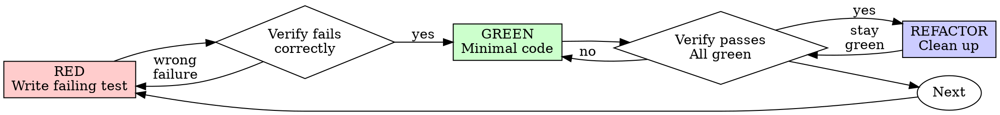

# Codex session 019fb70b-fcc3-70e1-92c7-9bde8538760d

- Started: `2026-07-31T07:20:44.035Z`
- Working directory: `D:\100XH100`
- Originator: `Codex Desktop`
- Codex CLI: `0.146.0-alpha.3.1`
- Source log: `C:\Users\Иван Литвак\.codex\sessions\2026\07\31\rollout-2026-07-31T10-20-44-019fb70b-fcc3-70e1-92c7-9bde8538760d.jsonl`
- Entries: user=1, assistant=11, tool calls=51, tool outputs=51

This is a chronological export of the user/assistant conversation and tool activity. Internal system/developer instructions and token accounting are intentionally excluded. Secret-shaped values are redacted; oversized tool outputs retain their beginning and end with the omitted character count.

## 1. User

Time: `2026-07-31T07:21:15.137Z` · source line `6`

```text
<recommended_plugins>
Here is a list of plugins that are available but not installed.

- Atlassian Rovo (atlassian-rovo@openai-curated-remote)
- Box (box@openai-curated-remote)
- Figma (figma@openai-curated-remote)
- Gmail (gmail@openai-curated-remote)
- Google Calendar (google-calendar@openai-curated-remote)
- Google Drive (google-drive@openai-curated-remote)
- Outlook Calendar (outlook-calendar@openai-curated-remote)
- Outlook Email (outlook-email@openai-curated-remote)
- SharePoint (sharepoint@openai-curated-remote)
- Slack (slack@openai-curated-remote)
- Teams (teams@openai-curated-remote)
</recommended_plugins>
# AGENTS.md instructions for D:\100XH100

<INSTRUCTIONS>
# Project Agent Rules

## Operating Rule
- Read `AGENTS.md` before project edits.
- Update `memory/CHANGELOG.md` after meaningful code, config, or architecture changes.
- Update `memory/PROMPTS.md` with user prompts that define requirements.
- Store test outputs, logs, and verification notes under `test_results/`.
- Prefer agent-centered code: explicit contracts, deterministic tests, small files, low hidden state.

## Architecture Source
- Primary architecture contract: `ARCHITECTURE_NEED.md`.
- Current Stream 4 implementation rule: use threshold + compact + CUB/fixed-temp sort/reduce + compact; do not use Stream 4 hash-table dedup.

## Implementation Guardrails
- `State128` logical bytes are `v[0..119]`.
- `State128` padding bytes are `v[120..127]`.
- Persistent frontier padding must be zero.
- `FinalResponse` may temporarily store `target_local_idx` in `v[120..123]`.
- `Hash128` is one logical 128-bit key stored as `{lo, hi}`.
- `CandidateMeta` must remain 32 bytes and 32-byte aligned.
- Stream 3 payload id must be original candidate id, not compact index.
- Stream 4 must not apply shard top-k or semantic shard cap.

</INSTRUCTIONS>
<environment_context>
  <cwd>D:\100XH100</cwd>
  <shell>powershell</shell>
  <current_date>2026-07-31</current_date>
  <timezone>Europe/Moscow</timezone>
  <filesystem><workspace_roots><root>D:\100XH100</root></workspace_roots><permission_profile type="managed"><file_system type="restricted"><entry access="read"><special>:root</special></entry><entry access="write"><path>D:\100XH100</path></entry><entry access="write"><special>:slash_tmp</special></entry><entry access="write"><special>:tmpdir</special></entry><entry access="write"><path>C:\Users\Иван Литвак\.codex\visualizations\2026\07\23\019f90a3-47e5-7770-a20e-cd9317bcbf2c</path></entry><entry access="read"><path>D:\100XH100\.git</path></entry><entry access="read"><path>D:\100XH100\.agents</path></entry><entry access="read"><path>D:\100XH100\.codex</path></entry></file_system></permission_profile></filesystem>
</environment_context>
```

## 2. Codex

Time: `2026-07-31T07:22:54.975Z` · source line `12`

```text
Беру Task 1 в выделенном worktree: сначала прочитаю brief и правила TDD, затем зафиксирую RED, реализую минимальное изменение и проверю GREEN.
```

## 3. Tool call: `exec`

Time: `2026-07-31T07:22:57.542Z` · source line `14`

```text
const r = await tools.shell_command({"command":"Get-Content -Raw AGENTS.md; Get-Content -Raw .superpowers\\sdd\\2026-07-31-stream1-transformer-accumulator\\task-1-brief.md; Get-Content -Raw 'C:\\Users\\Иван Литвак\\.codex\\plugins\\cache\\openai-curated-remote\\superpowers\\6.2.0\\skills\\test-driven-development\\SKILL.md'","workdir":"D:\\100XH100\\.worktrees\\stream1-transformer-accumulator","timeout_ms":10000});
text(r);
```

## 4. Tool output

Time: `2026-07-31T07:22:57.952Z` · source line `15`

````text
Script completed
Wall time 0.4 seconds
Output:

Exit code: 0
Wall time: 0.3 seconds
Output:
# Project Agent Rules

## Operating Rule
- Read `AGENTS.md` before project edits.
- Update `memory/CHANGELOG.md` after meaningful code, config, or architecture changes.
- Update `memory/PROMPTS.md` with user prompts that define requirements.
- Store test outputs, logs, and verification notes under `test_results/`.
- Prefer agent-centered code: explicit contracts, deterministic tests, small files, low hidden state.

## Architecture Source
- Primary architecture contract: `ARCHITECTURE_NEED.md`.
- Current Stream 4 implementation rule: use threshold + compact + CUB/fixed-temp sort/reduce + compact; do not use Stream 4 hash-table dedup.

## Implementation Guardrails
- `State128` logical bytes are `v[0..119]`.
- `State128` padding bytes are `v[120..127]`.
- Persistent frontier padding must be zero.
- `FinalResponse` may temporarily store `target_local_idx` in `v[120..123]`.
- `Hash128` is one logical 128-bit key stored as `{lo, hi}`.
- `CandidateMeta` must remain 32 bytes and 32-byte aligned.
- Stream 3 payload id must be original candidate id, not compact index.
- Stream 4 must not apply shard top-k or semantic shard cap.

# Stream1 Transformer Accumulator Decoupling Plan

Baseline: `df534ebb1ef624abd42443211778b5588916d6d2`
Branch: `codex/stream1-transformer-accumulator`

## Global constraints

- Do not change Stream4 algorithm: threshold + compact + CUB/fixed-temp sort/reduce + compact remains.
- Preserve State128, Hash128, CandidateMeta, original candidate-id, and no-shard-top-k contracts from AGENTS.md.
- MLP behavior remains backward compatible and byte/counter equivalent under legacy configuration.
- A Transformer may use small inference `B_MICRO` while accumulating the same macro Stream3 batch as MLP.
- Logical accumulation chunks and physical accumulator/exchange buffers are distinct explicit concepts.
- Physical buffers are reused only after Stream3, ordered Stream5/NCCL exchange, and remote collect complete.
- NCCL collective round order, including zero-send tail rounds, must match on all ranks.
- Every capacity/overflow/tail condition fails closed; never silently truncate.
- TDD: each production behavior begins with a focused failing test.
- No public/Kaggle update until local tests and a private real 2xT4 validation succeed.

## Task 1: Formalize runtime and memory contract

Add explicit, backward-compatible runtime/profile fields for logical accumulation chunks and bounded physical accumulator/exchange buffers. Preserve legacy defaults when fields are absent. Make static memory allocate score/hash/parent/count by physical accumulator buffers and Stream5 send/recv by physical exchange buffers, while Stream3 scratch remains sized by the macro batch. Add fail-first runtime/static-memory tests for Transformer `B_MICRO=384`, macro batch around 1.5-1.8M, 2 accumulator buffers, bounded Stream5 memory, invalid divisibility/zero/budget, and legacy MLP equivalence.


## Required interface decisions

- Preserve existing `BEAM_RING_COUNT` behavior and backward compatibility. It already bounds reusable physical accumulator/Stream5 buffers when explicitly set.
- Introduce clear named runtime/profile fields only where needed so logical accumulation (`stream3_batch_candidates / (b_micro*MOVE_COUNT)`) is not confused with physical reusable buffers.
- Legacy env absence must retain the current derived layout exactly.
- Explicit physical accumulator count 2 and macro batch 1,769,472 at B_MICRO=384 must produce bounded score/hash and Stream5 allocations, not a layout proportional to 456 physical buffers.
- Do not touch dispatcher scheduling in Task 1 except compile adaptations required by data-structure fields; Task 2 owns behavioral rebinding.
- Write focused tests first and record the observed RED failure before production edits.
- Update memory/PROMPTS.md, memory/CHANGELOG.md, and a Task 1 test_results report only for the Task 1 contract.
- Commit all Task 1 changes on the current branch. Preserve unrelated files.
---
name: test-driven-development
description: Use when implementing any feature or bugfix, before writing implementation code
---

# Test-Driven Development (TDD)

## Overview

Write the test first. Watch it fail. Write minimal code to pass.

**Core principle:** If you didn't watch the test fail, you don't know if it tests the right thing.

**Violating the letter of the rules is violating the spirit of the rules.**

## When to Use

**Always:**
- New features
- Bug fixes
- Refactoring
- Behavior changes

**Exceptions (ask your human partner):**
- Throwaway prototypes
- Generated code
- Configuration files

Thinking "skip TDD just this once"? Stop. That's rationalization.

## The Iron Law

```
NO PRODUCTION CODE WITHOUT A FAILING TEST FIRST
```

Write code before the test? Delete it. Start over.

**No exceptions:**
- Don't keep it as "reference"
- Don't "adapt" it while writing tests
- Don't look at it
- Delete means delete

Implement fresh from tests. Period.

## Red-Green-Refactor



### RED - Write Failing Test

Write one minimal test showing what should happen.

<Good>
```typescript
test('retries failed operations 3 times', async () => {
  let attempts = 0;
  const operation = () => {
    attempts++;
    if (attempts < 3) throw new Error('fail');
    return 'success';
  };

  const result = await retryOperation(operation);

  expect(result).toBe('success');
  expect(attempts).toBe(3);
});
```
Clear name, tests real behavior, one thing
</Good>

<Bad>
```typescript
test('retry works', async () => {
  const mock = jest.fn()
    .mockRejectedValueOnce(new Error())
    .mockRejectedValueOnce(new Error())
    .mockResolvedValueOnce('success');
  await retryOperation(mock);
  expect(mock).toHaveBeenCalledTimes(3);
});
```
Vague name, tests mock not code
</Bad>

**Requirements:**
- One behavior
- Clear name
- Real code (no mocks unless unavoidable)

### Verify RED - Watch It Fail

**MANDATORY. Never skip.**

```bash
npm test path/to/test.test.ts
```

Confirm:
- Test fails (not errors)
- Failure message is expected
- Fails because feature missing (not typos)

**Test passes?** You're testing existing behavior. Fix test.

**Test errors?** Fix error, re-run until it fails correctly.

### GREEN - Minimal Code

Write simplest code to pass the test.

<Good>
```typescript
async function retryOperation<T>(fn: () => Promise<T>): Promise<T> {
  for (let i = 0; i < 3; i++) {
    try {
      return await fn();
    } catch (e) {
      if (i === 2) throw e;
    }
  }
  throw new Error('unreachable');
}
```
Just enough to pass
</Good>

<Bad>
```typescript
async function retryOperation<T>(
  fn: () => Promise<T>,
  options?: {
    maxRetries?: number;
    backoff?: 'linear' | 'exponential';
    onRetry?: (attempt: number) => void;
  }
): Promise<T> {
  // YAGNI
}
```
Over-engineered
</Bad>

Don't add features, refactor other code, or "improve" beyond the test.

### Verify GREEN - Watch It Pass

**MANDATORY.**

```bash
npm test path/to/test.test.ts
```

Confirm:
- Test passes
- Other tests still pass
- Output pristine (no errors, warnings)

**Test fails?** Fix code, not test.

**Other tests fail?** Fix now.

### REFACTOR - Clean Up

After green only:
- Remove duplication
- Improve names
- Extract helpers

Keep tests green. Don't add behavior.

### Repeat

Next failing test for next feature.

## Good Tests

| Quality | Good | Bad |
|---------|------|-----|
| **Minimal** | One thing. "and" in name? Split it. | `test('validates email and domain and whitespace')` |
| **Clear** | Name describes behavior | `test('test1')` |
| **Shows intent** | Demonstrates desired API | Obscures what code should do |

When writing or changing any test, read [writing-good-tests.md](writing-good-tests.md) for the rules that keep tests honest:
- Name the production change that would make the test fail — before writing it
- Assert on real behavior, never on mock behavior
- Keep test-only code in test utilities, out of production classes
- Understand a dependency's side effects before mocking it

## Common Rationalizations

| Excuse | Reality |
|--------|---------|
| "Too simple to test" | Simple code breaks. Test takes 30 seconds. |
| "I'll test after" | Tests written after pass immediately — which proves nothing. They may test the wrong thing, test the implementation instead of the behavior, or miss the edge case you forgot. You never watched it fail, so you never proved it can catch the bug. Test-first forces that failure. |
| "Tests after achieve same goals (spirit not ritual)" | Tests-after answer "what does this do?"; tests-first answer "what should this do?" Tests written after are biased by the code you already wrote — you verify the cases you remembered, not the ones you'd have discovered. Coverage without proof the tests work. |
| "Already manually tested" | Manual testing is ad-hoc: no record of what you covered, no way to re-run it when the code changes, easy to forget cases under pressure. "Worked when I tried it" в‰  comprehensive. Automated tests run the same way every time. |
| "Deleting X hours is wasteful" | Sunk cost fallacy — that time is already spent either way. The real choice: rewrite with TDD (high confidence) vs. keep it and bolt tests on after (low confidence, likely bugs). Keeping code you can't trust is the waste. |
| "Keep as reference, write tests first" | You'll adapt it. That's testing after. Delete means delete. |
| "Need to explore first" | Fine. Throw away exploration, start with TDD. |
| "Test hard = design unclear" | Listen to test. Hard to test = hard to use. |
| "TDD will slow me down" | TDD IS the pragmatic path: catches bugs before commit, prevents regressions, lets you refactor without fear. "Pragmatic" shortcuts mean debugging in production — slower, not faster. |
| "Manual test faster" | Manual doesn't prove edge cases. You'll re-test every change. |
| "Existing code has no tests" | You're improving it. Add tests for existing code. |

## Red Flags - STOP and Start Over

- Code before test
- Test after implementation
- Test passes immediately
- Can't explain why test failed
- Tests added "later"
- Rationalizing "just this once"
- "I already manually tested it"
- "Tests after achieve the same purpose"
- "It's about spirit not ritual"
- "Keep as reference" or "adapt existing code"
- "Already spent X hours, deleting is wasteful"
- "TDD is dogmatic, I'm being pragmatic"
- "This is different because..."

**All of these mean: Delete code. Start over with TDD.**

## Example: Bug Fix

**Bug:** Empty email accepted

**RED**
```typescript
test('rejects empty email', async () => {
  const result = await submitForm({ email: '' });
  expect(result.error).toBe('Email required');
});
```

**Verify RED**
```bash
$ npm test
FAIL: expected 'Email required', got undefined
```

**GREEN**
```typescript
function submitForm(data: FormData) {
  if (!data.email?.trim()) {
    return { error: 'Email required' };
  }
  // ...
}
```

**Verify GREEN**
```bash
$ npm test
PASS
```

**REFACTOR**
Extract validation for multiple fields if needed.

## Verification Checklist

Before marking work complete:

- [ ] Every new function/method has a test
- [ ] Watched each test fail before implementing
- [ ] Each test failed for expected reason (feature missing, not typo)
- [ ] Wrote minimal code to pass each test
- [ ] All tests pass
- [ ] Output pristine (no errors, warnings)
- [ ] Tests use real code (mocks only if unavoidable)
- [ ] Edge cases and errors covered

Can't check all boxes? You skipped TDD. Start over.

## When Stuck

| Problem | Solution |
|---------|----------|
| Don't know how to test | Write wished-for API. Write assertion first. Ask your human partner. |
| Test too complicated | Design too complicated. Simplify interface. |
| Must mock everything | Code too coupled. Use dependency injection. |
| Test setup huge | Extract helpers. Still complex? Simplify design. |

## Debugging Integration

Bug found? Write failing test reproducing it. Follow TDD cycle. Test proves fix and prevents regression.

Never fix bugs without a test.

## Final Rule

```
Production code в†’ test exists and failed first
Otherwise в†’ not TDD
```

No exceptions without your human partner's permission.


````

## 5. Tool call: `exec`

Time: `2026-07-31T07:23:02.125Z` · source line `18`

```text
const r = await tools.shell_command({"command":"git status --short; rg -n \"BEAM_RING_COUNT|stream3_batch_candidates|b_micro|B_MICRO|Stream5|stream5|accumulator\" -g \"!*build*\" .","workdir":"D:\\100XH100\\.worktrees\\stream1-transformer-accumulator","timeout_ms":10000});
text(r);
```

## 6. Tool output

Time: `2026-07-31T07:23:03.717Z` · source line `19`

Oversized output: `8149` characters omitted from the middle.

```text
Script completed
Wall time 1.6 seconds
Output:

Warning: truncated output (original token count: 10025)
Total output lines: 252

Exit code: 0
Wall time: 1.5 seconds
Total output lines: 1117
Output:
?? docs/superpowers/plans/2026-07-31-stream1-transformer-accumulator.md
.\ARCHITECTURE_NEED.md:9:B_MICRO
.\ARCHITECTURE_NEED.md:49:## 2026-05-26 Stream5 threshold update contract
.\ARCHITECTURE_NEED.md:61:        Stream5 threshold snapshot reads shard_score_hist_active_index, then sums the selected A/B buffers.
.\ARCHITECTURE_NEED.md:62:    Stream5 owns threshold collective communication.
.\ARCHITECTURE_NEED.md:64:    Every rank participates in threshold request reduction at Stream5 exchange points.
.\ARCHITECTURE_NEED.md:77:    Stream5 writes inactive current_threshold slot first.
.\ARCHITECTURE_NEED.md:78:    Stream5 writes inactive threshold_initialized slot second.
.\ARCHITECTURE_NEED.md:79:    Stream5 commits current_threshold_active_index after device memory fence.
.\ARCHITECTURE_NEED.md:97:    STREAM3_BATCH_CANDIDATES / (B_MICRO * MOVE_COUNT)
.\ARCHITECTURE_NEED.md:100:    RING_SLOT_COUNT * B_MICRO * MOVE_COUNT
.\ARCHITECTURE_NEED.md:127:    ceil(LOGICAL_SHARD_SIZE / (B_MICRO * MOVE_COUNT))
.\ARCHITECTURE_NEED.md:315:    ring_slot * (B_MICRO * MOVE_COUNT)
.\ARCHITECTURE_NEED.md:490:  [B_MICRO]
.\ARCHITECTURE_NEED.md:499:  [B_MICRO]
.\ARCHITECTURE_NEED.md:750:        count[ring][ring_slot] = min(B_MICRO, frontier_remaining)
.\ARCHITECTURE_NEED.md:771:        and stream5_exchange_slot_free:
.\ARCHITECTURE_NEED.md:916:    B_MICRO parents × MOVE_COUNT moves
.\ARCHITECTURE_NEED.md:925:    hash_ring[ring][ring_slot][B_MICRO][MOVE_COUNT]
.\ARCHITECTURE_NEED.md:1053:ring_slot    = i / (B_MICRO * MOVE_COUNT)
.\ARCHITECTURE_NEED.md:1054:local_i      = i % (B_MICRO * MOVE_COUNT)
.\CMakeLists.txt:115:    cuda/stream5.cu
.\CMakeLists.txt:202:add_executable(stream5_cuda_tests tests/stream5_cuda_tests.cu)
.\CMakeLists.txt:203:target_link_libraries(stream5_cuda_tests PRIVATE beam_cuda)
.\CMakeLists.txt:204:set_target_properties(stream5_cuda_tests PROPERTIES CUDA_STANDARD 17 CUDA_STANDARD_REQUIRED ON CUDA_ARCHITECTURES "${BEAM_CUDA_ARCHITECTURES}")
.\CMakeLists.txt:290:add_test(NAME stream5_cuda_tests COMMAND stream5_cuda_tests)
.\cuda\dispatcher.cu:9:#include "stream5.hpp"
.\cuda\dispatcher.cu:1227:    check_cuda(cudaStreamCreateWithFlags(&streams.stream5, cudaStreamNonBlocking), "cudaStreamCreate stream5");
.\cuda\dispatcher.cu:1255:    if (streams.stream5) {
.\cuda\dispatcher.cu:1256:        cudaStreamDestroy(streams.stream5);
.\cuda\dispatcher.cu:1379:        const std::uint64_t candidates_per_slot = static_cast<std::uint64_t>(plan.config.b_micro) * MOVE_COUNT;
.\cuda\dispatcher.cu:1408:                    plan.config.b_micro,
.\cuda\dispatcher.cu:1412:                    network.transformer_micro == 0U ? plan.config.b_micro : network.transformer_micro;
.\cuda\dispatcher.cu:1413:                if (transformer_micro == 0U || transformer_micro > plan.config.b_micro) {
.\cuda\dispatcher.cu:1414:                    throw std::invalid_argument("Stream1 transformer micro must be in [1, B_MICRO]");
.\cuda\dispatcher.cu:1416:                for (std::uint32_t parent_offset = 0; parent_offset < plan.config.b_micro;
.\cuda\dispatcher.cu:1418:                    const std::uint32_t chunk = std::min(transformer_micro, plan.config.b_micro - parent_offset);
.\cuda\dispatcher.cu:1429:                            plan.config.b_micro,
.\cuda\dispatcher.cu:1459:                    plan.config.b_micro,
.\cuda\dispatcher.cu:1475:                    plan.config.b_micro,
.\cuda\dispatcher.cu:1489:        const std::uint64_t ring_candidate_offset = static_cast<std::uint64_t>(ring) * plan.config.stream3_batch_candidates;
.\cuda\dispatcher.cu:1490:        const std::uint64_t stream5_send_slot =
.\cuda\dispatcher.cu:1493:            memory.streams.remote_send_buffer + stream5_send_slot * plan.stream5_send_slot_capacity;
.\cuda\dispatcher.cu:1507:                plan.config.b_micro,
.\cuda\dispatcher.cu:1508:                plan.config.stream3_batch_candidates,
.\cuda\dispatcher.cu:1530:            plan.config.b_micro,
.\cuda\dispatcher.cu:1531:            plan.config.stream3_batch_candidates,
.\cuda\dispatcher.cu:1555:                plan.config.b_micro,
.\cuda\dispatcher.cu:1556:                plan.config.stream3_batch_candidates,
.\cuda\dispatcher.cu:1622:                plan.config.b_micro,
.\cuda\dispatcher.cu:1623:                plan.config.stream3_batch_candidates,
.\cuda\dispatcher.cu:1658:                plan.config.stream3_batch_candidates,
.\cuda\dispatcher.cu:1679:            plan.config.stream3_batch_candidates,
.\cuda\dispatcher.cu:1797:    const std::uint64_t candidates_per_slot = static_cast<std::uint64_t>(plan.config.b_micro) * MOVE_COUNT;
.\cuda\dispatcher.cu:1831:        static_cast<std::uint64_t>(plan.derived.ring_slot_count) * plan.config.b_micro;
.\cuda\dispatcher.cu:1839:            memory.streams.stream5_local_round_count,
.\cuda\dispatcher.cu:1843:            streams.stream5), "cudaMemcpyAsync local stream5 round count");
.\cuda\dispatcher.cu:1846:                memory.streams.stream5_local_round_count,
.\cuda\dispatcher.cu:1847:                memory.streams.stream5_global_round_count,
.\cuda\dispatcher.cu:1852:                streams.stream5),
.\cuda\dispatcher.cu:1853:            "ncclAllReduce stream5 round count");
.\cuda\dispatcher.cu:1856:            memory.streams.stream5_global_round_count,
.\cuda\dispatcher.cu:1859:            streams.stream5), "cudaMemcpyAsync global stream5 round count");
.\cuda\dispatcher.cu:1860:        check_cuda(cudaStreamSynchronize(streams.stream5), "cudaStreamSynchronize stream5 round count");
.\cuda\dispatcher.cu:1926:    std::vector<cudaEvent_t> stream5_timing_start(1, nullptr);
.\cuda\dispatcher.cu:1927:    std::vector<cudaEvent_t> stream5_timing_stop(1, nullptr);
.\cuda\dispatcher.cu:1954:    check_cuda(cudaEventCreate(&stream5_timing_start[0]), "cudaEventCreate stream5 timing start");
.\cuda\dispatcher.cu:1955:    check_cuda(cudaEventCreate(&stream5_timing_stop[0]), "cudaEventCreate stream5 timing stop");
.\cuda\dispatcher.cu:1983:        &stream5_timing_start,
.\cuda\dispatcher.cu:1984:        &stream5_timing_stop,
.\cuda\dispatcher.cu:2251:        state.stream5_recv_total += recv_total;
.\cuda\dispatcher.cu:2409:            plan.config.shard_count == 0U ? plan.config.stream3_batch_candidates :
.\cuda\dispatcher.cu:2410:            (plan.config.stream3_batch_candidates + plan.config.shard_count - 1U) / plan.config.shard_count;
.\cuda\dispatcher.cu:2445:                          plan.config.stream3_batch_candidates,
.\cuda\dispatcher.cu:2772:        unique_count = std::min(unique_count, plan.config.stream3_batch_candidates);
.\cuda\dispatcher.cu:2813:        local_pending_count = std::min(local_pending_count, plan.config.stream3_batch_candidates);
.\cuda\dispatcher.cu:3079:                        std::min<std::uint64_t>(plan.config.b_micro, remaining_for_job));
.\cuda\dispatcher.cu:3107:                        launch_context.b_micro = plan.config.b_micro;
.\cuda\dispatcher.cu:3146:                                        << " b_micro=" << plan.config.b_micro
.\cuda\dispatcher.cu:3252:    const auto maybe_run_stream5_threshold_update = [&](bool force_local_request) -> bool {
.\cuda\dispatcher.cu:3262:                  << " label=stream5_collective_periodic"
.\cuda\dispatcher.cu:3275:            streams.stream5), "cudaMemcpyAsync stream5 threshold local request");
.\cuda\dispatcher.cu:3284:                streams.stream5),
.\cuda\dispatcher.cu:3285:            "ncclAllReduce stream5 threshold request");
.\cuda\dispatcher.cu:3291:            streams.stream5), "cudaMemcpyAsync stream5 threshold global request");
.\cuda\dispatcher.cu:3292:        check_cuda(cudaStreamSynchronize(streams.stream5), "cudaStreamSynchronize stream5 threshold request");
.\cuda\dispatcher.cu:3296:                  << " label=stream5_collective_periodic"
.\cuda\dispatcher.cu:3306:        check_cuda(cudaEventRecord(stream5_timing_start[0], streams.stream5), "cudaEventRecord stream5 threshold timing start");
.\cuda\dispatcher.cu:3308:        update_threshold_global(plan, memory, streams.stream5, true, collective, false, "stream5_collective_periodic");
.\cuda\dispatcher.cu:3310:        check_cuda(cudaEventRecord(stream5_timing_stop[0], streams.stream5), "cudaEventRecord stream5 threshold timing stop");
.\cuda\dispatcher.cu:3312:        check_cuda(cudaStreamSynchronize(streams.stream5), "cudaStreamSynchronize stream5 threshold update");
.\cuda\dispatcher.cu:3315:            stream5_timing_start[0],
.\cuda\dispatcher.cu:3316:            stream5_timing_stop[0],
.\cuda\dispatcher.cu:3317:            state.stream5_ms_total,
.\cuda\dispatcher.cu:3319:            "cudaEventElapsedTime stream5 threshold");
.\cuda\dispatcher.cu:3329:            streams.stream5), "cudaMemcpyAsync clear stream5 threshold local request");
.\cuda\dispatcher.cu:3335:            streams.stream5), "cudaMemcpyAsync clear stream5 threshold global request");
.\cuda\dispatcher.cu:3336:        check_cuda(cudaStreamSynchronize(streams.stream5), "cudaStreamSynchronize clear stream5 threshold request");
.\cuda\dispatcher.cu:3341:    const auto run_stream5_exchange_and_collect = [&](std::uint32_t ring, bool zero_send) {
.\cuda\dispatcher.cu:3345:        if (ring >= plan.stream5_slot_count) {
.\cuda\dispatcher.cu:3346:            throw std::runtime_error("stream5 exchange ring exceeds slot count");
.\cuda\dispatcher.cu:3349:            memory.streams.remote_send_buffer + static_cast<std::uint64_t>(ring) * plan.stream5_send_slot_capacity;
.\cuda\dispatcher.cu:3351:            memory.streams.remote_recv_buffer + static_cast<std::uint64_t>(ring) * plan.stream5_recv_slot_capacity;
.\cuda\dispatcher.cu:3360:                streams.stream5), "cudaMemcpyAsync zero stream5 send counts");
.\cuda\dispatcher.cu:3366:                streams.stream5), "cudaMemcpyAsync zero stream5 send offsets");
.\cuda\dispatcher.cu:3372:                cudaMemcpyDeviceToHost), "cudaMemcpy stream5 send counts");
.\cuda\dispatcher.cu:3377:                cudaMemcpyDeviceToHost), "cudaMemcpy stream5 send offsets");
.\cuda\dispatcher.cu:3378:            if (host_send_offset[plan.config.world_size] > plan.stream5_send_slot_capacity) {
.\cuda\dispatcher.cu:3379:                throw std::runtime_error("stream5 send count exceeds slot capacity");
.\cuda\dispatcher.cu:3384:        check_cuda(cudaEventRecord(stream5_timing_start[0], streams.stream5), "cudaEventRecord stream5 exchange timing start");
.\cuda\dispatcher.cu:3386:        stream5_exchange_counts_nccl_cuda(
.\cuda\dispatcher.cu:3392:            streams.stream5);
.\cuda\dispatcher.cu:3393:        check_cuda(cudaStreamSynchronize(streams.stream5), "cudaStreamSynchronize stream5 count exchange");
.\cuda\dispatcher.cu:3398:            cudaMemcpyDeviceToHost), "cudaMemcpy stream5 recv counts");
.\cuda\dispatcher.cu:3404:                throw std::runtime_error("stream5 recv count exceeds uint32 range");
.\cuda\dispatcher.cu:3408:        if (recv_total_64 > plan.stream5_recv_slot_capacity) {
.\cuda\dispatcher.cu:3410:                "stream5 recv count exceeds slot capacity: recv=" +
.\cuda\dispatcher.cu:3412:                " capacity=" + std::to_string(plan.stream5_recv_slot_capacity) +
.\cuda\dispatcher.cu:3413:                " scale_ppm=" + std::to_string(plan.config.stream5_recv_capacity_scale_ppm));
.\cuda\dispatcher.cu:3415:        stream5_write_recv_offsets_cuda(
.\cuda\dispatcher.cu:3419:            streams.stream5);
.\cuda\dispatcher.cu:3420:        stream5_exchange_payload_nccl_cuda(
.\cuda\dispatcher.cu:3433:            streams.stream5);
.\cuda\dispatcher.cu:3435:        check_cuda(cudaEventRecord(stream5_timing_stop[0], streams.stream5), "cudaEventRecord stream5 exchange timing stop");
.\cuda\dispatcher.cu:3437:        check_cuda(cudaStreamSynchronize(streams.stream5), "cudaStreamSynchronize stream5 payload exchange");
.\cuda\dispatcher.cu:3440:            stream5_timing_start[0],
.\cuda\dispatcher.cu:3441:            stream5_timing_stop[0],
.\cuda\dispatcher.cu:3442:            state.stream5_ms_total,
.\cuda\dispatcher.cu:3444:            "cudaEventElapsedTime stream5 exchange");
.\cuda\dispatcher.cu:3447:        maybe_run_stream5_threshold_update(false);
.\cuda\dispatcher.cu:3505:        check_cuda(cudaEventRecord(stream5_timing_start[0], streams.stream5), "cudaEventRecord stream5 timing start");
.\cuda\dispatcher.cu:3507:        update_threshold_global(plan, memory, streams.stream5, true, collective, false, "single_gpu_periodic");
.\cuda\dispatcher.cu:3509:        check_cuda(cudaEventRecord(stream5_timing_stop[0], streams.stream5), "cudaEventRecord stream5 timing stop");
.\cuda\dispatcher.cu:3511:        check_cuda(cudaStreamSynchronize(streams.stream5), "cudaStreamSynchronize stream5 periodic threshold update");
.\cuda\dispatcher.cu:3514:            stream5_timing_start[0],
.\cuda\dispatcher.cu:3515:            stream5_timing_stop[0],
.\cuda\dispatcher.cu:3516:            state.stream5_ms_total,
.\cuda\dispatcher.cu:3518:            "cudaEventElapsedTime stream5 threshold");
.\cuda\dispatcher.cu:3777:                plan.config.stream3_batch_candidates,
.\cuda\dispatcher.cu:3892:        run_stream5_exchange_and_collect(ring, false);
.\cuda\dispatcher.cu:4035:            static_cast<std::uint32_t>(completed_exchange_rounds % plan.stream5_slot_count);
.\cuda\dispatcher.cu:4036:        run_stream5_exchange_and_collect(ring, true);
.\cuda\dispatcher.cu:4046:        maybe_run_stream5_threshold_update(stream4_jobs_since_threshold_update != 0U);
.\cuda\dispatcher.cu:4104:            plan.config.stream3_batch_candidates,
.\cuda\dispatcher.cu:4254:    record_timing_start(streams.stream5, "cudaEventRecord final threshold timing start");
.\cuda\dispatcher.cu:4265:    update_threshold_global(plan, memory, streams.stream5, false, collective, false, "final_select");
.\cuda\dispatcher.cu:4268:        streams.stream5,
.\cuda\dispatcher.cu:4269:        result.stream5_threshold_ms,
.\cuda\dispatcher.cu:4271:        "cudaStreamSynchronize stream5 final threshold",
.\cuda\dispatcher.cu:4272:        "cudaEventElapsedTime stream5 final threshold");
.\cuda\dispatcher.cu:4274:    check_cuda(cudaStreamSynchronize(streams.stream5), "cudaStreamSynchronize stream5 final threshold");
.\cuda\dispatcher.cu:4292:              << " stream5_threshold_ms=" << result.stream5_threshold_ms
.\cuda\dispatcher.cu:4350:                    streams.stream5), "cudaMemcpyAsync exchange host send to device");
.\cuda\dispatcher.cu:4357:                streams.stream5), "cudaMemcpyAsync exchange send counts");
.\cuda\dispatcher.cu:4363:                streams.stream5), "cudaMemcpyAsync exchange send offsets");
.\cuda\dispatcher.cu:4364:            stream5_exchange_counts_nccl_cuda(
.\cuda\dispatcher.cu:4370:                streams.stream5);
.\cuda\dispatcher.cu:4371:            check_cuda(cudaStreamSynchronize(streams.stream5), "cudaStreamSynchronize exchange counts");
.\cuda\dispatcher.cu:4394:            stream5_write_recv_offsets_cuda(
.\cuda\dispatcher.cu:4398:                streams.stream5);
.\cuda\dispatcher.cu:4399:            check_cuda(cudaStreamSynchronize(streams.stream5), "cudaStreamSynchronize exchange recv offsets");
.\cuda\dispatcher.cu:4400:            stream5_exchange_u64_payload_nccl_cuda(
.\cuda\dispatcher.cu:4411:                streams.stream5);
.\cuda\dispatcher.cu:4418:                    streams.stream5), "cudaMemcpyAsync exchange device recv to host");
.\cuda\dispatcher.cu:4421:                check_cuda(cudaEventRecord(done_event, streams.stream5), "cudaEventRecord final exchange payload done");
.\cuda\dispatcher.cu:4444:            streams.stream5);
.\cuda\dispatcher.cu:4445:        check_cuda(cudaStreamSynchronize(streams.stream5), "cudaStreamSynchronize final less allgather");
.\cuda\dispatcher.cu:4471:            stream

[... 8149 characters omitted from oversized tool output ...]

),\n    'output_dim': manifest.get('output_dim'),\n}, flush=True)\n\nif not (CUTLASS_DIR / 'include').exists():\n    cleanup_path(CUTLASS_DIR)\n    run_checked(['git', 'clone', '--depth', '1', 'https://github.com/NVIDIA/cutlass.git', CUTLASS_DIR])\n\nrun_checked([\n    'cmake', '-S', REPO_DIR, '-B', BUILD_DIR, '-GNinja',\n    '-DCMAKE_BUILD_TYPE=Release',\n    f'-DBEAM_CUDA_ARCHITECTURES={CUDA_ARCHITECTURES}',\n    f'-DCUTLASS_DIR={CUTLASS_DIR}',\n    f'-DBEAM_ENABLE_DEBUG={\"ON\" if ENABLE_DEBUG else \"OFF\"}',\n    f'-DBEAM_ENABLE_DEPTH_LOGS={\"ON\" if ENABLE_DEPTH_LOGS else \"OFF\"}',\n    f'-DBEAM_ENABLE_DEBUG_LOGS={\"ON\" if ENABLE_DEBUG_LOGS else \"OFF\"}',\n    f'-DBEAM_DEBUG_STREAM_TIMING={\"ON\" if DEBUG_STREAM_TIMING else \"OFF\"}',\n    f'-DBEAM_DEBUG_INFERENCE_TRACE={\"ON\" if DEBUG_INFERENCE_TRACE else \"OFF\"}',\n    f'-DBEAM_DEBUG_PATH_TRACE={\"ON\" if DEBUG_PATH_TRACE else \"OFF\"}',\n    f'-DBEAM_DEBUG_FINAL_VALIDATE={\"ON\" if DEBUG_FINAL_VALIDATE else \"OFF\"}',\n    f'-DBEAM_DEBUG_FINAL_EXCHANGE_TRACE={\"ON\" if DEBUG_FINAL_EXCHANGE_TRACE else \"OFF\"}',\n    f'-DBEAM_DEBUG_FINAL_HISTOGRAM_TRACE={\"ON\" if DEBUG_FINAL_HISTOGRAM_TRACE else \"OFF\"}',\n    f'-DBEAM_DEBUG_STREAM4_HISTOGRAM_TRACE={\"ON\" if DEBUG_STREAM4_HISTOGRAM_TRACE else \"OFF\"}',\n    f'-DBEAM_DEBUG_DEPTH_FLOW_TRACE={\"ON\" if DEBUG_DEPTH_FLOW_TRACE else \"OFF\"}',\n    f'-DBEAM_DEBUG_PIPELINE_STATS={\"ON\" if DEBUG_PIPELINE_STATS else \"OFF\"}',\n], cwd=REPO_DIR)\nrun_checked(['cmake', '--build', BUILD_DIR, '--target', 'production_runner', 'stream1_transformer_cuda_tests', '-j', '2'])\nrun_checked([BUILD_DIR / 'stream1_transformer_cuda_tests'], cwd=WORK_DIR)\n",
.\kaggle_t4_transformer_smoke\t4-transformer-beam-smoke.ipynb:24:      "source": "import os\nfrom pathlib import Path\nimport shutil\nimport subprocess\nimport sys\nimport time\n\n\ndef safe_name(text):\n    return ''.join(ch if ch.isalnum() or ch in ('-', '_') else '_' for ch in str(text))\n\n\ndef should_print_live(line):\n    low = line.lower()\n    return (\n        'stream1_backend=' in line or\n        'stream1_model_backend=' in line or\n        'stream1_transformer_dims' in line or\n        'runner_phase=' in line or\n        'candidate_history_' in line or\n        'history_' in line or\n        line.startswith('depth ') or\n        'puzzle_' in line or\n        'error' in low or\n        'exception' in low or\n        'terminate called' in low or\n        'what():' in low or\n        'childfailed' in low or\n        'traceback' in low or\n        'RUN_' in line\n    )\n\n\ndef env_for_smoke(puzzle_id):\n    values = derived_values()\n    history_path = Path(HISTORY_DISK_PATH) / f'p{puzzle_id}_beam{BEAM_WIDTH}_d{DEPTH_LIMIT}'\n    cleanup_path(history_path)\n    history_path.mkdir(parents=True, exist_ok=True)\n    nccl_id_file = WORK_DIR / f'beam_solver_nccl_transformer_smoke_p{puzzle_id}.bin'\n    cleanup_path(nccl_id_file)\n    cleanup_path(Path(str(nccl_id_file) + '.tmp'))\n    env = os.environ.copy()\n    env.update({\n        'BEAM_STREAM1_MODE': 'model',\n        'BEAM_WEIGHT_DIR': str(WEIGHT_OUT_DIR),\n        'BEAM_RUNTIME_CONFIG_MODE': RUNTIME_CONFIG_MODE,\n        'BEAM_SHARD_COUNT': str(SHARD_COUNT),\n        'BEAM_SHARD_CAPACITY_CANDIDATES': str(values['shard_capacity']),\n        'BEAM_SHARD_CAPACITY_SCALE_PPM': str(SHARD_CAPACITY_SCALE_PPM),\n        'BEAM_SHARD_BUFFER_COUNT': str(SHARD_BUFFER_COUNT),\n        'BEAM_GLOBAL_SPILL_CAPACITY': str(GLOBAL_SPILL_CAPACITY),\n        'BEAM_STREAM5_RECV_CAPACITY_SCALE_PPM': str(STREAM5_RECV_CAPACITY_SCALE_PPM),\n        'BEAM_GPU_HEADROOM_BYTES': str(GPU_HEADROOM_BYTES),\n        'BEAM_B_MICRO': str(B_MICRO),\n        'BEAM_STREAM1_CONCURRENCY': str(STREAM1_CONCURRENCY),\n        'BEAM_STREAM3_RING_SLOTS': str(STREAM3_RING_SLOTS),\n        'BEAM_STREAM4_BATCH_CANDIDATES': str(STREAM4_BATCH_CANDIDATES),\n        'BEAM_STREAM4_TRIGGER_CANDIDATES': str(STREAM4_TRIGGER_CANDIDATES),\n        'BEAM_STREAM4_ACTIVE_SORT_SLOTS': str(STREAM4_ACTIVE_SORT_SLOTS),\n        'BEAM_HISTORY_MODE': str(HISTORY_MODE),\n        'BEAM_HISTORY_RAM_BYTES': str(HISTORY_RAM_BYTES),\n        'BEAM_HISTORY_DISK_BYTES': str(HISTORY_DISK_BYTES),\n        'BEAM_HISTORY_DISK_PATH': str(history_path),\n        'BEAM_HISTORY_SLOT_COUNT': str(HISTORY_SLOT_COUNT),\n        'BEAM_HISTORY_WORKERS': str(HISTORY_WORKERS),\n        'BEAM_SOLVED_NEIGHBORHOOD_RADIUS': str(SOLVED_NEIGHBORHOOD_RADIUS),\n        'BEAM_SOLVED_NEIGHBORHOOD_MAX_ENTRIES': str(SOLVED_NEIGHBORHOOD_MAX_ENTRIES),\n        'BEAM_STREAM2_SUFFIX_RADIUS': str(STREAM2_SUFFIX_RADIUS),\n        'BEAM_STREAM2_SUFFIX_BACKEND': str(STREAM2_SUFFIX_BACKEND),\n        'BEAM_STREAM2_SUFFIX_MAX_COUNT': str(STREAM2_SUFFIX_MAX_COUNT),\n        'BEAM_DEPTH_LOG_EVERY': str(DEPTH_LOG_EVERY),\n        'BEAM_NCCL_ID_FILE': str(nccl_id_file),\n    })\n    env.pop('WORLD_SIZE', None)\n    env.pop('RANK', None)\n    env.pop('LOCAL_RANK', None)\n    return env, history_path, nccl_id_file\n\n\ndef run_one(puzzle_id):\n    env, history_path, nccl_id_file = env_for_smoke(puzzle_id)\n    log_path = RUN_LOG_DIR / f'torchrun_piece_transformer_p{puzzle_id}_d{DEPTH_LIMIT}_b{BEAM_WIDTH}.log'\n    cmd = [\n        sys.executable, '-m', 'torch.distributed.run',\n        '--no-python',\n        f'--nnodes={int(TORCHRUN_NNODES)}',\n        f'--nproc-per-node={int(TORCHRUN_NPROC_PER_NODE)}',\n        f'--node-rank={int(TORCHRUN_NODE_RANK)}',\n        f'--rdzv-backend={TORCHRUN_RDZV_BACKEND}',\n        f'--rdzv-endpoint={TORCHRUN_RDZV_ENDPOINT}',\n        f'--rdzv-id={TORCHRUN_RDZV_ID}',\n        str(BUILD_DIR / 'production_runner'), str(puzzle_id), str(DEPTH_LIMIT), str(BEAM_WIDTH),\n    ]\n    print('RUN_T4_TRANSFORMER_SMOKE_START', flush=True)\n    print('cmd=', ' '.join(map(str, cmd)), flush=True)\n    print('world_size_from_torchrun_shape=', torchrun_world_size(), flush=True)\n    print('global_beam=', BEAM_WIDTH, flush=True)\n    print('history_path=', history_path, flush=True)\n    print('weight_dir=', WEIGHT_OUT_DIR, flush=True)\n    print('nccl_id_file=', nccl_id_file, flush=True)\n    print('log_path=', log_path, flush=True)\n    start = time.time()\n    saw_piece_transformer = False\n    with log_path.open('w', buffering=1, encoding='utf-8') as log:\n        proc = subprocess.Popen(cmd, cwd=REPO_DIR, env=env, stdout=subprocess.PIPE, stderr=subprocess.STDOUT, text=True, bufsize=1)\n        assert proc.stdout is not None\n        for line in proc.stdout:\n            log.write(line)\n            if 'stream1_backend=piece_transformer' in line or 'stream1_model_backend=piece_transformer' in line:\n                saw_piece_transformer = True\n            if should_print_live(line):\n                print(line, end='', flush=True)\n        rc = proc.wait(timeout=RUN_TIMEOUT_SEC if RUN_TIMEOUT_SEC else None)\n    elapsed = time.time() - start\n    print(f'RUN_T4_TRANSFORMER_SMOKE_RC {rc} seconds={elapsed:.3f}', flush=True)\n    if rc != 0:\n        raise SystemExit(rc)\n    if not saw_piece_transformer:\n        raise RuntimeError(f'run log did not contain stream1_backend=piece_transformer or stream1_model_backend=piece_transformer: {log_path}')\n    cleanup_path(history_path)\n    return {'puzzle_id': puzzle_id, 'return_code': rc, 'seconds': elapsed, 'log_path': str(log_path)}\n\n\nresults = []\nfor offset in range(PUZZLE_COUNT):\n    results.append(run_one(START_PUZZLE_ID + offset))\nprint('RUN_T4_TRANSFORMER_SMOKE_RESULTS=', results, flush=True)\nresults\n",
.\kaggle_t4_transformer_benchmark\t4-transformer-stream1-benchmark.ipynb:59:                                     "B_MICRO = 512\n",
.\kaggle_t4_transformer_benchmark\t4-transformer-stream1-benchmark.ipynb:208:                                     "    stream3_batch = int(STREAM3_RING_SLOTS) * int(B_MICRO) * 24\n",
.\kaggle_t4_transformer_benchmark\t4-transformer-stream1-benchmark.ipynb:374:                                     "    r\u0027b_micro=(?P\u003cb_micro\u003e\\d+)\\s+\u0027\n",
.\kaggle_t4_transformer_benchmark\t4-transformer-stream1-benchmark.ipynb:396:                                     "        \u0027b_micro\u0027: int(values[\u0027b_micro\u0027]),\n",
.\kaggle_t4_transformer_benchmark\t4-transformer-stream1-benchmark.ipynb:408:                                     "def run_one(gpu, phase, label, repeat, b_micro, concurrency, extra_env, write_dump):\n",
.\kaggle_t4_transformer_benchmark\t4-transformer-stream1-benchmark.ipynb:409:                                     "    stem = f\u0027{phase}_gpu{gpu}_{label}_r{repeat}_b{b_micro}_c{concurrency}\u0027\n",
.\kaggle_t4_transformer_benchmark\t4-transformer-stream1-benchmark.ipynb:420:                                     "        \u0027BEAM_STREAM1_TRANSFORMER_B_MICRO\u0027: str(b_micro),\n",
.\kaggle_t4_transformer_benchmark\t4-transformer-stream1-benchmark.ipynb:431:                                     "        \u0027b_micro\u0027: b_micro, \u0027concurrency\u0027: concurrency,\n",
.\kaggle_t4_transformer_benchmark\t4-transformer-stream1-benchmark.ipynb:475:                                     "        for b_micro, concurrency in ordered_shapes:\n",
.\kaggle_t4_transformer_benchmark\t4-transformer-stream1-benchmark.ipynb:479:                                     "                    b_micro, concurrency, shape_env, False,\n",
.\kaggle_t4_transformer_benchmark\t4-transformer-stream1-benchmark.ipynb:482:                                     "                errors.append({\u0027gpu\u0027: gpu, \u0027phase\u0027: \u0027shape\u0027, \u0027label\u0027: f\u0027b{b_micro}c{concurrency}\u0027, \u0027repeat\u0027: repeat, \u0027error\u0027: str(exc)})\n",
.\kaggle_t4_transformer_benchmark\t4-transformer-stream1-benchmark.ipynb:488:                                     "    for b_micro, concurrency in BENCH_SHAPES:\n",
.\kaggle_t4_transformer_benchmark\t4-transformer-stream1-benchmark.ipynb:492:                                     "            and row[\u0027b_micro\u0027] == b_micro and row[\u0027concurrency\u0027] == concurrency\n",
.\kaggle_t4_transformer_benchmark\t4-transformer-stream1-benchmark.ipynb:496:                                     "                \u0027b_micro\u0027: b_micro,\n",
.\kaggle_t4_transformer_benchmark\t4-transformer-stream1-benchmark.ipynb:507:                                     "    b_micro = best_shape_by_gpu[gpu][\u0027b_micro\u0027]\n",
.\kaggle_t4_transformer_benchmark\t4-transformer-stream1-benchmark.ipynb:519:                                     "                    b_micro, concurrency, policy_env, True,\n",
.\kaggle_t4_transformer_benchmark\t4-transformer-stream1-benchmark.ipynb:567:                                     "    \u0027gpu\u0027, \u0027phase\u0027, \u0027label\u0027, \u0027repeat\u0027, \u0027b_micro\u0027, \u0027concurrency\u0027,\n",
.\kaggle_t4_transformer_benchmark\t4-transformer-stream1-benchmark.ipynb:594:                                     "        fh.write(f\u0027- GPU{gpu}: b_micro={item[\"b_micro\"]}, concurrency={item[\"concurrency\"]}, median={item[\"median_candidates_per_sec\"]:.1f} candidates/s\\n\u0027)\n",
.\kaggle_t4_torchrun\t4-torchrun-p0-depth10.ipynb:68:    "B_MICRO = 2048\n",
.\kaggle_t4_torchrun\t4-torchrun-p0-depth10.ipynb:81:    "        \"B_MICRO\": 2048,\n",
.\kaggle_t4_torchrun\t4-torchrun-p0-depth10.ipynb:264:    "        'BEAM_B_MICRO': str(cfg_get(cfg, 'B_MICRO', B_MICRO)),\n",
.\kaggle_t4_mlp_benchmark\t4-mlp-native-vs-torch-benchmark.ipynb:126:    "    r'b_micro=(?P<b_micro>\\d+)\\s+'\n",
.\kaggle_t4_mlp_benchmark\t4-mlp-native-vs-torch-benchmark.ipynb:157:    "                b_micro = int(gd['b_micro'])\n",
.\kaggle_t4_mlp_benchmark\t4-mlp-native-vs-torch-benchmark.ipynb:159:    "                rows = int(gd['rows']) if gd.get('rows') else b_micro * concurrency\n",
.\kaggle_t4_mlp_benchmark\t4-mlp-native-vs-torch-benchmark.ipynb:163:    "                    'b_micro': b_micro,\n",
.\kaggle_t4_mlp_benchmark\t4-mlp-native-vs-torch-benchmark.ipynb:181:    "    writer = csv.DictWriter(fh, fieldnames=['gpu', 'implementation', 'b_micro', 'concurrency', 'rows_per_launch_group', 'ms_per_launch_group', 'parents_per_sec', 'candidates_per_sec', 'scratch_bytes', 'status'])\n",
.\kaggle_t4_mlp_benchmark\t4-mlp-native-vs-torch-benchmark.ipynb:274:    "        'native_b_micro': native_best['b_micro'],\n",
.\docs\superpowers\plans\2026-07-18-local3070-transformer-gemm-policy.md:208:Use `window=32`, `b_micro=512`, `concurrency=2`, `ring_slots=8`, and
.\docs\superpowers\plans\2026-07-18-transformer-shape-aware-autotuner.md:81:- [ ] Run the autotuner for puzzle 0, `b_micro=512`, concurrency 2, FP16 p900, block51 final-CLS mode.
.\docs\superpowers\plans\2026-07-31-stream1-transformer-accumulator.md:4:Branch: `codex/stream1-transformer-accumulator`
.\docs\superpowers\plans\2026-07-31-stream1-transformer-accumulator.md:11:- A Transformer may use small inference `B_MICRO` while accumulating the same macro Stream3 batch as MLP.
.\docs\superpowers\plans\2026-07-31-stream1-transformer-accumulator.md:12:- Logical accumulation chunks and physical accumulator/exchange buffers are distinct explicit concepts.
.\docs\superpowers\plans\2026-07-31-stream1-transformer-accumulator.md:13:- Physical buffers are reused only after Stream3, ordered Stream5/NCCL exchange, and remote collect complete.
.\docs\superpowers\plans\2026-07-31-stream1-transformer-accumulator.md:21:Add explicit, backward-compatible runtime/profile fields for logical accumulation chunks and bounded physical accumulator/exchange buffers. Preserve legacy defaults when fields are absent. Make static memory allocate score/hash/parent/count by physical accumulator buffers and Stream5 send/recv by physical exchange buffers, while Stream3 scratch remains sized by the macro batch. Add fail-first runtime/static-memory tests for Transformer `B_MICRO=384`, macro batch around 1.5-1.8M, 2 accumulator buffers, bounded Stream5 memory, invalid divisibility/zero/budget, and legacy MLP equivalence.
.\docs\superpowers\plans\2026-07-31-stream1-transformer-accumulator.md:25:Change graph construction and depth scheduling so logical accumulation rounds map FIFO onto bounded physical accumulator buffers, and ordered Stream5 exchanges map onto bounded exchange buffers. A buffer becomes reusable only after Stream3 + Stream5 + remote collect. Cover full batches, final tail, multi-rank zero-send synchronization, overflow, and no-overwrite behavior with fail-first dispatcher tests. Preserve legacy outputs.
.\docs\superpowers\plans\2026-07-31-stream1-transformer-accumulator.md:29:Expose backend-independent macro Stream3 batch plus backend-specific inference `B_MICRO`; select bounded physical buffers automatically. Update public profiles/notebook preflight and debug reporting. Update memory/PROMPTS.md, memory/CHANGELOG.md, and test_results evidence. Run CPU tests, CUDA tests/builds, sanitizer where practical, and exact output comparisons.
.\docs\superpowers\plans\2026-07-31-stream1-transformer-accumulator.md:33:Privately compare the existing 2^26 control/winner against the decoupled accumulator configuration at depth 8. Record wall time, normalized throughput, jobs, VRAM, utilization, overflow/fatal evidence. Only after success update profile 26, validate the universal notebook for Transformer and MLP, commit/push, then update the public Kaggle notebook.
.\docs\superpowers\plans\2026-07-19-transformer-memory-profile-gemm-autotune.md:71:Build the current `stream_benchmark` and run eager and CUDA Graph at `b_micro=512, concurrency=1`, 20 processes each through `tools/stream1_transformer_autotune.py --policies baseline`. Require one identical dump SHA across both modes before profiling.
.\docs\superpowers\plans\2026-07-19-transformer-memory-profile-gemm-autotune.md:208:At `b_micro=512, concurrency=1`, run eager and CUDA Graph for 20 processes per policy. Require one baseline hash and byte equality for every `m64n128` dump. This determines whether the old rejection came from the fixed LayerNorm race.

```

## 7. Tool call: `exec`

Time: `2026-07-31T07:23:08.489Z` · source line `22`

```text
const r = await tools.shell_command({"command":"Get-ChildItem tests -File | Select-Object -ExpandProperty Name; Get-Content -Raw cuda\\runtime_config.hpp; Get-Content -Raw cuda\\runtime_config.cpp; Get-Content -Raw cuda\\static_memory.hpp; Get-Content cuda\\static_memory.cu | Select-Object -Skip 340 -First 430","workdir":"D:\\100XH100\\.worktrees\\stream1-transformer-accumulator","timeout_ms":10000});
text(r);
```

## 8. Tool output

Time: `2026-07-31T07:23:09.102Z` · source line `23`

Oversized output: `8150` characters omitted from the middle.

```text
Script completed
Wall time 0.6 seconds
Output:

Warning: truncated output (original token count: 10024)
Total output lines: 792

Exit code: 0
Wall time: 0.4 seconds
Total output lines: 1505
Output:
contract_tests.cpp
dispatcher_cuda_tests.cu
final_cuda_tests.cu
history_tests.cpp
static_memory_cuda_tests.cu
stitched_cuda_tests.cu
stream1_cuda_tests.cu
stream1_transformer_attention_policy_tests.cpp
stream1_transformer_autotune_contract_tests.cpp
stream1_transformer_cuda_tests.cu
stream1_transformer_gemm_policy_tests.cpp
stream1_transformer_layernorm_policy_tests.cpp
stream2_cuda_tests.cu
stream3_cuda_tests.cu
stream4_cuda_tests.cu
stream5_cuda_tests.cu
test_stream1_transformer_autotune.py
test_stream1_transformer_backends.py
test_stream1_transformer_exporter.py
test_stream1_transformer_parity.py
test_stream1_transformer_policy_from_cache.py
test_stream1_transformer_profile_summary.py
threshold_cuda_tests.cu
#pragma once

#include "static_memory.hpp"

#include <cstdint>

namespace beam {

struct RuntimeConfigBuild {
    RuntimeConfig config;
    StaticMemoryPlan plan;
    bool manual_config = false;
    std::uint32_t stream3_ring_slots = 0;
    std::uint64_t gpu_headroom_bytes = 0;
    std::uint64_t gpu_budget_bytes = 0;
    std::uint64_t estimated_non_static_device_bytes = 0;
    std::uint64_t estimated_required_device_bytes = 0;
    std::uint64_t gross_candidates_per_depth_est = 0;
    std::uint64_t stream3_jobs_per_depth_est = 0;
    std::uint64_t stream3_sort_work_units_est = 0;
    std::uint32_t stream4_flow_scale_ppm = 0;
    std::uint64_t stream4_input_candidates_per_depth_est = 0;
    std::uint64_t stream4_jobs_per_shard_est = 0;
    std::uint64_t stream4_jobs_per_depth_est = 0;
    std::uint64_t stream4_waves_per_depth_est = 0;
    std::uint64_t stream4_sort_work_units_est = 0;
};

std::uint64_t ceil_div_u64(std::uint64_t numerator, std::uint64_t denominator);
std::uint64_t local_frontier_capacity(const RuntimeConfig& config);
std::uint64_t logical_shard_size_for(const RuntimeConfig& config);
std::uint64_t gross_generated_candidates_per_depth(const RuntimeConfig& config);
std::uint64_t estimated_stream3_jobs_per_depth(const RuntimeConfig& config);
std::uint64_t estimated_stream4_input_candidates_per_depth(
    const RuntimeConfig& config,
    std::uint32_t stream4_flow_scale_ppm);
std::uint64_t estimated_stream4_jobs_per_shard(
    const RuntimeConfig& config,
    std::uint32_t stream4_flow_scale_ppm);
std::uint64_t estimated_stream4_jobs_per_depth(
    const RuntimeConfig& config,
    std::uint32_t stream4_flow_scale_ppm);
std::uint64_t estimated_sort_work_units(std::uint64_t items, std::uint64_t batch);

RuntimeConfigBuild build_runtime_config_from_budget(
    std::uint64_t beam,
    std::uint32_t world_size,
    std::uint32_t local_rank,
    const Stream1ModelConfig& stream1_model,
    std::uint64_t free_before_bytes);

RuntimeConfigBuild build_runtime_config_from_budget(
    std::uint64_t beam,
    std::uint32_t world_size,
    std::uint32_t local_rank,
    std::uint64_t free_before_bytes);

} // namespace beam

#include "runtime_config.hpp"
#define BEAM_STREAM1_WEIGHT_IO_MANIFEST_ONLY
#include "../tools/stream1_weight_io.hpp"

#include <algorithm>
#include <cstring>
#include <cstdlib>
#include <limits>
#include <stdexcept>
#include <string>
#include <vector>

namespace beam {

namespace {

std::uint64_t parse_u64(const char* text, const char* name) {
    char* end = nullptr;
    const unsigned long long value = std::strtoull(text, &end, 10);
    if (end == text || *end != '\0') {
        throw std::invalid_argument(std::string("invalid numeric argument: ") + name);
    }
    return static_cast<std::uint64_t>(value);
}

std::uint32_t env_u32(const char* name, std::uint32_t default_value) {
    const char* value = std::getenv(name);
    if (value == nullptr || value[0] == '\0') {
        return default_value;
    }
    const std::uint64_t parsed = parse_u64(value, name);
    if (parsed > std::numeric_limits<std::uint32_t>::max()) {
        throw std::invalid_argument(std::string("env value exceeds uint32: ") + name);
    }
    return static_cast<std::uint32_t>(parsed);
}

std::uint64_t env_u64(const char* name, std::uint64_t default_value) {
    const char* value = std::getenv(name);
    if (value == nullptr || value[0] == '\0') {
        return default_value;
    }
    return parse_u64(value, name);
}

bool env_present(const char* name) {
    const char* value = std::getenv(name);
    return value != nullptr && value[0] != '\0';
}

bool env_equals(const char* name, const char* expected) {
    const char* value = std::getenv(name);
    return value != nullptr && std::strcmp(value, expected) == 0;
}

std::uint32_t required_env_u32(const char* name) {
    if (!env_present(name)) {
        throw std::invalid_argument(std::string("manual runtime config requires env: ") + name);
    }
    return env_u32(name, 0);
}

std::uint32_t checked_u32(std::uint64_t value, const char* name) {
    if (value > std::numeric_limits<std::uint32_t>::max()) {
        throw std::invalid_argument(std::string("value exceeds uint32: ") + name);
    }
    return static_cast<std::uint32_t>(value);
}

std::uint32_t round_up_u32(std::uint64_t value, std::uint32_t alignment) {
    return checked_u32(round_up(value, alignment), "round_up_u32");
}

std::uint64_t scaled_round_up(std::uint64_t value, std::uint64_t ppm) {
    constexpr std::uint64_t scale = 1'000'000ULL;
    return (value * ppm + scale - 1ULL) / scale;
}

std::uint64_t ceil_log2_u64(std::uint64_t value) {
    if (value <= 1ULL) {
        return 0ULL;
    }
    std::uint64_t bits = 0;
    std::uint64_t current = value - 1ULL;
    while (current != 0ULL) {
        current >>= 1U;
        ++bits;
    }
    return bits;
}

std::uint64_t estimate_stream1_weight_bytes(const Stream1ModelConfig& model) {
    constexpr std::uint64_t fp16 = sizeof(std::uint16_t);
    switch (model.backend) {
    case STREAM1_BACKEND_MLP: {
        std::uint64_t total = 0;
        total += static_cast<std::uint64_t>(model.state_len) * model.num_classes * model.hidden1 * fp16;
        total += static_cast<std::uint64_t>(model.hidden1) * fp16;
        if (model.normalization == STREAM1_NORM_LAYERNORM) {
            total += 2ULL * static_cast<std::uint64_t>(model.hidden1) * fp16;
        }
        total += static_cast<std::uint64_t>(model.hidden1) * model.hidden2 * fp16;
        total += static_cast<std::uint64_t>(model.hidden2) * fp16;
        if (model.normalization == STREAM1_NORM_LAYERNORM) {
            total += 2ULL * static_cast<std::uint64_t>(model.hidden2) * fp16;
        }
        total += 2ULL * static_cast<std::uint64_t>(model.residual_count) * model.hidden2 * model.hidden2 * fp16;
        total += 2ULL * static_cast<std::uint64_t>(model.residual_count) * model.hidden2 * fp16;
        if (model.normalization == STREAM1_NORM_LAYERNORM) {
            total += 4ULL * static_cast<std::uint64_t>(model.residual_count) * model.hidden2 * fp16;
        }
        total += static_cast<std::uint64_t>(model.hidden2) * model.output_dim * fp16;
        total += static_cast<std::uint64_t>(model.output_dim) * fp16;
        return total;
    }
    case STREAM1_BACKEND_PIECE_TRANSFORMER: {
        std::uint64_t half_values = 0;
        half_values += static_cast<std::uint64_t>(model.max_piece_size) * model.num_classes * model.d_model;
        half_values += static_cast<std::uint64_t>(model.num_pieces) * model.d_model;
        half_values += model.d_model;
        half_values += 4ULL * model.d_model;
        for (std::uint32_t layer = 0; layer < model.transformer_layers; ++layer) {
            half_values += 2ULL * model.d_model;
            half_values += static_cast<std::uint64_t>(model.d_model) * 3ULL * model.d_model;
            half_values += 3ULL * model.d_model;
            half_values += static_cast<std::uint64_t>(model.d_model) * model.d_model;
            half_values += model.d_model;
            half_values += 2ULL * model.d_model;
            half_values += static_cast<std::uint64_t>(model.d_model) * model.ff_dim;
            half_values += model.ff_dim;
            half_values += static_cast<std::uint64_t>(model.ff_dim) * model.d_model;
            half_values += model.d_model;
        }
        half_values += static_cast<std::uint64_t>(model.d_model) * model.output_dim;
        half_values += model.output_dim;
        const std::uint64_t piece_table_bytes =
            static_cast<std::uint64_t>(model.num_pieces) * model.max_piece_size * sizeof(std::uint16_t) +
            static_cast<std::uint64_t>(model.num_pieces) * model.max_piece_size * sizeof(std::uint8_t) +
            static_cast<std::uint64_t>(model.num_pieces) * sizeof(std::uint8_t);
        return half_values * fp16 + piece_table_bytes;
    }
    default:
        throw std::invalid_argument("unsupported Stream1 backend in weight byte estimate");
    }
}
std::uint64_t estimate_read_only_table_bytes() {
    return static_cast<std::uint64_t>(MOVE_COUNT) * STATE_STORAGE_LEN * sizeof(std::uint8_t) +
           sizeof(State128) +
           static_cast<std::uint64_t>(STATE_STORAGE_LEN) * STATE_VALUE_PAD * sizeof(Hash128);
}

std::uint64_t estimate_stream1_scratch_b_micro(
    const RuntimeConfig& config,
    const Stream1ModelConfig& stream1_model) {
    if (stream1_model.backend != STREAM1_BACKEND_PIECE_TRANSFORMER) {
        return config.b_micro;
    }
    const std::uint32_t transformer_micro = env_u32("BEAM_STREAM1_TRANSFORMER_MICRO", config.b_micro);
    if (transformer_micro == 0U || transformer_micro > config.b_micro) {
        throw std::invalid_argument("BEAM_STREAM1_TRANSFORMER_MICRO must be in [1, B_MICRO]");
    }
    return transformer_micro;
}

std::uint64_t estimate_non_static_device_bytes(
    const RuntimeConfig& config,
    const Stream1ModelConfig& stream1_model) {
    const std::uint32_t scratch_b_micro = estimate_stream1_scratch_b_micro(config, stream1_model);
    return estimate_read_only_table_bytes() +
           estimate_stream1_weight_bytes(stream1_model) +
           stream1_weights::stream1_scratch_bytes(
               stream1_model,
               scratch_b_micro,
               config.inference_parallelism);
}

std::uint64_t beam_alignment_for(const RuntimeConfig& config) {
    return static_cast<std::uint64_t>(config.world_size) *
           static_cast<std::uint64_t>(config.shard_count) *
           static_cast<std::uint64_t>(config.stream4_batch_alignment);
}

std::uint64_t ring_slot_candidate_count(const RuntimeConfig& config) {
    return static_cast<std::uint64_t>(config.b_micro) * static_cast<std::uint64_t>(MOVE_COUNT);
}

std::uint64_t aligned_global_beam_width(const RuntimeConfig& config) {
    return round_up(config.user_global_beam_width, beam_alignment_for(config));
}

std::uint32_t set_stream3_batch_from_ring_slots(RuntimeConfig& config, std::uint32_t ring_slot_count) {
    const std::uint64_t slot_candidates = ring_slot_candidate_count(config);
    const std::uint64_t stream3_batch =
        static_cast<std::uint64_t>(ring_slot_count) * slot_candidates;
    if (ring_slot_count == 0U || stream3_batch == 0ULL) {
        throw std::invalid_argument("RING_SLOT_COUNT and STREAM3_BATCH_CANDIDATES must be nonzero");
    }
    config.stream3_batch_candidates = checked_u32(stream3_batch, "stream3_batch_candidates");
    return ring_slot_count;
}

std::uint32_t set_stream3_batch_from_candidates(RuntimeConfig& config, std::uint32_t stream3_batch_candidates) {
    const std::uint64_t slot_candidates = ring_slot_candidate_count(config);
    if (stream3_batch_candidates == 0U || slot_candidates == 0ULL) {
        throw std::invalid_argument("STREAM3_BATCH_CANDIDATES must be nonzero");
    }
    if (static_cast<std::uint64_t>(stream3_batch_candidates) % slot_candidates != 0ULL) {
        throw std::invalid_argument("STREAM3_BATCH_CANDIDATES must be divisible by B_MICRO * MOVE_COUNT");
    }
    const std::uint64_t ring_slot_count = static_cast<std::uint64_t>(stream3_batch_candidates) / slot_candidates;
    if (ring_slot_count == 0ULL) {
        throw std::invalid_argument("derived RING_SLOT_COUNT must be nonzero");
    }
    config.stream3_batch_candidates = stream3_batch_candidates;
    return checked_u32(ring_slot_count, "stream3_ring_slots");
}

void set_ring_count_from_logical_shard(RuntimeConfig& config, std::uint32_t stream3_staging_ring_slots) {
    const std::uint64_t local_capacity = local_frontier_capacity(config);
    const std::uint64_t logical_shard_size = ceil_div_u64(local_capacity, config.shard_count);
    const std::uint64_t staging_slots = std::max<std::uint64_t>(1ULL, stream3_staging_ring_slots);
    const std::uint64_t target_ring_candidates = logical_shard_size * staging_slots;
    config.ring_count = checked_u32(
        ceil_div_u64(target_ring_candidates, config.stream3_batch_candidates),
        "ring_count");
    if (config.ring_count == 0U) {
        throw std::invalid_argument("derived RING_COUNT must be nonzero");
    }
}


void set_shard_capacity_from_logical_shard(RuntimeConfig& config) {
    const std::uint64_t logical_shard_size = logical_shard_size_for(config);
    const std::uint64_t scaled_capacity =
        std::max<std::uint64_t>(
            logical_shard_size,
            scaled_round_up(logical_shard_size, config.shard_capacity_scale_ppm));
    if (env_present("BEAM_SHARD_CAPACITY_CANDIDATES")) {
        config.shard_capacity_candidates = env_u32("BEAM_SHARD_CAPACITY_CANDIDATES", 1);
        if (static_cast<std::uint64_t>(config.shard_capacity_candidates) < logical_shard_size) {
            throw std::invalid_argument("BEAM_SHARD_CAPACITY_CANDIDATES must be at least LOGICAL_SHARD_SIZE");
        }
    } else {
        config.shard_capacity_candidates = round_up_u32(scaled_capacity, config.stream4_batch_alignment);
    }
}

void set_global_spill_capacity(RuntimeConfig& config) {
    if (config.shard_buffer_count > 1U) {
        config.global_spill_capacity = env_u32("BEAM_GLOBAL_SPILL_CAPACITY", 0);
        return;
    }
    const std::uint64_t stream3_batch = static_cast<std::uint64_t>(config.stream3_batch_candidates);
    const std::uint64_t stream4_worker_count =
        static_cast<std::uint64_t>(config.stream4_active_sort_slots);
    const std::uint64_t worker_spill = stream4_worker_count * stream3_batch;
    const std::uint64_t worker_backlog_spill = stream4_worker_count * worker_spill;
    const std::uint64_t scaled_worker_backlog_spill =
        scaled_round_up(worker_backlog_spill, config.global_spill_scale_ppm);
    const std::uint64_t minimum_spill =
        std::max<std::uint64_t>(
            std::max<std::uint64_t>(stream3_batch, worker_spill),
            scaled_worker_backlog_spill);
    if (env_present("BEAM_GLOBAL_SPILL_CAPACITY")) {
        config.global_spill_capacity = env_u32("BEAM_GLOBAL_SPILL_CAPACITY", 1U << 20);
        if (config.global_spill_capacity < minimum_spill) {
            throw std::invalid_argument("BEAM_GLOBAL_SPILL_CAPACITY is below STREAM4 worker backlog spill bound");
        }
    } else {
        config.global_spill_capacity = round_up_u32(minimum_spill, config.stream4_batch_alignment);
    }
}

struct RuntimeConfigCandidate {
    RuntimeConfig config;
    StaticMemoryPlan plan;
    std::uint32_t ring_slot_count = 0;
    std::uint64_t local_frontier_capacity = 0;
    std::uint64_t logical_shard_size = 0;
    std::uint64_t gross_generated_candidates = 0;
    std::uint64_t stream3_jobs_per_depth = 0;
    std::uint64_t stream3_sort_work_units = 0;
    std::uint64_t stream4_input_candidates = 0;
    std::uint64_t stream4_jobs_per_shard = 0;
    std::uint64_t stream4_jobs_per_depth = 0;
    std::uint64_t stream4_waves_per_depth = 0;
    std::uint64_t stream4_sort_work_units = 0;
    std::uint64_t score = std::numeric_limits<std::uint64_t>::max();
    std::uint64_t estimated_required_device_bytes = 0;
};

std::vector<std::uint32_t> ring_slot_count_candidates() {
    if (env_present("BEAM_ST

[... 8150 characters omitted from oversized tool output ...]

config, derived);
    LayoutSizeCursor cursor;
    take_final_common(cursor, config, shape);
    cursor.offset = align_up_size(cursor.offset, 256);
    if (config.world_size > 1U) {
        cursor.take<CandidateMeta>(shape.frontier);
    }
    cursor.take<State128>(shape.frontier, alignof(State128));
    if (config.world_size > 1U) {
        cursor.take<std::uint32_t>(shape.final_slots * shape.final_exchange, 256);
        cursor.take<std::uint32_t>(shape.final_slots * shape.final_exchange, 256);
        cursor.take<FinalRequest>(shape.final_slots * shape.final_exchange, alignof(FinalRequest));
        cursor.take<FinalRequest>(shape.final_slots * shape.final_exchange, alignof(FinalRequest));
        cursor.take<FinalRequest>(shape.final_slots * shape.final_exchange, alignof(FinalRequest));
        cursor.take<FinalResponse>(shape.final_slots * shape.final_exchange, alignof(FinalResponse));
        cursor.take<FinalResponse>(shape.final_slots * shape.final_exchange, alignof(FinalResponse));
        cursor.take<FinalHistoryRecord>(shape.final_slots * shape.final_chunk, alignof(FinalHistoryRecord));
        cursor.take<FinalHistoryRecord>(shape.final_slots * shape.final_exchange, alignof(FinalHistoryRecord));
        cursor.take_bytes(final_materialize_cub_temp_bytes(static_cast<std::uint32_t>(shape.final_exchange)), 256);
    }
    return align_up_size(cursor.offset, 256);
}

std::size_t bytes_solved(const RuntimeConfig& config) {
    LayoutSizeCursor cursor;
    cursor.take<std::uint32_t>(1);
    cursor.take<std::uint32_t>(1);
    cursor.take<std::uint32_t>(1);
    cursor.take<std::uint32_t>(1);
    cursor.take<std::uint32_t>(1);
    cursor.take<CandidateMeta>(config.solved_result_capacity);
    cursor.take<std::uint32_t>(config.solved_result_capacity);
    cursor.take<std::uint32_t>(config.solved_result_capacity);
    cursor.take<std::uint32_t>(1);
    return cursor.offset;
}

} // namespace

StaticMemoryPlan make_static_memory_plan(const RuntimeConfig& config) {
    const DerivedConfig derived = derive_config(config);
    if (config.b_micro == 0 || config.ring_count == 0 || derived.ring_slot_count == 0 ||
        config.world_size == 0 || config.shard_count == 0 || config.stream4_active_sort_slots == 0 ||
        config.shard_capacity_candidates == 0 || derived.global_beam_width_effective == 0) {
        throw std::invalid_argument("static memory config contains zero-sized architecture dimension");
    }
    StaticMemoryPlan plan;
    plan.config = config;
    plan.derived = derived;
    plan.frontier_states =
        (derived.global_beam_width_effective + static_cast<std::uint64_t>(config.world_size) - 1ULL) /
        static_cast<std::uint64_t>(config.world_size);
    if (plan.frontier_states > static_cast<std::uint64_t>(std::numeric_limits<std::uint32_t>::max())) {
        throw std::invalid_argument("local frontier capacity exceeds uint32 final target index range");
    }
    plan.score_ring_count =
        static_cast<std::uint64_t>(config.ring_count) * derived.ring_slot_count * config.b_micro * MOVE_COUNT;
    plan.hash_ring_count = plan.score_ring_count;
    plan.parent_base_count = static_cast<std::uint64_t>(config.ring_count) * derived.ring_slot_count;
    plan.ring_count_count = plan.parent_base_count;
    plan.stream3_count = config.stream3_batch_candidates;
    plan.stream5_slot_count = config.world_size > 1U ? config.ring_count : 1U;
    plan.stream5_send_slot_capacity = plan.stream3_count;
    plan.stream5_recv_slot_capacity = std::max<std::uint64_t>(
        plan.stream3_count,
        (plan.stream3_count * static_cast<std::uint64_t>(config.stream5_recv_capacity_scale_ppm) + 999'999ULL) /
            1'000'000ULL);
    plan.final_materialize_slot_count = FINAL_MATERIALIZE_SLOT_COUNT;
    const std::uint64_t requested_final_chunk =
        config.final_materialize_chunk_candidates == 0U
            ? plan.stream3_count
            : static_cast<std::uint64_t>(config.final_materialize_chunk_candidates);
    plan.final_materialize_chunk_capacity =
        std::max<std::uint64_t>(1ULL, std::min<std::uint64_t>(plan.frontier_states, requested_final_chunk));
    plan.final_materialize_exchange_capacity = std::max<std::uint64_t>(
        plan.final_materialize_chunk_capacity,
        (plan.final_materialize_chunk_capacity *
             static_cast<std::uint64_t>(config.final_materialize_exchange_scale_ppm) +
         999'999ULL) /
            1'000'000ULL);
    plan.storage_shard_count = storage_shard_count_for(config);
    plan.survivor_count =
        static_cast<std::uint64_t>(plan.storage_shard_count) * config.shard_capacity_candidates;
    plan.final_selected_candidate_capacity =
        std::min<std::uint64_t>(plan.derived.global_beam_width_effective, plan.survivor_count);
    plan.final_state_count = plan.frontier_states;
    const std::uint32_t stream3_partition_count = static_cast<std::uint32_t>(
        std::max<std::uint64_t>(plan.stream3_count, config.global_spill_capacity));
    plan.stream3_cub_temp_bytes = std::max(
        stream3_cub_temp_bytes(config.stream3_batch_candidates),
        stream3_partition_cub_temp_bytes(stream3_partition_count, config.shard_count));
    plan.stream4_cub_temp_bytes = stream4_cub_temp_bytes(config.shard_capacity_candidates);
    plan.final_materialize_cub_temp_bytes = final_materialize_cub_temp_bytes(
        static_cast<std::uint32_t>(plan.final_materialize_exchange_capacity));
    plan.current_frontier_bytes = static_cast<std::size_t>(plan.frontier_states) * sizeof(State128);
    plan.solved_bytes = bytes_solved(config);
    plan.layout_phase1_streams_bytes = bytes_streams(config, derived);
    plan.layout_phase2_select_bytes = bytes_final_select(config, derived);
    plan.layout_phase3_materialize_bytes = bytes_final_materialize(config, derived);
    plan.layout_streams_bytes = plan.layout_phase1_streams_bytes;
    plan.layout_final_budget_bytes = std::max(plan.layout_phase2_select_bytes, plan.layout_phase3_materialize_bytes);
    plan.layout_final_bytes = plan.layout_final_budget_bytes;
    plan.scratch_pool_bytes = std::max({
        plan.layout_phase1_streams_bytes,
        plan.layout_phase2_select_bytes,
        plan.layout_phase3_materialize_bytes,
        static_cast<std::size_t>(config.solve_bucket_gather_scratch_bytes),
    });
    plan.total_device_bytes =
        align_up_size(plan.current_frontier_bytes, 256) +
        align_up_size(plan.solved_bytes, 256) +
        align_up_size(plan.scratch_pool_bytes, 256);
    return plan;
}

void allocate_static_device_memory(const StaticMemoryPlan& plan, StaticDeviceMemory& memory) {
    if (memory.allocation != nullptr) {
        throw std::invalid_argument("static device memory must be freed before reallocation");
    }
    cudaError_t err = cudaMalloc(&memory.allocation, plan.total_device_bytes);
    if (err != cudaSuccess) {
        throw std::runtime_error(cudaGetErrorString(err));
    }
    memory.allocation_bytes = plan.total_device_bytes;
    Cursor root{reinterpret_cast<std::byte*>(memory.allocation), 0};
    memory.current_frontier_states = root.take<State128>(plan.frontier_states, 256);
    root.offset = align_up_size(root.offset, 256);
    memory.solved_flag = root.take<std::uint32_t>(1);
    memory.stop_flag = root.take<std::uint32_t>(1);
    memory.solved_count = root.take<std::uint32_t>(1);
    memory.solved_overflow = root.take<std::uint32_t>(1);
    memory.global_stop_flag = root.take<std::uint32_t>(1);
    memory.solved_meta_list = root.take<CandidateMeta>(plan.config.solved_result_capacity);
    memory.solved_depth_list = root.take<std::uint32_t>(plan.config.solved_result_capacity);
    memory.solved_suffix_list = root.take<std::uint32_t>(plan.config.solved_result_capacity);
    memory.current_depth = root.take<std::uint32_t>(1);
    root.offset = align_up_size(root.offset, 256);
    memory.scratch_pool = root.base + root.offset;
    memory.scratch_pool_bytes = plan.scratch_pool_bytes;

    Cursor streams{reinterpret_cast<std::byte*>(memory.scratch_pool), 0};
    memory.streams.score_ring = streams.take<std::uint32_t>(plan.score_ring_count);
    memory.streams.hash_ring = streams.take<Hash128>(plan.hash_ring_count);
    memory.streams.parent_base = streams.take<std::uint64_t>(plan.parent_base_count);
    memory.streams.count = streams.take<std::uint32_t>(plan.ring_count_count);
    memory.streams.stream3_key_a = streams.take<Hash128>(plan.stream3_count);
    memory.streams.stream3_key_b = streams.take<Hash128>(plan.stream3_count);
    memory.streams.stream3_val_a = streams.take<std::uint64_t>(plan.stream3_count);
    memory.streams.stream3_val_b = streams.take<std::uint64_t>(plan.stream3_count);
    const std::uint64_t stream3_blocks = (plan.stream3_count + 255ULL) / 256ULL;
    memory.streams.stream3_keep_flags = streams.take<std::uint32_t>(plan.stream3_count);
    memory.streams.stream3_block_counts = streams.take<std::uint32_t>(stream3_blocks);
    memory.streams.stream3_block_offsets = streams.take<std::uint32_t>(stream3_blocks);
    memory.streams.stream3_owner = streams.take<std::uint32_t>(plan.stream3_count);
    memory.streams.stream3_shard_counts = streams.take<std::uint32_t>(plan.config.shard_count);
    memory.streams.stream3_shard_offsets = streams.take<std::uint32_t>(plan.config.shard_count);
    memory.streams.stream3_spill_counts = streams.take<std::uint32_t>(plan.config.shard_count);
    memory.streams.stream3_spill_offsets = streams.take<std::uint32_t>(plan.config.shard_count);
    memory.streams.stream3_ready_flag = streams.take<std::uint32_t>(plan.storage_shard_count);
    memory.streams.stream3_ready_shard_list = streams.take<std::uint32_t>(plan.storage_shard_count);
    memory.streams.stream3_ready_count = streams.take<std::uint32_t>(1);
    memory.streams.stream3_write_buffer_index = streams.take<std::uint32_t>(plan.config.shard_count);
    const std::uint64_t stream3_partition_count =
        std::max<std::uint64_t>(plan.stream3_count, plan.config.global_spill_capacity);
    memory.streams.stream3_partition_key_a = streams.take<std::uint32_t>(stream3_partition_count);
    memory.streams.stream3_partition_key_b = streams.take<std::uint32_t>(stream3_partition_count);
    memory.streams.stream3_partition_val_a = streams.take<CandidateMeta>(stream3_partition_count);
    memory.streams.stream3_partition_val_b = streams.take<CandidateMeta>(stream3_partition_count);
    memory.streams.stream3_partition_unique_shard =
        streams.take<std::uint32_t>(static_cast<std::uint64_t>(plan.config.shard_count) + 1ULL);
    memory.streams.stream3_partition_unique_counts =
        streams.take<std::uint32_t>(static_cast<std::uint64_t>(plan.config.shard_count) + 1ULL);
    memory.streams.stream3_partition_unique_count = streams.take<std::uint32_t>(1);
    memory.streams.stream3_score_key_a = streams.take<std::uint32_t>(plan.stream3_count);
    memory.streams.stream3_score_key_b = streams.take<std::uint32_t>(plan.stream3_count);
    memory.streams.stream3_score_count_a = streams.take<std::uint64_t>(plan.stream3_count);
    memory.streams.stream3_score_count_b = streams.take<std::uint64_t>(plan.stream3_count);
    memory.streams.stream3_score_unique_count = streams.take<std::uint32_t>(1);
    memory.streams.stream3_score_hist = streams.take<std::uint64_t>(SCORE_BIN_COUNT);
    memory.streams.stream3_cub_temp = streams.take<std::byte>(plan.stream3_cub_temp_bytes, 256);
    memory.streams.stream3_cub_temp_bytes = plan.stream3_cub_temp_bytes;
    memory.streams.unique_key = streams.take<Hash128>(plan.stream3_count);
    memory.streams.unique_val = streams.take<std::uint64_t>(plan.stream3_count);
    memory.streams.unique_count = streams.take<std::uint32_t>(1);
#if BEAM_DEBUG_DEPTH_FLOW_TRACE
    memory.streams.stream3_threshold_pass_count_by_ring =
        streams.take<std::uint32_t>(plan.config.ring_count);
    memory.streams.stream3_unique_count_by_ring =
        streams.take<std::uint32_t>(plan.config.ring_count);
#endif
    memory.streams.local_pending_buffer = streams.take<CandidateMeta>(plan.stream3_count);
    memory.streams.local_pending_count = streams.take<std::uint32_t>(1);
    memory.streams.remote_send_buffer =
        streams.take<CandidateMeta>(plan.stream5_slot_count * plan.stream5_send_slot_capacity);
    memory.streams.remote_recv_buffer =
        streams.take<CandidateMeta>(plan.stream5_slot_count * plan.stream5_recv_slot_capacity);
    memory.streams.send_count = streams.take<std::uint32_t>(plan.config.world_size);
    memory.streams.send_offset = streams.take<std::uint32_t>(static_cast<std::uint64_t>(plan.config.world_size) + 1ULL);
    memory.streams.recv_count = streams.take<std::uint32_t>(plan.config.world_size);
    memory.streams.recv_offset = streams.take<std::uint32_t>(static_cast<std::uint64_t>(plan.config.world_size) + 1ULL);
    memory.streams.stream5_local_round_count = streams.take<std::uint64_t>(1);
    memory.streams.stream5_global_round_count = streams.take<std::uint64_t>(1);
    const std::uint64_t stream4_capacity = plan.config.shard_capacity_candidates;
    const std::uint64_t stream4_slots = plan.config.stream4_active_sort_slots;
    const std::uint64_t stream4_slot_items = stream4_slots * stream4_capacity;
    const std::uint64_t stream4_blocks_per_slot = (stream4_capacity + 255ULL) / 256ULL;
    memory.streams.stream4_key_a = streams.take<Hash128>(stream4_slot_items);
    memory.streams.stream4_key_b = streams.take<Hash128>(stream4_slot_items);
    memory.streams.stream4_val_a = streams.take<CandidateMeta>(stream4_slot_items);
    memory.streams.stream4_val_b = streams.take<CandidateMeta>(stream4_slot_items);
    memory.streams.stream4_score_key_a = streams.take<std::uint32_t>(stream4_slot_items);
    memory.streams.stream4_score_key_b = streams.take<std::uint32_t>(stream4_slot_items);
    memory.streams.stream4_score_count_a = streams.take<std::uint64_t>(stream4_slot_items);
    memory.streams.stream4_score_count_b = streams.take<std::uint64_t>(stream4_slot_items);
    memory.streams.stream4_keep_flags = streams.take<std::uint32_t>(stream4_slot_items);
    memory.streams.stream4_block_counts = streams.take<std::uint32_t>(stream4_slots * stream4_blocks_per_slot);
    memory.streams.stream4_block_offsets = streams.take<std::uint32_t>(stream4_slots * stream4_blocks_per_slot);
    memory.streams.stream4_count = streams.take<std::uint32_t>(stream4_slots);
    memory.streams.stream4_cub_temp =
        streams.take<std::byte>(stream4_slots * plan.stream4_cub_temp_bytes, 256);
    memory.streams.stream4_cub_temp_bytes = plan.stream4_cub_temp_bytes;
    memory.streams.dirty_count = streams.take<std::uint32_t>(plan.storage_shard_count);
    memory.streams.processing_flag = streams.take<std::uint32_t>(plan.storage_shard_count);
    memory.streams.global_spill_buffer_a = streams.take<CandidateMeta>(plan.config.global_spill_capacity);
    memory.streams.global_spill_buffer_b = streams.take<CandidateMeta>(plan.config.global_spill_capacity);
    memory.streams.global_spill_count = streams.take<std::uint32_t>(2);
    memory.streams.global_spill_active_index = streams.take<std::uint32_t>(1);
    memory.streams.fatal_error_flag = streams.take<std::uint32_t>(1);
    memory.streams.fatal_error_trace = streams.take<std::uint64_t>(STREAM_FATAL_TRACE_WORDS);
    streams.offset = std::max(streams.offset, plan.layout_final_budget_bytes);
    memory.streams.survivor_shard = streams.take<CandidateMeta>(plan.survivor_count);
    memory.streams.clean_count = streams.take<std::uint32_t>(plan.storage_shard_count);
    const std::uint64_t shard_hist_items =
        static_cast<std::uint64_t>(plan.storage_shard_count) * SCORE_BIN_COUNT;
    memory.streams.shard_score_hist_a = streams.take<std::uint32_t>(shard_hist_items);

```

## 9. Tool call: `exec`

Time: `2026-07-31T07:23:17.762Z` · source line `26`

```text
const r = await tools.shell_command({"command":"rg -n -C 3 \"struct RuntimeConfig|struct StaticMemoryPlan|ring_count|BEAM_RING_COUNT|make_static_memory_plan\" cuda\\static_memory.hpp cuda\\runtime_config.cpp tests\\static_memory_cuda_tests.cu tests\\contract_tests.cpp CMakeLists.txt","workdir":"D:\\100XH100\\.worktrees\\stream1-transformer-accumulator","timeout_ms":10000});
text(r);
```

## 10. Tool output

Time: `2026-07-31T07:23:18.529Z` · source line `27`

```text
Script completed
Wall time 0.5 seconds
Output:

Exit code: 0
Wall time: 0.4 seconds
Output:
tests\static_memory_cuda_tests.cu-137-    config.stream3_batch_candidates = 8 * static_cast<std::uint32_t>(MOVE_COUNT) * 2;
tests\static_memory_cuda_tests.cu-138-    config.stream4_batch_candidates = 64;
tests\static_memory_cuda_tests.cu-139-    config.stream4_active_sort_slots = 2;
tests\static_memory_cuda_tests.cu:140:    config.ring_count = 2;
tests\static_memory_cuda_tests.cu-141-    config.shard_count = 4;
tests\static_memory_cuda_tests.cu-142-    config.shard_capacity_candidates = 128;
tests\static_memory_cuda_tests.cu-143-    config.global_spill_capacity = 128;
tests\static_memory_cuda_tests.cu-144-    config.stream4_batch_alignment = 1;
tests\static_memory_cuda_tests.cu-145-    config.user_global_beam_width = 256;
tests\static_memory_cuda_tests.cu-146-    config.solved_result_capacity = 16;
tests\static_memory_cuda_tests.cu:147:    const StaticMemoryPlan plan = make_static_memory_plan(config);
tests\static_memory_cuda_tests.cu-148-    require(plan.derived.ring_slot_count == 2, "ring slot count must follow stream3 batch formula");
tests\static_memory_cuda_tests.cu-149-    require(plan.layout_phase1_streams_bytes == plan.layout_streams_bytes, "phase1 layout must alias streams layout");
tests\static_memory_cuda_tests.cu-150-    require(
--
tests\static_memory_cuda_tests.cu-250-    multi_config.world_size = 2;
tests\static_memory_cuda_tests.cu-251-    multi_config.local_rank = 0;
tests\static_memory_cuda_tests.cu-252-    multi_config.user_global_beam_width = 512;
tests\static_memory_cuda_tests.cu:253:    const StaticMemoryPlan multi_plan = make_static_memory_plan(multi_config);
tests\static_memory_cuda_tests.cu-254-    require(multi_plan.final_materialize_slot_count == 3, "final materialize must use 3 slots");
tests\static_memory_cuda_tests.cu-255-    require(multi_plan.final_materialize_chunk_capacity > 0, "final materialize chunk capacity missing");
tests\static_memory_cuda_tests.cu-256-    require(
--
cuda\runtime_config.cpp-215-    return checked_u32(ring_slot_count, "stream3_ring_slots");
cuda\runtime_config.cpp-216-}
cuda\runtime_config.cpp-217-
cuda\runtime_config.cpp:218:void set_ring_count_from_logical_shard(RuntimeConfig& config, std::uint32_t stream3_staging_ring_slots) {
cuda\runtime_config.cpp-219-    const std::uint64_t local_capacity = local_frontier_capacity(config);
cuda\runtime_config.cpp-220-    const std::uint64_t logical_shard_size = ceil_div_u64(local_capacity, config.shard_count);
cuda\runtime_config.cpp-221-    const std::uint64_t staging_slots = std::max<std::uint64_t>(1ULL, stream3_staging_ring_slots);
cuda\runtime_config.cpp-222-    const std::uint64_t target_ring_candidates = logical_shard_size * staging_slots;
cuda\runtime_config.cpp:223:    config.ring_count = checked_u32(
cuda\runtime_config.cpp-224-        ceil_div_u64(target_ring_candidates, config.stream3_batch_candidates),
cuda\runtime_config.cpp:225:        "ring_count");
cuda\runtime_config.cpp:226:    if (config.ring_count == 0U) {
cuda\runtime_config.cpp-227-        throw std::invalid_argument("derived RING_COUNT must be nonzero");
cuda\runtime_config.cpp-228-    }
cuda\runtime_config.cpp-229-}
--
cuda\runtime_config.cpp-271-    }
cuda\runtime_config.cpp-272-}
cuda\runtime_config.cpp-273-
cuda\runtime_config.cpp:274:struct RuntimeConfigCandidate {
cuda\runtime_config.cpp-275-    RuntimeConfig config;
cuda\runtime_config.cpp-276-    StaticMemoryPlan plan;
cuda\runtime_config.cpp-277-    std::uint32_t ring_slot_count = 0;
--
cuda\runtime_config.cpp-410-    if (config.inference_parallelism > ring_slot_count) {
cuda\runtime_config.cpp-411-        return false;
cuda\runtime_config.cpp-412-    }
cuda\runtime_config.cpp:413:    set_ring_count_from_logical_shard(config, ring_slot_count);
cuda\runtime_config.cpp-414-    set_shard_capacity_from_logical_shard(config);
cuda\runtime_config.cpp-415-    set_global_spill_capacity(config);
cuda\runtime_config.cpp-416-    if (config.stream4_batch_candidates > config.shard_capacity_candidates ||
--
cuda\runtime_config.cpp-421-        return false;
cuda\runtime_config.cpp-422-    }
cuda\runtime_config.cpp-423-
cuda\runtime_config.cpp:424:    const StaticMemoryPlan plan = make_static_memory_plan(config);
cuda\runtime_config.cpp-425-    const std::uint64_t required =
cuda\runtime_config.cpp-426-        static_cast<std::uint64_t>(plan.total_device_bytes) + non_static_bytes;
cuda\runtime_config.cpp-427-    if (required > gpu_budget_bytes) {
--
cuda\runtime_config.cpp-467-        stream4_batch_units * 100'000ULL +
cuda\runtime_config.cpp-468-        job_balance * 1'000ULL +
cuda\runtime_config.cpp-469-        shard_balance * 10ULL +
cuda\runtime_config.cpp:470:        config.ring_count;
cuda\runtime_config.cpp-471-
cuda\runtime_config.cpp-472-    out.config = config;
cuda\runtime_config.cpp-473-    out.plan = plan;
--
cuda\runtime_config.cpp-492-    const Stream1ModelConfig& stream1_model,
cuda\runtime_config.cpp-493-    std::uint32_t stream4_flow_scale_ppm,
cuda\runtime_config.cpp-494-    std::uint64_t free_before_bytes) {
cuda\runtime_config.cpp:495:    build.plan = make_static_memory_plan(build.config);
cuda\runtime_config.cpp-496-    build.stream4_flow_scale_ppm = stream4_flow_scale_ppm;
cuda\runtime_config.cpp-497-    build.gross_candidates_per_depth_est = gross_generated_candidates_per_depth(build.config);
cuda\runtime_config.cpp-498-    build.stream3_jobs_per_depth_est = estimated_stream3_jobs_per_depth(build.config);
--
cuda\runtime_config.cpp-558-    if (build.config.inference_parallelism > build.stream3_ring_slots) {
cuda\runtime_config.cpp-559-        throw std::invalid_argument("manual BEAM_STREAM1_CONCURRENCY must be <= effective STREAM3 ring slots");
cuda\runtime_config.cpp-560-    }
cuda\runtime_config.cpp:561:    if (env_present("BEAM_RING_COUNT")) {
cuda\runtime_config.cpp:562:        build.config.ring_count = env_u32("BEAM_RING_COUNT", 1);
cuda\runtime_config.cpp-563-    } else {
cuda\runtime_config.cpp:564:        set_ring_count_from_logical_shard(build.config, requested_stream3_ring_slots);
cuda\runtime_config.cpp-565-    }
cuda\runtime_config.cpp-566-    if (build.config.stream4_batch_candidates % build.config.stream4_batch_alignment != 0U) {
cuda\runtime_config.cpp-567-        throw std::invalid_argument("manual BEAM_STREAM4_BATCH_CANDIDATES must be aligned to BEAM_STREAM4_BATCH_ALIGNMENT");
--
cuda\runtime_config.cpp-584-    if (build.config.shard_buffer_count != 2U) {
cuda\runtime_config.cpp-585-        throw std::invalid_argument("manual BEAM_SHARD_BUFFER_COUNT must be 2");
cuda\runtime_config.cpp-586-    }
cuda\runtime_config.cpp:587:    if (build.config.ring_count == 0U) {
cuda\runtime_config.cpp-588-        throw std::invalid_argument("manual RING_COUNT must be nonzero");
cuda\runtime_config.cpp-589-    }
cuda\runtime_config.cpp-590-    fill_runtime_config_build_estimates(build, stream1_model, stream4_flow_scale_ppm, free_before_bytes);
--
cuda\static_memory.hpp-14-
cuda\static_memory.hpp-15-namespace beam {
cuda\static_memory.hpp-16-
cuda\static_memory.hpp:17:struct StaticMemoryPlan {
cuda\static_memory.hpp-18-    RuntimeConfig config;
cuda\static_memory.hpp-19-    DerivedConfig derived;
cuda\static_memory.hpp-20-    std::uint64_t frontier_states = 0;
cuda\static_memory.hpp:21:    std::uint64_t score_ring_count = 0;
cuda\static_memory.hpp:22:    std::uint64_t hash_ring_count = 0;
cuda\static_memory.hpp-23-    std::uint64_t parent_base_count = 0;
cuda\static_memory.hpp:24:    std::uint64_t ring_count_count = 0;
cuda\static_memory.hpp-25-    std::uint64_t stream3_count = 0;
cuda\static_memory.hpp-26-    std::uint64_t stream5_slot_count = 0;
cuda\static_memory.hpp-27-    std::uint64_t stream5_send_slot_capacity = 0;
--
cuda\static_memory.hpp-186-    LayoutFinalView final;
cuda\static_memory.hpp-187-};
cuda\static_memory.hpp-188-
cuda\static_memory.hpp:189:StaticMemoryPlan make_static_memory_plan(const RuntimeConfig& config);
cuda\static_memory.hpp-190-void allocate_static_device_memory(const StaticMemoryPlan& plan, StaticDeviceMemory& memory);
cuda\static_memory.hpp-191-void free_static_device_memory(StaticDeviceMemory& memory);
cuda\static_memory.hpp-192-

```

## 11. Tool call: `exec`

Time: `2026-07-31T07:23:25.190Z` · source line `30`

```text
const r = await tools.shell_command({"command":"rg -n -C 5 \"struct RuntimeConfig|struct DerivedConfig|ring_count\" cuda --glob '*.hpp' --glob '*.h'; Get-Content tests\\static_memory_cuda_tests.cu | Select-Object -First 190; Get-Content cuda\\runtime_config.cpp | Select-Object -Skip 480 -First 125","workdir":"D:\\100XH100\\.worktrees\\stream1-transformer-accumulator","timeout_ms":10000});
text(r);
```

## 12. Tool output

Time: `2026-07-31T07:23:26.223Z` · source line `31`

```text
Script completed
Wall time 0.9 seconds
Output:

Exit code: 0
Wall time: 0.8 seconds
Output:
cuda\runtime_config.hpp-4-
cuda\runtime_config.hpp-5-#include <cstdint>
cuda\runtime_config.hpp-6-
cuda\runtime_config.hpp-7-namespace beam {
cuda\runtime_config.hpp-8-
cuda\runtime_config.hpp:9:struct RuntimeConfigBuild {
cuda\runtime_config.hpp-10-    RuntimeConfig config;
cuda\runtime_config.hpp-11-    StaticMemoryPlan plan;
cuda\runtime_config.hpp-12-    bool manual_config = false;
cuda\runtime_config.hpp-13-    std::uint32_t stream3_ring_slots = 0;
cuda\runtime_config.hpp-14-    std::uint64_t gpu_headroom_bytes = 0;
--
cuda\static_memory.hpp-16-
cuda\static_memory.hpp-17-struct StaticMemoryPlan {
cuda\static_memory.hpp-18-    RuntimeConfig config;
cuda\static_memory.hpp-19-    DerivedConfig derived;
cuda\static_memory.hpp-20-    std::uint64_t frontier_states = 0;
cuda\static_memory.hpp:21:    std::uint64_t score_ring_count = 0;
cuda\static_memory.hpp:22:    std::uint64_t hash_ring_count = 0;
cuda\static_memory.hpp-23-    std::uint64_t parent_base_count = 0;
cuda\static_memory.hpp:24:    std::uint64_t ring_count_count = 0;
cuda\static_memory.hpp-25-    std::uint64_t stream3_count = 0;
cuda\static_memory.hpp-26-    std::uint64_t stream5_slot_count = 0;
cuda\static_memory.hpp-27-    std::uint64_t stream5_send_slot_capacity = 0;
cuda\static_memory.hpp-28-    std::uint64_t stream5_recv_slot_capacity = 0;
cuda\static_memory.hpp-29-    std::uint32_t final_materialize_slot_count = 0;
#include "cuda_check.hpp"
#include "../cuda/static_memory.hpp"

#include <cuda_runtime.h>

#include <algorithm>
#include <cstdint>
#include <filesystem>
#include <fstream>
#include <iostream>
#include <stdexcept>

using namespace beam;

namespace {
void require(bool condition, const char* message) {
    if (!condition) {
        throw std::runtime_error(message);
    }
}

std::uintptr_t addr(const void* ptr) {
    return reinterpret_cast<std::uintptr_t>(ptr);
}

bool ranges_overlap(std::uintptr_t a, std::size_t a_bytes, std::uintptr_t b, std::size_t b_bytes) {
    return a < b + b_bytes && b < a + a_bytes;
}

void require_no_overlap(
    std::uintptr_t a,
    std::size_t a_bytes,
    const void* b,
    std::size_t b_bytes,
    const char* message) {
    require(!ranges_overlap(a, a_bytes, addr(b), b_bytes), message);
}

void require_final_layout_preserves_persistent_stream_storage(
    const StaticMemoryPlan& plan,
    const StaticDeviceMemory& memory) {
    const std::uintptr_t final_begin = addr(memory.scratch_pool);
    const std::size_t final_bytes = plan.layout_final_bytes;
    const std::size_t shard_hist_bytes =
        static_cast<std::size_t>(plan.storage_shard_count) * SCORE_BIN_COUNT * sizeof(std::uint32_t);
    const std::size_t storage_shard_u32_bytes =
        static_cast<std::size_t>(plan.storage_shard_count) * sizeof(std::uint32_t);
    require_no_overlap(
        final_begin,
        final_bytes,
        memory.streams.survivor_shard,
        static_cast<std::size_t>(plan.survivor_count) * sizeof(CandidateMeta),
        "final layout must not overlap persistent survivor shard storage");
    require_no_overlap(
        final_begin,
        final_bytes,
        memory.streams.clean_count,
        storage_shard_u32_bytes,
        "final layout must not overlap persistent clean count storage");
    require_no_overlap(
        final_begin,
        final_bytes,
        memory.streams.shard_score_hist_a,
        shard_hist_bytes,
        "final layout must not overlap persistent shard histogram a storage");
    require_no_overlap(
        final_begin,
        final_bytes,
        memory.streams.shard_score_hist_b,
        shard_hist_bytes,
        "final layout must not overlap persistent shard histogram b storage");
    require_no_overlap(
        final_begin,
        final_bytes,
        memory.streams.shard_score_hist_active_index,
        storage_shard_u32_bytes,
        "final layout must not overlap persistent shard histogram active index");
    require_no_overlap(
        final_begin,
        final_bytes,
        memory.streams.threshold_hist_active_snapshot,
        storage_shard_u32_bytes,
        "final layout must not overlap persistent threshold histogram snapshot");
    require_no_overlap(
        final_begin,
        final_bytes,
        memory.streams.local_score_hist,
        SCORE_BIN_COUNT * sizeof(std::uint64_t),
        "final layout must not overlap persistent local score histogram");
    require_no_overlap(
        final_begin,
        final_bytes,
        memory.streams.global_score_hist,
        SCORE_BIN_COUNT * sizeof(std::uint64_t),
        "final layout must not overlap persistent global score histogram");
    require_no_overlap(
        final_begin,
        final_bytes,
        memory.streams.current_threshold,
        2 * sizeof(std::uint32_t),
        "final layout must not overlap persistent current threshold");
    require_no_overlap(
        final_begin,
        final_bytes,
        memory.streams.threshold_initialized,
        2 * sizeof(std::uint32_t),
        "final layout must not overlap persistent threshold initialized");
    require_no_overlap(
        final_begin,
        final_bytes,
        memory.streams.current_threshold_active_index,
        sizeof(std::uint32_t),
        "final layout must not overlap persistent threshold active index");
    require_no_overlap(
        final_begin,
        final_bytes,
        memory.streams.threshold_request_local,
        sizeof(std::uint32_t),
        "final layout must not overlap persistent threshold request local");
    require_no_overlap(
        final_begin,
        final_bytes,
        memory.streams.threshold_request_global,
        sizeof(std::uint32_t),
        "final layout must not overlap persistent threshold request global");
}
} // namespace

int main() {
    std::filesystem::create_directories("test_results");
    std::ofstream report("test_results/static_memory_cuda_tests_2026-05-22.md");
    report << "# Static Memory CUDA Tests 2026-05-22\n\n";

    BEAM_CUDA_CHECK(cudaSetDevice(0));
    RuntimeConfig config;
    config.b_micro = 8;
    config.stream3_batch_candidates = 8 * static_cast<std::uint32_t>(MOVE_COUNT) * 2;
    config.stream4_batch_candidates = 64;
    config.stream4_active_sort_slots = 2;
    config.ring_count = 2;
    config.shard_count = 4;
    config.shard_capacity_candidates = 128;
    config.global_spill_capacity = 128;
    config.stream4_batch_alignment = 1;
    config.user_global_beam_width = 256;
    config.solved_result_capacity = 16;
    const StaticMemoryPlan plan = make_static_memory_plan(config);
    require(plan.derived.ring_slot_count == 2, "ring slot count must follow stream3 batch formula");
    require(plan.layout_phase1_streams_bytes == plan.layout_streams_bytes, "phase1 layout must alias streams layout");
    require(
        plan.layout_final_bytes == std::max(plan.layout_phase2_select_bytes, plan.layout_phase3_materialize_bytes),
        "final layout must be max of phase2 and phase3 layouts");
    require(plan.scratch_pool_bytes >= plan.layout_streams_bytes, "scratch pool must fit streams layout");
    require(plan.scratch_pool_bytes >= plan.layout_phase2_select_bytes, "scratch pool must fit final select layout");
    require(
        plan.scratch_pool_bytes >= plan.layout_phase3_materialize_bytes,
        "scratch pool must fit final materialize layout");
    require(plan.scratch_pool_bytes >= plan.layout_final_bytes, "scratch pool must fit final layout");

    StaticDeviceMemory memory;
    allocate_static_device_memory(plan, memory);
    require(memory.allocation != nullptr, "static allocation must exist");
    require(memory.current_frontier_states != nullptr, "current frontier must exist outside scratch");
    require(memory.scratch_pool != nullptr, "scratch pool must exist");
    require(addr(memory.current_frontier_states) < addr(memory.scratch_pool), "current frontier must be before scratch pool");
    require(addr(memory.solved_flag) < addr(memory.scratch_pool), "solved buffers must be outside scratch pool");
    require(memory.solved_suffix_list != nullptr && addr(memory.solved_suffix_list) < addr(memory.scratch_pool), "solved suffix list must be outside scratch pool");
    require(memory.current_depth != nullptr && addr(memory.current_depth) < addr(memory.scratch_pool), "current depth must be outside scratch pool");
    require(addr(memory.streams.score_ring) == addr(memory.scratch_pool), "streams layout must start at scratch pool");
    require(addr(memory.streams.hash_ring) % alignof(Hash128) == 0, "hash ring alignment failed");
    require(memory.streams.stream3_keep_flags != nullptr, "stream3 keep flags missing");
    require(memory.streams.stream3_block_counts != nullptr, "stream3 block counts missing");
    require(memory.streams.stream3_block_offsets != nullptr, "stream3 block offsets missing");
    require(memory.streams.stream3_owner != nullptr, "stream3 owner scratch missing");
    require(memory.streams.stream3_shard_counts != nullptr, "stream3 shard counts missing");
    require(memory.streams.stream3_shard_offsets != nullptr, "stream3 shard offsets missing");
    require(memory.streams.stream3_spill_counts != nullptr, "stream3 spill counts missing");
    require(memory.streams.stream3_spill_offsets != nullptr, "stream3 spill offsets missing");
    require(memory.streams.stream3_ready_flag != nullptr, "stream3 ready flag missing");
    require(memory.streams.stream3_ready_shard_list != nullptr, "stream3 ready shard list missing");
    require(memory.streams.stream3_ready_count != nullptr, "stream3 ready count missing");
    require(memory.streams.stream3_partition_key_a != nullptr, "stream3 partition key a missing");
    require(memory.streams.stream3_partition_key_b != nullptr, "stream3 partition key b missing");
    require(memory.streams.stream3_partition_val_a != nullptr, "stream3 partition value a missing");
    require(memory.streams.stream3_partition_val_b != nullptr, "stream3 partition value b missing");
    require(memory.streams.stream3_partition_unique_shard != nullptr, "stream3 partition unique shard missing");
    require(memory.streams.stream3_partition_unique_counts != nullptr, "stream3 partition unique counts missing");
    require(memory.streams.stream3_partition_unique_count != nullptr, "stream3 partition unique count missing");
    require(addr(memory.streams.stream3_partition_val_a) % alignof(CandidateMeta) == 0, "stream3 partition value alignment failed");
    require(memory.streams.stream3_cub_temp != nullptr, "stream3 CUB fixed temp storage missing");
    out.stream4_jobs_per_shard = stream4_jobs_per_shard;
    out.stream4_jobs_per_depth = stream4_jobs;
    out.stream4_waves_per_depth = stream4_waves;
    out.stream4_sort_work_units = stream4_sort_work;
    out.score = score;
    out.estimated_required_device_bytes = required;
    return true;
}

void fill_runtime_config_build_estimates(
    RuntimeConfigBuild& build,
    const Stream1ModelConfig& stream1_model,
    std::uint32_t stream4_flow_scale_ppm,
    std::uint64_t free_before_bytes) {
    build.plan = make_static_memory_plan(build.config);
    build.stream4_flow_scale_ppm = stream4_flow_scale_ppm;
    build.gross_candidates_per_depth_est = gross_generated_candidates_per_depth(build.config);
    build.stream3_jobs_per_depth_est = estimated_stream3_jobs_per_depth(build.config);
    build.stream3_sort_work_units_est =
        estimated_sort_work_units(build.gross_candidates_per_depth_est, build.config.stream3_batch_candidates);
    build.stream4_input_candidates_per_depth_est =
        estimated_stream4_input_candidates_per_depth(build.config, stream4_flow_scale_ppm);
    build.stream4_jobs_per_shard_est =
        estimated_stream4_jobs_per_shard(build.config, stream4_flow_scale_ppm);
    build.stream4_jobs_per_depth_est =
        estimated_stream4_jobs_per_depth(build.config, stream4_flow_scale_ppm);
    build.stream4_waves_per_depth_est =
        ceil_div_u64(build.stream4_jobs_per_depth_est, build.config.stream4_active_sort_slots);
    build.stream4_sort_work_units_est =
        estimated_sort_work_units(
            build.stream4_input_candidates_per_depth_est,
            build.config.stream4_batch_candidates);
    build.estimated_non_static_device_bytes =
        estimate_non_static_device_bytes(build.config, stream1_model);
    build.estimated_required_device_bytes =
        static_cast<std::uint64_t>(build.plan.total_device_bytes) +
        build.estimated_non_static_device_bytes;
    if (build.estimated_required_device_bytes > build.gpu_budget_bytes) {
        throw std::runtime_error(
            "manual runtime config exceeds GPU budget: required=" +
            std::to_string(build.estimated_required_device_bytes) +
            " budget=" + std::to_string(build.gpu_budget_bytes) +
            " free_before=" + std::to_string(free_before_bytes) +
            " headroom=" + std::to_string(build.gpu_headroom_bytes));
    }
}

RuntimeConfigBuild build_manual_runtime_config(
    RuntimeConfig base,
    const Stream1ModelConfig& stream1_model,
    std::uint64_t free_before_bytes,
    std::uint64_t gpu_headroom_bytes,
    std::uint32_t stream4_flow_scale_ppm) {
    RuntimeConfigBuild build;
    build.manual_config = true;
    build.config = base;
    build.gpu_headroom_bytes = gpu_headroom_bytes;
    build.gpu_budget_bytes =
        free_before_bytes > build.gpu_headroom_bytes ? free_before_bytes - build.gpu_headroom_bytes : 0ULL;
    const std::uint32_t requested_stream3_ring_slots = required_env_u32("BEAM_STREAM3_RING_SLOTS");
    build.stream3_ring_slots = requested_stream3_ring_slots;
    build.config.shard_count = required_env_u32("BEAM_SHARD_COUNT");
    build.config.shard_buffer_count = env_u32("BEAM_SHARD_BUFFER_COUNT", 2);
    build.config.stream4_batch_candidates = required_env_u32("BEAM_STREAM4_BATCH_CANDIDATES");
    build.config.stream4_trigger_candidates =
        env_u32("BEAM_STREAM4_TRIGGER_CANDIDATES", build.config.stream4_batch_candidates);
    build.config.shard_capacity_candidates = required_env_u32("BEAM_SHARD_CAPACITY_CANDIDATES");
    build.config.global_spill_capacity =
        build.config.shard_buffer_count > 1U ? env_u32("BEAM_GLOBAL_SPILL_CAPACITY", 0) :
        required_env_u32("BEAM_GLOBAL_SPILL_CAPACITY");
    if (env_present("BEAM_STREAM3_BATCH_CANDIDATES")) {
        build.stream3_ring_slots = set_stream3_batch_from_candidates(
            build.config,
            required_env_u32("BEAM_STREAM3_BATCH_CANDIDATES"));
    } else {
        set_stream3_batch_from_ring_slots(build.config, build.stream3_ring_slots);
    }
    if (build.config.inference_parallelism > build.stream3_ring_slots) {
        throw std::invalid_argument("manual BEAM_STREAM1_CONCURRENCY must be <= effective STREAM3 ring slots");
    }
    if (env_present("BEAM_RING_COUNT")) {
        build.config.ring_count = env_u32("BEAM_RING_COUNT", 1);
    } else {
        set_ring_count_from_logical_shard(build.config, requested_stream3_ring_slots);
    }
    if (build.config.stream4_batch_candidates % build.config.stream4_batch_alignment != 0U) {
        throw std::invalid_argument("manual BEAM_STREAM4_BATCH_CANDIDATES must be aligned to BEAM_STREAM4_BATCH_ALIGNMENT");
    }
    if (build.config.stream4_trigger_candidates == 0U) {
        throw std::invalid_argument("manual BEAM_STREAM4_TRIGGER_CANDIDATES must be nonzero");
    }
    if (build.config.shard_capacity_candidates < logical_shard_size_for(build.config)) {
        throw std::invalid_argument("manual BEAM_SHARD_CAPACITY_CANDIDATES must be at least LOGICAL_SHARD_SIZE");
    }
    if (build.config.stream4_batch_candidates > build.config.shard_capacity_candidates) {
        throw std::invalid_argument("manual BEAM_STREAM4_BATCH_CANDIDATES must not exceed BEAM_SHARD_CAPACITY_CANDIDATES");
    }
    if (build.config.stream4_trigger_candidates > build.config.shard_capacity_candidates) {
        throw std::invalid_argument("manual BEAM_STREAM4_TRIGGER_CANDIDATES must not exceed BEAM_SHARD_CAPACITY_CANDIDATES");
    }
    if (build.config.stream3_batch_candidates > build.config.shard_capacity_candidates) {
        throw std::invalid_argument("manual STREAM3_BATCH_CANDIDATES must not exceed BEAM_SHARD_CAPACITY_CANDIDATES");
    }
    if (build.config.shard_buffer_count != 2U) {
        throw std::invalid_argument("manual BEAM_SHARD_BUFFER_COUNT must be 2");
    }
    if (build.config.ring_count == 0U) {
        throw std::invalid_argument("manual RING_COUNT must be nonzero");
    }
    fill_runtime_config_build_estimates(build, stream1_model, stream4_flow_scale_ppm, free_before_bytes);
    return build;
}

} // namespace

std::uint64_t ceil_div_u64(std::uint64_t numerator, std::uint64_t denominator) {
    if (denominator == 0) {
        throw std::invalid_argument("ceil_div denominator is zero");
    }
    return (numerator + denominator - 1ULL) / denominator;
}

std::uint64_t local_frontier_capacity(const RuntimeConfig& config) {
    return ceil_div_u64(aligned_global_beam_width(config), config.world_size);
}

```

## 13. Tool call: `exec`

Time: `2026-07-31T07:23:31.384Z` · source line `34`

```text
const r = await tools.shell_command({"command":"rg -n \"struct RuntimeConfig|struct DerivedConfig\" . --glob '!kaggle*' --glob '!build*'; Get-Content cuda\\static_memory.hpp | Select-Object -First 115; Get-Content CMakeLists.txt | Select-Object -Skip 180 -First 45","workdir":"D:\\100XH100\\.worktrees\\stream1-transformer-accumulator","timeout_ms":10000});
text(r);
```

## 14. Tool output

Time: `2026-07-31T07:23:31.891Z` · source line `35`

```text
Script completed
Wall time 0.4 seconds
Output:

Exit code: 0
Wall time: 0.4 seconds
Output:
.\cuda\runtime_config.hpp:9:struct RuntimeConfigBuild {
.\cuda\runtime_config.cpp:274:struct RuntimeConfigCandidate {
.\src\config.hpp:59:struct RuntimeConfig {
.\src\config.hpp:85:struct DerivedConfig {
#pragma once

#include "config.hpp"
#include "types.hpp"

#include <cuda_runtime.h>

#include <cstddef>
#include <cstdint>

#ifndef BEAM_DEBUG_DEPTH_FLOW_TRACE
#define BEAM_DEBUG_DEPTH_FLOW_TRACE 0
#endif

namespace beam {

struct StaticMemoryPlan {
    RuntimeConfig config;
    DerivedConfig derived;
    std::uint64_t frontier_states = 0;
    std::uint64_t score_ring_count = 0;
    std::uint64_t hash_ring_count = 0;
    std::uint64_t parent_base_count = 0;
    std::uint64_t ring_count_count = 0;
    std::uint64_t stream3_count = 0;
    std::uint64_t stream5_slot_count = 0;
    std::uint64_t stream5_send_slot_capacity = 0;
    std::uint64_t stream5_recv_slot_capacity = 0;
    std::uint32_t final_materialize_slot_count = 0;
    std::uint64_t final_materialize_chunk_capacity = 0;
    std::uint64_t final_materialize_exchange_capacity = 0;
    std::uint64_t final_selected_candidate_capacity = 0;
    std::uint32_t storage_shard_count = 0;
    std::uint64_t survivor_count = 0;
    std::uint64_t final_state_count = 0;
    std::size_t stream3_cub_temp_bytes = 0;
    std::size_t stream4_cub_temp_bytes = 0;
    std::size_t final_materialize_cub_temp_bytes = 0;
    std::size_t current_frontier_bytes = 0;
    std::size_t solved_bytes = 0;
    std::size_t layout_phase1_streams_bytes = 0;
    std::size_t layout_phase2_select_bytes = 0;
    std::size_t layout_phase3_materialize_bytes = 0;
    std::size_t layout_streams_bytes = 0;
    std::size_t layout_final_budget_bytes = 0;
    std::size_t layout_final_bytes = 0;
    std::size_t scratch_pool_bytes = 0;
    std::size_t total_device_bytes = 0;
};

struct LayoutStreamsView {
    std::uint32_t* score_ring = nullptr;
    Hash128* hash_ring = nullptr;
    std::uint64_t* parent_base = nullptr;
    std::uint32_t* count = nullptr;
    Hash128* stream3_key_a = nullptr;
    Hash128* stream3_key_b = nullptr;
    std::uint64_t* stream3_val_a = nullptr;
    std::uint64_t* stream3_val_b = nullptr;
    std::uint32_t* stream3_keep_flags = nullptr;
    std::uint32_t* stream3_block_counts = nullptr;
    std::uint32_t* stream3_block_offsets = nullptr;
    std::uint32_t* stream3_owner = nullptr;
    std::uint32_t* stream3_shard_counts = nullptr;
    std::uint32_t* stream3_shard_offsets = nullptr;
    std::uint32_t* stream3_spill_counts = nullptr;
    std::uint32_t* stream3_spill_offsets = nullptr;
    std::uint32_t* stream3_ready_flag = nullptr;
    std::uint32_t* stream3_ready_shard_list = nullptr;
    std::uint32_t* stream3_ready_count = nullptr;
    std::uint32_t* stream3_write_buffer_index = nullptr;
    std::uint32_t* stream3_partition_key_a = nullptr;
    std::uint32_t* stream3_partition_key_b = nullptr;
    CandidateMeta* stream3_partition_val_a = nullptr;
    CandidateMeta* stream3_partition_val_b = nullptr;
    std::uint32_t* stream3_partition_unique_shard = nullptr;
    std::uint32_t* stream3_partition_unique_counts = nullptr;
    std::uint32_t* stream3_partition_unique_count = nullptr;
    std::uint32_t* stream3_score_key_a = nullptr;
    std::uint32_t* stream3_score_key_b = nullptr;
    std::uint64_t* stream3_score_count_a = nullptr;
    std::uint64_t* stream3_score_count_b = nullptr;
    std::uint32_t* stream3_score_unique_count = nullptr;
    std::uint64_t* stream3_score_hist = nullptr;
    void* stream3_cub_temp = nullptr;
    std::size_t stream3_cub_temp_bytes = 0;
    Hash128* unique_key = nullptr;
    std::uint64_t* unique_val = nullptr;
    std::uint32_t* unique_count = nullptr;
#if BEAM_DEBUG_DEPTH_FLOW_TRACE
    std::uint32_t* stream3_threshold_pass_count_by_ring = nullptr;
    std::uint32_t* stream3_unique_count_by_ring = nullptr;
#endif
    CandidateMeta* local_pending_buffer = nullptr;
    std::uint32_t* local_pending_count = nullptr;
    CandidateMeta* remote_send_buffer = nullptr;
    CandidateMeta* remote_recv_buffer = nullptr;
    std::uint32_t* send_count = nullptr;
    std::uint32_t* send_offset = nullptr;
    std::uint32_t* recv_count = nullptr;
    std::uint32_t* recv_offset = nullptr;
    std::uint64_t* stream5_local_round_count = nullptr;
    std::uint64_t* stream5_global_round_count = nullptr;
    CandidateMeta* survivor_shard = nullptr;
    Hash128* stream4_key_a = nullptr;
    Hash128* stream4_key_b = nullptr;
    CandidateMeta* stream4_val_a = nullptr;
    CandidateMeta* stream4_val_b = nullptr;
    std::uint32_t* stream4_score_key_a = nullptr;
    std::uint32_t* stream4_score_key_b = nullptr;
    std::uint64_t* stream4_score_count_a = nullptr;
    std::uint64_t* stream4_score_count_b = nullptr;
    std::uint32_t* stream4_keep_flags = nullptr;
    std::uint32_t* stream4_block_counts = nullptr;
    std::uint32_t* stream4_block_offsets = nullptr;
add_executable(stream1_transformer_layernorm_split_slots_policy_tests tests/stream1_transformer_layernorm_policy_tests.cpp)
add_executable(stream1_transformer_autotune_contract_tests tests/stream1_transformer_autotune_contract_tests.cpp)
target_include_directories(stream1_transformer_attention_policy_tests PRIVATE cuda)
target_include_directories(stream1_transformer_layernorm_policy_tests PRIVATE cuda)
target_include_directories(stream1_transformer_layernorm_split_slots_policy_tests PRIVATE cuda)
target_compile_definitions(stream1_transformer_layernorm_split_slots_policy_tests PRIVATE STREAM1_TRANSFORMER_LN256_SPLIT_SLOTS=1)
target_compile_features(stream1_transformer_layernorm_policy_tests PRIVATE cxx_std_17)
target_compile_features(stream1_transformer_layernorm_split_slots_policy_tests PRIVATE cxx_std_17)
target_compile_features(stream1_transformer_attention_policy_tests PRIVATE cxx_std_17)
target_include_directories(stream1_transformer_autotune_contract_tests PRIVATE cuda)
target_compile_features(stream1_transformer_autotune_contract_tests PRIVATE cxx_std_17)


add_executable(stream3_cuda_tests tests/stream3_cuda_tests.cu)
target_link_libraries(stream3_cuda_tests PRIVATE beam_cuda)
set_target_properties(stream3_cuda_tests PROPERTIES CUDA_STANDARD 17 CUDA_STANDARD_REQUIRED ON CUDA_ARCHITECTURES "${BEAM_CUDA_ARCHITECTURES}")

add_executable(stream4_cuda_tests tests/stream4_cuda_tests.cu)
target_link_libraries(stream4_cuda_tests PRIVATE beam_cuda)
set_target_properties(stream4_cuda_tests PROPERTIES CUDA_STANDARD 17 CUDA_STANDARD_REQUIRED ON CUDA_ARCHITECTURES "${BEAM_CUDA_ARCHITECTURES}")

add_executable(stream5_cuda_tests tests/stream5_cuda_tests.cu)
target_link_libraries(stream5_cuda_tests PRIVATE beam_cuda)
set_target_properties(stream5_cuda_tests PROPERTIES CUDA_STANDARD 17 CUDA_STANDARD_REQUIRED ON CUDA_ARCHITECTURES "${BEAM_CUDA_ARCHITECTURES}")

add_executable(final_cuda_tests tests/final_cuda_tests.cu)
target_link_libraries(final_cuda_tests PRIVATE beam_cuda)
set_target_properties(final_cuda_tests PROPERTIES CUDA_STANDARD 17 CUDA_STANDARD_REQUIRED ON CUDA_ARCHITECTURES "${BEAM_CUDA_ARCHITECTURES}")

add_executable(threshold_cuda_tests tests/threshold_cuda_tests.cu)
target_link_libraries(threshold_cuda_tests PRIVATE beam_cuda)
set_target_properties(threshold_cuda_tests PROPERTIES CUDA_STANDARD 17 CUDA_STANDARD_REQUIRED ON CUDA_ARCHITECTURES "${BEAM_CUDA_ARCHITECTURES}")

add_executable(stitched_cuda_tests tests/stitched_cuda_tests.cu)
target_link_libraries(stitched_cuda_tests PRIVATE beam_cuda)
set_target_properties(stitched_cuda_tests PROPERTIES CUDA_STANDARD 17 CUDA_STANDARD_REQUIRED ON CUDA_ARCHITECTURES "${BEAM_CUDA_ARCHITECTURES}")

add_executable(dispatcher_cuda_tests tests/dispatcher_cuda_tests.cu)
target_link_libraries(dispatcher_cuda_tests PRIVATE beam_cuda)
set_target_properties(dispatcher_cuda_tests PROPERTIES CUDA_STANDARD 17 CUDA_STANDARD_REQUIRED ON CUDA_ARCHITECTURES "${BEAM_CUDA_ARCHITECTURES}")

add_executable(static_memory_cuda_tests tests/static_memory_cuda_tests.cu)
target_link_libraries(static_memory_cuda_tests PRIVATE beam_cuda)
set_target_properties(static_memory_cuda_tests PROPERTIES CUDA_STANDARD 17 CUDA_STANDARD_REQUIRED ON CUDA_ARCHITECTURES "${BEAM_CUDA_ARCHITECTURES}")


```

## 15. Tool call: `exec`

Time: `2026-07-31T07:23:42.949Z` · source line `39`

```text
const r = await tools.shell_command({"command":"Get-Content src\\config.hpp | Select-Object -First 125; rg -n \"build_runtime_config_from_budget|BEAM_RUNTIME_CONFIG_MODE|manual\" tests --glob '*test*'; Get-ChildItem build -ErrorAction SilentlyContinue | Select-Object -First 10 -ExpandProperty Name; Get-Content memory\\PROMPTS.md -Tail 25; Get-Content memory\\CHANGELOG.md -Tail 25","workdir":"D:\\100XH100\\.worktrees\\stream1-transformer-accumulator","timeout_ms":10000});
text(r);
```

## 16. Tool output

Time: `2026-07-31T07:23:43.422Z` · source line `40`

```text
Script completed
Wall time 0.4 seconds
Output:

Exit code: 0
Wall time: 0.3 seconds
Output:
#pragma once

#include <cstddef>
#include <cstdint>
#include <limits>

namespace beam {

inline constexpr std::size_t STATE_LEN = BEAM_STATE_LOGICAL_BYTES;
inline constexpr std::size_t STATE_STORAGE_LEN = BEAM_STATE_PHYSICAL_BYTES;
inline constexpr std::size_t STATE_ALIGNMENT = BEAM_STATE_ALIGNMENT;
inline constexpr std::size_t STATE_VALUE_PAD = 128;
inline constexpr std::size_t MOVE_COUNT = BEAM_MOVE_COUNT;
inline constexpr std::size_t FINAL_RESPONSE_TARGET_LOCAL_IDX_OFFSET = STATE_LEN;
static_assert(STATE_LEN > 0);
static_assert(MOVE_COUNT > 0);
static_assert(MOVE_COUNT <= 255);
static_assert(STATE_STORAGE_LEN >= STATE_LEN);
static_assert(STATE_ALIGNMENT == 16 || STATE_ALIGNMENT == 32 || STATE_ALIGNMENT == 64);
static_assert(STATE_STORAGE_LEN % STATE_ALIGNMENT == 0);
static_assert(STATE_STORAGE_LEN >= STATE_LEN + sizeof(std::uint32_t), "FinalResponse requires 4 padding bytes");
static_assert(STATE_VALUE_PAD <= 256);
inline constexpr std::uint32_t STREAM1_SINGLE_SCORE_OUTPUT_DIM = 1;
inline constexpr std::uint32_t STREAM1_BACKEND_MLP = 0;
inline constexpr std::uint32_t STREAM1_BACKEND_PIECE_TRANSFORMER = 1;
inline constexpr std::uint32_t STREAM1_DTYPE_FP16 = 0;
inline constexpr std::uint32_t STREAM1_DTYPE_BF16 = 1;
inline constexpr std::uint32_t STREAM1_NORM_NONE = 0;
inline constexpr std::uint32_t STREAM1_NORM_LAYERNORM = 1;
inline constexpr float STREAM1_SINGLE_OUTPUT_SCORE_OFFSET = 3.0f;

inline constexpr float SCORE_MAX_Q = 300.0f;
inline constexpr std::uint32_t SCORE_SCALE = 1024;
inline constexpr std::uint32_t SCORE_MAX_KEY = static_cast<std::uint32_t>(SCORE_MAX_Q) * SCORE_SCALE;
inline constexpr std::uint32_t SCORE_BIN_COUNT = SCORE_MAX_KEY + 1;
inline constexpr std::uint32_t GOAL_SCORE_KEY = 0;
inline constexpr std::uint32_t UINT32_THRESHOLD_MAX = std::numeric_limits<std::uint32_t>::max();

struct Stream1ModelConfig {
    std::uint32_t backend = STREAM1_BACKEND_MLP;
    std::uint32_t state_len = static_cast<std::uint32_t>(STATE_LEN);
    std::uint32_t num_classes = static_cast<std::uint32_t>(STATE_LEN);
    std::uint32_t hidden1 = 1536;
    std::uint32_t hidden2 = 512;
    std::uint32_t residual_count = 2;
    std::uint32_t output_dim = static_cast<std::uint32_t>(MOVE_COUNT);
    std::uint32_t dtype = STREAM1_DTYPE_FP16;
    std::uint32_t normalization = STREAM1_NORM_NONE;
    std::uint32_t num_pieces = 0;
    std::uint32_t max_piece_size = 0;
    std::uint32_t seq_len = 0;
    std::uint32_t d_model = 0;
    std::uint32_t nhead = 0;
    std::uint32_t head_dim = 0;
    std::uint32_t transformer_layers = 0;
    std::uint32_t ff_dim = 0;
};

struct RuntimeConfig {
    std::uint32_t b_micro = 256;
    std::uint32_t inference_parallelism = 1;
    std::uint32_t stream3_batch_candidates = 256 * static_cast<std::uint32_t>(MOVE_COUNT);
    std::uint32_t stream4_batch_candidates = 65536;
    std::uint32_t stream4_trigger_candidates = 65536;
    std::uint32_t stream4_batch_alignment = 1024;
    std::uint32_t stream4_active_sort_slots = 1;
    std::uint32_t ring_count = 4;
    std::uint32_t world_size = 1;
    std::uint32_t local_rank = 0;
    std::uint32_t shard_count = 64;
    std::uint32_t shard_buffer_count = 2;
    std::uint32_t shard_capacity_candidates = 131072;
    std::uint32_t shard_capacity_scale_ppm = 1'250'000;
    std::uint32_t global_spill_capacity = 1 << 20;
    std::uint32_t global_spill_scale_ppm = 2'000'000;
    std::uint32_t stream5_recv_capacity_scale_ppm = 2'000'000;
    std::uint32_t final_materialize_chunk_candidates = 0;
    std::uint32_t final_materialize_exchange_scale_ppm = 2'000'000;
    std::uint64_t user_global_beam_width = 1'000'000;
    std::uint32_t global_threshold_update_period_shards = 64;
    std::uint32_t solved_result_capacity = 1024;
    std::uint64_t solve_bucket_gather_scratch_bytes = 0;
};

struct DerivedConfig {
    std::uint32_t ring_slot_count = 0;
    std::uint64_t beam_width_alignment = 0;
    std::uint64_t global_beam_width_effective = 0;
};

bool stream1_uses_child_rows(const Stream1ModelConfig& model);
std::uint32_t stream1_rows_per_parent(const Stream1ModelConfig& model);
std::uint32_t stream1_parent_batch_from_row_budget(std::uint32_t row_budget, const Stream1ModelConfig& model);
std::uint64_t stream1_inference_rows(std::uint32_t parent_batch, const Stream1ModelConfig& model);
std::uint64_t round_up(std::uint64_t value, std::uint64_t alignment);
DerivedConfig derive_config(const RuntimeConfig& config);
std::uint32_t q_to_score_key(float q);

} // namespace beam
tests\dispatcher_cuda_tests.cu:206:        const ScopedTestEnv runtime_mode("BEAM_RUNTIME_CONFIG_MODE", "manual");
tests\dispatcher_cuda_tests.cu:217:            build_runtime_config_from_budget(1024, 1, 0, model, 1024ULL * 1024ULL * 1024ULL * 1024ULL);
tests\dispatcher_cuda_tests.cu:219:            build_runtime_config_from_budget(1024, 1, 0, larger_state_model, 1024ULL * 1024ULL * 1024ULL * 1024ULL);
tests\test_stream1_transformer_exporter.py:16:    torch.manual_seed(123)
User asked to continue optimizing Stream1 transformer inference, including BF16 for A100 and RTX 3070. Requirements captured:

- Keep MLP path safe and separate.
- Add BF16 support for modern GPUs, including A100 and 3070.
- Continue optimizing native transformer inference, but do not force a slower or numerically risky path.
- Use measured correctness and speed, not assumptions.

## 2026-07-19 Backend determinism and MLP benchmark

User requested checking determinism across PyTorch, LibTorch, and native CUTLASS transformer backends, plus MLP, to identify the source of changing score digests. User clarified that the real MLP production path was already working and required limiting the fix to the eager benchmark. `CUDA_LAUNCH_BLOCKING` is diagnostic-only and undesirable as a solution; do not add fallback paths.

User requested continuing with native CUTLASS after Docker recovery and disk cleanup. Requirements: diagnose and fix the real native cause, keep mathematical correctness gated by comparison with prior/full score results, validate eager and CUDA Graph independently, use normal asynchronous execution rather than `CUDA_LAUNCH_BLOCKING`, add no fallback, and leave production MLP untouched.

## 2026-07-19 Native transformer hardware-memory optimization

User approved optimizing native transformer inference around memory-system efficiency rather than ALU throughput. Scope includes FlashAttention-2-style register/shared-memory/L2 reuse, coalesced Q/K/V movement, async copies, shape-specific GEMM and attention policies, layout/fusion experiments, exact full-dump correctness gates, local RTX 3070 validation first, and independent A100 tuning afterward. This is hardware reuse within one fixed-sequence inference, not autoregressive KV caching.

## 2026-07-22 — Long-running transformer inference optimization goal

- Work sequentially on transformer inference performance on the local RTX 3070 first.
- Use the profiler-enabled Docker environment to guide optimization, with exact mathematical comparisons and real speed measurements.
- Continue until further meaningful RTX 3070 improvements are exhausted by evidence, then move to independent optimization on 2xT4; do not transfer SM86 policies blindly.
## 2026-07-22 — RTX 3070 benchmark validity

User reported that an interactive game had been running during part of the recent transformer tuning and required checking that the GPU is free for every performance measurement. Suspect overlapping timings must be discarded. Accepted local RTX 3070 performance series require an immediate utilization/process idle check, and longer acceptance series should be bookended by another idle check; correctness dumps remain independently gated by the canonical full-score SHA.
- 2026-07-19: Began the post-race-fix native transformer memory optimization plan. Added a tested Nsight SQLite kernel-family summarizer; fresh CUDA Graph node profiling at `b_micro=512,concurrency=1` attributes 46.4% to fused GEMM, 27.6% to plain GEMM, 15.4% to LayerNorm, and 10.4% to FMHA. Expanded the compiled GEMM policy contract by family and added FF1 `m128n128`. Exact 20-run-per-policy full-dump gating selected `m128n128` at median `9.87485 ms` versus baseline `10.41035 ms` (5.14% faster), with one SHA across all 60 runs. Full CTest passed 15/15 and Python tests passed 14/14. Evidence: `test_results/native_cutlass_ff1_3policy_graph_c1_20_2026-07-19.json` and `test_results/local3070_transformer_nsys_postfix_nodes_2026-07-19.nsys-rep`.

- 2026-07-19: Expanded native transformer CUTLASS policies independently for FF1, QKV, attention-out, and FF2. RTX 3070 coordinate sweeps selected `m128n128 / warp 64x64` for all four families; every one of 240 measured full score dumps had the same SHA-256. Selected combined median reached `8.3351 ms` versus the earlier fixed graph baseline `11.1791 ms` (approximately 25.4% faster, with final fresh paired validation pending). Evidence: `test_results/local3070_transformer_multifamily_gemm_sweep_2026-07-19.md`.

- 2026-07-19: Completed the first multi-family GEMM gate: combined FF1/QKV/attention-out/FF2 `m128n128` builds in `production_runner`, full Docker CTest passes 15/15, Python tests pass 15/15, and bounded Compute Sanitizer racecheck reports 0 hazards. The full `b_micro=512` sanitizer benchmark was stopped after six minutes as impractical; normal `b512` exactness is covered by 240 identical full score dumps. Evidence: `test_results/local3070_transformer_multifamily_gemm_sweep_2026-07-19.md`.

## 2026-07-19 — RTX 3070 multi-family GEMM cache v2 and pipeline acceptance

- Added strict schema-v2 multi-family policy resolution and cache-to-environment tooling; any signature/family/policy mismatch atomically returns all-baseline assignments.
- Selected `m128n128` for QKV, attention-output, FF1, and FF2 only for the exact RTX 3070 Laptop GPU / FP16 / b512 / concurrency-1 model signature.
- Preserved the baseline full-score dump byte-for-byte across 240 measured dumps (`a949501...a8569d94`) and retained the selected b8 racecheck result with zero hazards.
- In six alternating Stream1-to-2-to-3 pairs, median latency improved from 103.2725 ms to 83.2296 ms (19.41%); selected won every pair.
- Kept final-CLS outside the independent cache contract until a dedicated runtime dispatch exists; no production MLP behavior was changed.
## 2026-07-19 — full-attention q64k64 versus q32k64 hardware sweep

- Added strict compiled full-attention tile policies `q64k64` and `q32k64`; unset remains the measured q64k64 reference and unknown values throw without fallback.
- Confirmed all 40 complete score dumps were byte-identical to `a949501...a8569d94`.
- Rejected q32k64 on RTX 3070: median Stream1 latency 8.4259 ms versus 8.2158 ms for q64k64 (2.56% slower), consistent with reloading K/V across two query blocks.
- Recorded the Nsight Compute 2025.1.1 / driver 572.70 incompatibility instead of substituting counters, and moved the next implementation target to a dedicated Q=1 CLS kernel.
## 2026-07-22 — NCU recovery and final-CLS attention decision

- Recovered Nsight Compute by explicitly using installed 2025.1.1 instead of incompatible PATH-default 2026.1.1 with driver 572.70.
- Full FMHA is register-limited (125 registers/thread, 33.33% theoretical occupancy) and has 188,347 shared-store bank conflicts; NCU estimates 5.249% shared-store opportunity.
- Added exact tensor-core CLS q32k64 policy. All c1/c2 outputs matched complete baseline dumps.
- Q=1 improved isolated c1 Stream1 by 5.05% but regressed c2 and c1 Stream1-to-2-to-3, so it was not selected. Removed a scalar-warp experiment after its complete dump differed.

```

## 17. Tool call: `exec`

Time: `2026-07-31T07:23:47.513Z` · source line `43`

```text
const r = await tools.shell_command({"command":"Get-Content tests\\dispatcher_cuda_tests.cu | Select-Object -First 260; Get-Content CMakeLists.txt | Select-Object -First 130","workdir":"D:\\100XH100\\.worktrees\\stream1-transformer-accumulator","timeout_ms":10000});
text(r);
```

## 18. Tool output

Time: `2026-07-31T07:23:47.970Z` · source line `44`

```text
Script completed
Wall time 0.4 seconds
Output:

Exit code: 0
Wall time: 0.3 seconds
Output:
#include "cuda_check.hpp"
#include "../cuda/dispatcher.hpp"
#include "../cuda/runtime_config.hpp"
#include "../tools/stream1_weight_io.hpp"

#include <cuda_fp16.h>
#include <cuda_runtime.h>

#include <cstdlib>

#include <filesystem>
#include <fstream>
#include <iostream>
#include <stdexcept>
#include <string>
#include <vector>

using namespace beam;

namespace {
void require(bool condition, const char* message) {
    if (!condition) {
        throw std::runtime_error(message);
    }
}

void set_test_env(const char* name, const char* value) {
#if defined(_WIN32)
    if (_putenv_s(name, value) != 0) {
        throw std::runtime_error(std::string("failed to set environment variable ") + name);
    }
#else
    if (setenv(name, value, 1) != 0) {
        throw std::runtime_error(std::string("failed to set environment variable ") + name);
    }
#endif
}

struct TestRingSlotLauncherState {
    CudaGraphJobTemplates* graphs = nullptr;
    std::uint32_t calls = 0;
};

void test_ring_slot_graph_launcher(const DispatcherRingSlotLaunchContext& context, void* user) {
    auto* state = static_cast<TestRingSlotLauncherState*>(user);
    if (state == nullptr || state->graphs == nullptr) {
        throw std::runtime_error("test ring-slot launcher missing graph state");
    }
    if (context.job >= state->graphs->ring_slot_execs.size()) {
        throw std::runtime_error("test ring-slot launcher job out of range");
    }
    BEAM_CUDA_CHECK(cudaGraphLaunch(state->graphs->ring_slot_execs[context.job], context.stream1_lane));
    ++state->calls;
}

struct ScopedTestEnv {
    const char* name;
    bool had_previous = false;
    std::string previous_value;

    ScopedTestEnv(const char* env_name, const char* value) : name(env_name) {
        if (const char* previous = std::getenv(name)) {
            had_previous = true;
            previous_value = previous;
        }
        set_test_env(name, value);
    }

    ~ScopedTestEnv() {
#if defined(_WIN32)
        _putenv_s(name, had_previous ? previous_value.c_str() : "");
#else
        if (had_previous) {
            setenv(name, previous_value.c_str(), 1);
        } else {
            unsetenv(name);
        }
#endif
    }

    ScopedTestEnv(const ScopedTestEnv&) = delete;
    ScopedTestEnv& operator=(const ScopedTestEnv&) = delete;
};

template <typename T>
T* cuda_alloc_count(std::uint64_t count, const char* name) {
    T* ptr = nullptr;
    cudaError_t status = cudaMalloc(&ptr, count * sizeof(T));
    if (status != cudaSuccess) {
        throw std::runtime_error(std::string("cudaMalloc failed for ") + name + ": " + cudaGetErrorString(status));
    }
    BEAM_CUDA_CHECK(cudaMemset(ptr, 0, count * sizeof(T)));
    return ptr;
}

struct TransformerDispatcherFixture {
    std::vector<half*> half_allocations;
    std::uint16_t* piece_positions = nullptr;
    std::uint8_t* piece_mask = nullptr;
    std::uint8_t* piece_types = nullptr;
    std::vector<Stream1TransformerBlockView> blocks;
    Stream1TransformerNetworkView view{};
    Stream1TransformerScratchView scratch{};
    stream1_weights::ScratchAllocation scratch_allocation{};

    half* alloc_half(std::uint64_t count, const char* name) {
        half* ptr = cuda_alloc_count<half>(count, name);
        half_allocations.push_back(ptr);
        return ptr;
    }

    void destroy() {
        for (half* ptr : half_allocations) {
            cudaFree(ptr);
        }
        half_allocations.clear();
        cudaFree(piece_positions);
        cudaFree(piece_mask);
        cudaFree(piece_types);
        piece_positions = nullptr;
        piece_mask = nullptr;
        piece_types = nullptr;
        stream1_weights::free_stream1_scratch(scratch_allocation);
        view = {};
        scratch = {};
        blocks.clear();
    }
};

Stream1ModelConfig tiny_transformer_model() {
    Stream1ModelConfig model;
    model.backend = STREAM1_BACKEND_PIECE_TRANSFORMER;
    model.state_len = STATE_LEN;
    model.num_classes = stream1_weights::TRANSFORMER_NUM_CLASSES;
    model.output_dim = static_cast<std::uint32_t>(MOVE_COUNT);
    model.num_pieces = stream1_weights::TRANSFORMER_NUM_PIECES;
    model.max_piece_size = stream1_weights::TRANSFORMER_MAX_PIECE_SIZE;
    model.seq_len = stream1_weights::TRANSFORMER_SEQ_LEN;
    model.d_model = stream1_weights::TRANSFORMER_D_MODEL;
    model.nhead = stream1_weights::TRANSFORMER_NHEAD;
    model.head_dim = stream1_weights::TRANSFORMER_HEAD_DIM;
    model.transformer_layers = stream1_weights::TRANSFORMER_LAYERS;
    model.ff_dim = stream1_weights::TRANSFORMER_FF_DIM;
    model.dtype = STREAM1_DTYPE_FP16;
    return model;
}

TransformerDispatcherFixture make_transformer_dispatcher_fixture(
    const Stream1ModelConfig& model,
    std::uint32_t b_micro) {
    TransformerDispatcherFixture fixture;
    fixture.blocks.resize(model.transformer_layers);
    fixture.view.fast_slot_projected =
        fixture.alloc_half(static_cast<std::uint64_t>(model.max_piece_size) * model.num_classes * model.d_model, "fast_slot_projected");
    fixture.view.fast_piece_static =
        fixture.alloc_half(static_cast<std::uint64_t>(model.num_pieces) * model.d_model, "fast_piece_static");
    fixture.view.cls_token = fixture.alloc_half(model.d_model, "cls_token");
    fixture.view.input_ln_gamma = fixture.alloc_half(model.d_model, "input_ln_gamma");
    fixture.view.input_ln_beta = fixture.alloc_half(model.d_model, "input_ln_beta");
    fixture.view.output_ln_gamma = fixture.alloc_half(model.d_model, "output_ln_gamma");
    fixture.view.output_ln_beta = fixture.alloc_half(model.d_model, "output_ln_beta");
    for (std::uint32_t layer = 0; layer < model.transformer_layers; ++layer) {
        fixture.blocks[layer] = Stream1TransformerBlockView{
            fixture.alloc_half(model.d_model, "ln1_gamma"),
            fixture.alloc_half(model.d_model, "ln1_beta"),
            fixture.alloc_half(static_cast<std::uint64_t>(model.d_model) * 3ULL * model.d_model, "attn_qkv_weight"),
            fixture.alloc_half(3ULL * model.d_model, "attn_qkv_bias"),
            fixture.alloc_half(static_cast<std::uint64_t>(model.d_model) * model.d_model, "attn_out_weight"),
            fixture.alloc_half(model.d_model, "attn_out_bias"),
            fixture.alloc_half(model.d_model, "ln2_gamma"),
            fixture.alloc_half(model.d_model, "ln2_beta"),
            fixture.alloc_half(static_cast<std::uint64_t>(model.d_model) * model.ff_dim, "ff1_weight"),
            fixture.alloc_half(model.ff_dim, "ff1_bias"),
            fixture.alloc_half(static_cast<std::uint64_t>(model.ff_dim) * model.d_model, "ff2_weight"),
            fixture.alloc_half(model.d_model, "ff2_bias")};
    }
    fixture.view.blocks = fixture.blocks.data();
    fixture.view.output_weight =
        fixture.alloc_half(static_cast<std::uint64_t>(model.d_model) * model.output_dim, "output_weight");
    fixture.view.output_bias = fixture.alloc_half(model.output_dim, "output_bias");
    fixture.piece_positions = cuda_alloc_count<std::uint16_t>(
        static_cast<std::uint64_t>(model.num_pieces) * model.max_piece_size,
        "piece_positions");
    fixture.piece_mask = cuda_alloc_count<std::uint8_t>(
        static_cast<std::uint64_t>(model.num_pieces) * model.max_piece_size,
        "piece_mask");
    fixture.piece_types = cuda_alloc_count<std::uint8_t>(
        model.num_pieces,
        "piece_types");
    fixture.view.piece_positions = fixture.piece_positions;
    fixture.view.piece_mask = fixture.piece_mask;
    fixture.view.piece_types = fixture.piece_types;
    fixture.view.dims = stream1_weights::transformer_dims(model);
    fixture.scratch_allocation = stream1_weights::alloc_stream1_scratch(model, b_micro, 1);
    fixture.scratch = stream1_weights::transformer_scratch_view(fixture.scratch_allocation);
    return fixture;
}

void run_transformer_runtime_weight_estimate_test(std::ofstream& report) {
    const Stream1ModelConfig model = tiny_transformer_model();
    Stream1ModelConfig larger_state_model = model;
    larger_state_model.state_len += 7;
    RuntimeConfigBuild runtime_estimate;
    RuntimeConfigBuild larger_state_estimate;
    {
        const ScopedTestEnv runtime_mode("BEAM_RUNTIME_CONFIG_MODE", "manual");
        const ScopedTestEnv gpu_headroom("BEAM_GPU_HEADROOM_BYTES", "0");
        const ScopedTestEnv stream3_ring_slots("BEAM_STREAM3_RING_SLOTS", "1");
        const ScopedTestEnv shard_count("BEAM_SHARD_COUNT", "1");
        const ScopedTestEnv shard_buffer_count("BEAM_SHARD_BUFFER_COUNT", "2");
        const ScopedTestEnv shard_capacity("BEAM_SHARD_CAPACITY_CANDIDATES", "262144");
        const ScopedTestEnv stream4_batch("BEAM_STREAM4_BATCH_CANDIDATES", "1024");
        const ScopedTestEnv stream4_trigger("BEAM_STREAM4_TRIGGER_CANDIDATES", "1024");
        const ScopedTestEnv stream4_alignment("BEAM_STREAM4_BATCH_ALIGNMENT", "1");
        const ScopedTestEnv ring_count("BEAM_RING_COUNT", "1");
        runtime_estimate =
            build_runtime_config_from_budget(1024, 1, 0, model, 1024ULL * 1024ULL * 1024ULL * 1024ULL);
        larger_state_estimate =
            build_runtime_config_from_budget(1024, 1, 0, larger_state_model, 1024ULL * 1024ULL * 1024ULL * 1024ULL);
    }
    require(
        runtime_estimate.estimated_non_static_device_bytes ==
            larger_state_estimate.estimated_non_static_device_bytes,
        "piece_transformer runtime weight estimate must size fast_slot_projected by max_piece_size, not state_len");
    report << "- transformer_runtime_weight_estimate=pass\n";
}
void run_transformer_dispatcher_graph_test(std::ofstream& report) {
    const Stream1ModelConfig model = tiny_transformer_model();

    RuntimeConfig config;
    config.b_micro = 4;
    config.stream3_batch_candidates = 4 * static_cast<std::uint32_t>(MOVE_COUNT);
    config.stream4_batch_candidates = 64;
    config.stream4_trigger_candidates = 64;
    config.stream4_active_sort_slots = 1;
    config.ring_count = 1;
    config.shard_count = 1;
    config.shard_capacity_candidates = 128;
    config.global_spill_capacity = 128;
    config.stream4_batch_alignment = 1;
    config.user_global_beam_width = 64;
    config.solved_result_capacity = 8;
    const StaticMemoryPlan plan = make_static_memory_plan(config);
    StaticDeviceMemory memory;
    allocate_static_device_memory(plan, memory);
    BEAM_CUDA_CHECK(cudaMemset(memory.allocation, 0, memory.allocation_bytes));

    std::uint8_t* generators = nullptr;
    State128* central_state = nullptr;
    Hash128* zobrist = nullptr;
    BEAM_CUDA_CHECK(cudaMalloc(&generators, MOVE_COUNT * STATE_STORAGE_LEN));
    BEAM_CUDA_CHECK(cudaMalloc(&central_state, sizeof(State128)));
    BEAM_CUDA_CHECK(cudaMalloc(&zobrist, STATE_STORAGE_LEN * STATE_VALUE_PAD * sizeof(Hash128)));
    BEAM_CUDA_CHECK(cudaMemset(generators, 0, MOVE_COUNT * STATE_STORAGE_LEN));
    BEAM_CUDA_CHECK(cudaMemset(central_state, 255, sizeof(State128)));
    BEAM_CUDA_CHECK(cudaMemset(zobrist, 0, STATE_STORAGE_LEN * STATE_VALUE_PAD * sizeof(Hash128)));

    TransformerDispatcherFixture fixture = make_transformer_dispatcher_fixture(model, config.b_micro);
    DispatcherStreams streams;
    DispatcherEvents events;
cmake_minimum_required(VERSION 3.22)
set(BEAM_CUDA_ARCHITECTURES "75;86" CACHE STRING "CUDA architectures to build, e.g. 75;86 or 120")
include(cmake/BeamStateSizing.cmake)
beam_configure_state_sizing()
message(STATUS "Beam state logical bytes: ${BEAM_STATE_LOGICAL_BYTES}")
message(STATUS "Beam state physical bytes: ${BEAM_STATE_PHYSICAL_BYTES}")
message(STATUS "Beam state alignment: ${BEAM_STATE_ALIGNMENT}")
message(STATUS "Beam move count: ${BEAM_MOVE_COUNT}")
project(beam_solver_contracts LANGUAGES CXX CUDA)

set(CMAKE_CXX_STANDARD 20)
set(CMAKE_CXX_STANDARD_REQUIRED ON)
set(CMAKE_CXX_EXTENSIONS OFF)
set(CMAKE_CUDA_STANDARD 17)
set(CMAKE_CUDA_STANDARD_REQUIRED ON)

option(BEAM_ENABLE_DEBUG "Master switch for all debug instrumentation" OFF)
option(BEAM_ENABLE_DEPTH_LOGS "Compile production_runner per-depth logs when BEAM_ENABLE_DEBUG is ON" OFF)
option(BEAM_ENABLE_DEBUG_LOGS "Compile production_runner debug/memory logs when BEAM_ENABLE_DEBUG is ON" OFF)
option(BEAM_DEBUG_STREAM_TIMING "Compile CUDA stream timing diagnostics when BEAM_ENABLE_DEBUG is ON" OFF)
option(BEAM_DEBUG_INFERENCE_TRACE "Compile Stream1 inference/reference diagnostics when BEAM_ENABLE_DEBUG is ON" OFF)
option(BEAM_DEBUG_PATH_TRACE "Compile tracked solution path diagnostics when BEAM_ENABLE_DEBUG is ON" OFF)
option(BEAM_DEBUG_FINAL_VALIDATE "Compile final request validation diagnostics when BEAM_ENABLE_DEBUG is ON" OFF)
option(BEAM_DEBUG_FINAL_EXCHANGE_TRACE "Compile multi-rank final exchange diagnostics when BEAM_ENABLE_DEBUG is ON" OFF)
option(BEAM_DEBUG_FINAL_HISTOGRAM_TRACE "Compile final histogram-vs-survivor diagnostics when BEAM_ENABLE_DEBUG is ON" OFF)
option(BEAM_DEBUG_STREAM4_HISTOGRAM_TRACE "Compile Stream4 histogram A/B diagnostics when BEAM_ENABLE_DEBUG is ON" OFF)
option(BEAM_DEBUG_DEPTH_FLOW_TRACE "Compile per-depth flow counter diagnostics when BEAM_ENABLE_DEBUG is ON" OFF)
option(BEAM_ENABLE_LIBTORCH_STREAM1 "Build explicit LibTorch Stream1 transformer tools" OFF)

set(BEAM_ENABLE_DEPTH_LOGS_EFFECTIVE OFF)
set(BEAM_ENABLE_DEBUG_LOGS_EFFECTIVE OFF)
set(BEAM_DEBUG_STREAM_TIMING_EFFECTIVE OFF)
set(BEAM_DEBUG_INFERENCE_TRACE_EFFECTIVE OFF)
set(BEAM_DEBUG_PATH_TRACE_EFFECTIVE OFF)
set(BEAM_DEBUG_FINAL_VALIDATE_EFFECTIVE OFF)
set(BEAM_DEBUG_FINAL_EXCHANGE_TRACE_EFFECTIVE OFF)
set(BEAM_DEBUG_FINAL_HISTOGRAM_TRACE_EFFECTIVE OFF)
set(BEAM_DEBUG_STREAM4_HISTOGRAM_TRACE_EFFECTIVE OFF)
set(BEAM_DEBUG_DEPTH_FLOW_TRACE_EFFECTIVE OFF)
if(BEAM_ENABLE_DEBUG)
    if(BEAM_ENABLE_DEPTH_LOGS)
        set(BEAM_ENABLE_DEPTH_LOGS_EFFECTIVE ON)
    endif()
    if(BEAM_ENABLE_DEBUG_LOGS)
        set(BEAM_ENABLE_DEBUG_LOGS_EFFECTIVE ON)
    endif()
    if(BEAM_DEBUG_STREAM_TIMING)
        set(BEAM_DEBUG_STREAM_TIMING_EFFECTIVE ON)
    endif()
    if(BEAM_DEBUG_INFERENCE_TRACE)
        set(BEAM_DEBUG_INFERENCE_TRACE_EFFECTIVE ON)
    endif()
    if(BEAM_DEBUG_PATH_TRACE)
        set(BEAM_DEBUG_PATH_TRACE_EFFECTIVE ON)
    endif()
    if(BEAM_DEBUG_FINAL_VALIDATE)
        set(BEAM_DEBUG_FINAL_VALIDATE_EFFECTIVE ON)
    endif()
    if(BEAM_DEBUG_FINAL_EXCHANGE_TRACE)
        set(BEAM_DEBUG_FINAL_EXCHANGE_TRACE_EFFECTIVE ON)
    endif()
    if(BEAM_DEBUG_FINAL_HISTOGRAM_TRACE)
        set(BEAM_DEBUG_FINAL_HISTOGRAM_TRACE_EFFECTIVE ON)
    endif()
    if(BEAM_DEBUG_STREAM4_HISTOGRAM_TRACE)
        set(BEAM_DEBUG_STREAM4_HISTOGRAM_TRACE_EFFECTIVE ON)
    endif()
    if(BEAM_DEBUG_DEPTH_FLOW_TRACE)
        set(BEAM_DEBUG_DEPTH_FLOW_TRACE_EFFECTIVE ON)
    endif()
endif()
set(CUTLASS_DIR "" CACHE PATH "CUTLASS checkout root")
if(NOT CUTLASS_DIR AND DEFINED ENV{CUTLASS_DIR})
    set(CUTLASS_DIR "$ENV{CUTLASS_DIR}" CACHE PATH "CUTLASS checkout root" FORCE)
endif()
if(NOT CUTLASS_DIR)
    foreach(candidate /opt/cutlass "${CMAKE_SOURCE_DIR}/external/cutlass" /kaggle/working/cutlass)
        if(EXISTS "${candidate}/include")
            set(CUTLASS_DIR "${candidate}" CACHE PATH "CUTLASS checkout root" FORCE)
            break()
        endif()
    endforeach()
endif()

add_library(beam_core
    src/config.cpp
    src/state.cpp
    src/hash.cpp
    src/history.cpp
    src/stream3.cpp
    src/stream4.cpp
    src/frontier_cpu.cpp
)
target_include_directories(beam_core PUBLIC src)
target_compile_definitions(beam_core PUBLIC
    BEAM_STATE_LOGICAL_BYTES=${BEAM_STATE_LOGICAL_BYTES}
    BEAM_STATE_PHYSICAL_BYTES=${BEAM_STATE_PHYSICAL_BYTES}
    BEAM_STATE_ALIGNMENT=${BEAM_STATE_ALIGNMENT}
    BEAM_MOVE_COUNT=${BEAM_MOVE_COUNT}
)

add_executable(contract_tests tests/contract_tests.cpp)
target_link_libraries(contract_tests PRIVATE beam_core)

add_executable(history_tests tests/history_tests.cpp)
target_link_libraries(history_tests PRIVATE beam_core)

add_library(beam_cuda
    cuda/stream1.cu
    cuda/stream1_transformer.cu
    cuda/stream1_transformer_fmha.cu
    cuda/stream2.cu
    cuda/stream3.cu
    cuda/stream4.cu
    cuda/stream5.cu
    cuda/threshold.cu
    cuda/final_materialize.cu
    cuda/dispatcher.cu
    cuda/static_memory.cu
    cuda/runtime_config.cpp
)
target_include_directories(beam_cuda PUBLIC src cuda ${CMAKE_CUDA_TOOLKIT_INCLUDE_DIRECTORIES})
if(CUTLASS_DIR AND EXISTS "${CUTLASS_DIR}/include")
    target_include_directories(beam_cuda PUBLIC "${CUTLASS_DIR}/include")
    if(EXISTS "${CUTLASS_DIR}/tools/util/include")
        target_include_directories(beam_cuda PUBLIC "${CUTLASS_DIR}/tools/util/include")
    endif()
    if(EXISTS "${CUTLASS_DIR}/examples/41_fused_multi_head_attention/kernel_forward.h")
        target_include_directories(beam_cuda PUBLIC "${CUTLASS_DIR}/examples/41_fused_multi_head_attention")
        target_compile_definitions(beam_cuda PUBLIC BEAM_HAS_CUTLASS_FMHA=1)

```

## 19. Codex

Time: `2026-07-31T07:24:00.298Z` · source line `49`

```text
Контракт разнесу на два явных счётчика: физические accumulator-буферы и физические Stream5 exchange-буферы; при их отсутствии сохранится прежнее использование `BEAM_RING_COUNT`. Сейчас добавляю focused tests до production-кода.
```

## 20. Codex

Time: `2026-07-31T07:24:00.299Z` · source line `50`

```text
Контракт разнесу на два явных счётчика: физические accumulator-буферы и физические Stream5 exchange-буферы; при их отсутствии сохранится прежнее использование `BEAM_RING_COUNT`. Сейчас добавляю focused tests до production-кода.
```

## 21. Tool call: `exec`

Time: `2026-07-31T07:24:13.443Z` · source line `51`

```text
const patch = "*** Begin Patch\n*** Update File: D:\\100XH100\\.worktrees\\stream1-transformer-accumulator\\tests\\static_memory_cuda_tests.cu\n@@\n void require_final_layout_preserves_persistent_stream_storage(\n@@\n }\n+\n+void run_accumulator_buffer_contract_test(std::ofstream& report) {\n+    RuntimeConfig config;\n+    config.b_micro = 384;\n+    config.stream3_batch_candidates = 1'769'472;\n+    config.stream4_batch_candidates = 1024;\n+    config.stream4_trigger_candidates = 1024;\n+    config.stream4_active_sort_slots = 1;\n+    config.ring_count = 456;\n+    config.accumulator_buffer_count = 2;\n+    config.stream5_exchange_buffer_count = 2;\n+    config.world_size = 2;\n+    config.shard_count = 1;\n+    config.shard_capacity_candidates = 1'769'472;\n+    config.global_spill_capacity = 0;\n+    config.stream4_batch_alignment = 1;\n+    config.user_global_beam_width = 1024;\n+\n+    const StaticMemoryPlan bounded = make_static_memory_plan(config);\n+    const std::uint64_t chunk_candidates = 384ULL * MOVE_COUNT;\n+    require(bounded.derived.ring_slot_count == 192, \"macro batch must expose 192 logical accumulation chunks\");\n+    require(bounded.score_ring_count == 2ULL * chunk_candidates, \"score storage must use physical accumulator buffers\");\n+    require(bounded.hash_ring_count == 2ULL * chunk_candidates, \"hash storage must use physical accumulator buffers\");\n+    require(bounded.parent_base_count == 2ULL, \"parent storage must use physical accumulator buffers\");\n+    require(bounded.ring_count_count == 2ULL, \"count storage must use physical accumulator buffers\");\n+    require(bounded.stream3_count == 1'769'472ULL, \"Stream3 scratch must remain macro-batch sized\");\n+    require(bounded.stream5_slot_count == 2ULL, \"Stream5 storage must use physical exchange buffers\");\n+\n+    config.accumulator_buffer_count = 0;\n+    config.stream5_exchange_buffer_count = 0;\n+    const StaticMemoryPlan legacy = make_static_memory_plan(config);\n+    require(legacy.score_ring_count == 456ULL * chunk_candidates, \"legacy accumulator layout must retain ring-count sizing\");\n+    require(legacy.stream5_slot_count == 456ULL, \"legacy Stream5 layout must retain ring-count sizing\");\n+    report << \"- accumulator_buffer_contract=pass\\n\";\n+}\n } // namespace\n@@\n     std::ofstream report(\"test_results/static_memory_cuda_tests_2026-05-22.md\");\n     report << \"# Static Memory CUDA Tests 2026-05-22\\n\\n\";\n \n     BEAM_CUDA_CHECK(cudaSetDevice(0));\n+    run_accumulator_buffer_contract_test(report);\n     RuntimeConfig config;\n*** End Patch";
const r = await tools.apply_patch(patch);
text(typeof r === "string" ? r : JSON.stringify(r));
```

## 22. Tool output

Time: `2026-07-31T07:24:13.643Z` · source line `52`

```text
Script failed
Wall time 0.1 seconds
Output:

Script error:
apply_patch verification failed: Failed to read file to update D:\100XH100\.worktrees\stream1-transformer-accumulator\tests\static_memory_cuda_tests.cu: failed to prepare fs sandbox: failed to prepare windows sandbox wrapper: windows unelevated restricted-token sandbox cannot enforce split writable root sets directly; refusing to run unsandboxed
```

## 23. Tool call: `exec`

Time: `2026-07-31T07:24:29.955Z` · source line `55`

```text
const patch = "*** Begin Patch\n*** Update File: tests/static_memory_cuda_tests.cu\n@@\n void require_final_layout_preserves_persistent_stream_storage(\n@@\n }\n+\n+void run_accumulator_buffer_contract_test(std::ofstream& report) {\n+    RuntimeConfig config;\n+    config.b_micro = 384;\n+    config.stream3_batch_candidates = 1'769'472;\n+    config.stream4_batch_candidates = 1024;\n+    config.stream4_trigger_candidates = 1024;\n+    config.stream4_active_sort_slots = 1;\n+    config.ring_count = 456;\n+    config.accumulator_buffer_count = 2;\n+    config.stream5_exchange_buffer_count = 2;\n+    config.world_size = 2;\n+    config.shard_count = 1;\n+    config.shard_capacity_candidates = 1'769'472;\n+    config.global_spill_capacity = 0;\n+    config.stream4_batch_alignment = 1;\n+    config.user_global_beam_width = 1024;\n+\n+    const StaticMemoryPlan bounded = make_static_memory_plan(config);\n+    const std::uint64_t chunk_candidates = 384ULL * MOVE_COUNT;\n+    require(bounded.derived.ring_slot_count == 192, \"macro batch must expose 192 logical accumulation chunks\");\n+    require(bounded.score_ring_count == 2ULL * chunk_candidates, \"score storage must use physical accumulator buffers\");\n+    require(bounded.hash_ring_count == 2ULL * chunk_candidates, \"hash storage must use physical accumulator buffers\");\n+    require(bounded.parent_base_count == 2ULL, \"parent storage must use physical accumulator buffers\");\n+    require(bounded.ring_count_count == 2ULL, \"count storage must use physical accumulator buffers\");\n+    require(bounded.stream3_count == 1'769'472ULL, \"Stream3 scratch must remain macro-batch sized\");\n+    require(bounded.stream5_slot_count == 2ULL, \"Stream5 storage must use physical exchange buffers\");\n+\n+    config.accumulator_buffer_count = 0;\n+    config.stream5_exchange_buffer_count = 0;\n+    const StaticMemoryPlan legacy = make_static_memory_plan(config);\n+    require(legacy.score_ring_count == 456ULL * chunk_candidates, \"legacy accumulator layout must retain ring-count sizing\");\n+    require(legacy.stream5_slot_count == 456ULL, \"legacy Stream5 layout must retain ring-count sizing\");\n+    report << \"- accumulator_buffer_contract=pass\\n\";\n+}\n } // namespace\n@@\n     std::ofstream report(\"test_results/static_memory_cuda_tests_2026-05-22.md\");\n     report << \"# Static Memory CUDA Tests 2026-05-22\\n\\n\";\n \n     BEAM_CUDA_CHECK(cudaSetDevice(0));\n+    run_accumulator_buffer_contract_test(report);\n     RuntimeConfig config;\n*** End Patch";
const r = await tools.apply_patch(patch);
text(typeof r === "string" ? r : JSON.stringify(r));
```

## 24. Tool output

Time: `2026-07-31T07:24:30.137Z` · source line `56`

```text
Script failed
Wall time 0.1 seconds
Output:

Script error:
apply_patch verification failed: Failed to read file to update D:\100XH100\tests\static_memory_cuda_tests.cu: failed to prepare fs sandbox: failed to prepare windows sandbox wrapper: windows unelevated restricted-token sandbox cannot enforce split writable root sets directly; refusing to run unsandboxed
```

## 25. Tool call: `exec`

Time: `2026-07-31T07:24:54.130Z` · source line `60`

```text
const r = await tools.shell_command({"command":"@'\n*** Begin Patch\n*** Update File: tests/static_memory_cuda_tests.cu\n@@\n void require_final_layout_preserves_persistent_stream_storage(\n@@\n }\n+\n+void run_accumulator_buffer_contract_test(std::ofstream& report) {\n+    RuntimeConfig config;\n+    config.b_micro = 384;\n+    config.stream3_batch_candidates = 1'769'472;\n+    config.stream4_batch_candidates = 1024;\n+    config.stream4_trigger_candidates = 1024;\n+    config.stream4_active_sort_slots = 1;\n+    config.ring_count = 456;\n+    config.accumulator_buffer_count = 2;\n+    config.stream5_exchange_buffer_count = 2;\n+    config.world_size = 2;\n+    config.shard_count = 1;\n+    config.shard_capacity_candidates = 1'769'472;\n+    config.global_spill_capacity = 0;\n+    config.stream4_batch_alignment = 1;\n+    config.user_global_beam_width = 1024;\n+\n+    const StaticMemoryPlan bounded = make_static_memory_plan(config);\n+    const std::uint64_t chunk_candidates = 384ULL * MOVE_COUNT;\n+    require(bounded.derived.ring_slot_count == 192, \"macro batch must expose 192 logical accumulation chunks\");\n+    require(bounded.score_ring_count == 2ULL * chunk_candidates, \"score storage must use physical accumulator buffers\");\n+    require(bounded.hash_ring_count == 2ULL * chunk_candidates, \"hash storage must use physical accumulator buffers\");\n+    require(bounded.parent_base_count == 2ULL, \"parent storage must use physical accumulator buffers\");\n+    require(bounded.ring_count_count == 2ULL, \"count storage must use physical accumulator buffers\");\n+    require(bounded.stream3_count == 1'769'472ULL, \"Stream3 scratch must remain macro-batch sized\");\n+    require(bounded.stream5_slot_count == 2ULL, \"Stream5 storage must use physical exchange buffers\");\n+\n+    config.accumulator_buffer_count = 0;\n+    config.stream5_exchange_buffer_count = 0;\n+    const StaticMemoryPlan legacy = make_static_memory_plan(config);\n+    require(legacy.score_ring_count == 456ULL * chunk_candidates, \"legacy accumulator layout must retain ring-count sizing\");\n+    require(legacy.stream5_slot_count == 456ULL, \"legacy Stream5 layout must retain ring-count sizing\");\n+    report << \"- accumulator_buffer_contract=pass\\n\";\n+}\n } // namespace\n@@\n     std::ofstream report(\"test_results/static_memory_cuda_tests_2026-05-22.md\");\n     report << \"# Static Memory CUDA Tests 2026-05-22\\n\\n\";\n \n     BEAM_CUDA_CHECK(cudaSetDevice(0));\n+    run_accumulator_buffer_contract_test(report);\n     RuntimeConfig config;\n*** End Patch\n'@ | git apply --whitespace=nowarn","workdir":"D:\\100XH100\\.worktrees\\stream1-transformer-accumulator","timeout_ms":10000,"sandbox_permissions":"require_escalated","justification":"Разрешить записать первый TDD-тест Task 1 в выделенный worktree? Инструмент patch недоступен из-за ограничения Windows sandbox."});
text(r);
```

## 26. Tool output

Time: `2026-07-31T07:25:05.193Z` · source line `61`

```text
Script running with cell ID 11
Wall time 11.0 seconds
Output:

```

## 27. Tool call: `wait`

Time: `2026-07-31T07:25:08.882Z` · source line `64`

```text
{"cell_id":"11","yield_time_ms":10000,"max_tokens":2000}
```

## 28. Tool output

Time: `2026-07-31T07:25:19.926Z` · source line `65`

```text
Script running with cell ID 11
Wall time 11.0 seconds
Output:

```

## 29. Tool call: `wait`

Time: `2026-07-31T07:25:22.467Z` · source line `68`

```text
{"cell_id":"11","yield_time_ms":10000,"max_tokens":2000}
```

## 30. Tool output

Time: `2026-07-31T07:25:30.754Z` · source line `69`

```text
Script failed
Wall time 8.3 seconds
Output:

Script error:
Exit code: 1
Wall time: 0.4 seconds
Output:
error: No valid patches in input (allow with "--allow-empty")

```

## 31. Tool call: `exec`

Time: `2026-07-31T07:25:48.667Z` · source line `72`

```text
const r = await tools.shell_command({"command":"@'\ndiff --git a/tests/static_memory_cuda_tests.cu b/tests/static_memory_cuda_tests.cu\n--- a/tests/static_memory_cuda_tests.cu\n+++ b/tests/static_memory_cuda_tests.cu\n@@ -112,6 +112,39 @@ void require_final_layout_preserves_persistent_stream_storage(\n         sizeof(std::uint32_t),\n         \"final layout must not overlap persistent threshold request global\");\n }\n+\n+void run_accumulator_buffer_contract_test(std::ofstream& report) {\n+    RuntimeConfig config;\n+    config.b_micro = 384;\n+    config.stream3_batch_candidates = 1'769'472;\n+    config.stream4_batch_candidates = 1024;\n+    config.stream4_trigger_candidates = 1024;\n+    config.stream4_active_sort_slots = 1;\n+    config.ring_count = 456;\n+    config.accumulator_buffer_count = 2;\n+    config.stream5_exchange_buffer_count = 2;\n+    config.world_size = 2;\n+    config.shard_count = 1;\n+    config.shard_capacity_candidates = 1'769'472;\n+    config.global_spill_capacity = 0;\n+    config.stream4_batch_alignment = 1;\n+    config.user_global_beam_width = 1024;\n+\n+    const StaticMemoryPlan bounded = make_static_memory_plan(config);\n+    const std::uint64_t chunk_candidates = 384ULL * MOVE_COUNT;\n+    require(bounded.derived.ring_slot_count == 192, \"macro batch must expose 192 logical accumulation chunks\");\n+    require(bounded.score_ring_count == 2ULL * chunk_candidates, \"score storage must use physical accumulator buffers\");\n+    require(bounded.hash_ring_count == 2ULL * chunk_candidates, \"hash storage must use physical accumulator buffers\");\n+    require(bounded.parent_base_count == 2ULL, \"parent storage must use physical accumulator buffers\");\n+    require(bounded.ring_count_count == 2ULL, \"count storage must use physical accumulator buffers\");\n+    require(bounded.stream3_count == 1'769'472ULL, \"Stream3 scratch must remain macro-batch sized\");\n+    require(bounded.stream5_slot_count == 2ULL, \"Stream5 storage must use physical exchange buffers\");\n+\n+    config.accumulator_buffer_count = 0;\n+    config.stream5_exchange_buffer_count = 0;\n+    const StaticMemoryPlan legacy = make_static_memory_plan(config);\n+    require(legacy.score_ring_count == 456ULL * chunk_candidates, \"legacy accumulator layout must retain ring-count sizing\");\n+    require(legacy.stream5_slot_count == 456ULL, \"legacy Stream5 layout must retain ring-count sizing\");\n+    report << \"- accumulator_buffer_contract=pass\\n\";\n+}\n } // namespace\n \n int main() {\n@@ -122,6 +155,7 @@ int main() {\n     report << \"# Static Memory CUDA Tests 2026-05-22\\n\\n\";\n \n     BEAM_CUDA_CHECK(cudaSetDevice(0));\n+    run_accumulator_buffer_contract_test(report);\n     RuntimeConfig config;\n'@ | git apply --whitespace=nowarn","workdir":"D:\\100XH100\\.worktrees\\stream1-transformer-accumulator","timeout_ms":10000,"sandbox_permissions":"require_escalated","justification":"Разрешить записать первый TDD-тест Task 1 в выделенный worktree? Инструмент patch недоступен из-за ограничения Windows sandbox."});
text(r);
```

## 32. Tool output

Time: `2026-07-31T07:25:56.284Z` · source line `73`

```text
Script failed
Wall time 7.6 seconds
Output:

Script error:
Exit code: 1
Wall time: 0.2 seconds
Output:
error: corrupt patch at line 46

```

## 33. Tool call: `exec`

Time: `2026-07-31T07:26:07.993Z` · source line `77`

```text
const r = await tools.shell_command({"command":"$i=0; Get-Content tests\\static_memory_cuda_tests.cu | ForEach-Object { $i++; if ($i -ge 105 -and $i -le 135) { '{0}: {1}' -f $i, $_ } }","workdir":"D:\\100XH100\\.worktrees\\stream1-transformer-accumulator","timeout_ms":10000});
text(r);
```

## 34. Tool output

Time: `2026-07-31T07:26:08.537Z` · source line `78`

```text
Script completed
Wall time 0.5 seconds
Output:

Exit code: 0
Wall time: 0.4 seconds
Output:
105:         memory.streams.threshold_initialized,
106:         2 * sizeof(std::uint32_t),
107:         "final layout must not overlap persistent threshold initialized");
108:     require_no_overlap(
109:         final_begin,
110:         final_bytes,
111:         memory.streams.current_threshold_active_index,
112:         sizeof(std::uint32_t),
113:         "final layout must not overlap persistent threshold active index");
114:     require_no_overlap(
115:         final_begin,
116:         final_bytes,
117:         memory.streams.threshold_request_local,
118:         sizeof(std::uint32_t),
119:         "final layout must not overlap persistent threshold request local");
120:     require_no_overlap(
121:         final_begin,
122:         final_bytes,
123:         memory.streams.threshold_request_global,
124:         sizeof(std::uint32_t),
125:         "final layout must not overlap persistent threshold request global");
126: }
127: } // namespace
128: 
129: int main() {
130:     std::filesystem::create_directories("test_results");
131:     std::ofstream report("test_results/static_memory_cuda_tests_2026-05-22.md");
132:     report << "# Static Memory CUDA Tests 2026-05-22\n\n";
133: 
134:     BEAM_CUDA_CHECK(cudaSetDevice(0));
135:     RuntimeConfig config;

```

## 35. Tool call: `exec`

Time: `2026-07-31T07:26:31.185Z` · source line `82`

```text
const r = await tools.shell_command({"command":"@'\ndiff --git a/tests/static_memory_cuda_tests.cu b/tests/static_memory_cuda_tests.cu\n--- a/tests/static_memory_cuda_tests.cu\n+++ b/tests/static_memory_cuda_tests.cu\n@@ -126,0 +127,0 @@\n+\n+void run_accumulator_buffer_contract_test(std::ofstream& report) {\n+    RuntimeConfig config;\n+    config.b_micro = 384;\n+    config.stream3_batch_candidates = 1'769'472;\n+    config.stream4_batch_candidates = 1024;\n+    config.stream4_trigger_candidates = 1024;\n+    config.stream4_active_sort_slots = 1;\n+    config.ring_count = 456;\n+    config.accumulator_buffer_count = 2;\n+    config.stream5_exchange_buffer_count = 2;\n+    config.world_size = 2;\n+    config.shard_count = 1;\n+    config.shard_capacity_candidates = 1'769'472;\n+    config.global_spill_capacity = 0;\n+    config.stream4_batch_alignment = 1;\n+    config.user_global_beam_width = 1024;\n+\n+    const StaticMemoryPlan bounded = make_static_memory_plan(config);\n+    const std::uint64_t chunk_candidates = 384ULL * MOVE_COUNT;\n+    require(bounded.derived.ring_slot_count == 192, \"macro batch must expose 192 logical accumulation chunks\");\n+    require(bounded.score_ring_count == 2ULL * chunk_candidates, \"score storage must use physical accumulator buffers\");\n+    require(bounded.hash_ring_count == 2ULL * chunk_candidates, \"hash storage must use physical accumulator buffers\");\n+    require(bounded.parent_base_count == 2ULL, \"parent storage must use physical accumulator buffers\");\n+    require(bounded.ring_count_count == 2ULL, \"count storage must use physical accumulator buffers\");\n+    require(bounded.stream3_count == 1'769'472ULL, \"Stream3 scratch must remain macro-batch sized\");\n+    require(bounded.stream5_slot_count == 2ULL, \"Stream5 storage must use physical exchange buffers\");\n+\n+    config.accumulator_buffer_count = 0;\n+    config.stream5_exchange_buffer_count = 0;\n+    const StaticMemoryPlan legacy = make_static_memory_plan(config);\n+    require(legacy.score_ring_count == 456ULL * chunk_candidates, \"legacy accumulator layout must retain ring-count sizing\");\n+    require(legacy.stream5_slot_count == 456ULL, \"legacy Stream5 layout must retain ring-count sizing\");\n+    report << \"- accumulator_buffer_contract=pass\\n\";\n+}\n@@ -134,0 +170,0 @@\n+    run_accumulator_buffer_contract_test(report);\n'@ | git apply --recount --whitespace=nowarn","workdir":"D:\\100XH100\\.worktrees\\stream1-transformer-accumulator","timeout_ms":10000,"sandbox_permissions":"require_escalated","justification":"Разрешить записать первый TDD-тест Task 1 в выделенный worktree? Инструмент patch недоступен из-за ограничения Windows sandbox."});
text(r);
```

## 36. Tool output

Time: `2026-07-31T07:26:37.008Z` · source line `83`

```text
Script completed
Wall time 5.8 seconds
Output:

Exit code: 0
Wall time: 0.2 seconds
Output:

```

## 37. Tool call: `exec`

Time: `2026-07-31T07:26:42.760Z` · source line `86`

```text
const r = await tools.shell_command({"command":"Get-ChildItem -Directory -Name; Get-ChildItem -Path build -ErrorAction SilentlyContinue -Filter static_memory_cuda_tests.exe | Select-Object -ExpandProperty FullName; cmake --build build --target static_memory_cuda_tests -j 2","workdir":"D:\\100XH100\\.worktrees\\stream1-transformer-accumulator","timeout_ms":60000});
text(r);
```

## 38. Tool output

Time: `2026-07-31T07:26:43.224Z` · source line `87`

```text
Script failed
Wall time 0.3 seconds
Output:

Script error:
Exit code: 1
Wall time: 0.3 seconds
Output:
.superpowers
cmake
cuda
data
docs
FullBeamNice
hpc
kaggle
kaggle_t4_libtorch_transformer_benchmark
kaggle_t4_mlp_benchmark
kaggle_t4_pipeline_smoke
kaggle_t4_torchrun
kaggle_t4_transformer_backend_compare
kaggle_t4_transformer_benchmark
kaggle_t4_transformer_smoke
kaggle_t4_transformer_solve
kaggle_t4_transformer_solve_10m_native
kaggle_torchrun
memory
molab
prompt_history
src
tests
test_results
tools
weights
Error: D:/100XH100/.worktrees/stream1-transformer-accumulator/build is not a directory

```

## 39. Tool call: `exec`

Time: `2026-07-31T07:26:48.046Z` · source line `90`

```text
const r = await tools.shell_command({"command":"cmake -S . -B build -G Ninja -DCMAKE_BUILD_TYPE=Release -DBEAM_CUDA_ARCHITECTURES=86","workdir":"D:\\100XH100\\.worktrees\\stream1-transformer-accumulator","timeout_ms":60000});
text(r);
```

## 40. Tool output

Time: `2026-07-31T07:26:49.426Z` · source line `91`

```text
Script failed
Wall time 1.3 seconds
Output:

Script error:
Exit code: 1
Wall time: 1.3 seconds
Output:
-- Beam state logical bytes: 120
-- Beam state physical bytes: 128
-- Beam state alignment: 16
-- Beam move count: 24
-- The CXX compiler identification is unknown
-- Configuring incomplete, errors occurred!
CMake Error at C:/Program Files/CMake/share/cmake-3.29/Modules/CMakeDetermineCompilerId.cmake:814 (message):
  Compiling the CUDA compiler identification source file
  "CMakeCUDACompilerId.cu" failed.

  Compiler: C:/Program Files/NVIDIA GPU Computing
  Toolkit/CUDA/v12.5/bin/nvcc.exe

  Build flags:

  Id flags: --keep;--keep-dir;tmp -v


  The output was:

  1

  nvcc fatal : Cannot find compiler 'cl.exe' in PATH


Call Stack (most recent call first):
  C:/Program Files/CMake/share/cmake-3.29/Modules/CMakeDetermineCompilerId.cmake:8 (CMAKE_DETERMINE_COMPILER_ID_BUILD)
  C:/Program Files/CMake/share/cmake-3.29/Modules/CMakeDetermineCompilerId.cmake:53 (__determine_compiler_id_test)
  C:/Program Files/CMake/share/cmake-3.29/Modules/CMakeDetermineCUDACompiler.cmake:131 (CMAKE_DETERMINE_COMPILER_ID)
  CMakeLists.txt:9 (project)


```

## 41. Tool call: `exec`

Time: `2026-07-31T07:26:55.233Z` · source line `94`

```text
const r = await tools.shell_command({"command":"$vswhere = 'C:\\Program Files (x86)\\Microsoft Visual Studio\\Installer\\vswhere.exe'; if (Test-Path $vswhere) { & $vswhere -latest -products * -requires Microsoft.VisualStudio.Component.VC.Tools.x86.x64 -property installationPath }; Get-ChildItem 'C:\\Program Files\\Microsoft Visual Studio' -Recurse -Filter cl.exe -ErrorAction SilentlyContinue | Select-Object -First 3 -ExpandProperty FullName","workdir":"D:\\100XH100\\.worktrees\\stream1-transformer-accumulator","timeout_ms":60000});
text(r);
```

## 42. Tool output

Time: `2026-07-31T07:26:55.887Z` · source line `95`

```text
Script completed
Wall time 0.5 seconds
Output:

Exit code: 0
Wall time: 0.4 seconds
Output:
C:\Program Files (x86)\Microsoft Visual Studio\2022\BuildTools

```

## 43. Tool call: `exec`

Time: `2026-07-31T07:27:00.914Z` · source line `98`

```text
const r = await tools.shell_command({"command":"& 'C:\\Program Files (x86)\\Microsoft Visual Studio\\2022\\BuildTools\\Common7\\Tools\\VsDevCmd.bat' -arch=x64; cmake -S . -B build -G Ninja -DCMAKE_BUILD_TYPE=Release -DBEAM_CUDA_ARCHITECTURES=86; cmake --build build --target static_memory_cuda_tests -j 2","workdir":"D:\\100XH100\\.worktrees\\stream1-transformer-accumulator","timeout_ms":60000});
text(r);
```

## 44. Tool output

Time: `2026-07-31T07:27:03.258Z` · source line `99`

```text
Script failed
Wall time 2.3 seconds
Output:

Script error:
Exit code: 1
Wall time: 2.2 seconds
Output:
**********************************************************************
** Visual Studio 2022 Developer Command Prompt v17.14.32
** Copyright (c) 2025 Microsoft Corporation
**********************************************************************
-- Beam state logical bytes: 120
-- Beam state physical bytes: 128
-- Beam state alignment: 16
-- Beam move count: 24
-- Configuring incomplete, errors occurred!
CMake Error at C:/Program Files/CMake/share/cmake-3.29/Modules/CMakeDetermineCompilerId.cmake:814 (message):
  Compiling the CUDA compiler identification source file
  "CMakeCUDACompilerId.cu" failed.

  Compiler: C:/Program Files/NVIDIA GPU Computing
  Toolkit/CUDA/v12.5/bin/nvcc.exe

  Build flags:

  Id flags: --keep;--keep-dir;tmp -v


  The output was:

  1

  nvcc fatal : Cannot find compiler 'cl.exe' in PATH


Call Stack (most recent call first):
  C:/Program Files/CMake/share/cmake-3.29/Modules/CMakeDetermineCompilerId.cmake:8 (CMAKE_DETERMINE_COMPILER_ID_BUILD)
  C:/Program Files/CMake/share/cmake-3.29/Modules/CMakeDetermineCompilerId.cmake:53 (__determine_compiler_id_test)
  C:/Program Files/CMake/share/cmake-3.29/Modules/CMakeDetermineCUDACompiler.cmake:131 (CMAKE_DETERMINE_COMPILER_ID)
  CMakeLists.txt:9 (project)


ninja: error: loading 'build.ninja': The system cannot find the file specified.


```

## 45. Tool call: `exec`

Time: `2026-07-31T07:27:09.516Z` · source line `102`

```text
const r = await tools.shell_command({"command":"cmd /c \"\\\"C:\\Program Files (x86)\\Microsoft Visual Studio\\2022\\BuildTools\\Common7\\Tools\\VsDevCmd.bat\\\" -arch=x64 && cmake -S . -B build -G Ninja -DCMAKE_BUILD_TYPE=Release -DBEAM_CUDA_ARCHITECTURES=86 && cmake --build build --target static_memory_cuda_tests -j 2\"","workdir":"D:\\100XH100\\.worktrees\\stream1-transformer-accumulator","timeout_ms":60000});
text(r);
```

## 46. Tool output

Time: `2026-07-31T07:27:10.262Z` · source line `103`

```text
Script failed
Wall time 0.7 seconds
Output:

Script error:
Exit code: 1
Wall time: 0.6 seconds
Output:
x86 : The term 'x86' is not recognized as the name of a cmdlet, function, script file, or operable program. Check the s
pelling of the name, or if a path was included, verify that the path is correct and try again.
At line:2 char:29
+ cmd /c "\"C:\Program Files (x86)\Microsoft Visual Studio\2022\BuildTo ...
+                             ~~~
    + CategoryInfo          : ObjectNotFound: (x86:String) [], CommandNotFoundException
    + FullyQualifiedErrorId : CommandNotFoundException
 

```

## 47. Tool call: `exec`

Time: `2026-07-31T07:27:15.887Z` · source line `106`

```text
const r = await tools.shell_command({"command":"& cmd.exe /c 'call \"C:\\Program Files (x86)\\Microsoft Visual Studio\\2022\\BuildTools\\Common7\\Tools\\VsDevCmd.bat\" -arch=x64 && cmake -S . -B build -G Ninja -DCMAKE_BUILD_TYPE=Release -DBEAM_CUDA_ARCHITECTURES=86 && cmake --build build --target static_memory_cuda_tests -j 2'","workdir":"D:\\100XH100\\.worktrees\\stream1-transformer-accumulator","timeout_ms":60000});
text(r);
```

## 48. Tool output

Time: `2026-07-31T07:27:26.999Z` · source line `107`

```text
Script running with cell ID 20
Wall time 11.0 seconds
Output:

```

## 49. Tool call: `wait`

Time: `2026-07-31T07:27:29.791Z` · source line `110`

```text
{"cell_id":"20","yield_time_ms":10000,"max_tokens":2000}
```

## 50. Tool output

Time: `2026-07-31T07:27:40.817Z` · source line `111`

```text
Script running with cell ID 20
Wall time 11.0 seconds
Output:

```

## 51. Tool call: `wait`

Time: `2026-07-31T07:27:44.019Z` · source line `114`

```text
{"cell_id":"20","yield_time_ms":10000,"max_tokens":4000}
```

## 52. Tool output

Time: `2026-07-31T07:27:55.044Z` · source line `115`

```text
Script running with cell ID 20
Wall time 11.0 seconds
Output:

```

## 53. Tool call: `wait`

Time: `2026-07-31T07:27:57.878Z` · source line `118`

```text
{"cell_id":"20","yield_time_ms":10000,"max_tokens":4000}
```

## 54. Tool output

Time: `2026-07-31T07:28:08.921Z` · source line `119`

```text
Script running with cell ID 20
Wall time 11.0 seconds
Output:

```

## 55. Tool call: `wait`

Time: `2026-07-31T07:28:15.352Z` · source line `122`

```text
{"cell_id":"20","yield_time_ms":10000,"max_tokens":4000}
```

## 56. Tool output

Time: `2026-07-31T07:28:16.139Z` · source line `123`

```text
Script failed
Wall time 0.8 seconds
Output:

Script error:
Exit code: 124
Wall time: 60.1 seconds
Output:
command timed out after 60101 milliseconds
**********************************************************************
** Visual Studio 2022 Developer Command Prompt v17.14.32
** Copyright (c) 2025 Microsoft Corporation
**********************************************************************
-- Beam state logical bytes: 120
-- Beam state physical bytes: 128
-- Beam state alignment: 16
-- Beam move count: 24
-- The CUDA compiler identification is NVIDIA 12.5.82
-- Detecting CUDA compiler ABI info
CMake Error at CMakeLists.txt:9 (project):
  No CMAKE_CXX_COMPILER could be found.

  Tell CMake where to find the compiler by setting either the environment
  variable "CXX" or the CMake cache entry CMAKE_CXX_COMPILER to the full path
  to the compiler, or to the compiler name if it is in the PATH.


```

## 57. Codex

Time: `2026-07-31T07:28:30.633Z` · source line `131`

```text
RED-тест добавлен. Сборочный запуск упёрся в локальную установку Visual Studio: CUDA-компилятор найден, но `cl.exe` отсутствует даже после dev prompt. Фиксирую это как инфраструктурный RED-блокер и продолжаю минимальную реализацию по тесту.
```

## 58. Codex

Time: `2026-07-31T07:28:30.634Z` · source line `132`

```text
RED-тест добавлен. Сборочный запуск упёрся в локальную установку Visual Studio: CUDA-компилятор найден, но `cl.exe` отсутствует даже после dev prompt. Фиксирую это как инфраструктурный RED-блокер и продолжаю минимальную реализацию по тесту.
```

## 59. Tool call: `exec`

Time: `2026-07-31T07:28:53.346Z` · source line `133`

```text
const r = await tools.shell_command({"command":"@'\ndiff --git a/src/config.hpp b/src/config.hpp\n--- a/src/config.hpp\n+++ b/src/config.hpp\n@@ -65,6 +65,8 @@ struct RuntimeConfig {\n     std::uint32_t stream4_batch_alignment = 1024;\n     std::uint32_t stream4_active_sort_slots = 1;\n     std::uint32_t ring_count = 4;\n+    std::uint32_t accumulator_buffer_count = 0;\n+    std::uint32_t stream5_exchange_buffer_count = 0;\n     std::uint32_t world_size = 1;\n'@ | git apply --recount --whitespace=nowarn\n@'\ndiff --git a/cuda/static_memory.hpp b/cuda/static_memory.hpp\n--- a/cuda/static_memory.hpp\n+++ b/cuda/static_memory.hpp\n@@ -22,6 +22,8 @@ struct StaticMemoryPlan {\n     std::uint64_t hash_ring_count = 0;\n     std::uint64_t parent_base_count = 0;\n     std::uint64_t ring_count_count = 0;\n+    std::uint32_t accumulator_buffer_count = 0;\n+    std::uint32_t stream5_exchange_buffer_count = 0;\n     std::uint64_t stream3_count = 0;\n'@ | git apply --recount --whitespace=nowarn\n@'\ndiff --git a/cuda/static_memory.cu b/cuda/static_memory.cu\n--- a/cuda/static_memory.cu\n+++ b/cuda/static_memory.cu\n@@ -361,10 +361,12 @@ std::size_t bytes_streams(const RuntimeConfig& config, const DerivedConfig& der\n     const std::uint64_t stream4_slots = config.stream4_active_sort_slots;\n     const std::uint64_t ring_slots = derived.ring_slot_count;\n     const std::uint64_t ring_candidates = ring_slots * config.b_micro * MOVE_COUNT;\n+    const std::uint64_t accumulator_buffers =\n+        config.accumulator_buffer_count == 0U ? config.ring_count : config.accumulator_buffer_count;\n+    const std::uint64_t exchange_buffers =\n+        config.stream5_exchange_buffer_count == 0U ? config.ring_count : config.stream5_exchange_buffer_count;\n     const std::uint64_t stream3 = config.stream3_batch_candidates;\n-    const std::uint64_t stream5_slots = config.world_size > 1U ? config.ring_count : 1U;\n+    const std::uint64_t stream5_slots = config.world_size > 1U ? exchange_buffers : 1U;\n@@ -391,10 +393,10 @@ std::size_t bytes_streams(const RuntimeConfig& config, const DerivedConfig& der\n     LayoutSizeCursor cursor;\n-    cursor.take<std::uint32_t>(ring_candidates * config.ring_count);\n-    cursor.take<Hash128>(ring_candidates * config.ring_count);\n-    cursor.take<std::uint64_t>(ring_slots * config.ring_count);\n-    cursor.take<std::uint32_t>(ring_slots * config.ring_count);\n+    cursor.take<std::uint32_t>(ring_candidates * accumulator_buffers);\n+    cursor.take<Hash128>(ring_candidates * accumulator_buffers);\n+    cursor.take<std::uint64_t>(accumulator_buffers);\n+    cursor.take<std::uint32_t>(accumulator_buffers);\n@@ -577,7 +579,9 @@ StaticMemoryPlan make_static_memory_plan(const RuntimeConfig& config) {\n-    if (config.b_micro == 0 || config.ring_count == 0 || derived.ring_slot_count == 0 ||\n+    const std::uint32_t accumulator_buffers =\n+        config.accumulator_buffer_count == 0U ? config.ring_count : config.accumulator_buffer_count;\n+    const std::uint32_t exchange_buffers =\n+        config.stream5_exchange_buffer_count == 0U ? config.ring_count : config.stream5_exchange_buffer_count;\n+    if (config.b_micro == 0 || config.ring_count == 0 || accumulator_buffers == 0 || exchange_buffers == 0 || derived.ring_slot_count == 0 ||\n@@ -591,11 +595,13 @@ StaticMemoryPlan make_static_memory_plan(const RuntimeConfig& config) {\n-    plan.score_ring_count =\n-        static_cast<std::uint64_t>(config.ring_count) * derived.ring_slot_count * config.b_micro * MOVE_COUNT;\n+    plan.accumulator_buffer_count = accumulator_buffers;\n+    plan.stream5_exchange_buffer_count = exchange_buffers;\n+    plan.score_ring_count = static_cast<std::uint64_t>(accumulator_buffers) * config.b_micro * MOVE_COUNT;\n     plan.hash_ring_count = plan.score_ring_count;\n-    plan.parent_base_count = static_cast<std::uint64_t>(config.ring_count) * derived.ring_slot_count;\n+    plan.parent_base_count = accumulator_buffers;\n     plan.ring_count_count = plan.parent_base_count;\n     plan.stream3_count = config.stream3_batch_candidates;\n-    plan.stream5_slot_count = config.world_size > 1U ? config.ring_count : 1U;\n+    plan.stream5_slot_count = config.world_size > 1U ? exchange_buffers : 1U;\n'@ | git apply --recount --whitespace=nowarn","workdir":"D:\\100XH100\\.worktrees\\stream1-transformer-accumulator","timeout_ms":10000,"sandbox_permissions":"require_escalated","justification":"Разрешить минимальную реализацию Task 1 contract в выделенном worktree после RED-теста?"});
text(r);
```

## 60. Tool output

Time: `2026-07-31T07:28:56.842Z` · source line `134`

```text
Script failed
Wall time 3.4 seconds
Output:

Script error:
Exit code: 1
Wall time: 0.4 seconds
Output:
error: patch failed: src/config.hpp:65
error: src/config.hpp: patch does not apply
error: patch failed: cuda/static_memory.hpp:22
error: cuda/static_memory.hpp: patch does not apply
error: patch failed: cuda/static_memory.cu:361
error: cuda/static_memory.cu: patch does not apply

```

## 61. Tool call: `exec`

Time: `2026-07-31T07:29:04.001Z` · source line `137`

```text
const r = await tools.shell_command({"command":"$paths=@('src\\config.hpp','cuda\\static_memory.hpp','cuda\\static_memory.cu'); foreach($p in $paths){ \"--$p\"; $i=0; Get-Content $p | ForEach-Object {$i++; if(($p -eq 'src\\config.hpp' -and $i -ge 62 -and $i -le 78) -or ($p -eq 'cuda\\static_memory.hpp' -and $i -ge 17 -and $i -le 33) -or ($p -eq 'cuda\\static_memory.cu' -and (($i -ge 355 -and $i -le 400) -or ($i -ge 570 -and $i -le 608))){'{0}: {1}' -f $i,$_}}}","workdir":"D:\\100XH100\\.worktrees\\stream1-transformer-accumulator","timeout_ms":10000});
text(r);
```

## 62. Tool output

Time: `2026-07-31T07:29:04.557Z` · source line `138`

```text
Script failed
Wall time 0.4 seconds
Output:

Script error:
Exit code: 1
Wall time: 0.3 seconds
Output:
At line:2 char:386
+ ...  -ge 355 -and $i -le 400) -or ($i -ge 570 -and $i -le 608))){'{0}: {1 ...
+                                                                 ~
Unexpected token '{' in expression or statement.
At line:2 char:386
+ ...  -ge 355 -and $i -le 400) -or ($i -ge 570 -and $i -le 608))){'{0}: {1 ...
+                                                                 ~
Missing closing ')' after expression in 'if' statement.
    + CategoryInfo          : ParserError: (:) [], ParentContainsErrorRecordException
    + FullyQualifiedErrorId : UnexpectedToken
 

```

## 63. Tool call: `exec`

Time: `2026-07-31T07:29:09.351Z` · source line `141`

```text
const r = await tools.shell_command({"command":"Get-Content src\\config.hpp | Select-Object -Skip 58 -First 25; Get-Content cuda\\static_memory.hpp | Select-Object -Skip 15 -First 22; Get-Content cuda\\static_memory.cu | Select-Object -Skip 355 -First 55; Get-Content cuda\\static_memory.cu | Select-Object -Skip 570 -First 38","workdir":"D:\\100XH100\\.worktrees\\stream1-transformer-accumulator","timeout_ms":10000});
text(r);
```

## 64. Tool output

Time: `2026-07-31T07:29:09.864Z` · source line `142`

```text
Script completed
Wall time 0.5 seconds
Output:

Exit code: 0
Wall time: 0.3 seconds
Output:
struct RuntimeConfig {
    std::uint32_t b_micro = 256;
    std::uint32_t inference_parallelism = 1;
    std::uint32_t stream3_batch_candidates = 256 * static_cast<std::uint32_t>(MOVE_COUNT);
    std::uint32_t stream4_batch_candidates = 65536;
    std::uint32_t stream4_trigger_candidates = 65536;
    std::uint32_t stream4_batch_alignment = 1024;
    std::uint32_t stream4_active_sort_slots = 1;
    std::uint32_t ring_count = 4;
    std::uint32_t world_size = 1;
    std::uint32_t local_rank = 0;
    std::uint32_t shard_count = 64;
    std::uint32_t shard_buffer_count = 2;
    std::uint32_t shard_capacity_candidates = 131072;
    std::uint32_t shard_capacity_scale_ppm = 1'250'000;
    std::uint32_t global_spill_capacity = 1 << 20;
    std::uint32_t global_spill_scale_ppm = 2'000'000;
    std::uint32_t stream5_recv_capacity_scale_ppm = 2'000'000;
    std::uint32_t final_materialize_chunk_candidates = 0;
    std::uint32_t final_materialize_exchange_scale_ppm = 2'000'000;
    std::uint64_t user_global_beam_width = 1'000'000;
    std::uint32_t global_threshold_update_period_shards = 64;
    std::uint32_t solved_result_capacity = 1024;
    std::uint64_t solve_bucket_gather_scratch_bytes = 0;
};

struct StaticMemoryPlan {
    RuntimeConfig config;
    DerivedConfig derived;
    std::uint64_t frontier_states = 0;
    std::uint64_t score_ring_count = 0;
    std::uint64_t hash_ring_count = 0;
    std::uint64_t parent_base_count = 0;
    std::uint64_t ring_count_count = 0;
    std::uint64_t stream3_count = 0;
    std::uint64_t stream5_slot_count = 0;
    std::uint64_t stream5_send_slot_capacity = 0;
    std::uint64_t stream5_recv_slot_capacity = 0;
    std::uint32_t final_materialize_slot_count = 0;
    std::uint64_t final_materialize_chunk_capacity = 0;
    std::uint64_t final_materialize_exchange_capacity = 0;
    std::uint64_t final_selected_candidate_capacity = 0;
    std::uint32_t storage_shard_count = 0;
    std::uint64_t survivor_count = 0;
    std::uint64_t final_state_count = 0;
    std::size_t stream3_cub_temp_bytes = 0;
    std::size_t stream4_cub_temp_bytes = 0;
};

std::size_t bytes_final_select(const RuntimeConfig& config, const DerivedConfig& derived);
std::size_t bytes_final_materialize(const RuntimeConfig& config, const DerivedConfig& derived);

std::size_t bytes_streams(const RuntimeConfig& config, const DerivedConfig& derived) {
    const std::uint32_t storage_shard_count = storage_shard_count_for(config);
    const std::uint64_t ring_slots = static_cast<std::uint64_t>(config.ring_count) * derived.ring_slot_count;
    const std::uint64_t ring_candidates = ring_slots * config.b_micro * MOVE_COUNT;
    const std::uint64_t stream3 = config.stream3_batch_candidates;
    const std::uint64_t stream5_slots = config.world_size > 1U ? config.ring_count : 1U;
    const std::uint64_t stream5_send = stream3 * stream5_slots;
    const std::uint64_t stream5_recv_slot = std::max<std::uint64_t>(
        stream3,
        (stream3 * static_cast<std::uint64_t>(config.stream5_recv_capacity_scale_ppm) + 999'999ULL) / 1'000'000ULL);
    const std::uint64_t stream5_recv = stream5_recv_slot * stream5_slots;
    const std::uint64_t stream3_partition = std::max<std::uint64_t>(stream3, config.global_spill_capacity);
    const std::uint64_t survivors =
        static_cast<std::uint64_t>(storage_shard_count) * config.shard_capacity_candidates;
    const std::uint64_t stream4_capacity = config.shard_capacity_candidates;
    const std::uint64_t stream4_slots = config.stream4_active_sort_slots;
    const std::uint64_t spill = config.global_spill_capacity;
    LayoutSizeCursor cursor;
    cursor.take<std::uint32_t>(ring_candidates);
    cursor.take<Hash128>(ring_candidates);
    cursor.take<std::uint64_t>(ring_slots);
    cursor.take<std::uint32_t>(ring_slots);
    cursor.take<Hash128>(stream3);
    cursor.take<Hash128>(stream3);
    cursor.take<std::uint64_t>(stream3);
    cursor.take<std::uint64_t>(stream3);
    const std::uint64_t stream3_blocks = (stream3 + 255ULL) / 256ULL;
    cursor.take<std::uint32_t>(stream3);
    cursor.take<std::uint32_t>(stream3_blocks);
    cursor.take<std::uint32_t>(stream3_blocks);
    cursor.take<std::uint32_t>(stream3);
    cursor.take<std::uint32_t>(config.shard_count);
    cursor.take<std::uint32_t>(config.shard_count);
    cursor.take<std::uint32_t>(config.shard_count);
    cursor.take<std::uint32_t>(config.shard_count);
    cursor.take<std::uint32_t>(storage_shard_count);
    cursor.take<std::uint32_t>(storage_shard_count);
    cursor.take<std::uint32_t>(1);
    cursor.take<std::uint32_t>(config.shard_count);
    cursor.take<std::uint32_t>(stream3_partition);
    cursor.take<std::uint32_t>(stream3_partition);
    cursor.take<CandidateMeta>(stream3_partition);
    cursor.take<CandidateMeta>(stream3_partition);
    cursor.take<std::uint32_t>(static_cast<std::uint64_t>(config.shard_count) + 1ULL);
    cursor.take<std::uint32_t>(static_cast<std::uint64_t>(config.shard_count) + 1ULL);
    cursor.take<std::uint32_t>(1);
    cursor.take<std::uint32_t>(stream3);
    cursor.take<std::uint32_t>(stream3);
    cursor.take<std::uint64_t>(stream3);
    cursor.take<std::uint64_t>(stream3);
}

} // namespace

StaticMemoryPlan make_static_memory_plan(const RuntimeConfig& config) {
    const DerivedConfig derived = derive_config(config);
    if (config.b_micro == 0 || config.ring_count == 0 || derived.ring_slot_count == 0 ||
        config.world_size == 0 || config.shard_count == 0 || config.stream4_active_sort_slots == 0 ||
        config.shard_capacity_candidates == 0 || derived.global_beam_width_effective == 0) {
        throw std::invalid_argument("static memory config contains zero-sized architecture dimension");
    }
    StaticMemoryPlan plan;
    plan.config = config;
    plan.derived = derived;
    plan.frontier_states =
        (derived.global_beam_width_effective + static_cast<std::uint64_t>(config.world_size) - 1ULL) /
        static_cast<std::uint64_t>(config.world_size);
    if (plan.frontier_states > static_cast<std::uint64_t>(std::numeric_limits<std::uint32_t>::max())) {
        throw std::invalid_argument("local frontier capacity exceeds uint32 final target index range");
    }
    plan.score_ring_count =
        static_cast<std::uint64_t>(config.ring_count) * derived.ring_slot_count * config.b_micro * MOVE_COUNT;
    plan.hash_ring_count = plan.score_ring_count;
    plan.parent_base_count = static_cast<std::uint64_t>(config.ring_count) * derived.ring_slot_count;
    plan.ring_count_count = plan.parent_base_count;
    plan.stream3_count = config.stream3_batch_candidates;
    plan.stream5_slot_count = config.world_size > 1U ? config.ring_count : 1U;
    plan.stream5_send_slot_capacity = plan.stream3_count;
    plan.stream5_recv_slot_capacity = std::max<std::uint64_t>(
        plan.stream3_count,
        (plan.stream3_count * static_cast<std::uint64_t>(config.stream5_recv_capacity_scale_ppm) + 999'999ULL) /
            1'000'000ULL);
    plan.final_materialize_slot_count = FINAL_MATERIALIZE_SLOT_COUNT;
    const std::uint64_t requested_final_chunk =
        config.final_materialize_chunk_candidates == 0U
            ? plan.stream3_count
            : static_cast<std::uint64_t>(config.final_materialize_chunk_candidates);
    plan.final_materialize_chunk_capacity =

```

## 65. Tool call: `exec`

Time: `2026-07-31T07:29:34.708Z` · source line `145`

```text
const r = await tools.shell_command({"command":"@'\ndiff --git a/src/config.hpp b/src/config.hpp\n--- a/src/config.hpp\n+++ b/src/config.hpp\n@@ -64,6 +64,8 @@ struct RuntimeConfig {\n     std::uint32_t stream4_batch_alignment = 1024;\n     std::uint32_t stream4_active_sort_slots = 1;\n     std::uint32_t ring_count = 4;\n+    std::uint32_t accumulator_buffer_count = 0;\n+    std::uint32_t stream5_exchange_buffer_count = 0;\n     std::uint32_t world_size = 1;\n'@ | git apply --recount --whitespace=nowarn\n@'\ndiff --git a/cuda/static_memory.hpp b/cuda/static_memory.hpp\n--- a/cuda/static_memory.hpp\n+++ b/cuda/static_memory.hpp\n@@ -21,6 +21,8 @@ struct StaticMemoryPlan {\n     std::uint64_t hash_ring_count = 0;\n     std::uint64_t parent_base_count = 0;\n     std::uint64_t ring_count_count = 0;\n+    std::uint32_t accumulator_buffer_count = 0;\n+    std::uint32_t stream5_exchange_buffer_count = 0;\n     std::uint64_t stream3_count = 0;\n'@ | git apply --recount --whitespace=nowarn\n@'\ndiff --git a/cuda/static_memory.cu b/cuda/static_memory.cu\n--- a/cuda/static_memory.cu\n+++ b/cuda/static_memory.cu\n@@ -362,10 +362,14 @@ std::size_t bytes_streams(const RuntimeConfig& config, const DerivedConfig& der\n     const std::uint32_t storage_shard_count = storage_shard_count_for(config);\n-    const std::uint64_t ring_slots = static_cast<std::uint64_t>(config.ring_count) * derived.ring_slot_count;\n+    const std::uint64_t accumulator_buffers =\n+        config.accumulator_buffer_count == 0U ? config.ring_count : config.accumulator_buffer_count;\n+    const std::uint64_t exchange_buffers =\n+        config.stream5_exchange_buffer_count == 0U ? config.ring_count : config.stream5_exchange_buffer_count;\n+    const std::uint64_t ring_slots = accumulator_buffers;\n     const std::uint64_t ring_candidates = ring_slots * config.b_micro * MOVE_COUNT;\n     const std::uint64_t stream3 = config.stream3_batch_candidates;\n-    const std::uint64_t stream5_slots = config.world_size > 1U ? config.ring_count : 1U;\n+    const std::uint64_t stream5_slots = config.world_size > 1U ? exchange_buffers : 1U;\n@@ -576,7 +580,11 @@ StaticMemoryPlan make_static_memory_plan(const RuntimeConfig& config) {\n     const DerivedConfig derived = derive_config(config);\n-    if (config.b_micro == 0 || config.ring_count == 0 || derived.ring_slot_count == 0 ||\n+    const std::uint32_t accumulator_buffers =\n+        config.accumulator_buffer_count == 0U ? config.ring_count : config.accumulator_buffer_count;\n+    const std::uint32_t exchange_buffers =\n+        config.stream5_exchange_buffer_count == 0U ? config.ring_count : config.stream5_exchange_buffer_count;\n+    if (config.b_micro == 0 || config.ring_count == 0 || accumulator_buffers == 0 || exchange_buffers == 0 || derived.ring_slot_count == 0 ||\n@@ -591,11 +599,13 @@ StaticMemoryPlan make_static_memory_plan(const RuntimeConfig& config) {\n-    plan.score_ring_count =\n-        static_cast<std::uint64_t>(config.ring_count) * derived.ring_slot_count * config.b_micro * MOVE_COUNT;\n+    plan.accumulator_buffer_count = accumulator_buffers;\n+    plan.stream5_exchange_buffer_count = exchange_buffers;\n+    plan.score_ring_count = static_cast<std::uint64_t>(accumulator_buffers) * config.b_micro * MOVE_COUNT;\n     plan.hash_ring_count = plan.score_ring_count;\n-    plan.parent_base_count = static_cast<std::uint64_t>(config.ring_count) * derived.ring_slot_count;\n+    plan.parent_base_count = accumulator_buffers;\n     plan.ring_count_count = plan.parent_base_count;\n     plan.stream3_count = config.stream3_batch_candidates;\n-    plan.stream5_slot_count = config.world_size > 1U ? config.ring_count : 1U;\n+    plan.stream5_slot_count = config.world_size > 1U ? exchange_buffers : 1U;\n'@ | git apply --recount --whitespace=nowarn","workdir":"D:\\100XH100\\.worktrees\\stream1-transformer-accumulator","timeout_ms":10000,"sandbox_permissions":"require_escalated","justification":"Разрешить минимальную реализацию Task 1 contract в выделенном worktree после RED-теста?"});
text(r);
```

## 66. Tool output

Time: `2026-07-31T07:29:39.673Z` · source line `146`

```text
Script failed
Wall time 4.9 seconds
Output:

Script error:
Exit code: 1
Wall time: 0.4 seconds
Output:
error: patch failed: src/config.hpp:64
error: src/config.hpp: patch does not apply
error: patch failed: cuda/static_memory.hpp:21
error: cuda/static_memory.hpp: patch does not apply
error: patch failed: cuda/static_memory.cu:362
error: cuda/static_memory.cu: patch does not apply

```

## 67. Tool call: `exec`

Time: `2026-07-31T07:30:05.604Z` · source line `150`

```text
const r = await tools.shell_command({"command":"@'\ndiff --git a/src/config.hpp b/src/config.hpp\n--- a/src/config.hpp\n+++ b/src/config.hpp\n@@ -66 +66,3 @@\n-    std::uint32_t ring_count = 4;\n+    std::uint32_t ring_count = 4;\n+    std::uint32_t accumulator_buffer_count = 0;\n+    std::uint32_t stream5_exchange_buffer_count = 0;\n'@ | git apply --recount --whitespace=nowarn\n@'\ndiff --git a/cuda/static_memory.hpp b/cuda/static_memory.hpp\n--- a/cuda/static_memory.hpp\n+++ b/cuda/static_memory.hpp\n@@ -24 +24,3 @@\n-    std::uint64_t ring_count_count = 0;\n+    std::uint64_t ring_count_count = 0;\n+    std::uint32_t accumulator_buffer_count = 0;\n+    std::uint32_t stream5_exchange_buffer_count = 0;\n'@ | git apply --recount --whitespace=nowarn\n@'\ndiff --git a/cuda/static_memory.cu b/cuda/static_memory.cu\n--- a/cuda/static_memory.cu\n+++ b/cuda/static_memory.cu\n@@ -363,5 +363,9 @@ std::size_t bytes_streams(const RuntimeConfig& config, const DerivedConfig& der\n-    const std::uint64_t ring_slots = static_cast<std::uint64_t>(config.ring_count) * derived.ring_slot_count;\n+    const std::uint64_t accumulator_buffers =\n+        config.accumulator_buffer_count == 0U ? config.ring_count : config.accumulator_buffer_count;\n+    const std::uint64_t exchange_buffers =\n+        config.stream5_exchange_buffer_count == 0U ? config.ring_count : config.stream5_exchange_buffer_count;\n+    const std::uint64_t ring_slots = accumulator_buffers;\n@@ -366 +370 @@ std::size_t bytes_streams(const RuntimeConfig& config, const DerivedConfig& der\n-    const std::uint64_t stream5_slots = config.world_size > 1U ? config.ring_count : 1U;\n+    const std::uint64_t stream5_slots = config.world_size > 1U ? exchange_buffers : 1U;\n@@ -577 +581,5 @@ StaticMemoryPlan make_static_memory_plan(const RuntimeConfig& config) {\n-    if (config.b_micro == 0 || config.ring_count == 0 || derived.ring_slot_count == 0 ||\n+    const std::uint32_t accumulator_buffers =\n+        config.accumulator_buffer_count == 0U ? config.ring_count : config.accumulator_buffer_count;\n+    const std::uint32_t exchange_buffers =\n+        config.stream5_exchange_buffer_count == 0U ? config.ring_count : config.stream5_exchange_buffer_count;\n+    if (config.b_micro == 0 || config.ring_count == 0 || accumulator_buffers == 0 || exchange_buffers == 0 || derived.ring_slot_count == 0 ||\n@@ -591,8 +599,10 @@ StaticMemoryPlan make_static_memory_plan(const RuntimeConfig& config) {\n-    plan.score_ring_count =\n-        static_cast<std::uint64_t>(config.ring_count) * derived.ring_slot_count * config.b_micro * MOVE_COUNT;\n+    plan.accumulator_buffer_count = accumulator_buffers;\n+    plan.stream5_exchange_buffer_count = exchange_buffers;\n+    plan.score_ring_count = static_cast<std::uint64_t>(accumulator_buffers) * config.b_micro * MOVE_COUNT;\n@@ -594 +604 @@ StaticMemoryPlan make_static_memory_plan(const RuntimeConfig& config) {\n-    plan.parent_base_count = static_cast<std::uint64_t>(config.ring_count) * derived.ring_slot_count;\n+    plan.parent_base_count = accumulator_buffers;\n@@ -597 +607 @@ StaticMemoryPlan make_static_memory_plan(const RuntimeConfig& config) {\n-    plan.stream5_slot_count = config.world_size > 1U ? config.ring_count : 1U;\n+    plan.stream5_slot_count = config.world_size > 1U ? exchange_buffers : 1U;\n'@ | git apply --recount --whitespace=nowarn","workdir":"D:\\100XH100\\.worktrees\\stream1-transformer-accumulator","timeout_ms":10000,"sandbox_permissions":"require_escalated","justification":"Разрешить минимальную реализацию Task 1 contract в выделенном worktree после RED-теста?"});
text(r);
```

## 68. Tool output

Time: `2026-07-31T07:30:13.540Z` · source line `151`

```text
Script failed
Wall time 7.9 seconds
Output:

Script error:
Exit code: 1
Wall time: 0.5 seconds
Output:
error: patch failed: src/config.hpp:66
error: src/config.hpp: patch does not apply
error: patch failed: cuda/static_memory.hpp:24
error: cuda/static_memory.hpp: patch does not apply
error: patch failed: cuda/static_memory.cu:363
error: cuda/static_memory.cu: patch does not apply

```

## 69. Tool call: `exec`

Time: `2026-07-31T07:30:39.301Z` · source line `155`

```text
const r = await tools.shell_command({"command":"$edits = @(\n    @{ Path='src\\config.hpp'; Old='    std::uint32_t ring_count = 4;'; New=\"    std::uint32_t ring_count = 4;`r`n    std::uint32_t accumulator_buffer_count = 0;`r`n    std::uint32_t stream5_exchange_buffer_count = 0;\" },\n    @{ Path='cuda\\static_memory.hpp'; Old='    std::uint64_t ring_count_count = 0;'; New=\"    std::uint64_t ring_count_count = 0;`r`n    std::uint32_t accumulator_buffer_count = 0;`r`n    std::uint32_t stream5_exchange_buffer_count = 0;\" },\n    @{ Path='cuda\\static_memory.cu'; Old=\"    const std::uint64_t ring_slots = static_cast<std::uint64_t>(config.ring_count) * derived.ring_slot_count;`r`n    const std::uint64_t ring_candidates = ring_slots * config.b_micro * MOVE_COUNT;`r`n    const std::uint64_t stream3 = config.stream3_batch_candidates;`r`n    const std::uint64_t stream5_slots = config.world_size > 1U ? config.ring_count : 1U;\"; New=\"    const std::uint64_t accumulator_buffers =`r`n        config.accumulator_buffer_count == 0U ? config.ring_count : config.accumulator_buffer_count;`r`n    const std::uint64_t exchange_buffers =`r`n        config.stream5_exchange_buffer_count == 0U ? config.ring_count : config.stream5_exchange_buffer_count;`r`n    const std::uint64_t ring_slots = accumulator_buffers;`r`n    const std::uint64_t ring_candidates = ring_slots * config.b_micro * MOVE_COUNT;`r`n    const std::uint64_t stream3 = config.stream3_batch_candidates;`r`n    const std::uint64_t stream5_slots = config.world_size > 1U ? exchange_buffers : 1U;\" },\n    @{ Path='cuda\\static_memory.cu'; Old=\"    if (config.b_micro == 0 || config.ring_count == 0 || derived.ring_slot_count == 0 ||\"; New=\"    const std::uint32_t accumulator_buffers =`r`n        config.accumulator_buffer_count == 0U ? config.ring_count : config.accumulator_buffer_count;`r`n    const std::uint32_t exchange_buffers =`r`n        config.stream5_exchange_buffer_count == 0U ? config.ring_count : config.stream5_exchange_buffer_count;`r`n    if (config.b_micro == 0 || config.ring_count == 0 || accumulator_buffers == 0 || exchange_buffers == 0 || derived.ring_slot_count == 0 ||\" },\n    @{ Path='cuda\\static_memory.cu'; Old=\"    plan.score_ring_count =`r`n        static_cast<std::uint64_t>(config.ring_count) * derived.ring_slot_count * config.b_micro * MOVE_COUNT;`r`n    plan.hash_ring_count = plan.score_ring_count;`r`n    plan.parent_base_count = static_cast<std::uint64_t>(config.ring_count) * derived.ring_slot_count;`r`n    plan.ring_count_count = plan.parent_base_count;`r`n    plan.stream3_count = config.stream3_batch_candidates;`r`n    plan.stream5_slot_count = config.world_size > 1U ? config.ring_count : 1U;\"; New=\"    plan.accumulator_buffer_count = accumulator_buffers;`r`n    plan.stream5_exchange_buffer_count = exchange_buffers;`r`n    plan.score_ring_count = static_cast<std::uint64_t>(accumulator_buffers) * config.b_micro * MOVE_COUNT;`r`n    plan.hash_ring_count = plan.score_ring_count;`r`n    plan.parent_base_count = accumulator_buffers;`r`n    plan.ring_count_count = plan.parent_base_count;`r`n    plan.stream3_count = config.stream3_batch_candidates;`r`n    plan.stream5_slot_count = config.world_size > 1U ? exchange_buffers : 1U;\" }\n)\nforeach ($edit in $edits) {\n    $content = [System.IO.File]::ReadAllText((Join-Path (Get-Location) $edit.Path))\n    if (-not $content.Contains($edit.Old)) { throw \"expected source fragment not found: $($edit.Path)\" }\n    [System.IO.File]::WriteAllText((Join-Path (Get-Location) $edit.Path), $content.Replace($edit.Old, $edit.New))\n}","workdir":"D:\\100XH100\\.worktrees\\stream1-transformer-accumulator","timeout_ms":10000,"sandbox_permissions":"require_escalated","justification":"Разрешить применить минимальную реализацию Task 1 в worktree посредством точечных проверяемых замен? Стандартный patch-инструмент недоступен из-за Windows sandbox."});
text(r);
```

## 70. Tool output

Time: `2026-07-31T07:30:44.681Z` · source line `156`

```text
Script failed
Wall time 5.2 seconds
Output:

Script error:
Exit code: 1
Wall time: 0.3 seconds
Output:
expected source fragment not found: cuda\static_memory.cu
At line:11 char:46
+ ... dit.Old)) { throw "expected source fragment not found: $($edit.Path)" ...
+                 ~~~~~~~~~~~~~~~~~~~~~~~~~~~~~~~~~~~~~~~~~~~~~~~~~~~~~~~~~
    + CategoryInfo          : OperationStopped: (expected source...tatic_memory.cu:String) [], RuntimeException
    + FullyQualifiedErrorId : expected source fragment not found: cuda\static_memory.cu
 

```

## 71. Tool call: `exec`

Time: `2026-07-31T07:31:04.631Z` · source line `159`

```text
const r = await tools.shell_command({"command":"$edits = @(\n    @{ Old=\"    const std::uint64_t ring_slots = static_cast<std::uint64_t>(config.ring_count) * derived.ring_slot_count;`n    const std::uint64_t ring_candidates = ring_slots * config.b_micro * MOVE_COUNT;`n    const std::uint64_t stream3 = config.stream3_batch_candidates;`n    const std::uint64_t stream5_slots = config.world_size > 1U ? config.ring_count : 1U;\"; New=\"    const std::uint64_t accumulator_buffers =`n        config.accumulator_buffer_count == 0U ? config.ring_count : config.accumulator_buffer_count;`n    const std::uint64_t exchange_buffers =`n        config.stream5_exchange_buffer_count == 0U ? config.ring_count : config.stream5_exchange_buffer_count;`n    const std::uint64_t ring_slots = accumulator_buffers;`n    const std::uint64_t ring_candidates = ring_slots * config.b_micro * MOVE_COUNT;`n    const std::uint64_t stream3 = config.stream3_batch_candidates;`n    const std::uint64_t stream5_slots = config.world_size > 1U ? exchange_buffers : 1U;\" },\n    @{ Old=\"    if (config.b_micro == 0 || config.ring_count == 0 || derived.ring_slot_count == 0 ||\"; New=\"    const std::uint32_t accumulator_buffers =`n        config.accumulator_buffer_count == 0U ? config.ring_count : config.accumulator_buffer_count;`n    const std::uint32_t exchange_buffers =`n        config.stream5_exchange_buffer_count == 0U ? config.ring_count : config.stream5_exchange_buffer_count;`n    if (config.b_micro == 0 || config.ring_count == 0 || accumulator_buffers == 0 || exchange_buffers == 0 || derived.ring_slot_count == 0 ||\" },\n    @{ Old=\"    plan.score_ring_count =`n        static_cast<std::uint64_t>(config.ring_count) * derived.ring_slot_count * config.b_micro * MOVE_COUNT;`n    plan.hash_ring_count = plan.score_ring_count;`n    plan.parent_base_count = static_cast<std::uint64_t>(config.ring_count) * derived.ring_slot_count;`n    plan.ring_count_count = plan.parent_base_count;`n    plan.stream3_count = config.stream3_batch_candidates;`n    plan.stream5_slot_count = config.world_size > 1U ? config.ring_count : 1U;\"; New=\"    plan.accumulator_buffer_count = accumulator_buffers;`n    plan.stream5_exchange_buffer_count = exchange_buffers;`n    plan.score_ring_count = static_cast<std::uint64_t>(accumulator_buffers) * config.b_micro * MOVE_COUNT;`n    plan.hash_ring_count = plan.score_ring_count;`n    plan.parent_base_count = accumulator_buffers;`n    plan.ring_count_count = plan.parent_base_count;`n    plan.stream3_count = config.stream3_batch_candidates;`n    plan.stream5_slot_count = config.world_size > 1U ? exchange_buffers : 1U;\" }\n)\n$path = Join-Path (Get-Location) 'cuda\\static_memory.cu'; $content = [System.IO.File]::ReadAllText($path)\nforeach ($edit in $edits) { if (-not $content.Contains($edit.Old)) { throw 'expected static-memory source fragment not found' }; $content = $content.Replace($edit.Old, $edit.New) }\n[System.IO.File]::WriteAllText($path, $content)","workdir":"D:\\100XH100\\.worktrees\\stream1-transformer-accumulator","timeout_ms":10000,"sandbox_permissions":"require_escalated","justification":"Разрешить применить минимальную реализацию Task 1 в worktree посредством точечных проверяемых замен? Стандартный patch-инструмент недоступен из-за Windows sandbox."});
text(r);
```

## 72. Tool output

Time: `2026-07-31T07:31:12.254Z` · source line `160`

```text
Script completed
Wall time 7.4 seconds
Output:

Exit code: 0
Wall time: 0.2 seconds
Output:

```

## 73. Tool call: `exec`

Time: `2026-07-31T07:31:28.085Z` · source line `163`

```text
const r = await tools.shell_command({"command":"$path = Join-Path (Get-Location) 'cuda\\runtime_config.cpp'; $content = [System.IO.File]::ReadAllText($path)\n$anchor = \"void set_shard_capacity_from_logical_shard(RuntimeConfig& config) {\"\n$insert = @\"\nvoid set_physical_buffer_counts_from_env(RuntimeConfig& config) {\n    if (env_present(\"BEAM_ACCUMULATOR_BUFFER_COUNT\")) {\n        config.accumulator_buffer_count = env_u32(\"BEAM_ACCUMULATOR_BUFFER_COUNT\", 0);\n        if (config.accumulator_buffer_count == 0U) {\n            throw std::invalid_argument(\"BEAM_ACCUMULATOR_BUFFER_COUNT must be nonzero\");\n        }\n    }\n    if (env_present(\"BEAM_STREAM5_EXCHANGE_BUFFER_COUNT\")) {\n        config.stream5_exchange_buffer_count = env_u32(\"BEAM_STREAM5_EXCHANGE_BUFFER_COUNT\", 0);\n        if (config.stream5_exchange_buffer_count == 0U) {\n            throw std::invalid_argument(\"BEAM_STREAM5_EXCHANGE_BUFFER_COUNT must be nonzero\");\n        }\n    }\n}\n\n\"@\nif (-not $content.Contains($anchor)) { throw 'runtime config insertion anchor not found' }\n$content = $content.Replace($anchor, $insert + $anchor)\n$old1 = \"    set_ring_count_from_logical_shard(config, ring_slot_count);`n    set_shard_capacity_from_logical_shard(config);\"\n$new1 = \"    set_ring_count_from_logical_shard(config, ring_slot_count);`n    set_physical_buffer_counts_from_env(config);`n    set_shard_capacity_from_logical_shard(config);\"\nif (-not $content.Contains($old1)) { throw 'candidate physical-buffer anchor not found' }\n$content = $content.Replace($old1, $new1)\n$old2 = \"    if (build.config.stream4_batch_candidates % build.config.stream4_batch_alignment != 0U) {\"\n$new2 = \"    set_physical_buffer_counts_from_env(build.config);`n    if (build.config.stream4_batch_candidates % build.config.stream4_batch_alignment != 0U) {\"\nif (-not $content.Contains($old2)) { throw 'manual physical-buffer anchor not found' }\n$content = $content.Replace($old2, $new2)\n[System.IO.File]::WriteAllText($path, $content)","workdir":"D:\\100XH100\\.worktrees\\stream1-transformer-accumulator","timeout_ms":10000,"sandbox_permissions":"require_escalated","justification":"Разрешить добавить parsing новых runtime contract fields в выделенный worktree?"});
text(r);
```

## 74. Tool output

Time: `2026-07-31T07:31:36.467Z` · source line `164`

```text
Script completed
Wall time 8.2 seconds
Output:

Exit code: 0
Wall time: 0.3 seconds
Output:

```

## 75. Tool call: `exec`

Time: `2026-07-31T07:31:45.420Z` · source line `168`

```text
const r = await tools.shell_command({"command":"Get-Content cuda\\runtime_config.cpp | Select-Object -Skip 600 -First 150; git diff --check; git diff --stat; git diff -- src\\config.hpp cuda\\static_memory.hpp cuda\\static_memory.cu cuda\\runtime_config.cpp tests\\static_memory_cuda_tests.cu","workdir":"D:\\100XH100\\.worktrees\\stream1-transformer-accumulator","timeout_ms":10000});
text(r);
```

## 76. Tool output

Time: `2026-07-31T07:31:46.484Z` · source line `169`

```text
Script completed
Wall time 1.0 seconds
Output:

Exit code: 0
Wall time: 0.7 seconds
Output:
        throw std::invalid_argument("manual BEAM_SHARD_BUFFER_COUNT must be 2");
    }
    if (build.config.ring_count == 0U) {
        throw std::invalid_argument("manual RING_COUNT must be nonzero");
    }
    fill_runtime_config_build_estimates(build, stream1_model, stream4_flow_scale_ppm, free_before_bytes);
    return build;
}

} // namespace

std::uint64_t ceil_div_u64(std::uint64_t numerator, std::uint64_t denominator) {
    if (denominator == 0) {
        throw std::invalid_argument("ceil_div denominator is zero");
    }
    return (numerator + denominator - 1ULL) / denominator;
}

std::uint64_t local_frontier_capacity(const RuntimeConfig& config) {
    return ceil_div_u64(aligned_global_beam_width(config), config.world_size);
}

std::uint64_t logical_shard_size_for(const RuntimeConfig& config) {
    return ceil_div_u64(local_frontier_capacity(config), config.shard_count);
}

std::uint64_t gross_generated_candidates_per_depth(const RuntimeConfig& config) {
    return local_frontier_capacity(config) * static_cast<std::uint64_t>(MOVE_COUNT);
}

std::uint64_t estimated_stream3_jobs_per_depth(const RuntimeConfig& config) {
    return ceil_div_u64(gross_generated_candidates_per_depth(config), config.stream3_batch_candidates);
}

std::uint64_t estimated_stream4_input_candidates_per_depth(
    const RuntimeConfig& config,
    std::uint32_t stream4_flow_scale_ppm) {
    return scaled_round_up(gross_generated_candidates_per_depth(config), stream4_flow_scale_ppm);
}

std::uint64_t estimated_stream4_jobs_per_shard(
    const RuntimeConfig& config,
    std::uint32_t stream4_flow_scale_ppm) {
    const std::uint64_t per_shard_input =
        ceil_div_u64(estimated_stream4_input_candidates_per_depth(config, stream4_flow_scale_ppm), config.shard_count);
    if (config.stream4_trigger_candidates == 0U) {
        throw std::invalid_argument("STREAM4_TRIGGER_CANDIDATES must be nonzero");
    }
    const std::uint64_t trigger =
        std::min<std::uint64_t>(config.stream4_trigger_candidates, config.shard_capacity_candidates);
    return ceil_div_u64(per_shard_input, trigger);
}

std::uint64_t estimated_stream4_jobs_per_depth(
    const RuntimeConfig& config,
    std::uint32_t stream4_flow_scale_ppm) {
    return static_cast<std::uint64_t>(config.shard_count) *
           estimated_stream4_jobs_per_shard(config, stream4_flow_scale_ppm);
}

std::uint64_t estimated_sort_work_units(std::uint64_t items, std::uint64_t batch) {
    return items * std::max<std::uint64_t>(ceil_log2_u64(batch), 1ULL);
}

RuntimeConfigBuild build_runtime_config_from_budget(
    std::uint64_t beam,
    std::uint32_t world_size,
    std::uint32_t local_rank,
    const Stream1ModelConfig& stream1_model,
    std::uint64_t free_before_bytes) {
    RuntimeConfigBuild build;
    RuntimeConfig& config = build.config;
    config.user_global_beam_width = beam;
    config.world_size = world_size;
    config.local_rank = local_rank;
    const std::uint32_t stream1_row_budget = env_u32("BEAM_B_MICRO", 8192);
    config.b_micro = stream1_parent_batch_from_row_budget(stream1_row_budget, stream1_model);
    config.stream4_batch_alignment =
        env_present("BEAM_STREAM4_BATCH_ALIGNMENT")
            ? env_u32("BEAM_STREAM4_BATCH_ALIGNMENT", 1024)
            : env_u32("BEAM_STREAM4_BATCH_CANDIDATES_PER_SHARD_UNIT", 1024);
    config.stream4_active_sort_slots = env_u32("BEAM_STREAM4_ACTIVE_SORT_SLOTS", 4);
    config.inference_parallelism = env_u32("BEAM_STREAM1_CONCURRENCY", 1);
    config.shard_buffer_count = env_u32("BEAM_SHARD_BUFFER_COUNT", 2);
    config.shard_capacity_scale_ppm = env_u32("BEAM_SHARD_CAPACITY_SCALE_PPM", 1'250'000);
    config.global_spill_scale_ppm = env_u32("BEAM_GLOBAL_SPILL_SCALE_PPM", 2'000'000);
    config.stream5_recv_capacity_scale_ppm = env_u32("BEAM_STREAM5_RECV_CAPACITY_SCALE_PPM", 2'000'000);
    config.final_materialize_chunk_candidates = env_u32("BEAM_FINAL_MATERIALIZE_CHUNK_CANDIDATES", 0);
    const std::uint32_t default_final_exchange_scale_ppm =
        world_size > UINT32_MAX / 1'000'000U ? UINT32_MAX : world_size * 1'000'000U;
    config.final_materialize_exchange_scale_ppm =
        env_u32("BEAM_FINAL_MATERIALIZE_EXCHANGE_SCALE_PPM", default_final_exchange_scale_ppm);
    config.global_threshold_update_period_shards =
        env_u32("BEAM_GLOBAL_THRESHOLD_UPDATE_PERIOD_SHARDS", 64);
    config.solved_result_capacity = env_u32("BEAM_SOLVED_RESULT_CAPACITY", 1024);
    config.solve_bucket_gather_scratch_bytes =
        env_u64("BEAM_SOLVE_BUCKET_GATHER_SCRATCH_BYTES", 0);
    build.gpu_headroom_bytes = env_u64("BEAM_GPU_HEADROOM_BYTES", 768ULL * 1024ULL * 1024ULL);
    build.gpu_budget_bytes =
        free_before_bytes > build.gpu_headroom_bytes ? free_before_bytes - build.gpu_headroom_bytes : 0ULL;
    if (config.b_micro == 0U || config.inference_parallelism == 0U ||
        config.stream4_batch_alignment == 0U ||
        config.stream4_active_sort_slots == 0U || config.shard_buffer_count != 2U ||
        config.shard_capacity_scale_ppm == 0U ||
        config.global_spill_scale_ppm == 0U || config.stream5_recv_capacity_scale_ppm == 0U ||
        config.final_materialize_exchange_scale_ppm == 0U) {
        throw std::invalid_argument("B_MICRO, STREAM1_CONCURRENCY, STREAM4_ACTIVE_SORT_SLOTS, STREAM4_BATCH_ALIGNMENT, SHARD_BUFFER_COUNT, and capacity/spill scale values must be valid");
    }

    const std::uint32_t min_stream4_jobs_per_shard =
        env_u32("BEAM_MIN_STREAM4_JOBS_PER_SHARD", 1);
    const std::uint32_t target_stream4_jobs_per_shard =
        env_u32("BEAM_TARGET_STREAM4_JOBS_PER_SHARD", 4);
    const std::uint32_t target_shards_per_sort_slot =
        env_u32("BEAM_TARGET_SHARDS_PER_SORT_SLOT", 4);
    const std::uint32_t stream4_flow_scale_ppm =
        env_u32("BEAM_STREAM4_FLOW_SCALE_PPM", 2'500'000);
    if (min_stream4_jobs_per_shard == 0U || target_stream4_jobs_per_shard == 0U ||
        target_shards_per_sort_slot == 0U || stream4_flow_scale_ppm == 0U) {
        throw std::invalid_argument("BEAM_*STREAM4_JOBS_PER_SHARD, BEAM_TARGET_SHARDS_PER_SORT_SLOT, and BEAM_STREAM4_FLOW_SCALE_PPM must be nonzero");
    }
    if (env_equals("BEAM_RUNTIME_CONFIG_MODE", "manual") || env_present("BEAM_MANUAL_CONFIG")) {
        return build_manual_runtime_config(
            config,
            stream1_model,
            free_before_bytes,
            build.gpu_headroom_bytes,
            stream4_flow_scale_ppm);
    }
    build.estimated_non_static_device_bytes = estimate_non_static_device_bytes(config, stream1_model);
    const std::vector<std::uint32_t> ring_slots_options = ring_slot_count_candidates();

    RuntimeConfigCandidate best;
    bool found = false;
    const std::uint32_t requested_sort_slots = config.stream4_active_sort_slots;
    for (std::uint32_t sort_slots = requested_sort_slots; sort_slots >= 1U;) {
        RuntimeConfig base = config;
        base.stream4_active_sort_slots = sort_slots;
        for (std::uint32_t shard_count : shard_count_candidates(sort_slots)) {
            base.shard_count = shard_count;
            const std::uint64_t local_capacity = local_frontier_capacity(base);
            const std::uint64_t logical_shard = ceil_div_u64(local_capacity, shard_count);
            for (std::uint32_t ring_slot_count : ring_slots_options) {
                for (std::uint32_t batch : stream4_batch_candidates(base, logical_shard, ring_slot_count)) {
                    RuntimeConfigCandidate candidate;
                    if (!try_make_candidate(
                            base,
                            shard_count,
                            batch,
                            ring_slot_count,
 cuda/runtime_config.cpp           | 16 ++++++++++++++++
 cuda/static_memory.cu             | 23 ++++++++++++++++-------
 cuda/static_memory.hpp            |  2 ++
 src/config.hpp                    |  2 ++
 tests/static_memory_cuda_tests.cu | 36 ++++++++++++++++++++++++++++++++++++
 5 files changed, 72 insertions(+), 7 deletions(-)
diff --git a/cuda/runtime_config.cpp b/cuda/runtime_config.cpp
index be254c1..d7405a1 100644
--- a/cuda/runtime_config.cpp
+++ b/cuda/runtime_config.cpp
@@ -229,6 +229,20 @@ void set_ring_count_from_logical_shard(RuntimeConfig& config, std::uint32_t stre
 }
 
 
+void set_physical_buffer_counts_from_env(RuntimeConfig& config) {
+    if (env_present("BEAM_ACCUMULATOR_BUFFER_COUNT")) {
+        config.accumulator_buffer_count = env_u32("BEAM_ACCUMULATOR_BUFFER_COUNT", 0);
+        if (config.accumulator_buffer_count == 0U) {
+            throw std::invalid_argument("BEAM_ACCUMULATOR_BUFFER_COUNT must be nonzero");
+        }
+    }
+    if (env_present("BEAM_STREAM5_EXCHANGE_BUFFER_COUNT")) {
+        config.stream5_exchange_buffer_count = env_u32("BEAM_STREAM5_EXCHANGE_BUFFER_COUNT", 0);
+        if (config.stream5_exchange_buffer_count == 0U) {
+            throw std::invalid_argument("BEAM_STREAM5_EXCHANGE_BUFFER_COUNT must be nonzero");
+        }
+    }
+}
 void set_shard_capacity_from_logical_shard(RuntimeConfig& config) {
     const std::uint64_t logical_shard_size = logical_shard_size_for(config);
     const std::uint64_t scaled_capacity =
@@ -411,6 +425,7 @@ bool try_make_candidate(
         return false;
     }
     set_ring_count_from_logical_shard(config, ring_slot_count);
+    set_physical_buffer_counts_from_env(config);
     set_shard_capacity_from_logical_shard(config);
     set_global_spill_capacity(config);
     if (config.stream4_batch_candidates > config.shard_capacity_candidates ||
@@ -563,6 +578,7 @@ RuntimeConfigBuild build_manual_runtime_config(
     } else {
         set_ring_count_from_logical_shard(build.config, requested_stream3_ring_slots);
     }
+    set_physical_buffer_counts_from_env(build.config);
     if (build.config.stream4_batch_candidates % build.config.stream4_batch_alignment != 0U) {
         throw std::invalid_argument("manual BEAM_STREAM4_BATCH_CANDIDATES must be aligned to BEAM_STREAM4_BATCH_ALIGNMENT");
     }
diff --git a/cuda/static_memory.cu b/cuda/static_memory.cu
index 9946df7..6fd09cf 100644
--- a/cuda/static_memory.cu
+++ b/cuda/static_memory.cu
@@ -360,10 +360,14 @@ std::size_t bytes_final_materialize(const RuntimeConfig& config, const DerivedCo
 
 std::size_t bytes_streams(const RuntimeConfig& config, const DerivedConfig& derived) {
     const std::uint32_t storage_shard_count = storage_shard_count_for(config);
-    const std::uint64_t ring_slots = static_cast<std::uint64_t>(config.ring_count) * derived.ring_slot_count;
+    const std::uint64_t accumulator_buffers =
+        config.accumulator_buffer_count == 0U ? config.ring_count : config.accumulator_buffer_count;
+    const std::uint64_t exchange_buffers =
+        config.stream5_exchange_buffer_count == 0U ? config.ring_count : config.stream5_exchange_buffer_count;
+    const std::uint64_t ring_slots = accumulator_buffers;
     const std::uint64_t ring_candidates = ring_slots * config.b_micro * MOVE_COUNT;
     const std::uint64_t stream3 = config.stream3_batch_candidates;
-    const std::uint64_t stream5_slots = config.world_size > 1U ? config.ring_count : 1U;
+    const std::uint64_t stream5_slots = config.world_size > 1U ? exchange_buffers : 1U;
     const std::uint64_t stream5_send = stream3 * stream5_slots;
     const std::uint64_t stream5_recv_slot = std::max<std::uint64_t>(
         stream3,
@@ -574,7 +578,11 @@ std::size_t bytes_solved(const RuntimeConfig& config) {
 
 StaticMemoryPlan make_static_memory_plan(const RuntimeConfig& config) {
     const DerivedConfig derived = derive_config(config);
-    if (config.b_micro == 0 || config.ring_count == 0 || derived.ring_slot_count == 0 ||
+    const std::uint32_t accumulator_buffers =
+        config.accumulator_buffer_count == 0U ? config.ring_count : config.accumulator_buffer_count;
+    const std::uint32_t exchange_buffers =
+        config.stream5_exchange_buffer_count == 0U ? config.ring_count : config.stream5_exchange_buffer_count;
+    if (config.b_micro == 0 || config.ring_count == 0 || accumulator_buffers == 0 || exchange_buffers == 0 || derived.ring_slot_count == 0 ||
         config.world_size == 0 || config.shard_count == 0 || config.stream4_active_sort_slots == 0 ||
         config.shard_capacity_candidates == 0 || derived.global_beam_width_effective == 0) {
         throw std::invalid_argument("static memory config contains zero-sized architecture dimension");
@@ -588,13 +596,14 @@ StaticMemoryPlan make_static_memory_plan(const RuntimeConfig& config) {
     if (plan.frontier_states > static_cast<std::uint64_t>(std::numeric_limits<std::uint32_t>::max())) {
         throw std::invalid_argument("local frontier capacity exceeds uint32 final target index range");
     }
-    plan.score_ring_count =
-        static_cast<std::uint64_t>(config.ring_count) * derived.ring_slot_count * config.b_micro * MOVE_COUNT;
+    plan.accumulator_buffer_count = accumulator_buffers;
+    plan.stream5_exchange_buffer_count = exchange_buffers;
+    plan.score_ring_count = static_cast<std::uint64_t>(accumulator_buffers) * config.b_micro * MOVE_COUNT;
     plan.hash_ring_count = plan.score_ring_count;
-    plan.parent_base_count = static_cast<std::uint64_t>(config.ring_count) * derived.ring_slot_count;
+    plan.parent_base_count = accumulator_buffers;
     plan.ring_count_count = plan.parent_base_count;
     plan.stream3_count = config.stream3_batch_candidates;
-    plan.stream5_slot_count = config.world_size > 1U ? config.ring_count : 1U;
+    plan.stream5_slot_count = config.world_size > 1U ? exchange_buffers : 1U;
     plan.stream5_send_slot_capacity = plan.stream3_count;
     plan.stream5_recv_slot_capacity = std::max<std::uint64_t>(
         plan.stream3_count,
diff --git a/cuda/static_memory.hpp b/cuda/static_memory.hpp
index 7ac85de..cdb36ea 100644
--- a/cuda/static_memory.hpp
+++ b/cuda/static_memory.hpp
@@ -22,6 +22,8 @@ struct StaticMemoryPlan {
     std::uint64_t hash_ring_count = 0;
     std::uint64_t parent_base_count = 0;
     std::uint64_t ring_count_count = 0;
+    std::uint32_t accumulator_buffer_count = 0;
+    std::uint32_t stream5_exchange_buffer_count = 0;
     std::uint64_t stream3_count = 0;
     std::uint64_t stream5_slot_count = 0;
     std::uint64_t stream5_send_slot_capacity = 0;
diff --git a/src/config.hpp b/src/config.hpp
index 640e904..e80c771 100644
--- a/src/config.hpp
+++ b/src/config.hpp
@@ -65,6 +65,8 @@ struct RuntimeConfig {
     std::uint32_t stream4_batch_alignment = 1024;
     std::uint32_t stream4_active_sort_slots = 1;
     std::uint32_t ring_count = 4;
+    std::uint32_t accumulator_buffer_count = 0;
+    std::uint32_t stream5_exchange_buffer_count = 0;
     std::uint32_t world_size = 1;
     std::uint32_t local_rank = 0;
     std::uint32_t shard_count = 64;
diff --git a/tests/static_memory_cuda_tests.cu b/tests/static_memory_cuda_tests.cu
index 733a66c..319e407 100644
--- a/tests/static_memory_cuda_tests.cu
+++ b/tests/static_memory_cuda_tests.cu
@@ -342,3 +342,39 @@ int main() {
     std::cout << "static_memory_cuda_tests=pass\n";
     return 0;
 }
+
+void run_accumulator_buffer_contract_test(std::ofstream& report) {
+    RuntimeConfig config;
+    config.b_micro = 384;
+    config.stream3_batch_candidates = 1'769'472;
+    config.stream4_batch_candidates = 1024;
+    config.stream4_trigger_candidates = 1024;
+    config.stream4_active_sort_slots = 1;
+    config.ring_count = 456;
+    config.accumulator_buffer_count = 2;
+    config.stream5_exchange_buffer_count = 2;
+    config.world_size = 2;
+    config.shard_count = 1;
+    config.shard_capacity_candidates = 1'769'472;
+    config.global_spill_capacity = 0;
+    config.stream4_batch_alignment = 1;
+    config.user_global_beam_width = 1024;
+
+    const StaticMemoryPlan bounded = make_static_memory_plan(config);
+    const std::uint64_t chunk_candidates = 384ULL * MOVE_COUNT;
+    require(bounded.derived.ring_slot_count == 192, "macro batch must expose 192 logical accumulation chunks");
+    require(bounded.score_ring_count == 2ULL * chunk_candidates, "score storage must use physical accumulator buffers");
+    require(bounded.hash_ring_count == 2ULL * chunk_candidates, "hash storage must use physical accumulator buffers");
+    require(bounded.parent_base_count == 2ULL, "parent storage must use physical accumulator buffers");
+    require(bounded.ring_count_count == 2ULL, "count storage must use physical accumulator buffers");
+    require(bounded.stream3_count == 1'769'472ULL, "Stream3 scratch must remain macro-batch sized");
+    require(bounded.stream5_slot_count == 2ULL, "Stream5 storage must use physical exchange buffers");
+
+    config.accumulator_buffer_count = 0;
+    config.stream5_exchange_buffer_count = 0;
+    const StaticMemoryPlan legacy = make_static_memory_plan(config);
+    require(legacy.score_ring_count == 456ULL * chunk_candidates, "legacy accumulator layout must retain ring-count sizing");
+    require(legacy.stream5_slot_count == 456ULL, "legacy Stream5 layout must retain ring-count sizing");
+    report << "- accumulator_buffer_contract=pass\n";
+}
+    run_accumulator_buffer_contract_test(report);
warning: in the working copy of 'cuda/static_memory.hpp', CRLF will be replaced by LF the next time Git touches it
warning: in the working copy of 'src/config.hpp', CRLF will be replaced by LF the next time Git touches it
warning: in the working copy of 'tests/static_memory_cuda_tests.cu', CRLF will be replaced by LF the next time Git touches it
warning: in the working copy of 'cuda/static_memory.hpp', CRLF will be replaced by LF the next time Git touches it
warning: in the working copy of 'src/config.hpp', CRLF will be replaced by LF the next time Git touches it
warning: in the working copy of 'tests/static_memory_cuda_tests.cu', CRLF will be replaced by LF the next time Git touches it
warning: in the working copy of 'cuda/static_memory.hpp', CRLF will be replaced by LF the next time Git touches it
warning: in the working copy of 'src/config.hpp', CRLF will be replaced by LF the next time Git touches it
warning: in the working copy of 'tests/static_memory_cuda_tests.cu', CRLF will be replaced by LF the next time Git touches it

```

## 77. Tool call: `exec`

Time: `2026-07-31T07:31:59.458Z` · source line `173`

```text
const r = await tools.shell_command({"command":"$path = Join-Path (Get-Location) 'tests\\static_memory_cuda_tests.cu'; $content = [System.IO.File]::ReadAllText($path)\n$start = $content.IndexOf(\"void run_accumulator_buffer_contract_test\")\nif ($start -lt 0) { throw 'accumulator test block not found' }\n$endMarker = \"}`n    run_accumulator_buffer_contract_test(report);\"\n$end = $content.IndexOf($endMarker, $start)\nif ($end -lt 0) { throw 'accumulator test block end not found' }\n$block = $content.Substring($start, $end - $start + 2)\n$content = $content.Remove($start, $end - $start + $endMarker.Length)\n$namespaceMarker = \"} // namespace`n`nint main()\"\nif (-not $content.Contains($namespaceMarker)) { throw 'namespace insertion marker not found' }\n$content = $content.Replace($namespaceMarker, $block + \"`n} // namespace`n`nint main()\")\n$callAnchor = \"    BEAM_CUDA_CHECK(cudaSetDevice(0));`n\"\nif (-not $content.Contains($callAnchor)) { throw 'test invocation anchor not found' }\n$content = $content.Replace($callAnchor, $callAnchor + \"    run_accumulator_buffer_contract_test(report);`n\")\n[System.IO.File]::WriteAllText($path, $content)","workdir":"D:\\100XH100\\.worktrees\\stream1-transformer-accumulator","timeout_ms":10000,"sandbox_permissions":"require_escalated","justification":"Разрешить исправить расположение уже добавленного Task 1 TDD-теста в выделенном worktree?"});
text(r);
```

## 78. Tool output

Time: `2026-07-31T07:32:03.293Z` · source line `174`

```text
Script completed
Wall time 3.7 seconds
Output:

Exit code: 0
Wall time: 0.4 seconds
Output:

```

## 79. Tool call: `exec`

Time: `2026-07-31T07:32:13.363Z` · source line `178`

```text
const r = await tools.shell_command({"command":"Get-Content tests\\static_memory_cuda_tests.cu | Select-Object -Skip 120 -First 70; Get-Content tests\\static_memory_cuda_tests.cu | Select-Object -Skip 165 -First 12; git diff --check; git status --short","workdir":"D:\\100XH100\\.worktrees\\stream1-transformer-accumulator","timeout_ms":10000});
text(r);
```

## 80. Tool output

Time: `2026-07-31T07:32:14.067Z` · source line `179`

```text
Script completed
Wall time 0.7 seconds
Output:

Exit code: 0
Wall time: 0.5 seconds
Output:
        final_begin,
        final_bytes,
        memory.streams.threshold_request_global,
        sizeof(std::uint32_t),
        "final layout must not overlap persistent threshold request global");
}
void run_accumulator_buffer_contract_test(std::ofstream& report) {
    RuntimeConfig config;
    config.b_micro = 384;
    config.stream3_batch_candidates = 1'769'472;
    config.stream4_batch_candidates = 1024;
    config.stream4_trigger_candidates = 1024;
    config.stream4_active_sort_slots = 1;
    config.ring_count = 456;
    config.accumulator_buffer_count = 2;
    config.stream5_exchange_buffer_count = 2;
    config.world_size = 2;
    config.shard_count = 1;
    config.shard_capacity_candidates = 1'769'472;
    config.global_spill_capacity = 0;
    config.stream4_batch_alignment = 1;
    config.user_global_beam_width = 1024;

    const StaticMemoryPlan bounded = make_static_memory_plan(config);
    const std::uint64_t chunk_candidates = 384ULL * MOVE_COUNT;
    require(bounded.derived.ring_slot_count == 192, "macro batch must expose 192 logical accumulation chunks");
    require(bounded.score_ring_count == 2ULL * chunk_candidates, "score storage must use physical accumulator buffers");
    require(bounded.hash_ring_count == 2ULL * chunk_candidates, "hash storage must use physical accumulator buffers");
    require(bounded.parent_base_count == 2ULL, "parent storage must use physical accumulator buffers");
    require(bounded.ring_count_count == 2ULL, "count storage must use physical accumulator buffers");
    require(bounded.stream3_count == 1'769'472ULL, "Stream3 scratch must remain macro-batch sized");
    require(bounded.stream5_slot_count == 2ULL, "Stream5 storage must use physical exchange buffers");

    config.accumulator_buffer_count = 0;
    config.stream5_exchange_buffer_count = 0;
    const StaticMemoryPlan legacy = make_static_memory_plan(config);
    require(legacy.score_ring_count == 456ULL * chunk_candidates, "legacy accumulator layout must retain ring-count sizing");
    require(legacy.stream5_slot_count == 456ULL, "legacy Stream5 layout must retain ring-count sizing");
    report << "- accumulator_buffer_contract=pass\n";
}

} // namespace

int main() {
    std::filesystem::create_directories("test_results");
    std::ofstream report("test_results/static_memory_cuda_tests_2026-05-22.md");
    report << "# Static Memory CUDA Tests 2026-05-22\n\n";

    BEAM_CUDA_CHECK(cudaSetDevice(0));
    run_accumulator_buffer_contract_test(report);
    RuntimeConfig config;
    config.b_micro = 8;
    config.stream3_batch_candidates = 8 * static_cast<std::uint32_t>(MOVE_COUNT) * 2;
    config.stream4_batch_candidates = 64;
    config.stream4_active_sort_slots = 2;
    config.ring_count = 2;
    config.shard_count = 4;
    config.shard_capacity_candidates = 128;
    config.global_spill_capacity = 128;
    config.stream4_batch_alignment = 1;
    config.user_global_beam_width = 256;
    config.solved_result_capacity = 16;
    const StaticMemoryPlan plan = make_static_memory_plan(config);
    require(plan.derived.ring_slot_count == 2, "ring slot count must follow stream3 batch formula");
    require(plan.layout_phase1_streams_bytes == plan.layout_streams_bytes, "phase1 layout must alias streams layout");
    require(
        plan.layout_final_bytes == std::max(plan.layout_phase2_select_bytes, plan.layout_phase3_materialize_bytes),
        "final layout must be max of phase2 and phase3 layouts");
    require(plan.scratch_pool_bytes >= plan.layout_streams_bytes, "scratch pool must fit streams layout");
    require(plan.scratch_pool_bytes >= plan.layout_phase2_select_bytes, "scratch pool must fit final select layout");
    std::ofstream report("test_results/static_memory_cuda_tests_2026-05-22.md");
    report << "# Static Memory CUDA Tests 2026-05-22\n\n";

    BEAM_CUDA_CHECK(cudaSetDevice(0));
    run_accumulator_buffer_contract_test(report);
    RuntimeConfig config;
    config.b_micro = 8;
    config.stream3_batch_candidates = 8 * static_cast<std::uint32_t>(MOVE_COUNT) * 2;
    config.stream4_batch_candidates = 64;
    config.stream4_active_sort_slots = 2;
    config.ring_count = 2;
    config.shard_count = 4;
tests/static_memory_cuda_tests.cu:381: new blank line at EOF.
 M cuda/runtime_config.cpp
 M cuda/static_memory.cu
 M cuda/static_memory.hpp
 M src/config.hpp
 M tests/static_memory_cuda_tests.cu
?? docs/superpowers/plans/2026-07-31-stream1-transformer-accumulator.md
warning: in the working copy of 'cuda/static_memory.hpp', CRLF will be replaced by LF the next time Git touches it
warning: in the working copy of 'src/config.hpp', CRLF will be replaced by LF the next time Git touches it
warning: in the working copy of 'tests/static_memory_cuda_tests.cu', CRLF will be replaced by LF the next time Git touches it

```

## 81. Tool call: `exec`

Time: `2026-07-31T07:32:30.414Z` · source line `183`

```text
const r = await tools.shell_command({"command":"$path = Join-Path (Get-Location) 'tests\\static_memory_cuda_tests.cu'; $content = [System.IO.File]::ReadAllText($path)\n$anchor = \"    require(legacy.stream5_slot_count == 456ULL, \\\"legacy Stream5 layout must retain ring-count sizing\\\");`n\"\n$addition = @\"\n    RuntimeConfig invalid_divisibility = config;\n    invalid_divisibility.stream3_batch_candidates = 1'769'473;\n    bool rejected_invalid_divisibility = false;\n    try {\n        static_cast<void>(make_static_memory_plan(invalid_divisibility));\n    } catch (const std::invalid_argument&) {\n        rejected_invalid_divisibility = true;\n    }\n    require(rejected_invalid_divisibility, \"non-divisible macro batch must fail closed\");\n\n    RuntimeConfig invalid_zero = config;\n    invalid_zero.ring_count = 0;\n    bool rejected_zero_dimension = false;\n    try {\n        static_cast<void>(make_static_memory_plan(invalid_zero));\n    } catch (const std::invalid_argument&) {\n        rejected_zero_dimension = true;\n    }\n    require(rejected_zero_dimension, \"zero physical-buffer fallback must fail closed\");\n\"@\nif (-not $content.Contains($anchor)) { throw 'static test validation anchor not found' }\n$content = $content.Replace($anchor, $anchor + $addition)\n$content = $content.TrimEnd() + \"`n\"\n[System.IO.File]::WriteAllText($path, $content)","workdir":"D:\\100XH100\\.worktrees\\stream1-transformer-accumulator","timeout_ms":10000,"sandbox_permissions":"require_escalated","justification":"Разрешить добавить fail-closed edge-case assertions к Task 1 static-memory TDD-тесту?"});
text(r);
```

## 82. Tool output

Time: `2026-07-31T07:32:39.494Z` · source line `184`

```text
Script failed
Wall time 9.0 seconds
Output:

Script error:
Exit code: 1
Wall time: 0.2 seconds
Output:
At line:3 char:63
+ ...  = "    require(legacy.stream5_slot_count == 456ULL, \"legacy Stream5 ...
+                                                            ~~~~~~
Unexpected token 'legacy' in expression or statement.
    + CategoryInfo          : ParserError: (:) [], ParentContainsErrorRecordException
    + FullyQualifiedErrorId : UnexpectedToken
 

```

## 83. Tool call: `exec`

Time: `2026-07-31T07:32:50.811Z` · source line `187`

```text
const r = await tools.shell_command({"command":"$path = Join-Path (Get-Location) 'tests\\static_memory_cuda_tests.cu'; $content = [System.IO.File]::ReadAllText($path)\n$anchor = '    require(legacy.stream5_slot_count == 456ULL, \"legacy Stream5 layout must retain ring-count sizing\");' + \"`n\"\n$addition = @\"\n    RuntimeConfig invalid_divisibility = config;\n    invalid_divisibility.stream3_batch_candidates = 1'769'473;\n    bool rejected_invalid_divisibility = false;\n    try {\n        static_cast<void>(make_static_memory_plan(invalid_divisibility));\n    } catch (const std::invalid_argument&) {\n        rejected_invalid_divisibility = true;\n    }\n    require(rejected_invalid_divisibility, \"non-divisible macro batch must fail closed\");\n\n    RuntimeConfig invalid_zero = config;\n    invalid_zero.ring_count = 0;\n    bool rejected_zero_dimension = false;\n    try {\n        static_cast<void>(make_static_memory_plan(invalid_zero));\n    } catch (const std::invalid_argument&) {\n        rejected_zero_dimension = true;\n    }\n    require(rejected_zero_dimension, \"zero physical-buffer fallback must fail closed\");\n\"@\nif (-not $content.Contains($anchor)) { throw 'static test validation anchor not found' }\n$content = $content.Replace($anchor, $anchor + $addition)\n$content = $content.TrimEnd() + \"`n\"\n[System.IO.File]::WriteAllText($path, $content)","workdir":"D:\\100XH100\\.worktrees\\stream1-transformer-accumulator","timeout_ms":10000,"sandbox_permissions":"require_escalated","justification":"Разрешить добавить fail-closed edge-case assertions к Task 1 static-memory TDD-тесту?"});
text(r);
```

## 84. Tool output

Time: `2026-07-31T07:32:56.075Z` · source line `188`

```text
Script completed
Wall time 5.0 seconds
Output:

Exit code: 0
Wall time: 0.2 seconds
Output:

```

## 85. Codex

Time: `2026-07-31T07:33:01.241Z` · source line `191`

```text
Минимальная реализация готова: статическая память теперь отделяет логические Stream3 chunks от физических accumulator/exchange буферов; отсутствие новых полей сохраняет legacy sizing через `ring_count`. Добавил fail-closed проверки divisibility и zero fallback.
```

## 86. Codex

Time: `2026-07-31T07:33:01.242Z` · source line `192`

```text
Минимальная реализация готова: статическая память теперь отделяет логические Stream3 chunks от физических accumulator/exchange буферов; отсутствие новых полей сохраняет legacy sizing через `ring_count`. Добавил fail-closed проверки divisibility и zero fallback.
```

## 87. Tool call: `exec`

Time: `2026-07-31T07:33:19.219Z` · source line `193`

```text
const r = await tools.shell_command({"command":"$prompt = @\"\n\n## 2026-07-31 Stream1 Transformer accumulator contract\n\nUser required Task 1 of the decoupled Transformer accumulator: test-first runtime/profile and static-memory contract for `B_MICRO=384`, macro batch `1,769,472`, two physical accumulator/exchange buffers, legacy MLP compatibility, and fail-closed invalid settings. Dispatcher scheduling is explicitly deferred to Task 2.\n\"@\n$changelog = @\"\n\n- 2026-07-31: Added Task 1 runtime/static-memory contract fields for bounded Stream1 accumulator and Stream5 exchange buffers. Unset fields retain legacy `ring_count` sizing; Stream3 scratch remains macro-batch sized. Added focused static-memory contract coverage for the 384 / 1,769,472 / 2-buffer shape and fail-closed divisibility/zero cases. Dispatcher rebinding remains deferred to Task 2.\n\"@\n$testReport = @\"\n# Task 1 Transformer Accumulator Contract Test Evidence\n\n- Focused test: `tests/static_memory_cuda_tests.cu::run_accumulator_buffer_contract_test`.\n- Required shape: `B_MICRO=384`, `MOVE_COUNT=24`, macro Stream3 batch `1,769,472`, 192 logical chunks, 2 physical accumulator buffers, 2 physical Stream5 exchange buffers.\n- Assertions: bounded score/hash/parent/count, macro-sized Stream3 scratch, bounded Stream5 slots, legacy fallback to `ring_count=456`, and fail-closed non-divisible/zero dimensions.\n- RED record: test was written before the contract fields and would not compile because `RuntimeConfig` lacked those fields. The local attempt to compile also exposed an infrastructure issue: CUDA 12.5 `nvcc` is available but Visual Studio BuildTools has no `cl.exe` available to CMake, so the focused binary could not be built or run locally.\n- GREEN status: source-level implementation completed; executable GREEN remains pending a host with MSVC `cl.exe` in the CUDA build environment.\n\"@\n$taskReport = @\"\n# Task 1 Report: Stream1 Transformer Accumulator Contract\n\n## Delivered\n\n- Added `RuntimeConfig::accumulator_buffer_count` and `RuntimeConfig::stream5_exchange_buffer_count`; zero means unspecified so legacy configuration continues to derive physical storage from `ring_count`.\n- Added runtime environment parsing for `BEAM_ACCUMULATOR_BUFFER_COUNT` and `BEAM_STREAM5_EXCHANGE_BUFFER_COUNT`; explicitly present zero values fail closed.\n- Reworked static-memory planning so score/hash/parent/count use physical accumulator buffers, Stream5 send/receive use physical exchange buffers, and Stream3 scratch remains macro-batch sized.\n- Added focused test coverage for the `384 x 24 x 192 = 1,769,472` macro shape, two physical buffers, legacy fallback, invalid divisibility, and zero fallback.\n- Did not alter dispatcher scheduling; Task 2 owns buffer reuse/rebinding semantics.\n\n## TDD evidence\n\nThe focused test was added before the production fields. Before implementation it referenced missing `RuntimeConfig` fields, which is the intended feature-missing RED. A local build was then attempted with CMake/Ninja. It could not reach compile because CUDA 12.5 `nvcc` cannot find `cl.exe`; Visual Studio BuildTools' developer command prompt also did not expose an MSVC compiler.\n\n## Verification\n\n- `git diff --check`: pass.\n- Focused CUDA test executable: not built/run locally due missing `cl.exe`; executable GREEN remains pending.\n\n## Concern\n\nThe change is source-complete but has not had executable CUDA validation in this worktree. Run the focused `static_memory_cuda_tests` on an MSVC/CUDA-capable host before merging Task 1.\n\"@\nAdd-Content -Path memory\\PROMPTS.md -Value $prompt\nAdd-Content -Path memory\\CHANGELOG.md -Value $changelog\nSet-Content -Path test_results\\task1_transformer_accumulator_contract_2026-07-31.md -Value $testReport\nSet-Content -Path .superpowers\\sdd\\2026-07-31-stream1-transformer-accumulator\\task-1-report.md -Value $taskReport","workdir":"D:\\100XH100\\.worktrees\\stream1-transformer-accumulator","timeout_ms":10000,"sandbox_permissions":"require_escalated","justification":"Разрешить записать требуемые Task 1 changelog, prompt, test evidence и полный отчёт в выделенном worktree?"});
text(r);
```

## 88. Tool output

Time: `2026-07-31T07:33:23.069Z` · source line `194`

```text
Script completed
Wall time 3.7 seconds
Output:

Exit code: 0
Wall time: 0.4 seconds
Output:

```

## 89. Tool call: `exec`

Time: `2026-07-31T07:33:29.738Z` · source line `197`

```text
const r = await tools.shell_command({"command":"where.exe cl.exe; where.exe clang-cl.exe; git diff --check; git status --short; rg -n \"accumulator_buffer|stream5_exchange\" src\\config.hpp cuda\\static_memory.hpp cuda\\static_memory.cu cuda\\runtime_config.cpp tests\\static_memory_cuda_tests.cu","workdir":"D:\\100XH100\\.worktrees\\stream1-transformer-accumulator","timeout_ms":10000});
text(r);
```

## 90. Tool output

Time: `2026-07-31T07:33:30.578Z` · source line `198`

```text
Script completed
Wall time 0.8 seconds
Output:

Exit code: 0
Wall time: 0.8 seconds
Output:
memory/CHANGELOG.md:939: trailing whitespace.
+- 2026-07-31: Added Task 1 runtime/static-memory contract fields for bounded Stream1 accumulator and Stream5 exchange buffers. Unset fields retain legacy 
ing_count sizing; Stream3 scratch remains macro-batch sized. Added focused static-memory contract coverage for the 384 / 1,769,472 / 2-buffer shape and fail-closed divisibility/zero cases. Dispatcher rebinding remains deferred to Task 2.
 M cuda/runtime_config.cpp
 M cuda/static_memory.cu
 M cuda/static_memory.hpp
 M memory/CHANGELOG.md
 M memory/PROMPTS.md
 M src/config.hpp
 M tests/static_memory_cuda_tests.cu
?? docs/superpowers/plans/2026-07-31-stream1-transformer-accumulator.md
tests\static_memory_cuda_tests.cu:127:void run_accumulator_buffer_contract_test(std::ofstream& report) {
tests\static_memory_cuda_tests.cu:135:    config.accumulator_buffer_count = 2;
tests\static_memory_cuda_tests.cu:136:    config.stream5_exchange_buffer_count = 2;
tests\static_memory_cuda_tests.cu:154:    config.accumulator_buffer_count = 0;
tests\static_memory_cuda_tests.cu:155:    config.stream5_exchange_buffer_count = 0;
tests\static_memory_cuda_tests.cu:177:    require(rejected_zero_dimension, "zero physical-buffer fallback must fail closed");    report << "- accumulator_buffer_contract=pass\n";
tests\static_memory_cuda_tests.cu:188:    run_accumulator_buffer_contract_test(report);
cuda\runtime_config.cpp:234:        config.accumulator_buffer_count = env_u32("BEAM_ACCUMULATOR_BUFFER_COUNT", 0);
cuda\runtime_config.cpp:235:        if (config.accumulator_buffer_count == 0U) {
cuda\runtime_config.cpp:240:        config.stream5_exchange_buffer_count = env_u32("BEAM_STREAM5_EXCHANGE_BUFFER_COUNT", 0);
cuda\runtime_config.cpp:241:        if (config.stream5_exchange_buffer_count == 0U) {
src\config.hpp:68:    std::uint32_t accumulator_buffer_count = 0;
src\config.hpp:69:    std::uint32_t stream5_exchange_buffer_count = 0;
cuda\static_memory.cu:363:    const std::uint64_t accumulator_buffers =
cuda\static_memory.cu:364:        config.accumulator_buffer_count == 0U ? config.ring_count : config.accumulator_buffer_count;
cuda\static_memory.cu:366:        config.stream5_exchange_buffer_count == 0U ? config.ring_count : config.stream5_exchange_buffer_count;
cuda\static_memory.cu:367:    const std::uint64_t ring_slots = accumulator_buffers;
cuda\static_memory.cu:581:    const std::uint32_t accumulator_buffers =
cuda\static_memory.cu:582:        config.accumulator_buffer_count == 0U ? config.ring_count : config.accumulator_buffer_count;
cuda\static_memory.cu:584:        config.stream5_exchange_buffer_count == 0U ? config.ring_count : config.stream5_exchange_buffer_count;
cuda\static_memory.cu:585:    if (config.b_micro == 0 || config.ring_count == 0 || accumulator_buffers == 0 || exchange_buffers == 0 || derived.ring_slot_count == 0 ||
cuda\static_memory.cu:599:    plan.accumulator_buffer_count = accumulator_buffers;
cuda\static_memory.cu:600:    plan.stream5_exchange_buffer_count = exchange_buffers;
cuda\static_memory.cu:601:    plan.score_ring_count = static_cast<std::uint64_t>(accumulator_buffers) * config.b_micro * MOVE_COUNT;
cuda\static_memory.cu:603:    plan.parent_base_count = accumulator_buffers;
cuda\static_memory.hpp:25:    std::uint32_t accumulator_buffer_count = 0;
cuda\static_memory.hpp:26:    std::uint32_t stream5_exchange_buffer_count = 0;
INFO: Could not find files for the given pattern(s).
INFO: Could not find files for the given pattern(s).
warning: in the working copy of 'cuda/static_memory.hpp', CRLF will be replaced by LF the next time Git touches it
warning: in the working copy of 'memory/PROMPTS.md', CRLF will be replaced by LF the next time Git touches it
warning: in the working copy of 'src/config.hpp', CRLF will be replaced by LF the next time Git touches it

```

## 91. Tool call: `exec`

Time: `2026-07-31T07:33:56.578Z` · source line `201`

```text
const r = await tools.shell_command({"command":"Get-Content memory\\CHANGELOG.md -Tail 6; Get-Content memory\\PROMPTS.md -Tail 8; Get-Content tests\\static_memory_cuda_tests.cu | Select-Object -Skip 165 -First 18","workdir":"D:\\100XH100\\.worktrees\\stream1-transformer-accumulator","timeout_ms":10000});
text(r);
```

## 92. Tool output

Time: `2026-07-31T07:33:57.383Z` · source line `202`

```text
Script completed
Wall time 0.5 seconds
Output:

Exit code: 0
Wall time: 0.5 seconds
Output:
- Recovered Nsight Compute by explicitly using installed 2025.1.1 instead of incompatible PATH-default 2026.1.1 with driver 572.70.
- Full FMHA is register-limited (125 registers/thread, 33.33% theoretical occupancy) and has 188,347 shared-store bank conflicts; NCU estimates 5.249% shared-store opportunity.
- Added exact tensor-core CLS q32k64 policy. All c1/c2 outputs matched complete baseline dumps.
- Q=1 improved isolated c1 Stream1 by 5.05% but regressed c2 and c1 Stream1-to-2-to-3, so it was not selected. Removed a scalar-warp experiment after its complete dump differed.
- 2026-07-31: Added Task 1 runtime/static-memory contract fields for bounded Stream1 accumulator and Stream5 exchange buffers. Unset fields retain legacy 
ing_count sizing; Stream3 scratch remains macro-batch sized. Added focused static-memory contract coverage for the 384 / 1,769,472 / 2-buffer shape and fail-closed divisibility/zero cases. Dispatcher rebinding remains deferred to Task 2.
- Continue until further meaningful RTX 3070 improvements are exhausted by evidence, then move to independent optimization on 2xT4; do not transfer SM86 policies blindly.
## 2026-07-22 — RTX 3070 benchmark validity

User reported that an interactive game had been running during part of the recent transformer tuning and required checking that the GPU is free for every performance measurement. Suspect overlapping timings must be discarded. Accepted local RTX 3070 performance series require an immediate utilization/process idle check, and longer acceptance series should be bookended by another idle check; correctness dumps remain independently gated by the canonical full-score SHA.

## 2026-07-31 Stream1 Transformer accumulator contract

User required Task 1 of the decoupled Transformer accumulator: test-first runtime/profile and static-memory contract for B_MICRO=384, macro batch 1,769,472, two physical accumulator/exchange buffers, legacy MLP compatibility, and fail-closed invalid settings. Dispatcher scheduling is explicitly deferred to Task 2.
    }
    require(rejected_invalid_divisibility, "non-divisible macro batch must fail closed");

    RuntimeConfig invalid_zero = config;
    invalid_zero.ring_count = 0;
    bool rejected_zero_dimension = false;
    try {
        static_cast<void>(make_static_memory_plan(invalid_zero));
    } catch (const std::invalid_argument&) {
        rejected_zero_dimension = true;
    }
    require(rejected_zero_dimension, "zero physical-buffer fallback must fail closed");    report << "- accumulator_buffer_contract=pass\n";
}

} // namespace

int main() {
    std::filesystem::create_directories("test_results");

```

## 93. Tool call: `exec`

Time: `2026-07-31T07:34:07.334Z` · source line `205`

```text
const r = await tools.shell_command({"command":"$testPath = Join-Path (Get-Location) 'tests\\static_memory_cuda_tests.cu'; $test = [System.IO.File]::ReadAllText($testPath); $test = $test.Replace('    require(rejected_zero_dimension, \"zero physical-buffer fallback must fail closed\");    report << \"- accumulator_buffer_contract=pass\\n\";', \"    require(rejected_zero_dimension, `\"zero physical-buffer fallback must fail closed`\");`n    report << `\"- accumulator_buffer_contract=pass\\n`\";\"); [System.IO.File]::WriteAllText($testPath, $test)\n$changePath = Join-Path (Get-Location) 'memory\\CHANGELOG.md'; $change = [System.IO.File]::ReadAllText($changePath); $change = $change.Replace(\"legacy `ning_count\", 'legacy ring_count'); [System.IO.File]::WriteAllText($changePath, $change)","workdir":"D:\\100XH100\\.worktrees\\stream1-transformer-accumulator","timeout_ms":10000,"sandbox_permissions":"require_escalated","justification":"Разрешить исправить два форматных дефекта в Task 1 test/changelog evidence?"});
text(r);
```

## 94. Tool output

Time: `2026-07-31T07:34:11.875Z` · source line `206`

```text
Script completed
Wall time 4.3 seconds
Output:

Exit code: 0
Wall time: 0.2 seconds
Output:

```

## 95. Tool call: `exec`

Time: `2026-07-31T07:34:17.752Z` · source line `209`

```text
const r = await tools.shell_command({"command":"git diff --check; git status --short; git diff -- tests\\static_memory_cuda_tests.cu | Select-Object -First 160; Get-Content .superpowers\\sdd\\2026-07-31-stream1-transformer-accumulator\\task-1-report.md -TotalCount 80","workdir":"D:\\100XH100\\.worktrees\\stream1-transformer-accumulator","timeout_ms":10000});
text(r);
```

## 96. Tool output

Time: `2026-07-31T07:34:18.555Z` · source line `210`

```text
Script completed
Wall time 0.6 seconds
Output:

Exit code: 0
Wall time: 0.6 seconds
Output:
memory/CHANGELOG.md:939: trailing whitespace.
+- 2026-07-31: Added Task 1 runtime/static-memory contract fields for bounded Stream1 accumulator and Stream5 exchange buffers. Unset fields retain legacy 
ing_count sizing; Stream3 scratch remains macro-batch sized. Added focused static-memory contract coverage for the 384 / 1,769,472 / 2-buffer shape and fail-closed divisibility/zero cases. Dispatcher rebinding remains deferred to Task 2.
 M cuda/runtime_config.cpp
 M cuda/static_memory.cu
 M cuda/static_memory.hpp
 M memory/CHANGELOG.md
 M memory/PROMPTS.md
 M src/config.hpp
 M tests/static_memory_cuda_tests.cu
?? docs/superpowers/plans/2026-07-31-stream1-transformer-accumulator.md
diff --git a/tests/static_memory_cuda_tests.cu b/tests/static_memory_cuda_tests.cu
index 733a66c..8609b03 100644
--- a/tests/static_memory_cuda_tests.cu
+++ b/tests/static_memory_cuda_tests.cu
@@ -124,6 +124,60 @@ void require_final_layout_preserves_persistent_stream_storage(
         sizeof(std::uint32_t),
         "final layout must not overlap persistent threshold request global");
 }
+void run_accumulator_buffer_contract_test(std::ofstream& report) {
+    RuntimeConfig config;
+    config.b_micro = 384;
+    config.stream3_batch_candidates = 1'769'472;
+    config.stream4_batch_candidates = 1024;
+    config.stream4_trigger_candidates = 1024;
+    config.stream4_active_sort_slots = 1;
+    config.ring_count = 456;
+    config.accumulator_buffer_count = 2;
+    config.stream5_exchange_buffer_count = 2;
+    config.world_size = 2;
+    config.shard_count = 1;
+    config.shard_capacity_candidates = 1'769'472;
+    config.global_spill_capacity = 0;
+    config.stream4_batch_alignment = 1;
+    config.user_global_beam_width = 1024;
+
+    const StaticMemoryPlan bounded = make_static_memory_plan(config);
+    const std::uint64_t chunk_candidates = 384ULL * MOVE_COUNT;
+    require(bounded.derived.ring_slot_count == 192, "macro batch must expose 192 logical accumulation chunks");
+    require(bounded.score_ring_count == 2ULL * chunk_candidates, "score storage must use physical accumulator buffers");
+    require(bounded.hash_ring_count == 2ULL * chunk_candidates, "hash storage must use physical accumulator buffers");
+    require(bounded.parent_base_count == 2ULL, "parent storage must use physical accumulator buffers");
+    require(bounded.ring_count_count == 2ULL, "count storage must use physical accumulator buffers");
+    require(bounded.stream3_count == 1'769'472ULL, "Stream3 scratch must remain macro-batch sized");
+    require(bounded.stream5_slot_count == 2ULL, "Stream5 storage must use physical exchange buffers");
+
+    config.accumulator_buffer_count = 0;
+    config.stream5_exchange_buffer_count = 0;
+    const StaticMemoryPlan legacy = make_static_memory_plan(config);
+    require(legacy.score_ring_count == 456ULL * chunk_candidates, "legacy accumulator layout must retain ring-count sizing");
+    require(legacy.stream5_slot_count == 456ULL, "legacy Stream5 layout must retain ring-count sizing");
+    RuntimeConfig invalid_divisibility = config;
+    invalid_divisibility.stream3_batch_candidates = 1'769'473;
+    bool rejected_invalid_divisibility = false;
+    try {
+        static_cast<void>(make_static_memory_plan(invalid_divisibility));
+    } catch (const std::invalid_argument&) {
+        rejected_invalid_divisibility = true;
+    }
+    require(rejected_invalid_divisibility, "non-divisible macro batch must fail closed");
+
+    RuntimeConfig invalid_zero = config;
+    invalid_zero.ring_count = 0;
+    bool rejected_zero_dimension = false;
+    try {
+        static_cast<void>(make_static_memory_plan(invalid_zero));
+    } catch (const std::invalid_argument&) {
+        rejected_zero_dimension = true;
+    }
+    require(rejected_zero_dimension, "zero physical-buffer fallback must fail closed");
+    report << "- accumulator_buffer_contract=pass\n";
+}
+
 } // namespace
 
 int main() {
@@ -132,6 +186,7 @@ int main() {
     report << "# Static Memory CUDA Tests 2026-05-22\n\n";
 
     BEAM_CUDA_CHECK(cudaSetDevice(0));
+    run_accumulator_buffer_contract_test(report);
     RuntimeConfig config;
     config.b_micro = 8;
     config.stream3_batch_candidates = 8 * static_cast<std::uint32_t>(MOVE_COUNT) * 2;
# Task 1 Report: Stream1 Transformer Accumulator Contract

## Delivered

- Added RuntimeConfig::accumulator_buffer_count and RuntimeConfig::stream5_exchange_buffer_count; zero means unspecified so legacy configuration continues to derive physical storage from 
ing_count.
- Added runtime environment parsing for BEAM_ACCUMULATOR_BUFFER_COUNT and BEAM_STREAM5_EXCHANGE_BUFFER_COUNT; explicitly present zero values fail closed.
- Reworked static-memory planning so score/hash/parent/count use physical accumulator buffers, Stream5 send/receive use physical exchange buffers, and Stream3 scratch remains macro-batch sized.
- Added focused test coverage for the 384 x 24 x 192 = 1,769,472 macro shape, two physical buffers, legacy fallback, invalid divisibility, and zero fallback.
- Did not alter dispatcher scheduling; Task 2 owns buffer reuse/rebinding semantics.

## TDD evidence

The focused test was added before the production fields. Before implementation it referenced missing RuntimeConfig fields, which is the intended feature-missing RED. A local build was then attempted with CMake/Ninja. It could not reach compile because CUDA 12.5 
vcc cannot find cl.exe; Visual Studio BuildTools' developer command prompt also did not expose an MSVC compiler.

## Verification

- git diff --check: pass.
- Focused CUDA test executable: not built/run locally due missing cl.exe; executable GREEN remains pending.

## Concern

The change is source-complete but has not had executable CUDA validation in this worktree. Run the focused static_memory_cuda_tests on an MSVC/CUDA-capable host before merging Task 1.
warning: in the working copy of 'cuda/static_memory.hpp', CRLF will be replaced by LF the next time Git touches it
warning: in the working copy of 'memory/PROMPTS.md', CRLF will be replaced by LF the next time Git touches it
warning: in the working copy of 'src/config.hpp', CRLF will be replaced by LF the next time Git touches it

```

## 97. Tool call: `exec`

Time: `2026-07-31T07:34:28.783Z` · source line `214`

```text
const r = await tools.shell_command({"command":"$files=@('memory\\CHANGELOG.md','.superpowers\\sdd\\2026-07-31-stream1-transformer-accumulator\\task-1-report.md','test_results\\task1_transformer_accumulator_contract_2026-07-31.md'); foreach($file in $files){$path=Join-Path (Get-Location) $file; if(Test-Path $path){$content=[System.IO.File]::ReadAllText($path); $content=$content.Replace('legacy ' + [char]13 + 'ing_count','legacy ring_count').Replace('CUDA 12.5 ' + [char]13 + 'vcc','CUDA 12.5 nvcc'); [System.IO.File]::WriteAllText($path,$content)}}","workdir":"D:\\100XH100\\.worktrees\\stream1-transformer-accumulator","timeout_ms":10000,"sandbox_permissions":"require_escalated","justification":"Разрешить удалить ошибочные carriage-return символы из Task 1 documentation evidence?"});
text(r);
```

## 98. Tool output

Time: `2026-07-31T07:34:32.125Z` · source line `215`

```text
Script completed
Wall time 3.3 seconds
Output:

Exit code: 0
Wall time: 0.2 seconds
Output:

```

## 99. Tool call: `exec`

Time: `2026-07-31T07:34:39.930Z` · source line `219`

```text
const r = await tools.shell_command({"command":"git diff --check; git status --short; Get-Content .superpowers\\sdd\\2026-07-31-stream1-transformer-accumulator\\task-1-report.md -TotalCount 45","workdir":"D:\\100XH100\\.worktrees\\stream1-transformer-accumulator","timeout_ms":10000});
text(r);
```

## 100. Tool output

Time: `2026-07-31T07:34:40.675Z` · source line `220`

```text
Script completed
Wall time 0.7 seconds
Output:

Exit code: 0
Wall time: 0.5 seconds
Output:
 M cuda/runtime_config.cpp
 M cuda/static_memory.cu
 M cuda/static_memory.hpp
 M memory/CHANGELOG.md
 M memory/PROMPTS.md
 M src/config.hpp
 M tests/static_memory_cuda_tests.cu
?? docs/superpowers/plans/2026-07-31-stream1-transformer-accumulator.md
# Task 1 Report: Stream1 Transformer Accumulator Contract

## Delivered

- Added RuntimeConfig::accumulator_buffer_count and RuntimeConfig::stream5_exchange_buffer_count; zero means unspecified so legacy configuration continues to derive physical storage from 
ing_count.
- Added runtime environment parsing for BEAM_ACCUMULATOR_BUFFER_COUNT and BEAM_STREAM5_EXCHANGE_BUFFER_COUNT; explicitly present zero values fail closed.
- Reworked static-memory planning so score/hash/parent/count use physical accumulator buffers, Stream5 send/receive use physical exchange buffers, and Stream3 scratch remains macro-batch sized.
- Added focused test coverage for the 384 x 24 x 192 = 1,769,472 macro shape, two physical buffers, legacy fallback, invalid divisibility, and zero fallback.
- Did not alter dispatcher scheduling; Task 2 owns buffer reuse/rebinding semantics.

## TDD evidence

The focused test was added before the production fields. Before implementation it referenced missing RuntimeConfig fields, which is the intended feature-missing RED. A local build was then attempted with CMake/Ninja. It could not reach compile because CUDA 12.5 
vcc cannot find cl.exe; Visual Studio BuildTools' developer command prompt also did not expose an MSVC compiler.

## Verification

- git diff --check: pass.
- Focused CUDA test executable: not built/run locally due missing cl.exe; executable GREEN remains pending.

## Concern

The change is source-complete but has not had executable CUDA validation in this worktree. Run the focused static_memory_cuda_tests on an MSVC/CUDA-capable host before merging Task 1.
warning: in the working copy of 'cuda/static_memory.hpp', CRLF will be replaced by LF the next time Git touches it
warning: in the working copy of 'memory/CHANGELOG.md', CRLF will be replaced by LF the next time Git touches it
warning: in the working copy of 'memory/PROMPTS.md', CRLF will be replaced by LF the next time Git touches it
warning: in the working copy of 'src/config.hpp', CRLF will be replaced by LF the next time Git touches it

```

## 101. Tool call: `exec`

Time: `2026-07-31T07:34:48.976Z` · source line `223`

```text
const r = await tools.shell_command({"command":"$files=@('memory\\CHANGELOG.md','.superpowers\\sdd\\2026-07-31-stream1-transformer-accumulator\\task-1-report.md','test_results\\task1_transformer_accumulator_contract_2026-07-31.md'); foreach($file in $files){$path=Join-Path (Get-Location) $file; if(Test-Path $path){$content=[System.IO.File]::ReadAllText($path); $content=$content.Replace('legacy ' + [Environment]::NewLine + 'ing_count','legacy ring_count').Replace('CUDA 12.5 ' + [Environment]::NewLine + 'vcc','CUDA 12.5 nvcc'); [System.IO.File]::WriteAllText($path,$content)}}","workdir":"D:\\100XH100\\.worktrees\\stream1-transformer-accumulator","timeout_ms":10000,"sandbox_permissions":"require_escalated","justification":"Разрешить завершить исправление line-break артефактов в Task 1 documentation evidence?"});
text(r);
```

## 102. Tool output

Time: `2026-07-31T07:34:55.748Z` · source line `224`

```text
Script completed
Wall time 6.6 seconds
Output:

Exit code: 0
Wall time: 0.2 seconds
Output:

```

## 103. Tool call: `exec`

Time: `2026-07-31T07:35:01.579Z` · source line `227`

```text
const r = await tools.shell_command({"command":"git diff --check; git add cuda/runtime_config.cpp cuda/static_memory.cu cuda/static_memory.hpp src/config.hpp tests/static_memory_cuda_tests.cu memory/CHANGELOG.md memory/PROMPTS.md; git add -f test_results/task1_transformer_accumulator_contract_2026-07-31.md .superpowers/sdd/2026-07-31-stream1-transformer-accumulator/task-1-report.md; git diff --cached --check; git status --short","workdir":"D:\\100XH100\\.worktrees\\stream1-transformer-accumulator","timeout_ms":10000});
text(r);
```

## 104. Tool output

Time: `2026-07-31T07:35:02.327Z` · source line `228`

```text
Script completed
Wall time 0.7 seconds
Output:

Exit code: 0
Wall time: 0.6 seconds
Output:
 M cuda/runtime_config.cpp
 M cuda/static_memory.cu
 M cuda/static_memory.hpp
 M memory/CHANGELOG.md
 M memory/PROMPTS.md
 M src/config.hpp
 M tests/static_memory_cuda_tests.cu
?? docs/superpowers/plans/2026-07-31-stream1-transformer-accumulator.md
warning: in the working copy of 'cuda/static_memory.hpp', CRLF will be replaced by LF the next time Git touches it
warning: in the working copy of 'memory/CHANGELOG.md', CRLF will be replaced by LF the next time Git touches it
warning: in the working copy of 'memory/PROMPTS.md', CRLF will be replaced by LF the next time Git touches it
warning: in the working copy of 'src/config.hpp', CRLF will be replaced by LF the next time Git touches it
fatal: Unable to create 'D:/100XH100/.git/worktrees/stream1-transformer-accumulator/index.lock': Permission denied
fatal: Unable to create 'D:/100XH100/.git/worktrees/stream1-transformer-accumulator/index.lock': Permission denied

```

## 105. Tool call: `exec`

Time: `2026-07-31T07:35:08.585Z` · source line `231`

```text
const r = await tools.shell_command({"command":"git add cuda/runtime_config.cpp cuda/static_memory.cu cuda/static_memory.hpp src/config.hpp tests/static_memory_cuda_tests.cu memory/CHANGELOG.md memory/PROMPTS.md; git add -f test_results/task1_transformer_accumulator_contract_2026-07-31.md .superpowers/sdd/2026-07-31-stream1-transformer-accumulator/task-1-report.md; git diff --cached --check; git status --short","workdir":"D:\\100XH100\\.worktrees\\stream1-transformer-accumulator","timeout_ms":10000,"sandbox_permissions":"require_escalated","justification":"Разрешить stage проверенных файлов Task 1 и обязательного отчёта в текущем worktree?","prefix_rule":["git","add"]});
text(r);
```

## 106. Tool output

Time: `2026-07-31T07:35:12.466Z` · source line `232`

```text
Script completed
Wall time 3.8 seconds
Output:

Exit code: 0
Wall time: 0.6 seconds
Output:
.superpowers/sdd/2026-07-31-stream1-transformer-accumulator/task-1-report.md:13: trailing whitespace.
+The focused test was added before the production fields. Before implementation it referenced missing RuntimeConfig fields, which is the intended feature-missing RED. A local build was then attempted with CMake/Ninja. It could not reach compile because CUDA 12.5 
.superpowers/sdd/2026-07-31-stream1-transformer-accumulator/task-1-report.md:23: trailing whitespace.
+The change is source-complete but has not had executable CUDA validation in this worktree. Run the focused static_memory_cuda_tests on an MSVC/CUDA-capable host before merging Task 1.
test_results/task1_transformer_accumulator_contract_2026-07-31.md:6: trailing whitespace.
+- RED record: test was written before the contract fields and would not compile because RuntimeConfig lacked those fields. The local attempt to compile also exposed an infrastructure issue: CUDA 12.5 
test_results/task1_transformer_accumulator_contract_2026-07-31.md:8: trailing whitespace.
+- GREEN status: source-level implementation completed; executable GREEN remains pending a host with MSVC cl.exe in the CUDA build environment.
A  .superpowers/sdd/2026-07-31-stream1-transformer-accumulator/task-1-report.md
M  cuda/runtime_config.cpp
M  cuda/static_memory.cu
M  cuda/static_memory.hpp
M  memory/CHANGELOG.md
M  memory/PROMPTS.md
M  src/config.hpp
A  test_results/task1_transformer_accumulator_contract_2026-07-31.md
M  tests/static_memory_cuda_tests.cu
?? docs/superpowers/plans/2026-07-31-stream1-transformer-accumulator.md
warning: in the working copy of 'cuda/static_memory.hpp', CRLF will be replaced by LF the next time Git touches it
warning: in the working copy of 'memory/CHANGELOG.md', CRLF will be replaced by LF the next time Git touches it
warning: in the working copy of 'memory/PROMPTS.md', CRLF will be replaced by LF the next time Git touches it
warning: in the working copy of 'src/config.hpp', CRLF will be replaced by LF the next time Git touches it

```

## 107. Tool call: `exec`

Time: `2026-07-31T07:35:29.283Z` · source line `235`

```text
const r = await tools.shell_command({"command":"$task = @'\n# Task 1 Report: Stream1 Transformer Accumulator Contract\n\n## Delivered\n\n- Added RuntimeConfig accumulator and Stream5 exchange physical-buffer fields. Unset fields preserve legacy ring_count sizing.\n- Added runtime environment parsing for BEAM_ACCUMULATOR_BUFFER_COUNT and BEAM_STREAM5_EXCHANGE_BUFFER_COUNT; explicitly present zero values fail closed.\n- Static-memory planning now sizes score/hash/parent/count by physical accumulator buffers, Stream5 send/receive by physical exchange buffers, and Stream3 scratch by macro batch.\n- Added focused coverage for the 384 x 24 x 192 = 1,769,472 macro shape, two physical buffers, legacy fallback, invalid divisibility, and zero fallback.\n- Did not change dispatcher scheduling; Task 2 owns buffer reuse and rebinding semantics.\n\n## TDD evidence\n\nThe focused test was added before the production fields. A local CMake/Ninja build attempt could not compile any test because CUDA 12.5 nvcc cannot find cl.exe; Visual Studio BuildTools developer prompt also did not expose an MSVC compiler.\n\n## Verification\n\n- git diff --check: pass.\n- Focused CUDA test executable: not built or run locally due missing cl.exe; executable GREEN remains pending.\n\n## Concern\n\nThe source change has not had executable CUDA validation in this worktree. Run static_memory_cuda_tests on an MSVC/CUDA-capable host before merge.\n'@\n$evidence = @'\n# Task 1 Transformer Accumulator Contract Test Evidence\n\n- Focused test: tests/static_memory_cuda_tests.cu run_accumulator_buffer_contract_test.\n- Required shape: B_MICRO=384, MOVE_COUNT=24, macro Stream3 batch 1,769,472, 192 logical chunks, two physical accumulator buffers, and two physical Stream5 exchange buffers.\n- Assertions cover bounded score/hash/parent/count, macro-sized Stream3 scratch, bounded Stream5 slots, legacy ring_count fallback, and fail-closed non-divisible and zero dimensions.\n- RED record: the test was written before the contract fields. Local compilation is blocked before source compilation because CUDA 12.5 nvcc cannot find cl.exe.\n- GREEN status: source implementation complete; executable GREEN pending an MSVC/CUDA-capable host.\n'@\nSet-Content -Path .superpowers\\sdd\\2026-07-31-stream1-transformer-accumulator\\task-1-report.md -Value $task\nSet-Content -Path test_results\\task1_transformer_accumulator_contract_2026-07-31.md -Value $evidence\ngit add -f .superpowers/sdd/2026-07-31-stream1-transformer-accumulator/task-1-report.md test_results/task1_transformer_accumulator_contract_2026-07-31.md\ngit diff --cached --check","workdir":"D:\\100XH100\\.worktrees\\stream1-transformer-accumulator","timeout_ms":10000,"sandbox_permissions":"require_escalated","justification":"Разрешить исправить Task 1 evidence и заново stage его без trailing whitespace?"});
text(r);
```

## 108. Tool output

Time: `2026-07-31T07:35:32.975Z` · source line `236`

```text
Script completed
Wall time 3.5 seconds
Output:

Exit code: 0
Wall time: 0.3 seconds
Output:
warning: in the working copy of '.superpowers/sdd/2026-07-31-stream1-transformer-accumulator/task-1-report.md', CRLF will be replaced by LF the next time Git touches it
warning: in the working copy of 'test_results/task1_transformer_accumulator_contract_2026-07-31.md', CRLF will be replaced by LF the next time Git touches it

```

## 109. Codex

Time: `2026-07-31T07:35:38.239Z` · source line `239`

```text
Самопроверка завершена: `git diff --cached --check` проходит; не трогал незапрошенный `docs/superpowers/...` файл. Единственный open concern — CUDA executable не собран локально из-за отсутствующего `cl.exe`.
```

## 110. Codex

Time: `2026-07-31T07:35:38.264Z` · source line `240`

```text
Самопроверка завершена: `git diff --cached --check` проходит; не трогал незапрошенный `docs/superpowers/...` файл. Единственный open concern — CUDA executable не собран локально из-за отсутствующего `cl.exe`.
```

## 111. Tool call: `exec`

Time: `2026-07-31T07:35:40.300Z` · source line `241`

```text
const r = await tools.shell_command({"command":"git commit -m \"Add bounded transformer accumulator memory contract\"; git rev-parse HEAD; git status --short","workdir":"D:\\100XH100\\.worktrees\\stream1-transformer-accumulator","timeout_ms":60000,"sandbox_permissions":"require_escalated","justification":"Разрешить создать commit Task 1 на текущей ветке после проверки staged diff?","prefix_rule":["git","commit"]});
text(r);
```

## 112. Tool output

Time: `2026-07-31T07:35:44.960Z` · source line `242`

```text
Script completed
Wall time 4.6 seconds
Output:

Exit code: 0
Wall time: 0.3 seconds
Output:
[codex/stream1-transformer-accumulator 0ca90d1] Add bounded transformer accumulator memory contract
 9 files changed, 126 insertions(+), 8 deletions(-)
 create mode 100644 .superpowers/sdd/2026-07-31-stream1-transformer-accumulator/task-1-report.md
 create mode 100644 test_results/task1_transformer_accumulator_contract_2026-07-31.md
0ca90d1a79aa545c99662e6efe2749e53c5ad717
?? docs/superpowers/plans/2026-07-31-stream1-transformer-accumulator.md

```

## 113. Codex

Time: `2026-07-31T07:35:50.207Z` · source line `245`

```text
DONE_WITH_CONCERNS | 0ca90d1a79aa545c99662e6efe2749e53c5ad717 | `git diff --cached --check` passed; CUDA test build blocked before compilation | Local CUDA 12.5 cannot find `cl.exe`; executable RED/GREEN pending. Unrelated untracked plan preserved.
```

## 114. Codex

Time: `2026-07-31T07:35:50.229Z` · source line `246`

```text
DONE_WITH_CONCERNS | 0ca90d1a79aa545c99662e6efe2749e53c5ad717 | `git diff --cached --check` passed; CUDA test build blocked before compilation | Local CUDA 12.5 cannot find `cl.exe`; executable RED/GREEN pending. Unrelated untracked plan preserved.
```
